# 在 Tableau 仪表板中添加过滤器

> 原文：<https://www.educba.com/adding-filters-in-tableau-dashboard/>

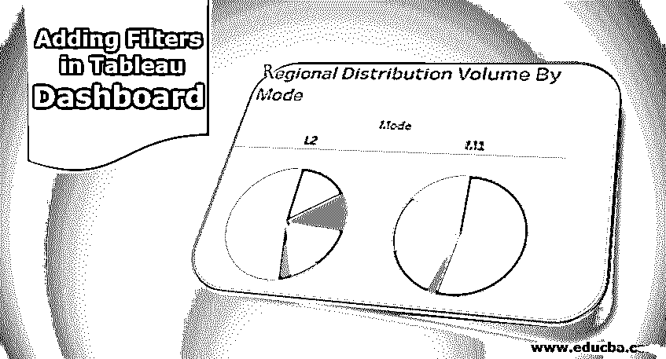

## 在 Tableau Dashboard 中添加过滤器简介

在 Tableau 仪表板中添加过滤器是将各种过滤条件应用于仪表板所涉及的步骤。Tableau 通过连接到数据源并将数据导入工作簿来开始处理。工作簿上的数据可用后，Tableau 开发人员需要为仪表板可视化选择适当的度量、维度和相关图表类型。要添加过滤器，Tableau 在右上角提供选项，然后是“更多选项”，其中包括“用作过滤器”选项。接下来，需要从将反映在仪表板上的数据集中为过滤器配置选择相关字段。

### 向仪表板添加逐步筛选

让我们继续向仪表板添加过滤器。在本演示中，我们将考虑配电装置的体积数据。该数据包含关于分布在位于不同区域的不同分布单元上的量的细节。这里重要的维度是分销单位、区域和模式，而分销量是一个衡量标准。使用这些数据，我们将创建工作表，构建仪表板，最后将过滤器添加到仪表板中。

<small>Hadoop、数据科学、统计学&其他</small>

1.首先，加载数据。点击“数据”菜单中“新数据源”。或者，单击“连接到数据”。

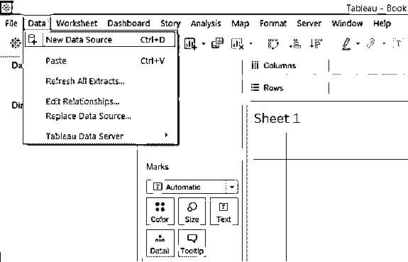

2.在“连接”中，选择必需的数据源类型。在本例中，它是 Microsoft Excel，因此单击 Microsoft Excel 并加载数据。

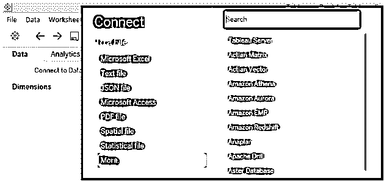

3.加载的数据可以在下面的截图中看到。

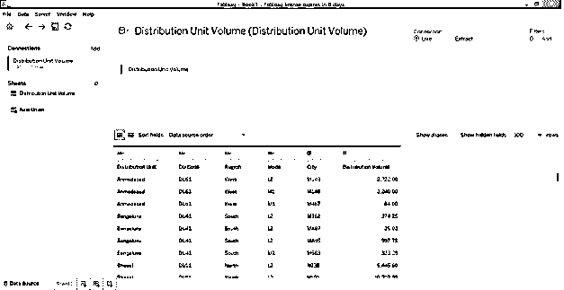

4.转到“工作表”选项卡，我们可以看到各个部分中显示的维度和度量，如下图所示。

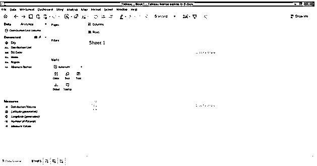

5.让我们创建第一个分析。“标记”卡中的“选择饼图”然后将“维”模式拖到“列”区域。此外，拖动尺寸区域，并在标记卡中分别测量颜色和角度的分布量。对于每种模式，我们分别得到两个饼图，显示区域分布的体积贡献。

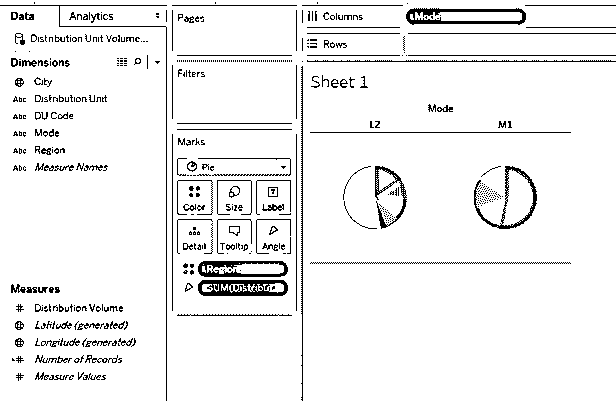

6.如下所示，从标记卡中的大小调整饼图的大小。

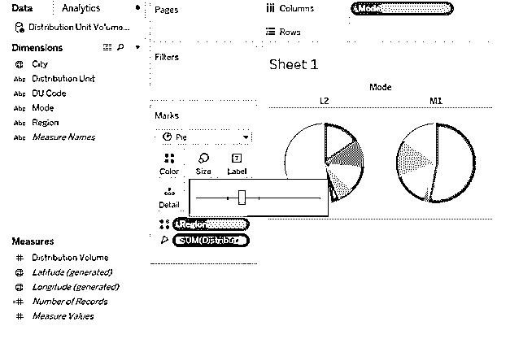

7.要以百分比的形式获取贡献，请转到 Marks 卡中的分发量下拉菜单，在“快速表格计算”中选择“占总数的百分比”。将此表重命名为“按模式划分的区域分配量”。

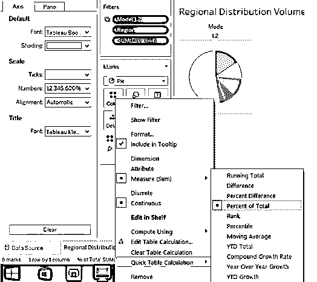

8.接下来，在另一张表中，我们将创建一个分析，给出按地区细分的配送单位配送量。要生成它，请将“分配量”度量值拖到“列”区域和“维”区域，并将“分配单位”拖到“行”区域。要区分每个区域，请将尺寸区域拖到标记卡的颜色上。一旦完成，我们得到下面一个水平条形图。将该表重命名为“DU 体积贡献”。

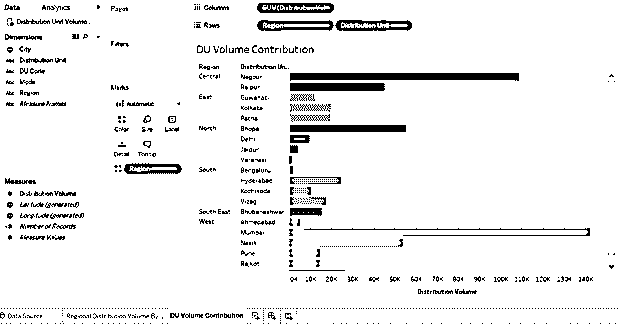

9.现在，我们将把上述两个分析合并到一个仪表板中。要创建新的仪表板，请单击仪表板菜单中的“new dashboard”选项，如下图所示。或者，我们也可以单击工作表栏中的“新仪表板”符号。

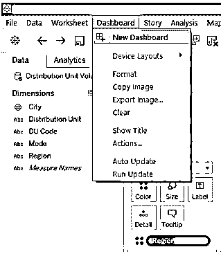

10.按照上述步骤创建一个空白仪表板。图纸出现在左侧，如下所示。

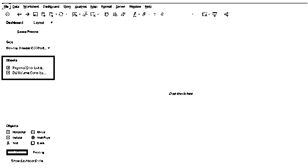

11.要从工作表中获取分析，只需双击它，或者将该工作表拖动到“将工作表拖放到此处”部分。如下图所示，我们将两个表中的分析带入了仪表板。

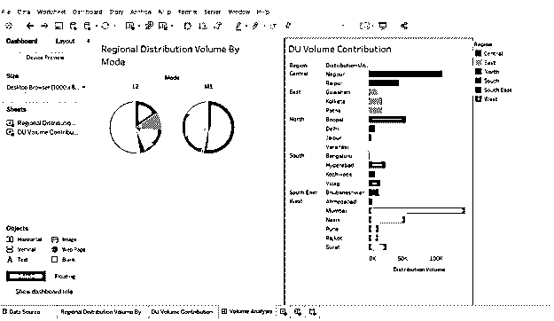

12.现在，我们来看最重要的部分:向仪表板添加过滤器。点击任何可视化，在右上角，我们会发现某些符号选项。最下面是“更多选项”，点击它。

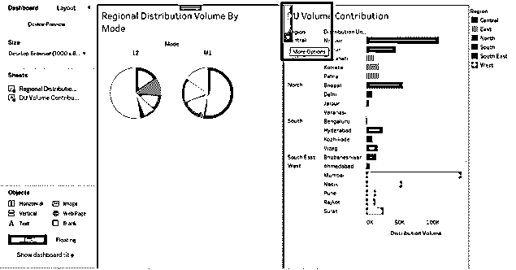

13.在更多选项中，点击“用作过滤器”。这是一种使用可视化工具过滤数据的简单快捷的方法。

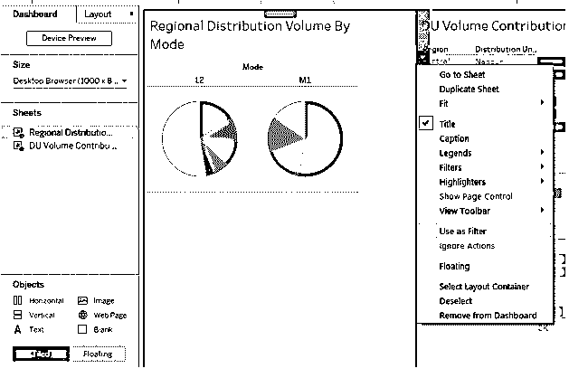

14.从下面的截图中可以看出，只需选择 M1 模式饼图的一部分，就可以在其他分析中看到与之相关的详细信息。

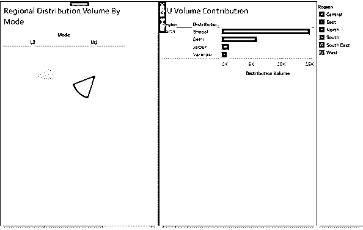

15.如下图所示，在饼图中选择西部地区，也可在 DU 容量贡献分析中给出西部的总容量分布。

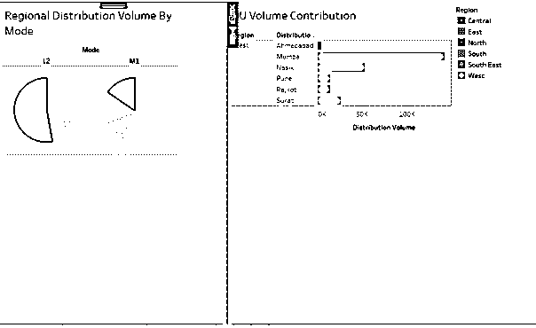

16.现在，我们希望过滤器出现在仪表板上。为此，请转到“更多选项”,并在“过滤器”中选择我们要创建过滤器的字段。就像在这种情况下，我们为模式创建了一个过滤器，如下所示。该过滤器出现在控制面板的右侧，可以在下面的屏幕截图之后的屏幕截图中看到。

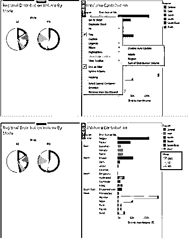

17.我们可以通过右键单击过滤器并选择合适的选项来更改过滤器的显示方式。就像，在这种情况下，我们更喜欢有一个过滤器作为下拉菜单。

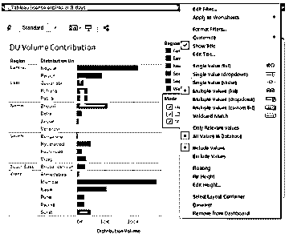

18.从 Mode filter 下拉菜单中，我们选择了 L2，正如我们在下面看到的，为饼图“按模式划分的区域分布量”分析过滤了数据，但没有为“DU 量贡献”过滤数据。这是因为过滤器应用于前一个分析，为了使它也能应用于后一个分析，我们需要将它应用于所有的工作表。我们必须记住，如果两个或更多的分析有共同的字段来生成过滤器，那么只有该过滤器将为这些分析工作。

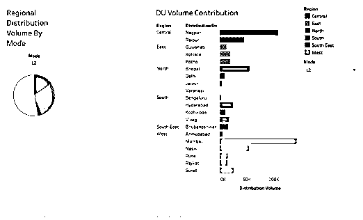

19.要在所有工作表中应用过滤器，右键单击该过滤器，在“应用于工作表”中，单击“选定的工作表”，出现“将过滤器应用于工作表[模式]”对话框，如下面的屏幕截图之后的屏幕截图所示。

20.在“将过滤器应用于工作表[模式]”对话框中，检查 DU 体积贡献。这确保了过滤器现在可以应用于所有工作表的分析。

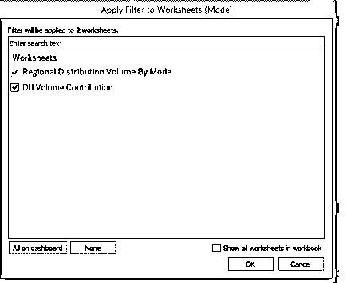

21.让我们检查一下过滤器是否应用于所有的工作表。在模式过滤器中，选择 M1，我们可以看到，在下面的截图中，左侧的分析显示了不同地区对 M1 模式分销量的贡献。同样，我们可以看到过滤器也影响了“DU 体积贡献”分析。因此，过滤器已成功应用于整个工作表。

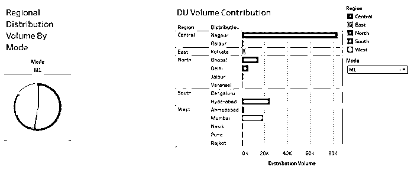

22.在下面的屏幕截图中，我们在模式过滤器中选择了模式 L2，通过仅与该模型相关的两个分析为我们提供了直观的见解。

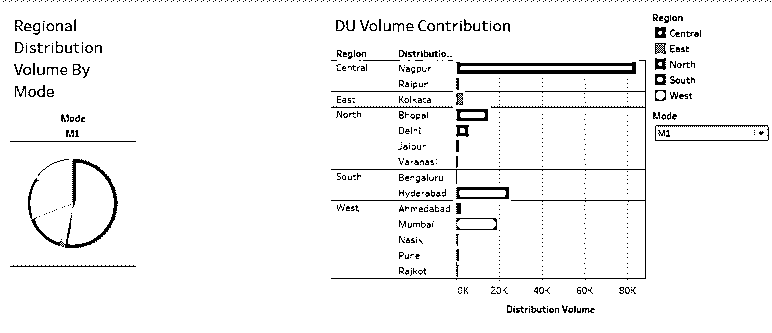

### 结论

在仪表板上使用过滤器的意义在于，它们不应该帮助提取内容，并仅为特定的分析提供见解。相反，通过在仪表板上添加过滤器，可以同等地影响所有分析，以便从所有分析中获得特定于上下文的洞察力。

### 推荐文章

这是一个在 Tableau Dashboard 中添加过滤器的指南。这里我们讨论了在 Tableau Dashboard 中添加过滤器的基本概念和逐步过程。您也可以浏览我们推荐的其他文章，了解更多信息——

1.  [班加罗尔的数据科学培训](https://www.educba.com/data-science/courses/data-science-training-in-bangalore/)
2.  [表格中前 6 种过滤器类型](https://www.educba.com/types-of-filters-in-tableau/)
3.  [Tableau 中的排名函数](https://www.educba.com/rank-function-in-tableau/)
4.  [Tableau 中的枢轴](https://www.educba.com/pivot-in-tableau/)
5.  [Tableau 项目符号图](https://www.educba.com/tableau-bullet-chart/)

