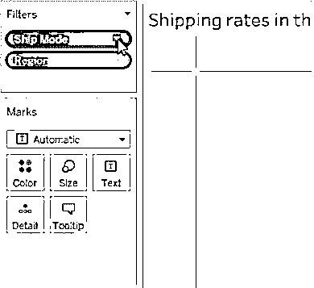
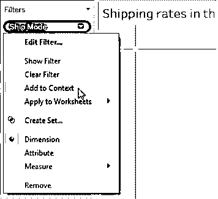
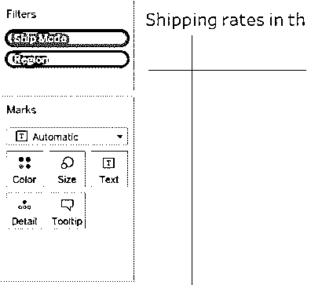
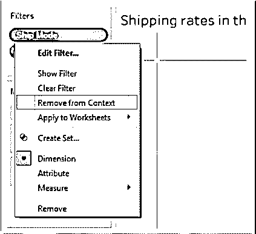
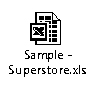
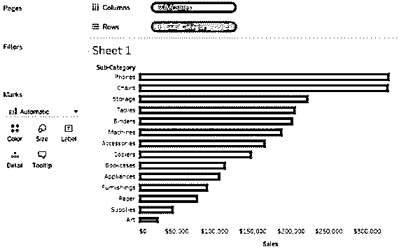
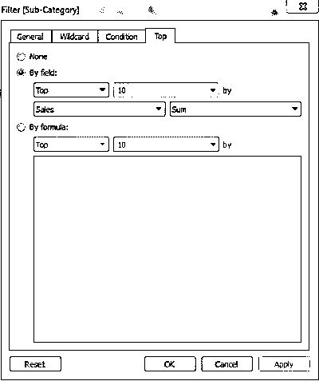
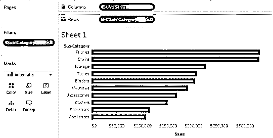
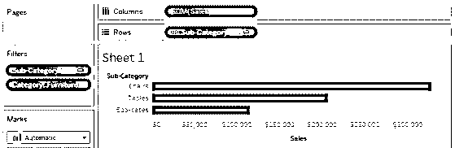
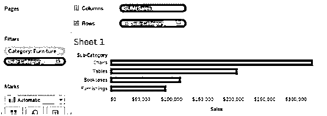

# Tableau 上下文过滤器

> 原文：<https://www.educba.com/tableau-context-filter/>

## 什么是 Tableau 上下文过滤器？

Tableau 上下文筛选器是一种特殊类型的筛选器，它控制其他筛选器的数据。而普通过滤器通常独立于相关过滤器处理来自数据源的所有数据行。Tableau 创建一个临时表来处理上下文过滤器数据，这就是 Tableau 中的上下文过滤器也称为依赖过滤器的原因。上下文过滤器用于提高处理性能。对于创建可视化效果的大型数据集，这是 Tableau 中推荐的过滤条件。在添加其他筛选器以优化性能之前，Tableau 上下文筛选器应该包含在可视化设计中。

### 创建上下文过滤器

*   通过将维拖动到过滤器架，创建要在其上创建上下文过滤器的过滤器。在以下示例中，ShipMode 和 Region 是过滤器架中的维度。

<small>Hadoop、数据科学、统计学&其他</small>

*   右键单击它，并从现有过滤器的上下文菜单中选择添加到上下文选项。在此示例中，右键单击 ShipMode 维，并从 general 选项卡中选择 Add to Context 选项，如下所示:

*   上下文过滤器出现在过滤器架的顶部。
*   这些过滤器无论如何都不能重新排列。
*   此外，一旦过滤器成为上下文过滤器，它就可以在过滤器架中用灰色来标识。
*   在示例中，将上下文过滤器添加到 ShipMode 后，其颜色变为灰色，如下所示:

*   在本例中，ShipMode 维度已经成为上下文过滤器。现在使用通过 Ship 模式的数据来计算区域过滤器。

### 删除上下文过滤器

*   要删除上下文过滤器，您可以右键单击维度，然后从“常规”选项卡中选择“从上下文中删除”选项，如下所示:

*   现在颜色将变回蓝色作为指示。
*   移除上下文过滤器时，如果过滤器架上还有任何其他上下文过滤器，则会计算新的上下文。
*   删除上下文过滤器后，该过滤器作为标准过滤器保留在过滤器架上。
*   每当编辑上下文过滤器时，每次都会计算一个新的上下文。

### Tableau 上下文过滤器示例

你可以考虑下面的超级商店样本数据集为下面的例子。

*   这个例子让您了解上下文过滤器的创建和使用。
*   首先，您可以创建一个普通视图，并根据销售额筛选前十名产品。
*   然后，在产品类别维度上添加一个上下文过滤器。
*   上下文过滤器过滤视图并显示前 10 个家具产品。

**步骤 1:** 使用 SuperstoreSample 数据集，创建一个显示子类别 sales 的初始视图，该视图按销售额的降序排序，如下所示:

**步骤 2:** 现在，通过创建前 10 名过滤器，展示最畅销的产品:

*   将字段子类别添加到过滤器架。
*   右键单击子类别字段并选择顶部。
*   现在按字段选择。
*   现在选择前 10 个销售金额，如下图所示:

*   完成 ****后点击确定。**T3】**

**步骤 3:** 现在，视图被过滤，只显示按销售额排列的前 10 个产品子类别，如下所示:

**步骤 4:** 现在您可以再添加一个过滤器来显示一个产品类别，比如家具。

*   将字段类别拖到过滤器架上。
*   选择*家具。*
**   完成 **后点击确定。*T3】**

 *过滤后的视图如下图所示:

*   筛选视图现在只显示 3 种产品，而不是 10 种，因为所有的筛选器都是独立的，并且是单独计算的。
*   从这个角度来看，我们可以看到前 10 名中有 3 个产品是家具。

**第五步:**使用类别上的上下文过滤器，*我们可以找到排名前十的产品。*

 **   右键单击过滤器架上的类别维度，然后选择添加到上下文选项 ****。**T3】**
*   现在，您可以看到颜色变为灰色，作为上下文过滤器的标识。
*   此外，现在您只能从视图中看到家具的前四个产品，因为在子类别中只有四个家具产品。
*   视图如下所示:

### Tableau 上下文过滤器的优点

Tableau 上下文过滤器的优点解释如下:

#### **1。提高性能**

 ***   当您同时使用许多过滤器或处理大型数据集时，查询可能会很慢。
*   在这种情况下，可以使用上下文过滤器来提高性能，因为它根据过滤标准创建临时数据集。
*   主要分类上下文过滤器的选择有助于您有效地提高性能。

#### **2。相关过滤条件**

 ***   上下文过滤器可用于根据您的要求设置相关的过滤条件。
*   当数据源很大时，应该优先考虑上下文过滤器。
*   您可以设置上下文过滤器来单独获取感兴趣的数据，然后设置一个相关的数字或前 N 名过滤器。

### Tableau 上下文过滤器的性能改进

*   使用一个显著减小数据集大小的过滤器比同时使用多个过滤器要好。
*   如果过滤器无法将数据集的大小减少十分之一或更多，那么建议不要对这样的数据集使用过滤器，因为它会严重影响性能。
*   所有数据建模都应该在应用过滤器之前完成，因为数据模型中的每次更改，例如，将维度转换为度量值，每次都需要重新计算竞争。
*   如果在日期字段上设置上下文，请使用连续日期。对离散类型的日期使用日期格式(如年份(日期)或上下文过滤器)也是有效的。
*   您应该为上下文设置所有必要的过滤器，并且应该在将字段添加到其他工具架之前创建上下文。当删除其他货架字段时，它使查询运行得更快。
*   如果数据集被大量索引，则上下文过滤器不能提供性能改进。它会降低性能。

### 结论

上下文过滤器用于提高查询性能。上下文过滤器将数据集的大小减少到十分之一甚至更多。上下文过滤器数量的选择对于性能也是非常关键的。选择连接的类型对于提高性能也很重要。

### 推荐文章

这是一个 Tableau 上下文过滤指南。这里我们讨论如何创建和删除上下文过滤器，上下文过滤器的例子和优点。您也可以阅读以下文章，了解更多信息——

1.  [Tableau 故事情节(创作故事)](https://www.educba.com/tableau-storyline/)
2.  [Tableau 表计算](https://www.educba.com/tableau-table-calculation/)
3.  [Tableau 仪表板创建(概念和示例)](https://www.educba.com/tableau-dashboard-creation/)
4.  [Tableau 可视化-类型、优势](https://www.educba.com/tableau-visualization/)
5.  [表格中枢轴的完整指南](https://www.educba.com/pivot-in-tableau/)
6.  [PHP 更改日期格式](https://www.educba.com/php-change-date-format/)
7.  [Tableau 项目符号图](https://www.educba.com/tableau-bullet-chart/)
8.  [Tableau 特性和属性介绍](https://www.educba.com/tableau-new-features/)

******