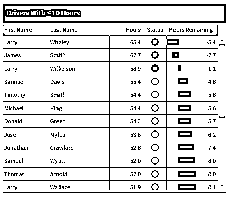
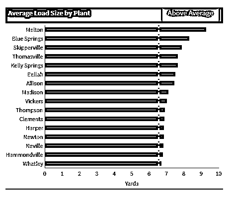
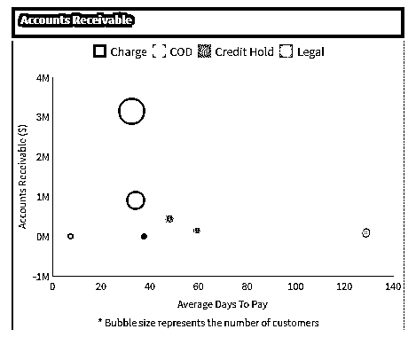
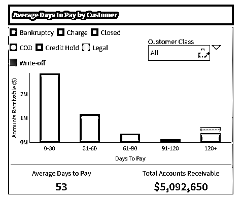

# 带示例的 Tableau 仪表板

> 原文：<https://www.educba.com/tableau-dashboard-with-examples/>

## Tableau 仪表板概述

Tableau 是一个[商业智能工具](https://www.educba.com/12-best-business-intelligence-tool/)，用于可视化分析数据。任何人都可以开发和提供一个交互式和可共享的仪表板； [Tableau 以图表和图形等各种形式描绘数据的趋势](https://www.educba.com/tableau-interview-questions/)和密度。该软件允许在各种图表和图形上描绘数据，这使得它非常独特和重要。它可以连接到文件，大数据源，以获取和处理数据显示在图表上。学术研究人员、企业和许多政府机构可以使用它进行可视化数据分析和创建报告。在 Gartner 魔力象限中，它被视为领先的分析平台和商业智能。

### Tableau 仪表板的功能

Tableau Dashboard 的重要功能如下:

<small>Hadoop、数据科学、统计学&其他</small>

**实时协作—**Tableau 可以即时排序、过滤讨论数据，并嵌入 Salesforce、SharePoint 网站等实时仪表板门户。

**自力更生—**运行 Tableau 不需要复杂的软件设置。

**集中数据—**tableau 的服务器提供了一个集中位置来管理所有组织发布的所有数据。

**分析速度—**使用 Tableau 不需要编程知识。用户只需要访问数据来获取价值。

### Tableau 仪表板的主要概念

Windows 上的设置步骤–

1.  从链接下载免费的 Tableau 桌面个人版-https://www . Tableau . com/products/Desktop/download？os=windows 要下载软件，我们需要在下载过程中提供所需的详细信息。
2.  接受条款和条件，安装下载的软件
3.  安装后，如果您只是出于学习目的使用，它将提示我们必须选择的几个选项，以便立即开始试用。
4.  之后，它会询问您的姓名和许多细节，提供进一步进行所需的所有强制信息。
5.  通过进入窗口的开始菜单来验证安装，Tableau 图标将出现在搜索中。

### 如何创建 Tableau 数据报告

*   **连接到一个数据源**–首先，我们必须给出数据源的来源，从哪里获取数据。
*   **选择尺寸和度量**–给出数据的尺寸和度量。
*   **应用可视化技术**–将可视化应用于要在图表上显示的数据。

### Tableau 仪表板的菜单命令

**1)文件菜单**
文件菜单用于创建新的 Tableau 工作簿，并从本地系统和 Tableau 服务器打开现有的工作簿。下面给出了其中的几个

*   **工作簿区域设置**用于设置报告中使用的语言。
*   粘贴工作表将从另一个工作簿复制的工作表粘贴到当前工作簿中。
*   “导出打包工作簿”用于创建打包工作簿，该工作簿将与其他用户共享。

**2)数据菜单**

数据菜单用于创建新的数据源，以获取数据进行分析和可视化。它还允许您替换或升级现有的数据源。数据菜单中的重要功能如下

*   **新数据源**用于查看所有可用的连接类型并从中进行选择。
*   **刷新所有提取数据**刷新数据源中的数据。
*   **编辑关系**这定义了多个数据源中用于链接的字段。

**3)工作表菜单**

此菜单用于创建一个新的工作表以及各种显示功能，如显示标题和题注。工作表菜单中的重要功能如下

*   **显示汇总**允许查看工作表中使用的数据汇总，如计数等。
*   **工具提示**用于当鼠标悬停在各种数据字段上时显示工具提示。
*   **运行更新**该选项更新工作表数据或使用的过滤器。

**4)仪表板菜单**

仪表板菜单用于创建一个新的仪表板以及各种显示功能，如显示标题和导出图像等。仪表板菜单中的重要功能如下

*   **格式**用于根据仪表板的颜色和部分设置布局。
*   **动作**用于将仪表板表链接到外部 URL 或其他表。
*   **导出图像**选项导出仪表板的图像。

**5)故事菜单**

Story 菜单用于创建一个新的故事，该故事包含许多带有相关数据的工作表或仪表板。该菜单中的重要功能如下

*   **格式**根据故事的颜色和章节设置布局。
*   **运行更新**用来自数据源的最新数据更新故事。
*   **导出图像**它用于导出故事的图像。

**6)分析菜单**

分析菜单用于分析工作表中的数据。Tableau 提供了许多现成的特性，例如计算百分比和执行预测等。分析菜单中的重要功能如下

*   **预测**–发布给显示基于可用数据的预测。
*   **趋势线**显示一系列数据的趋势线。
*   **创建计算字段**选项，基于现有字段的特定计算创建附加字段。

**7)地图菜单**

地图菜单用于在 Tableau 中构建地图视图。您可以为数据中的字段分配地理角色。地图菜单中的重要功能如下

*   **地图图层-** 用于隐藏和显示地图图层，如街道名称、国家边界，并添加数据图层。
*   **地理编码**创建新的地理角色，并将其分配给数据中的地理字段。

**8)格式菜单**

格式菜单用于应用各种格式选项，以增强创建的仪表板的外观。它提供了诸如边框、颜色、文本对齐等功能。格式菜单中的重要功能如下

*   **边框**为报表中显示的字段应用边框。
*   **标题&标题**用于给报表分配标题和题注。
*   **单元格大小**定制显示数据的单元格的大小。
*   **工作簿主题**将主题应用于整个工作簿。

9)服务器菜单

服务器菜单中的重要功能如下

*   **发布工作簿**在服务器上发布工作簿供他人使用。
*   **发布数据源**发布工作簿中使用的源数据。
*   **创建用户过滤器**在工作表上创建过滤器，供不同用户在访问报告时应用。

### 带示例的 Tableau 仪表板

来源链接-https://samples . dundas . com/Dashboard/57 a4 B3 e 9-0942-41da-8254-a 80 FD 0 da 24 b 4？e=false&vo=viewonly

来源链接-https://samples . dundas . com/Dashboard/57 a4 B3 e 9-0942-41da-8254-a 80 FD 0 da 24 b 4？e=false&vo=viewonly

来源链接-https://samples . dundas . com/Dashboard/57 a4 B3 e 9-0942-41da-8254-a 80 FD 0 da 24 b 4？e=false&vo=viewonly

来源链接–https://samples . dundas . com/Dashboard/386836 D8-7be 2-4c 21-bb47-67 EEC 50 DAC 0b？e=false&vo=viewonly

### 结论

正如我们看到的，我们可以使用 Tableau 创建报告，它提供了许多创建报告的方法，这有助于我们的业务提高公司的绩效。

### 推荐文章:

这是一个 Tableau 仪表板指南。这里我们用例子讨论了 Tableau Dashboard 的不同方法。您也可以阅读以下文章，了解更多信息——

1.  [Tableau 面试问题](https://www.educba.com/tableau-interview-questions/)
2.  [视觉分析 vs Tableau](https://www.educba.com/visual-analytics-vs-tableau/)
3.  [Tableau 中的趋势线](https://www.educba.com/trend-lines-in-tableau/)

