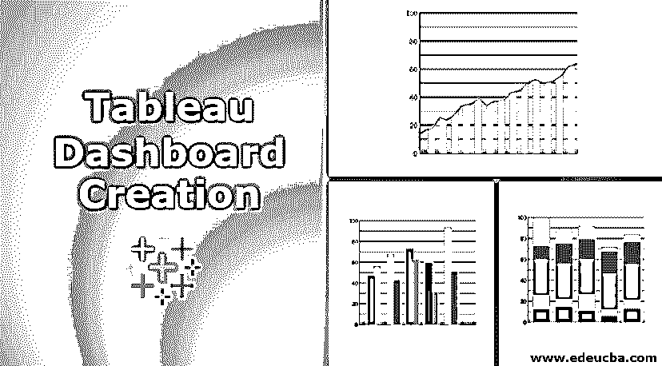

# Tableau 仪表板创建

> 原文：<https://www.educba.com/tableau-dashboard-creation/>

## Tableau 仪表板创建概述

Tableau 是一个数据可视化软件，因其易于使用的功能和数百个内置模板和可视化功能而广受欢迎。这是一个[商业智能工具](https://www.educba.com/business-intelligence-tool/),用户可以在其中创建和共享交互式和引人入胜的仪表板，以衡量他们的业务绩效，跟踪 KPI 并根据获得的见解采取行动。Tableau 很受欢迎，尽管成本很高。不同的调查和组织多次将它列为其他数据可视化平台的第一名。因此，在今天的文章中，我们将重点关注 tableau 仪表板创建的基本功能，提供如何创建 Tableau 仪表板的示例以及使用 Tableau 的优势。

这篇文章对新的和即将到来的 tableau 专业人士非常重要，他们想学习 tableau 来创建一个惊人的 tableau 仪表板，或者想被聘为 tableau 专家。

<small>Hadoop、数据科学、统计学&其他</small>

### Tableau 仪表板创建的主要概念

Tableau 有许多独特的功能，这使它成为数据可视化领域的市场领导者。它的拖放界面可能是进行数据可视化、视图探索甚至合并多个数据库的最佳特性。Tableau 中不需要复杂的脚本。通过 Tableau 发布到 Tableau 服务器，可以与他人共享分析后的结果。

使 Tableau 能够处理各种业务用例的一些独特功能如下所示:-

*   **分析速度–**Tableau 不需要高水平的编程专业知识，因此即使是业务用户也可以自己进行分析。
*   **自力更生—**Tableau 不需要复杂冗长的设置过程。最常用的桌面版本易于安装(它以. exe 或。zip 文件)并包含所有必需的功能。
*   **可视化发现—**用户可以使用颜色、图表、趋势线、条形图和图形等可视化工具来探索和分析数据。
*   **混合不同的数据集—**Tableau 允许实时混合不同的关系、结构化、半结构化和任何其他数据源。
*   **与架构无关—**Tableau 可在各种设备上运行，包括桌面、手机、平板电脑等。使用它不需要[特定的硬件或软件](https://www.educba.com/hardware-vs-software/)。
*   **实时协作–**It 可以即时过滤、排序、更改模板和讨论数据，从而在 SharePoint 或 Salesforce 等门户网站中提供实时仪表板的感觉。
*   **集中数据—**Tableau 还提供了一个中央服务器，它是管理和存储组织所有发布数据的集中位置。在这个中央服务器中安排提取刷新并管理它们是很容易的。管理员也可以进行增量和完全刷新。

做 Tableau 数据分析有三个基本步骤，下面提到了这些步骤:-

*   **连接到数据源—**首先，我们连接到一个数据源，如 excel 表、数据库表或其他类似的数据源来读取数据。
*   **选择维度和度量–**然后，我们从需要进行分析的源数据中选择所需的列。
*   **应用可视化技术—**现在，我们将所需的可视化方法应用于需要分析的数据，无论是特定的图表还是图形。一切都是通过几次鼠标点击和拖放完成的。

### Tableau 仪表板

它是几个工作表和其他相关信息在一个地方的综合显示。仪表板用于同时比较和监控各种数据。创建仪表板时，任何工作表中的视图都可以与许多其他支持对象一起添加到工作簿中，无论是文本区域、网页还是图像。

添加到仪表板的每个视图都连接到其对应的工作表。因此，当修改工作表时，仪表板也会更新，同样，当仪表板中的视图被修改时，工作表也会更新。

### 例子

我们将在 Tableau 仪表板创建上确定，该仪表板显示一家假设公司在其运作的所有州的每个细分市场及其子类别产品的销售额和利润。从互联网下载 Tableau 后，请打开试用版，并按照下面提到的步骤操作。

我们可以通过以下步骤来完成这项工作:-

*   **步骤 1—**首先，我们将使用位于工作簿底部的添加工作表图标创建一个空白工作表。然后，将维段拖动到列区域，将维子类别拖动到行区域。同样，将“销售额”度量拖放到“颜色”区域，将“利润”度量拖放到“大小”区域。这将绘制一个图表，让我们称之为销售利润。
*   **步骤 2—**下一步，创建另一个表来分析各州的销售详情。为此，将维度状态拖到行区域，将销售额度量值拖到列区域。之后，可以对 State 字段应用一个过滤器，以升序或降序排列销售额。我们将把这个工作表称为销售状态。
*   **第 3 步—**第三步，我们现在将通过单击工作簿底部的“创建新仪表板”链接来创建一个空白仪表板。
*   **第 4 步–**现在，将上面第 1 步和第 2 步中创建的两张工作表拖到仪表板上。完成后，您可以在销售利润工作表的顶部边界附近看到三个小图标。当鼠标悬停在中间图标上时，单击该图标将显示提示“用作过滤器”。
*   **第 5 步—**现在，作为最后一步，点击仪表板中代表机器子类别和细分消费者的方框。这样做是为了在右窗格中只显示该利润金额/标准的销售发生的州。这表明这些表是链接的。

### 结论

在上面的文章中，我们创建了一个基本的 tableau 仪表板。这些数据是从网上收集的，用户可以使用任何数据集进行同样的练习，或者自己创建一个数据集。这个想法是为了展示 Tableau 的基本功能，预计用户现在已经掌握了它的窍门。

### 推荐文章

这是 Tableau 仪表板创建的指南。这里我们已经讨论了 tableau 仪表板创建的概念和 tableau 仪表板创建的步骤，并附有示例。您也可以阅读以下文章，了解更多信息——

1.  [视觉分析 vs Tableau](https://www.educba.com/visual-analytics-vs-tableau/)
2.  [Tableau vs Microstrategy](https://www.educba.com/tableau-vs-microstrategy/)
3.  [旁观者 vs 画面](https://www.educba.com/looker-vs-tableau/)
4.  [画面可视化](https://www.educba.com/tableau-visualization/)
5.  [Tableau 中的排名函数](https://www.educba.com/rank-function-in-tableau/)
6.  [电力 BI 中的 KPI](https://www.educba.com/kpi-in-power-bi/)

