# Tableau 工作簿

> 原文：<https://www.educba.com/tableau-workbook/>

## Tableau 工作簿简介

软件由多个组件组成。在技术术语中，这些组件被称为对象。任何分析工具或编程语言都有多个对象。基本上，正是这些对象完善了工具的概念。不理解对象及其重要性，就不可能理解软件。对象可以有一定的层次结构，这意味着一个对象有多个对象。Tableau 是一个可视化分析工具，也是由对象组成的。Tableau 中一个非常重要的对象是 Workbook。顾名思义，它实际上是一本包含作品的书，因此得名。

### 了解 Tableau 中的工作簿

用户在 Tableau 中完成的工作在工作簿文件中执行。可以看到工作簿出现在它自己的窗口中。在特定背景下完成的重要分析包含在工作簿中。我们可以根据需要有多个工作簿。Tableau 工作簿的扩展名是. twb。

<small>Hadoop、数据科学、统计学&其他</small>

Tableau 工作簿由各种对象组成，如工作表、菜单、工作表标签等。这些对象中的每一个都很重要，都有自己的相关性。Tableau 中的工作表可以是工作表、仪表板或文章。这些都有一定的语境意义。

### 在 Tableau 中创建工作簿

在 Tableau 中创建工作簿非常简单。这就像我们在 MS Excel 或任何其他类似工具中所做的一样。

1.当我们打开 Tableau 时，初始屏幕如下所示。如果我们仔细观察，就会发现一个工作簿中有多个选项，这一点我们将在后面的部分中看到。

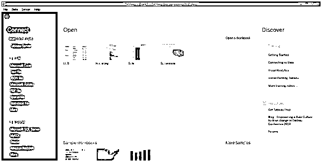

2.首先，我们可以通过单击“文件”菜单中的“新建”来创建工作簿。我们可以通过单击“文件”菜单中的“打开”来打开现有的工作簿。

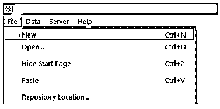

3.我们发现我们可以连接到一个特定的数据源，如左侧截图所示。当我们将 Tableau 连接到特定的数据源类型时，操作开始在工作簿中发生。

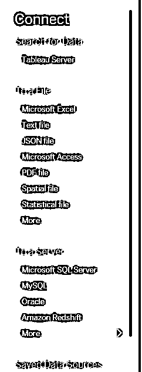

4.我们可以通过单击“打开工作簿”来打开现有工作簿，现有工作簿显示在“打开”选项下。

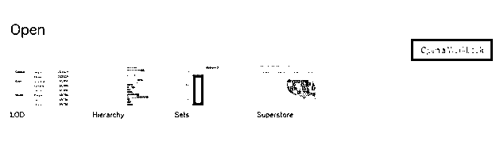

5.Tableau 还为我们提供了一些示例练习册作为指导。我们可以打开其中的任何一个，并通过点击“更多示例”来浏览更多这样的指导示例

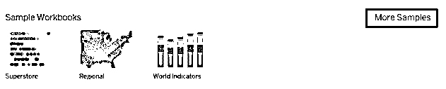

6.当我们点击“文件”菜单中的“新建”选项时，就会创建一个 Tableau 工作簿。

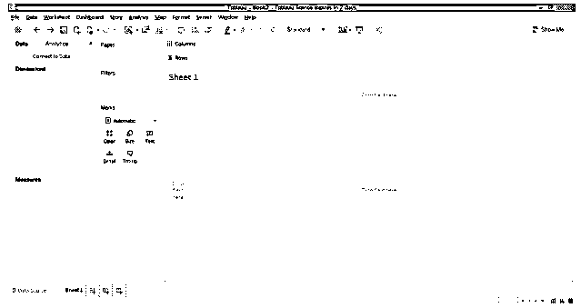

### 使用 Tableau 工作簿

为了理解 Tableau 工作簿是如何工作的，有必要理解它的组件或对象，这可以通过理解 Tableau 工作空间来理解。为了有一个正确的理解，我们加载一个现有的工作簿。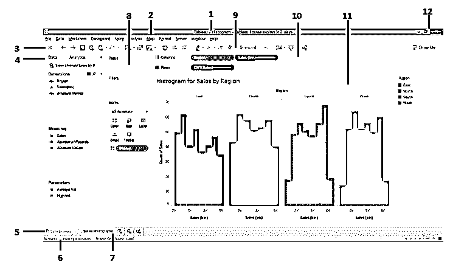

从上面可以看出，我们已经对工作簿的组件进行了编号。

简而言之，它们按顺序描述如下。

这是工作簿名称。在这种情况下，它是直方图，因为工作簿包含直方图分析。工作簿的名称必须适合上下文。

*   **菜单栏:**Tableau 中的菜单栏包含多个菜单，类似于我们在 MS Excel、MS Word 和 MS PowerPoint 中看到的菜单。
*   当你点击这个图标，它把我们带到“连接”部分。要返回工作簿，请再次单击它。
*   侧边栏:这一部分包含两个重要部分，即。数据窗格和分析窗格。无论我们将什么数据集加载到 Tableau 中，都可以在数据窗格中看到，以及必要的维度、度量和参数。分析窗格包含与汇总统计和建模相关的功能。
*   **数据源页签:**当我们将数据加载到 Tableau 中时，数据会在该页签中得到反映。点击它查看在进行分析之前必须检查的数据。
*   状态栏:它基本上给出了工作簿的状态，基于某些度量标准，如列数、行数等。在该栏的右侧，我们可以找到三个图标。单击它们，以特定方式查看包括视觉分析在内的组件。
*   **工作表标签:**由工作表、仪表板或故事组成。我们可以创建多个在此选项卡中可见的工作表。
*   **卡片:**包含页面、过滤器和标记卡片。其中，标记卡包含经常使用的重要且有用的选项。
*   **工具栏:**该工具栏包含各种功能，点击图标即可轻松应用。
*   **货架:**包含列货架和区域货架。必须将维度和度量纳入其中。基于它们被带到的地方，可视化被生成。
*   **视图:**这是一个工作空间中非常重要的组件。基本上就是在这里，我们头脑中的形象化产生了。它由标题等各种元素组成。
*   最后但同样重要的是，最小化、向下恢复和关闭按钮。

### 与 Tableau 工作簿关联的选项

1.我们可以打印工作簿，或者使用下面的屏幕截图中显示的步骤将其保存为 PDF 格式。

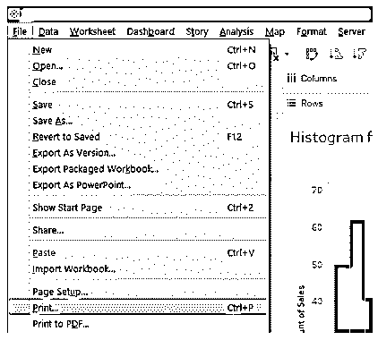

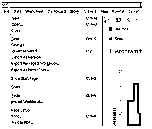

2.点击“打印成 PDF”弹出如下对话框。从对话框中选择“整个工作簿”选项，以打印整个工作簿。

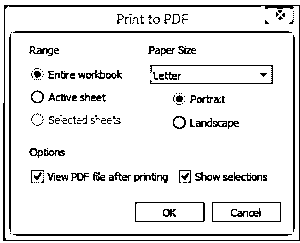

3.现在，我们可以通过单击格式菜单下的工作簿来设置工作簿的格式。

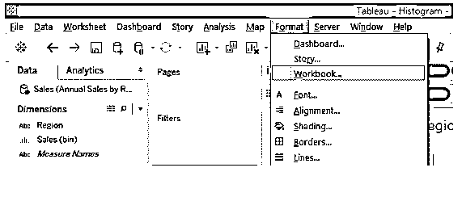

4.当我们遵循上面的过程时，我们得到与“格式化工作簿”部分相关的各种选项。

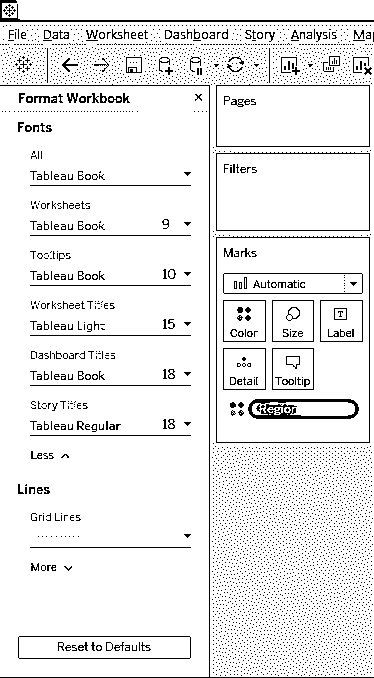

5.我们可以从打开工作簿，也可以在服务器上发布工作簿。这可以通过单击服务器菜单中的所需选项来完成，如下所示。

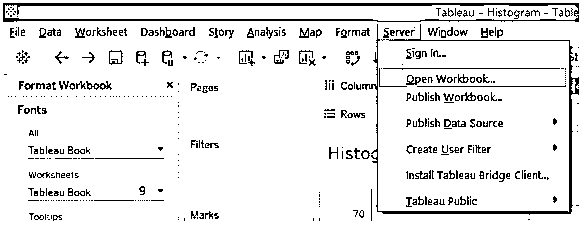

### 结论

练习册是 Tableau 的重要组成部分。它类似于 MS Excel 中的工作簿。因此，在 Tableau 中，我们也有一个对象层次结构，其中工作簿对象在顺序中处于较高位置。该对象充当父对象。没有工作簿，Tableau 将是空白的。

### 推荐文章

这是一个 Tableau 工作簿指南。在这里，我们讨论如何创建 tableau 连同一些插图工作簿。您也可以看看以下文章，了解更多信息–

1.  [Tableau 聚合函数](https://www.educba.com/tableau-aggregate-functions/)
2.  [Tableau 表计算](https://www.educba.com/tableau-table-calculation/)
3.  [Tableau 命令](https://www.educba.com/tableau-commands/)
4.  [什么是 Tableau 服务器？](https://www.educba.com/what-is-tableau-server/)

