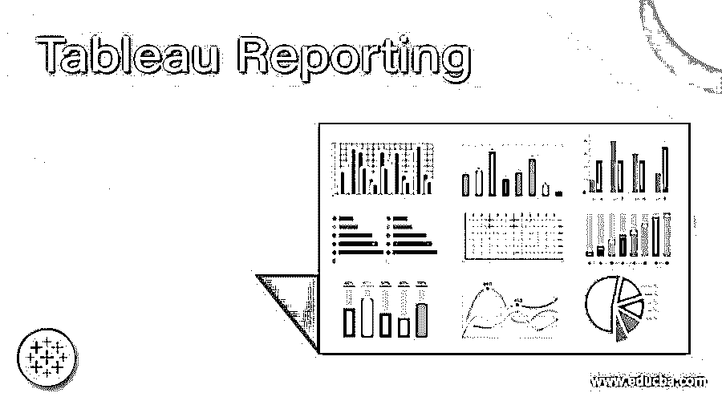
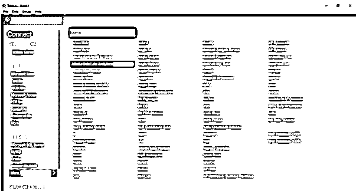
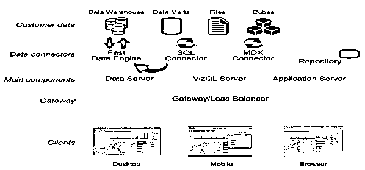
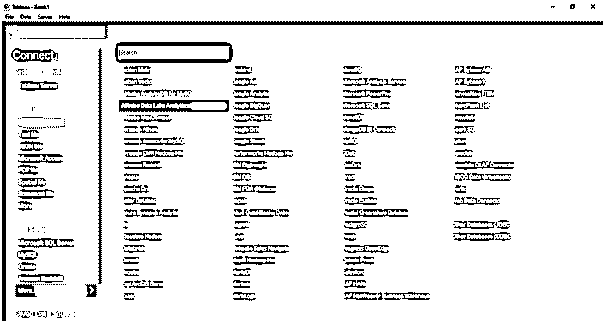
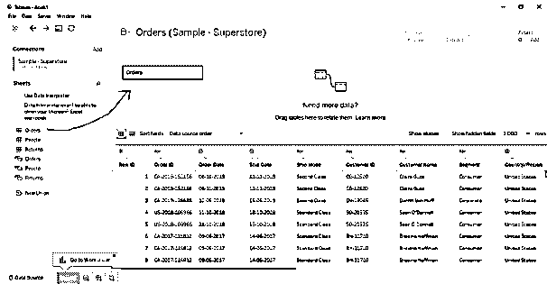
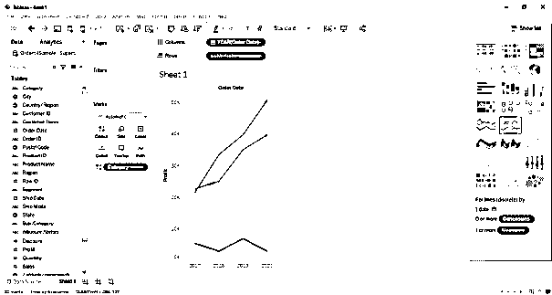
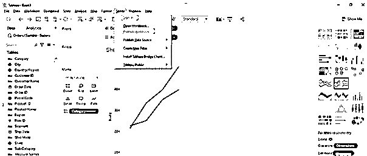

# 表格报告

> 原文：<https://www.educba.com/tableau-reporting/>

## Tableau 报告简介

Tableau 报告工具用于数据分析目的。Tableau 是用于可视化目的的最快和最强大的工具之一。对于企业未来的预测和决策，必然需要对数据进行分析。这可以通过使用 Tableau 来完成。Tableau 是一个高度交互式的商业智能解决方案。使用 Tableau，任何人都可以可视化和理解数据，而无需任何编码知识和数据科学方面的高级技能。Tableau 特性的特点是:–易于使用，更好的洞察力，数据可视化，等等。

Tableau Software 由克里斯蒂安·沙博特、帕特·汉拉汉和克里斯·斯托尔特于 2003 年 1 月创立。该公司目前的总部设在美国华盛顿州西雅图。

<small>Hadoop、数据科学、统计学&其他</small>

### 如何执行 Tableau 报告？

在讨论如何在 Tableau 中执行报告之前。让我们讨论一下 tableau 产品，以及如何在我们的电脑上安装 Tableau 桌面的步骤。

#### Tableau 产品

用于设计和发布工作簿的 Tableau 产品如下:-

*   **Tableau Desktop:** 创建工作簿、故事和仪表板将在 Tableau Desktop 中完成。在 tableau desktop 中创建的工作簿可以本地共享或公开共享。
*   **Tableau Public:** 任何人都可以访问和查看 Tableau 公共工作簿或仪表板。
*   **Tableau 服务器:**为了让授权用户访问 Tableau 报告，我们需要一个服务器。Tableau 服务器是我们发布在 tableau 桌面中开发的报告的地方。
*   **Tableau Online:**Tableau Online 类似于 Tableau 服务器。但它是 tableau software 托管的付费服务器应用。
*   **Tableau Reader:** 为了让用户查看在 tableau desktop 中开发的仪表板，我们使用了 Tableau Reader。

#### 安装 Tableau 桌面

我们得到了 tableau 桌面的免费试用版。下面是下载 tableau 软件的路径。

[https://www.tableau.com/products/desktop/download](https://www.tableau.com/products/desktop/download)

**可以连接的 Tableau 数据源:** Tableau 可以连接在数据源类型下面。

*   CSV、Excel、Oracle、SQL Server、DB2、Windows Azure、Google BigQuery 等，以及其他使用 ODBC 的资源。

**截图:**

**Tableau 中的数据类型:**布尔值，日期，日期&时间，地理值，文本/字符串，数字(小数)，数字(整数)。

**命名 Tableau 中的文件扩展名:**

*   Tableau 工作簿(。twb)
*   Tableau 打包工作簿(。twbx)
*   Tableau 数据源(。tds)
*   Tableau 打包的数据源(。tdsx)
*   Tableau 数据提取(。tde)
*   Tableau 书签(。tdm)
*   Tableau 贴图来源(。tms)
*   Tableau 首选项(。tps)

**twb 和 twbx 的区别**

*   twb 是一个 XML 文档，它包含在 Tableau 工作簿中所做的所有选择和布局。它不包含任何数据。
*   twbx 是包含 twb 和任何极端文件(如摘录和背景图像)的压缩档案。

### 舞台建筑

**如何在 tableau 中执行报告的案例研究:**

Tableau 用于连接和提取从各种来源存储的数据。它可以从任何数据库、Excel、PDF、Oracle 甚至 Amazon Web Services 中提取数据。以下是所遵循的过程:–

*   连接到数据库
*   连接可以是实时的，也可以是提取的
*   根据业务需求在数据源级别应用过滤器，并创建工作表和仪表板。
*   创建的仪表板以静态文件的形式与用户共享。
*   仪表板可以在 Tableau 服务器中发布。
*   用于工作表阅读的 Tableau 阅读器。

#### 1.连接到数据库

现在让我们考虑使用 Excel 数据作为数据源的情况。以便连接到数据源。我们需要下面的数据源页面，并选择我们计划连接的数据源，在我们的例子中，我们计划连接到“Excel”。

**截图:**

#### 2.连接可以是实时的，也可以是提取的

**Live connection:**Tableau 中的 Live connection 基本上意味着 Tableau 直接从你的数据库中查询和读取。

**提取:**提取是原始数据源中实际数据的第一个副本。如果您使用 extracts，而不是使用 live DB 连接，您将获得更好的性能。但是，除非用户对提取应用计划刷新，否则提取不会刷新。将所需的表格拖到您想要在仪表板中使用的空间。

**截图:**

#### 3.创建仪表板

仪表板是在单一位置显示的多个工作表和支持信息的集合，因此您可以同时比较和监控各种数据。

**仪表盘组件:**仪表盘主要有五个组件。那些是

*   水平的
*   垂直的
*   图像提取
*   文本和 WEB [URL 操作]

**标记卡**

**工具提示:**工具提示是一个强大的工具。这将有助于理解相关图形的值和数字。这与标签或文本有关，但是这里的值是隐藏的。

*   **标签或文本:**如果您想查看相关图表的特定数字。
*   **详情:**这与颜色部分有关，但这里将作为部分获取。
*   **离散的:**单独分开的，截然不同的

**连续:**形成不间断的价值，没有中断

**截图:**下面是一个示例仪表板，用于按类别显示基于年份的“SUM(利润)”。

### 如何在 Tableau 服务器中发布工作簿？

选择“服务器”选项卡登录到所需的服务器和站点。然后您可以看到“发布工作簿”选项。点击它，然后点击“确定”。工作簿被发布到各自的服务器和网站。

**截图:**

### 结论

Tableau 是一个 BI 工具。通过使用这个工具，我们可以将数据转换成可视化和有意义的方式来理解业务人员做出的业务决策。

很人性化。为什么，因为我们没有使用任何编码，只是拖放方法，但我们需要分析性地思考计算字段。普通用户也可以打开并理解可视化效果。我们将在短时间内获得报告，并且我们可以将它们安装在任何操作系统中，而不需要任何支持文件。我们可以连接多个数据源。

*   **Diff B/W Excel & Tableau:** 通过使用 Excel 我们只能看到一个报告，而且报告也不是很有效，但是在 Tableau 中，我们可以在 Tableau 中看到多个具有不同可视化效果的报告。
*   **例如:**如果您想查看类别和年份，我们可以在短时间内过滤并查看报告。我们可以在飞行中看到多个数据，但在 excel 中我们无法一次看到多个报告。

### 推荐文章

这是一个 Tableau 报告指南。这里我们讨论定义，Tableau 架构，Tableau 产品，如何执行 Tableau 报表？.您也可以浏览我们推荐的其他文章，了解更多信息——

1.  [Tableau 报告工具](https://www.educba.com/tableau-reporting-tool/)
2.  [Tableau 用户组](https://www.educba.com/tableau-user-group/)
3.  [操作顺序表](https://www.educba.com/tableau-order-of-operations/)
4.  [Tableau 计算字段](https://www.educba.com/tableau-calculated-field/)

