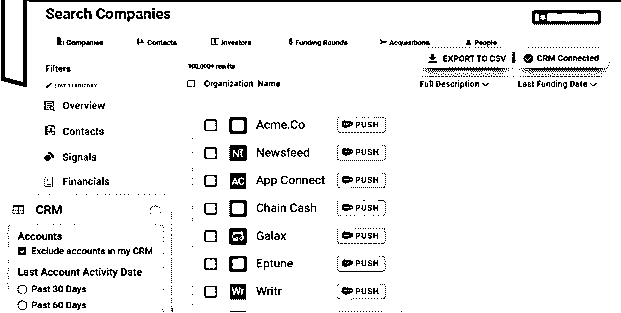
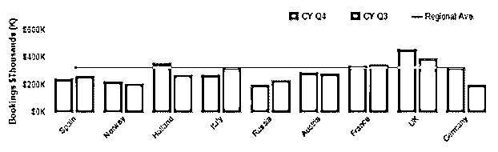
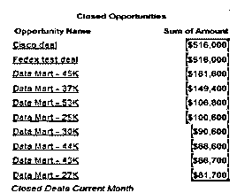
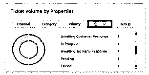
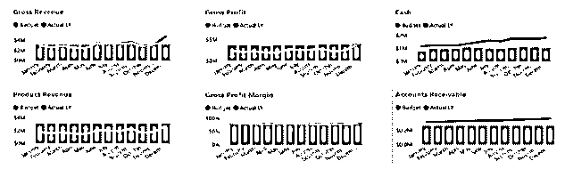
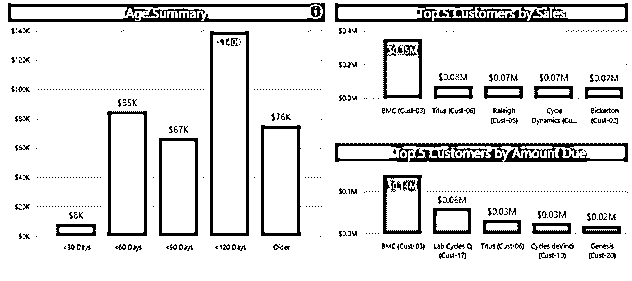
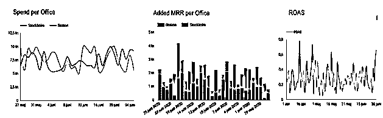
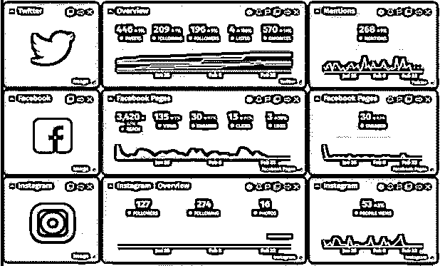

# Tableau 模板

> 原文：<https://www.educba.com/tableau-templates/>

## Tableau 模板的定义

Tableau 模板包含最少细节的徽标，但在我们的仪表盘中的重量。Tableau 模板包含关键指标，这是在应用关键指标时使用的任何报告的宝贵资产，这是我们将关键指标集与其他数据分开的方式。tableau 模板的仪表板也显得杂乱，没有使用不同方面之间的任何分离。通过使用 tableau 模板，我们还可以使用驱动过滤器的特性。这种语言是从左到右阅读的，它的关键是显示客户端的第一次交互。

### Tableau 模板概述

通过使用 Windsor.ai，如果可能的话，我们可以努力为用户进行轻松的营销。下面是平台列表，数据来源如下。

<small>Hadoop、数据科学、统计学&其他</small>

1.  必应广告
2.  脸书广告
3.  LinkedIn 广告
4.  谷歌分析

该工作簿包含 tableau 模板的布局，使用户能够下载模板，并快速复制粘贴在我们的 tableau 桌面工作簿的布局。要使用 tableau 模板，首先我们需要下载 tableau 仪表板的布局模板。以下步骤显示了我们如何使用 tableau 模板。

*   首先，我们需要使用 tableau 的桌面下载 tableau 仪表板的布局模板。
*   下载 tableau 仪表板的布局模板后，在这一步中我们需要复制仪表板布局，我们可以通过右键单击选项卡式仪表板来复制仪表板布局，并需要单击复制选项卡。
*   复制仪表板布局后，我们需要右键单击任何选项卡，将仪表板粘贴到工作簿中。
*   在这一步中，在我们的工作簿中粘贴仪表板后，我们将用徽标、筛选器、标题、工作表和 KPI 替换占位符的工作表。
*   在这一步中替换了占位符的页面之后，我们通过将内部和外部新页面的填充与占位符的页面相匹配来创建我们自己的布局。

### 最佳 Tableau 模板

基本上，tableau 是一种智能工具，用于从数据和可视化构建中获取我们组织的洞察力的业务。Tableau 以直观的可视化和利用高级分析功能的能力而闻名，即使用户不具备技术背景。Tableau 还提供支持应用程序套件，帮助用户充分利用 tableau 服务器。tableau prep 的构建器正在帮助我们连接不同的数据源，并为计算字段的分析做准备。

Tableau 仪表板是不同类型视图的集合。每个视图代表不同类型的数据，因此仪表板也同时比较不同类型的数据。我们可以使用“新建仪表板”按钮来访问仪表板。下面是最好的 tableau 模板如下。

1.  电子商务销售仪表板–该仪表板用于查看不同来源的收入。它还会显示产品的价格。这在电商这个行业是很有价值的。

2.区域销售仪表板-该仪表板将有助于组织和跟踪销售。我将允许我们深入了解该地区的销售产品级别。下图显示了区域销售仪表板，如下所示。

3.高管销售仪表板–该仪表板将不同于其他仪表板。它将提供有关利润和销售的信息，还显示有关运输成本的信息。它也将使用这些信息给出供应链的指示。下面的仪表板显示了高管的销售情况如下。

4.销售渠道仪表板–检测快速旋转的可能性，同时我们使用销售渠道仪表板。这个仪表板将帮助我们更好地了解我们的销售情况。

5.服务台票证控制面板–该控制面板将提供服务台团队如何管理其票证的信息。这个仪表板提供了所有的细节。

6.损益仪表板–该仪表板用于检查组织的损益。它也用于提供利润和损失的趋势。

7.员工费用分析仪表板–该仪表板提供员工用于提出费用申请的主要项目的详细信息。它给出了顶级商品类别的趋势。下面的仪表板显示了如下员工费用分析。

8.应收账款分析仪表板–该仪表板由负责跟踪未付发票的财务总监使用。它提供关于天数的信息。下面的仪表板显示应收账款分析如下。

### Tableau 营销分析仪表板

tableau 营销分析仪表板有两种类型，如下所示。以下是 tableau 营销分析仪表板的类型。

*   营销漏斗仪表板–该仪表板将帮助营销人员访问他们的活动，以注册订购服务的客户。该控制面板还提供了有关活动已发送电子邮件数量及其打开百分比的信息。这个仪表板在画面中非常重要。下面是营销漏斗的仪表板如下。

*   社交媒体跟踪仪表板——如今，大部分营销都是在社交媒体上完成的，因此，跟踪资金将如何用于社交媒体营销的能力是跟踪资金将如何用于营销人员工作的重要组成部分。下面的仪表板显示社交媒体跟踪如下。这个仪表板对于社交媒体的营销非常重要。

### 结论

tableau prep 的构建器正在帮助我们连接不同的数据源，并为计算字段的分析做准备。Tableau 以其直观的可视化和利用分析的高级功能而闻名，即使用户不具备技术背景。

### 推荐文章

这是一个 Tableau 模板指南。在这里，我们讨论定义、概述、Tableau 营销分析仪表板和最佳 Tableau 模板。您也可以看看以下文章，了解更多信息–

1.  表格工具提示
2.  [Tableau 量表图](https://www.educba.com/tableau-gauge-chart/)
3.  [Tableau 桥](https://www.educba.com/tableau-bridge/)
4.  [Tableau BI 工具](https://www.educba.com/tableau-bi-tool/)

