# Tableau 数据集

> 原文：<https://www.educba.com/tableau-data-sets/>

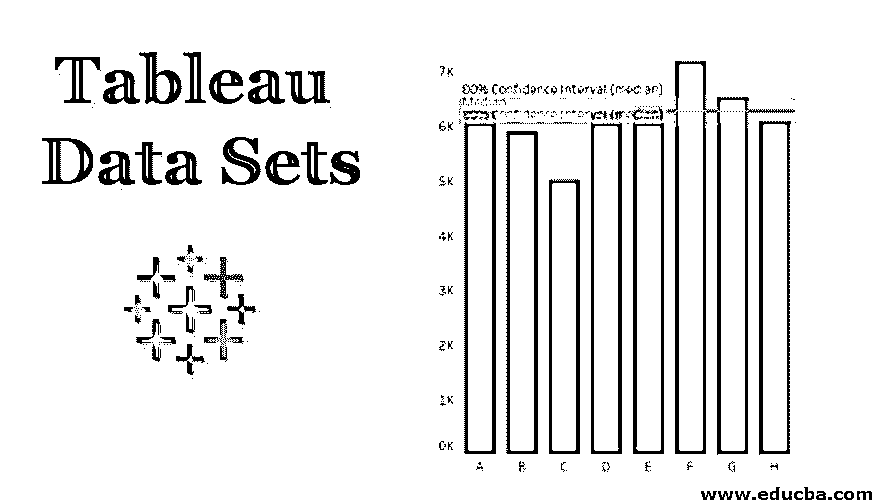

## Tableau 数据集简介

Tableau 数据集是来自各种数据源的异构数据，用于数据可视化。数据集是核心组件，是与商业智能(BI)相关的任何业务流程的一部分。一旦数据集准备好并导入到 Tableau 的工作簿中，就很容易管理数据质量和计算值。Tableau 数据集上的一些常用功能是创建标准和下钻可视化，以及添加参考线、波段、分布和用于特定条件识别的方框。此外，tableau 支持仪表板和故事，它们是使用数据集创建的相关可视化序列。

### 如何引用 Tableau 数据集中的行？

我们可以使用参考线来比较度量和维度之间的结果。我们将从上面提到的链接中下载一些数据集，并在表格中执行一条参考线。

<small>Hadoop、数据科学、统计学&其他</small>

*   下载名为 2018 年世界杯花名册的文件
*   保存在电脑上。
*   打开 Tableau 桌面或公共。
*   将下载的文件打开到 tableau 中。
*   将组维拖到列中将 Caps 度量拖到行中。

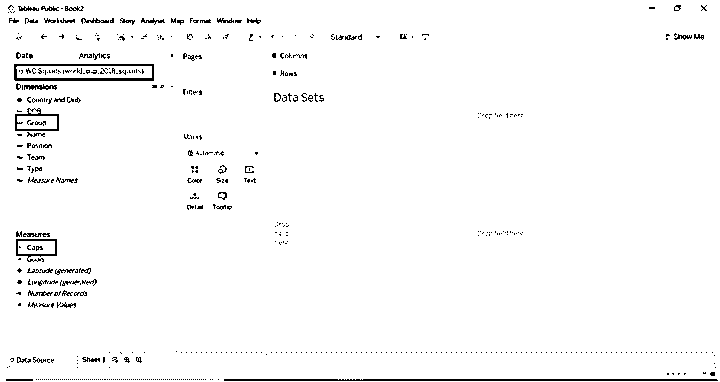

当我们将尺寸和度量值拖动到表格中后，您将会看到下图。

默认情况下，会显示条形图，因为有一个维和措施。

*   转到分析->自定义->参考线

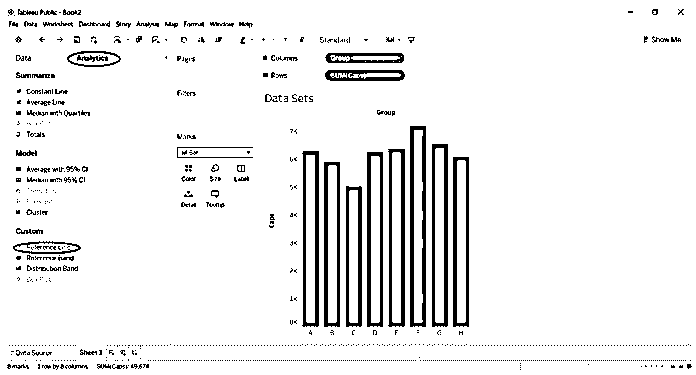

*   将参考线拖到图表中。
*   根据需要选择范围，如整个表格、每个单元格和每个窗格
*   我们将从范围作为整个表开始，选择值作为总和、平均值
*   标签为计算。
*   在格式化区域线改变颜色为红色(你可以选择你喜欢的颜色)。

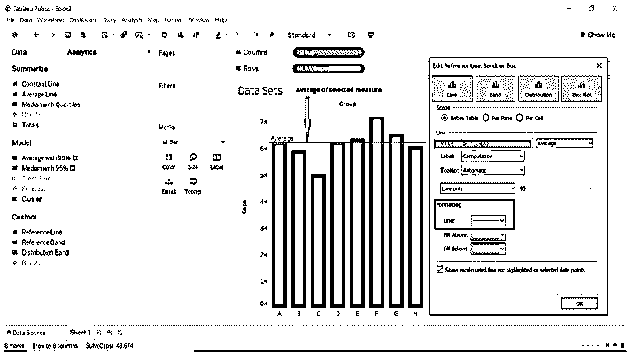

*   我们将把该值设置为常数；该选项将根据我们选择的数据显示指定测量的常数值。我们可以改变这个值。我们现在拥有的数据，tableau 将显示常量值为 5，028。
*   我们将常量值更改为 4000。
*   下面两幅图像将显示从缺省到变化的常量值。

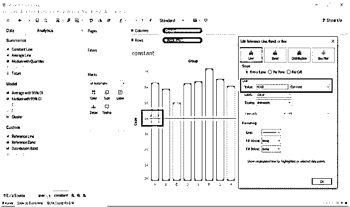

*   当我们仅选择平均值和中值时，我们可以更改线型。
*   当我们选择平均值时，我们只改变了线和置信区间。
*   我们保留了标签作为计算；当我们选择不同的标签时，图片将会不同。

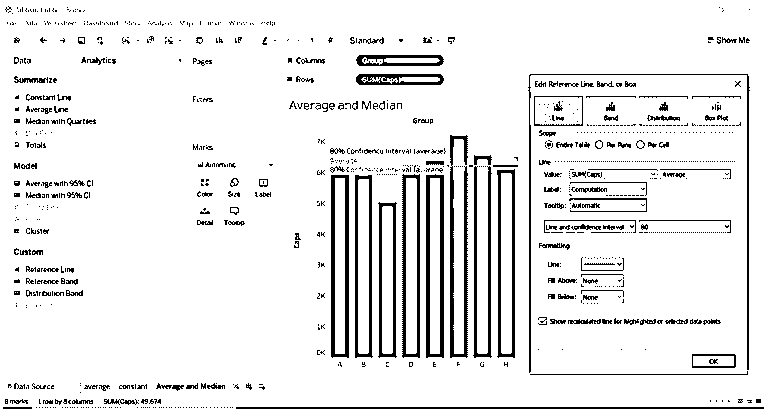

*   当我们选择中值时。

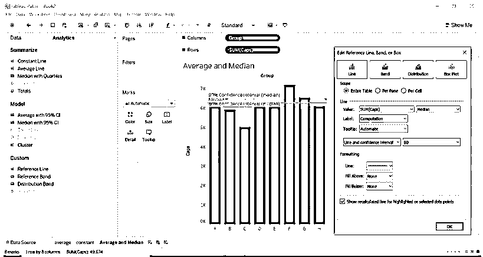

### 为了面包

*   当我们按窗格选择范围时，tableau 将为每个窗格计算聚合。例如，在下面的示例表中，每个组计算目标的特定数据的平均值。
*   将 Group 和 DOB 维度拖到列中。
*   将目标拖到列中。
*   拖动出生日期到过滤器，选择你想要的日期。

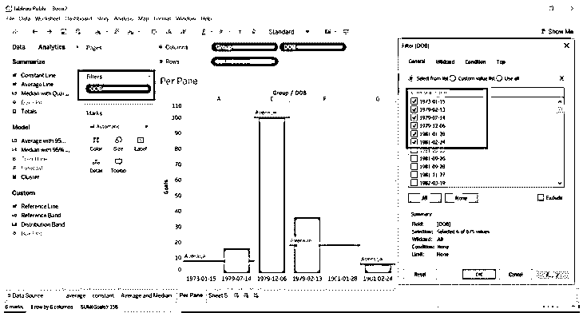

*   我们选择了线类型作为线和置信区间；我们可以根据自己的需要调整尺寸或定制尺寸。
*   我们已经格式化了上面填充和下面填充的颜色。

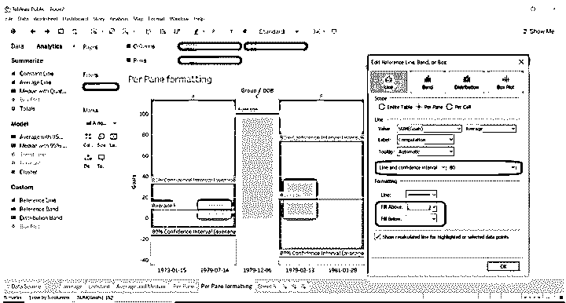

### 每个细胞

*   如果我们按每个单元格选择范围，它会向每个选定的单元格添加一条参考线。
*   Tableau 将为我们选择的每个单元格计算聚合。
*   选择 Group，DOB，Type 维到列。
*   选择目标行。
*   将参考线拖动到每个单元格。

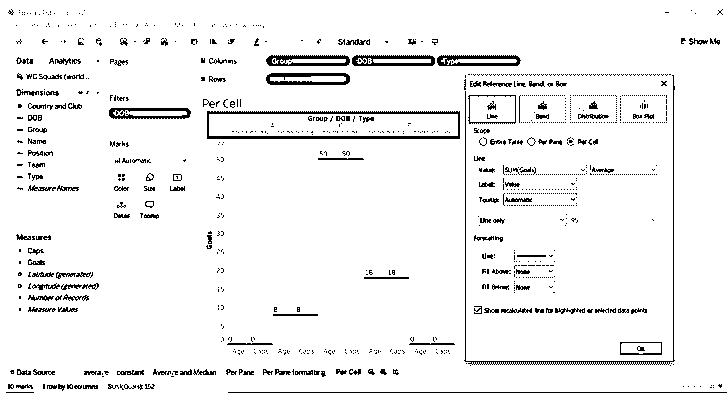

*   看看下面的图片；我们在这里使用了格式化区域。
*   我们改变了上面填充和下面填充的颜色。
*   我们只保持直线。

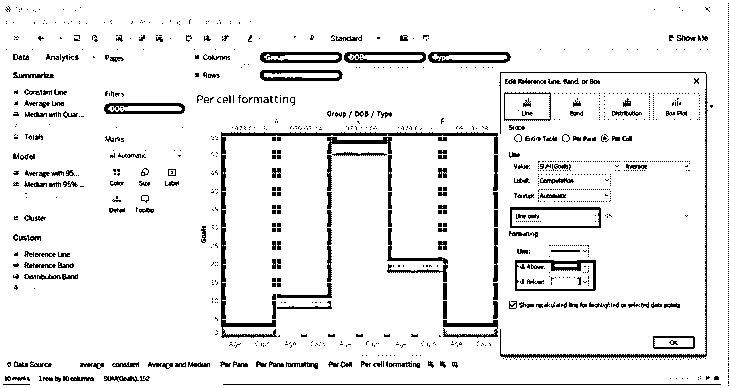

### 仪表盘

*   仪表板是几个工作表的集合，这些工作表提供了我们用来可视化的不同工作表的视图。
*   我们将比较我们为参考线选择的范围之间的结果。
*   创建仪表板要遵循的步骤。
    1.  转到仪表板(工作表底部栏上给出的仪表板图标。)
    2.  看一下仪表板的左侧；您将看到我们处理或创建的工作表的数量。
    3.  将工作表拖放到仪表板中。
    4.  我们将看到为整个表格、每个窗格和每个单元格创建的平均值。
    5.  我们可以更改仪表板标题(选择显示仪表板标题->右键单击标题名称->选择编辑标题->给出您想要的标题名称)
    6.  显示仪表板左侧底部给出的仪表板标题选项。在下图中你可以看到。
*   你可以在下图中看到；我们已经拖动了工作表。
*   Average(工作表)-范围为整个表。平均值是根据我们从数据集中选择的维度和度量值对整个表进行计算的。
*   每窗格格式(工作表)-范围为每窗格。平均值是根据我们从数据集中选择的维度和度量值的每个窗格来计算的。
*   每个单元格格式(工作表)-范围为每个单元格。平均值是根据我们从数据集中选择的维度和度量对每个单元格进行计算的。

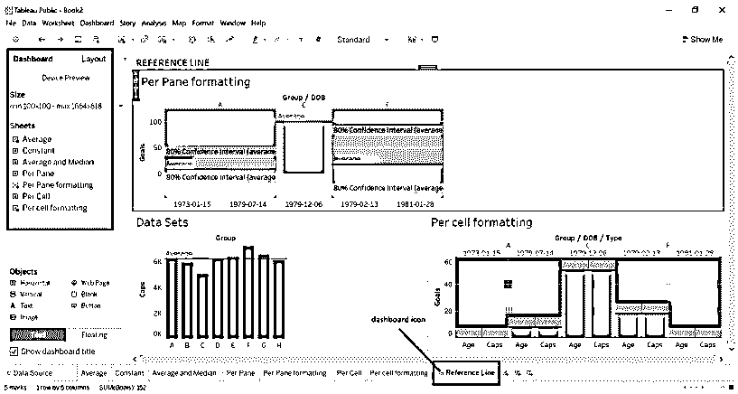

我们将研究不同的数据集名称猫和狗在美国的受欢迎程度(数据集来自上面给出的链接)

*   从上面提到的链接下载数据集。
*   打开它进入 tableau 桌面或 tableau。
*   将位置从维度拖到列中。
*   将猫的数量和狗的数量拖成行。
*   将参考线应用于整个表格、每个窗格和每个单元格。

#### 整个表格

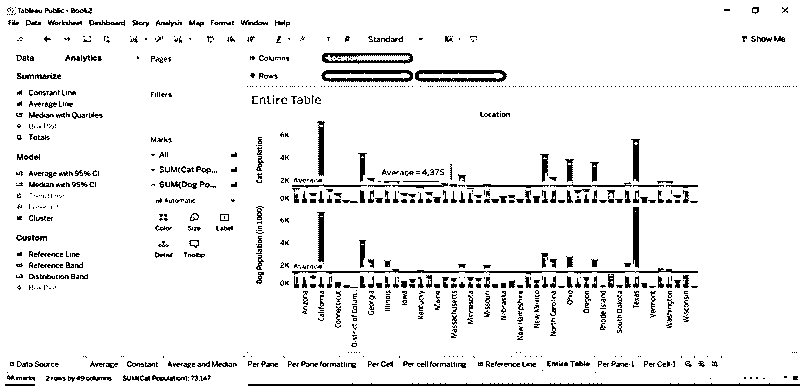

#### 为了面包

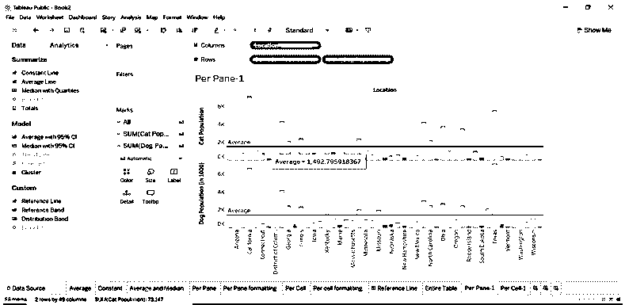

#### 每个细胞

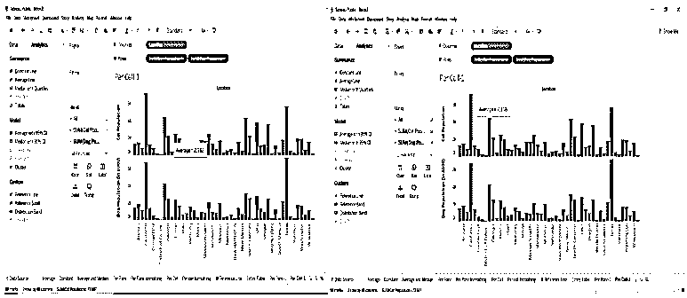

*   我们创建了一个仪表板，用于在一个工作表中显示不同的视图，即仪表板。我们可以看到整个表格、每个窗格和每个单元格的平均值是如何不同的。

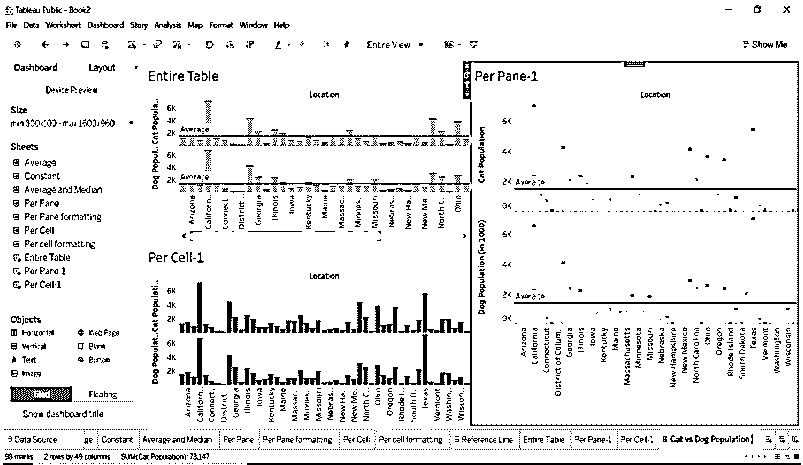

### 结论

通过将参考线添加到不同类型的数据集，我们将获得不同的视图。我们可以比较每个视图生成的结果。审视每一个维度和尺度将会很容易。Tableau 提供了不同类型的数据集，这将帮助我们可视化具有不同值的数据。我们可以通过 tableau 工具获得专业知识。

### 推荐文章

这是 Tableau 数据集指南。这里我们讨论不同类型的数据集，这将有助于我们以不同的方式可视化数据。您也可以阅读以下文章，了解更多信息——

1.  [如何使用 Tableau？](https://www.educba.com/how-to-use-tableau/)
2.  [Tableau 函数](https://www.educba.com/tableau-functions/)
3.  [画面可视化](https://www.educba.com/tableau-visualization/)
4.  [Tableau 建筑](https://www.educba.com/tableau-architecture/)
5.  [Tableau 中的排名函数](https://www.educba.com/rank-function-in-tableau/)

