# Tableau 连接

> 原文：<https://www.educba.com/tableau-joins/>

## Tableau 联接简介

从数据库的多个表中提取数据的一种方法是 Tableau 连接。它们使我们能够从不同的表中获取数据，前提是这些表具有某些公共字段。公共字段应该是一个表中的主键，作为另一个表中的外键。各种类型的联接包括内部联接、左联接、右联接和完全外部联接。Tableau 允许我们以非常简单的方式执行连接。它提供了一种有指导的方法来连接两个表，提供了几个重要的选项。使用该功能，我们可以从不同的表中获取数据进行分析。

### Tableau 中的连接类型及其应用

首先，我们将数据源加载到 Tableau 中。在本演示中，我们使用 Excel 文件中的员工数据。在两个不同的表上有两个表格。第一个表是雇员，第二个表是薪水。雇员表包含雇员 ID、出生日期、名字、姓氏、性别和雇用日期等维度。薪金表包含雇员 ID、薪金和开始日期等维度。雇员 ID 出现在两个表中。此外，雇用日期和开始日期是相同的字段，但名称不同。

<small>Hadoop、数据科学、统计学&其他</small>

*   在数据菜单中点击**【新数据源】**选项。然后选择数据源类型。

*   在我们的例子中，它以一个微软 Excel 文件的形式出现。加载数据源。下面的截图说明了这一点。

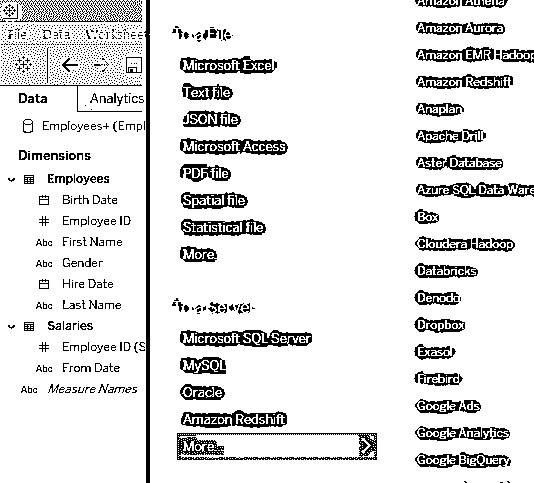

*   数据源按如下方式加载。现在，我们将把表“**雇员**”和“**工资**”一个接一个地拖到“将表拖到这里”部分。

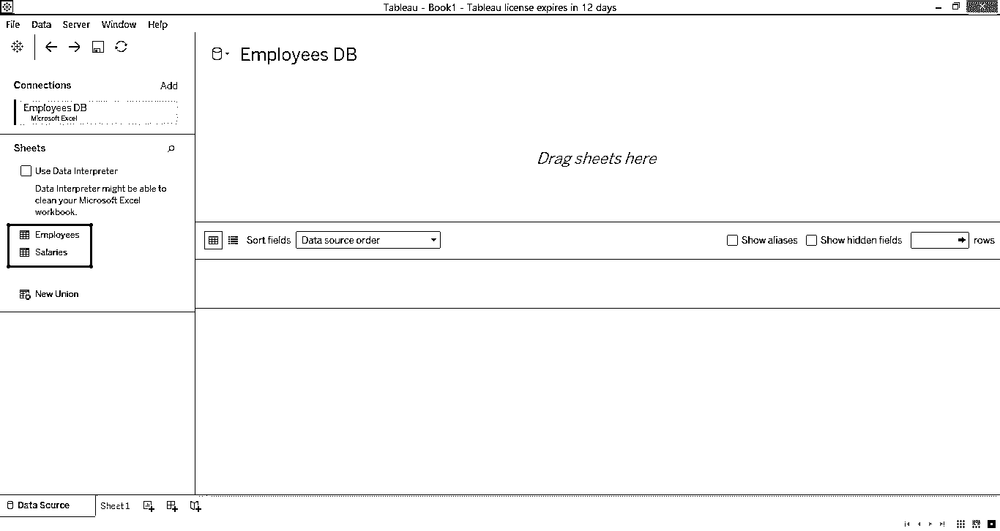

*   首先，我们拖动**雇员**表如下。

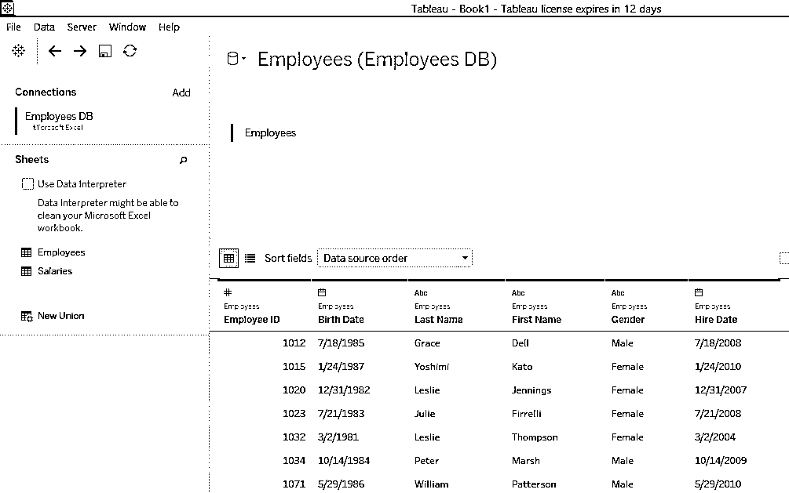

*   现在，看看当我们拖动薪水表时发生了什么，一个内部连接被自动创建。相交的圆表示一个连接。

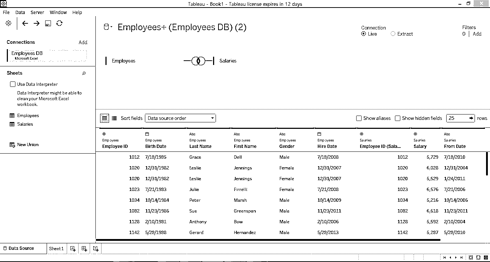

#### 1.内部连接

*   将鼠标悬停在相交的圆圈上，可以看到关于连接的详细信息，如下图所示。

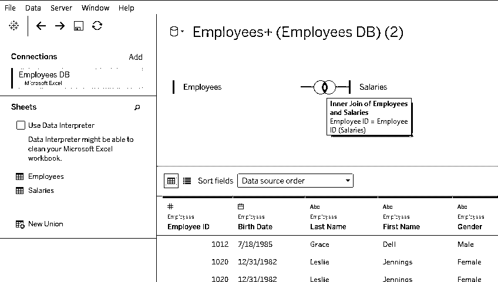

*   点击相交的圆圈，会弹出一个框。可以看出，有四种类型的连接，即。内侧、左侧、右侧和全外侧。目前，选择了内部联接，它只返回两个表之间的公共数据。就像两个集合的交集。

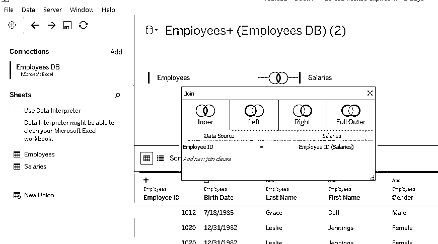

#### 2.左连接

当左连接应用于两个表时，会考虑左表中的完整数据，并且只考虑右表中两个表共有的数据。下面的截图显示了这一点。

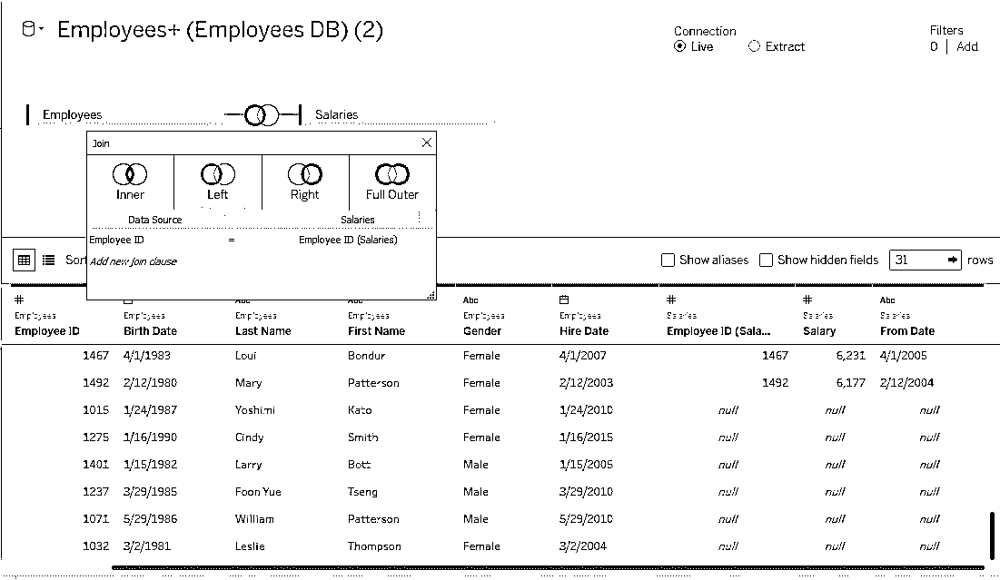

*   从上面的截图中可以看出，在截图的右上角，sales 表中的维度有“null”条目。这是因为我们应用了左连接，Employees 表是左表。

#### 3.右连接

当对两个表应用[右连接](https://www.educba.com/sql-right-join/)时，会考虑右表中的完整数据，并且只考虑左表中两个表共有的数据。下面的截图说明了这一点。

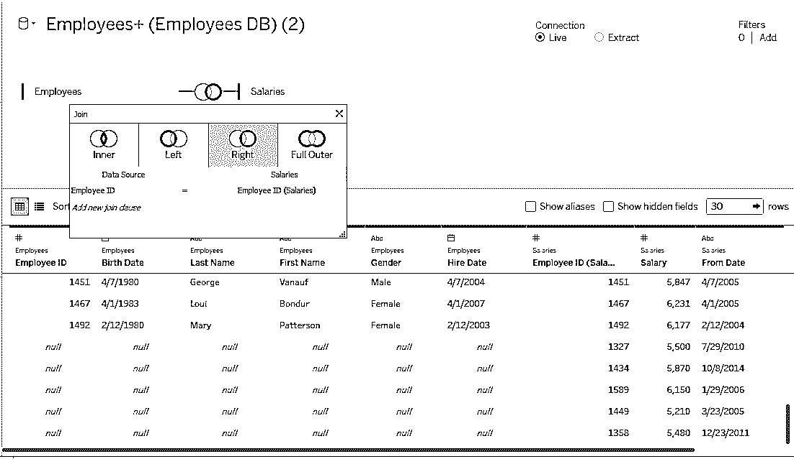

*   从上面的截图中可以看出，在截图的左上角，Employees 表中的维度有“null”条目。这是因为我们已经应用了 Right join，并且 Salaries 是正确的表。

#### 4.完全外部连接

应用时，该连接将返回两个表共有的数据，以及两个表中不常见的数据。下面的截图演示了这一点。

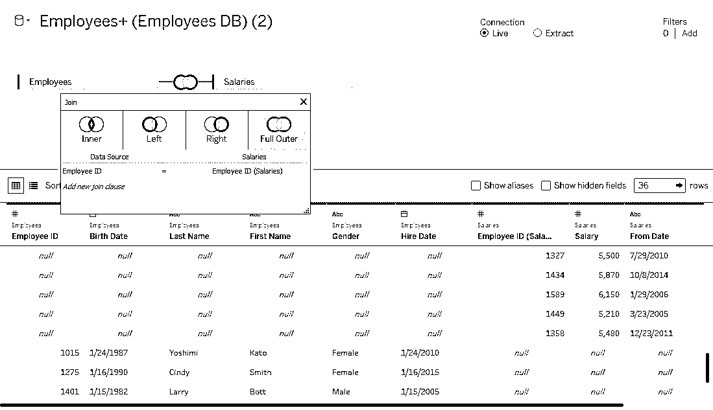

*   使用下表所示的下拉菜单，我们可以选择连接两个表的公共字段。选择错误的字段不会连接表，从而产生错误的结果。

*   现在，当我们试图在工作表中分析数据时，我们将检查连接返回的数据是否正确工作。在数据部分，我们可以看到两个表及其各自的维度。将“名字”和“员工 ID”维拖到“行”区域，将“薪金标准”拖到“列”区域。点击“演示”中的“文本表格”选项，数据以下列形式显示。正如我们所看到的，对于某些雇员 id 和名字，没有为薪金度量返回任何值。这是因为，当我们从 Employees 表中选择 Employee ID 时，将返回该表中的所有雇员 ID 以及相应的名字，但是这些条目不在 Names 表中，因此，Salary 列中没有为这些条目返回任何值。

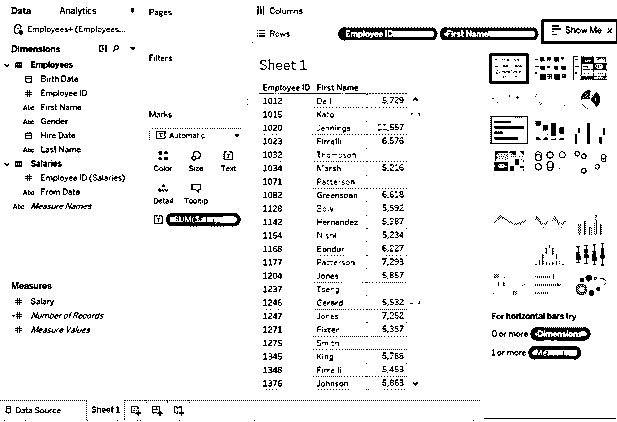

*   现在，我们从 Employees 表中删除雇员 ID，并将雇员 ID 从 sales 表拖到 Rows 区域。我们得到的结果如下图所示。可以看到，这一次已经返回了 Names 表中的所有雇员 id，以及相应的名字和薪水。这一次，对于 First Name 列中的某些条目，Employee ID 和 Salary 没有返回值。这是因为名字中的那些条目出现在 Employees 表中，而不在 sales 表中。

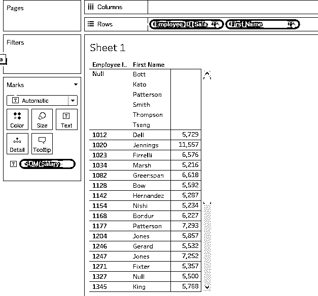

*   在上面的两个例子中，我们从两个表中得到一个结果。这两个表中的公共条目和详细信息一起返回。但是，我们必须记住，主键必须从适当的表中选择，如上面的示例所示。当我们需要对从多个表中提取的数据进行分析时，这一点至关重要。
*   现在，我们将简要探讨下表下拉菜单中的选项。点击表 Employee 的下拉菜单，会出现某些选项。自动选择的第一个选项是“字段名在第一行”。此选项在第一行将字段名称显示为标题。“自动生成字段名”会自动生成字段名。“转换为联合”选项将在两个表之间创建一个联合。“Duplicate”选项创建表的副本，就像我们为 Employees 单击 Duplicate 一样，它将创建一个副本 Employees1。单击“移除”选项会将该表从窗格中移除。

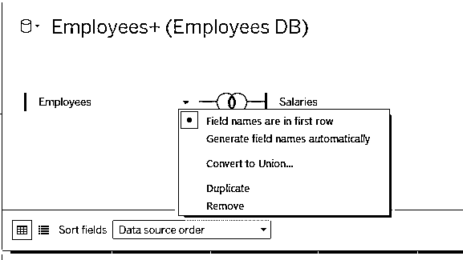

### 结论

连接是数据仓库中的一个重要概念，它允许我们将多个表中的数据放在一起。它们像数学中的集合运算一样工作。Tableau 提供了一种易于实现的方法来实现多个表之间的连接，这有助于进行详细的分析，因为我们可以随意使用所需的数据。

### 推荐文章

这是一个 Tableau 连接的指南。这里我们讨论了 Tableau 中连接的介绍和类型以及它们的应用。你也可以浏览我们的文章来了解更多-

1.  [什么是 Tableau？](https://www.educba.com/what-is-tableau/)
2.  [如何安装 Tableau](https://www.educba.com/install-tableau/)
3.  [表格中的过滤器](https://www.educba.com/filters-in-tableau/)
4.  [Tableau 建筑](https://www.educba.com/tableau-architecture/)
5.  [MySQL 中最常见的 6 种连接类型及示例](https://www.educba.com/joins-in-mysql/)

