# Tableau 中的地图图层

> 原文：<https://www.educba.com/map-layers-in-tableau/>

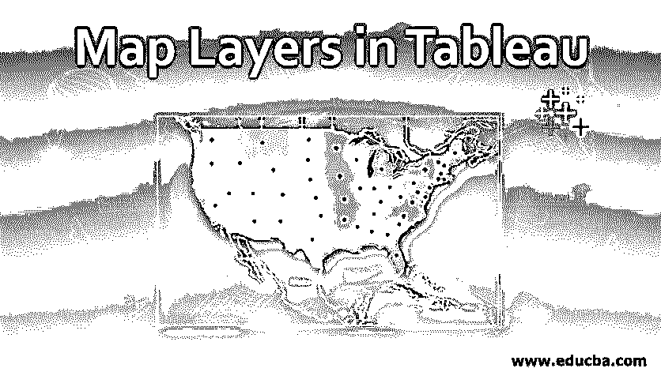

## Tableau 中地图图层的介绍

在本文中，我们将了解 Tableau 中的地图图层。Tableau 是一个可视化分析工具，通过提供基于地图的见解来提供出色的分析能力。基于地图的见解具有特殊的意义，因为它们允许利益相关者通过形成基于上下文的图像来直接暴露他们的想法。与地图相关联的地理元素为用户提供了这种能力。Tableau 中的地图提供了广泛的功能，使用这些功能，我们可以根据需要创建基于地图的分析。“地图图层”就是这样一个非常强大而重要的功能，它基本上允许我们根据功能中提供的各种特性来定制基于地图的分析。如果没有此功能，Tableau 的地图[功能就不完整。](https://www.educba.com/tableau-new-features/)

### 在 Tableau 中使用地图图层

为了在 Tableau 中演示地图图层的概念，我们将使用一个简单的数据集，该数据集包含美国各州产品的销售额和利润百分比。我们将使用这些数据来处理地图图层。让我们按如下步骤进行操作:

<small>Hadoop、数据科学、统计学&其他</small>

**第一步:**将需要的数据源加载到 Tableau 中。点击“数据”菜单中“新数据源”选项。或者，单击“连接到数据”。

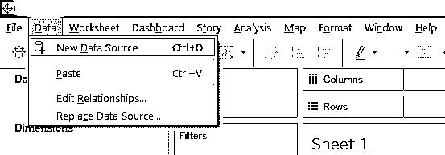

**第二步:**在连接中，选择合适的数据源类型。在这种情况下，它是 MS Excel，因此单击 Microsoft Excel，如下所示。

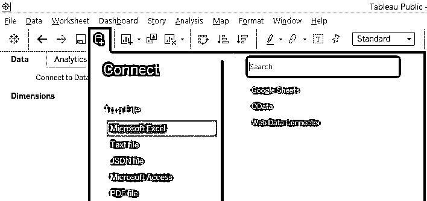

**第三步:**从存储位置选择所需的 Excel 文件，如下图所示。最后，单击 OK 加载它。

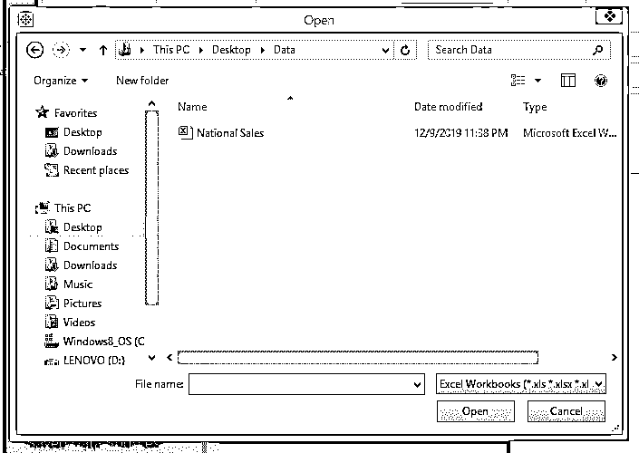

**第四步:**如果数据成功加载到 Tableau 中，那么可以在数据源选项卡中看到它，如下图所示。

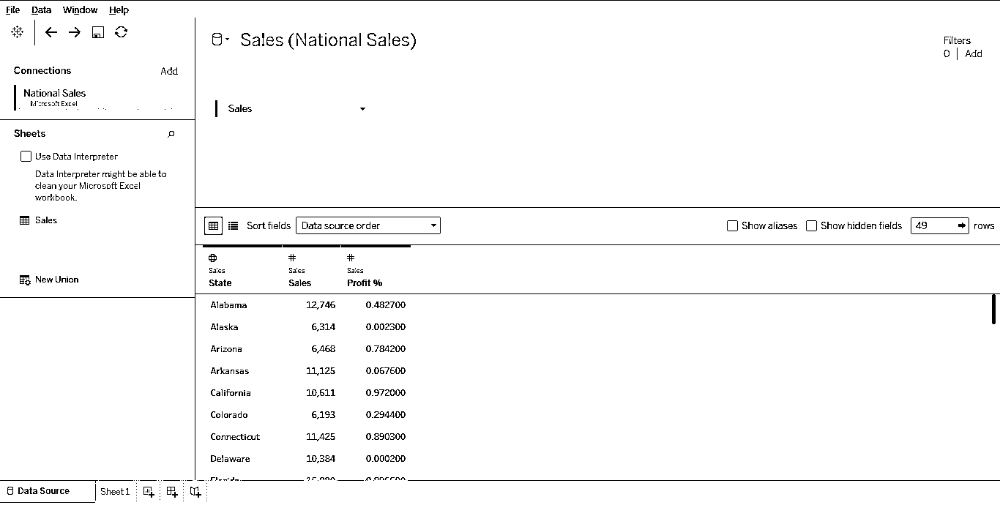

**步骤 5:** 转到工作表选项卡，我们可以找到各个部分中的维度和度量，如下图所示。

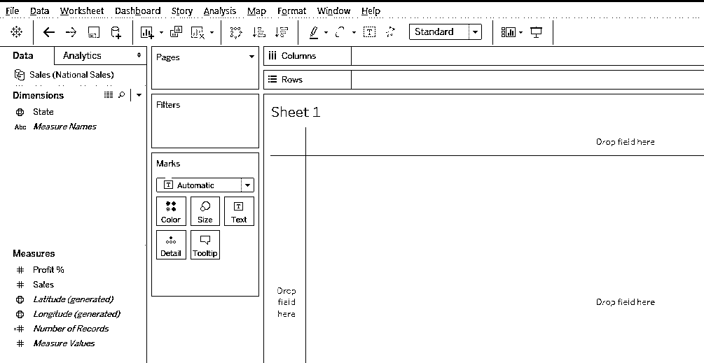

**步骤 6:** 为了使用地图，必须确保相关维度被分配了地理角色。通过这种方式，我们基本上意味着该维度表示一些地理实体。下面的屏幕截图说明了我们如何将“州/省”字符分配给 State 维度。现在，维度状态的值将自动映射到地图上的地理要素。

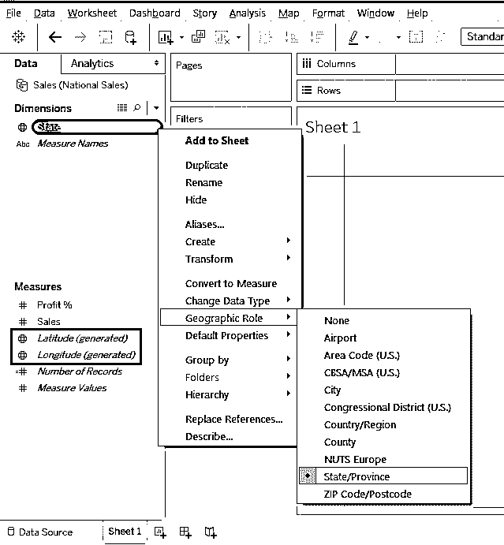

**第 7 步:**我们找到上面突出显示的度量中生成的纬度和经度。双击它们中的每一个，将它们带入工作表中。下面的屏幕截图显示了分析中引入的经度(生成的)和纬度(生成的)。当我们给他们带来一张地图。我们缩放了地图以突出美国。

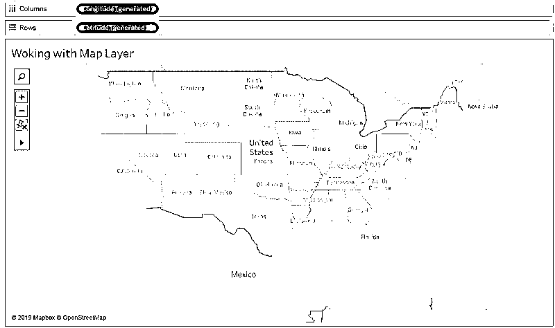

**第八步:**现在，在 Marks 卡片的 detail 上拖动 State 维度，我们得到了如下图所示的基于地图的可视化。这些状态可以正确映射，因为我们正确遵循了前面讨论的步骤。

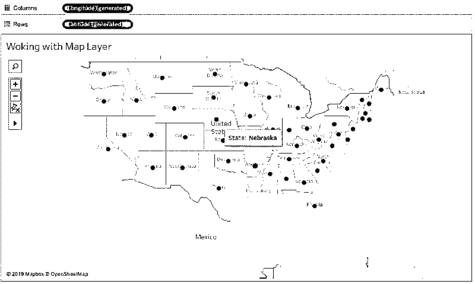

**第 9 步:**我们可以通过选择不同的选项来改变地图的背景，如下图所示。

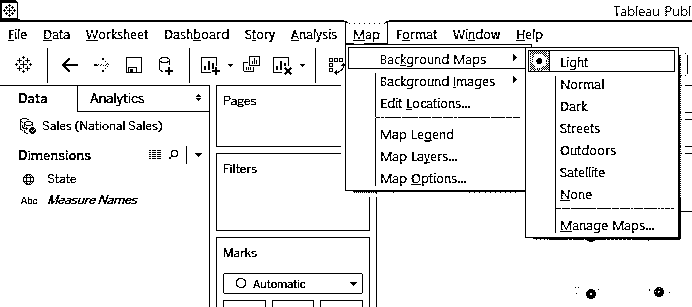

**步骤 10:** 现在，进入地图最重要的部分，即地图图层，点击地图选项卡下的“地图图层”选项，如下图所示。

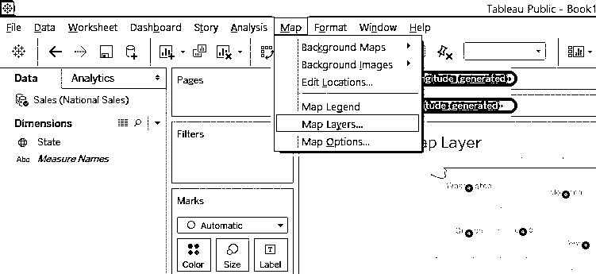

**步骤 11** :当我们点击地图图层选项时，在窗口的左侧弹出地图图层窗格。地图图层部分如下所示。仔细浏览它的每一个元素。我们可以发现有各种各样的选项与背景、地图图层和数据图层相关。

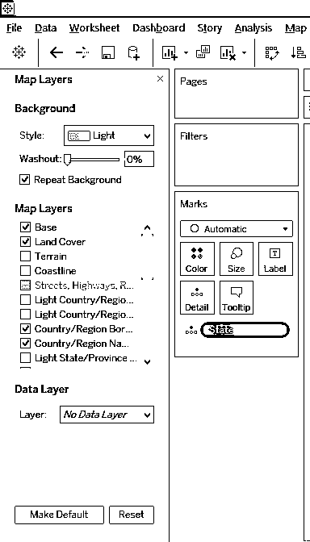

首先，在背景下的样式中，我们可以设置任何样式。我们选择了风格下的户外选项，观察它如何影响可视化，如下图所示。

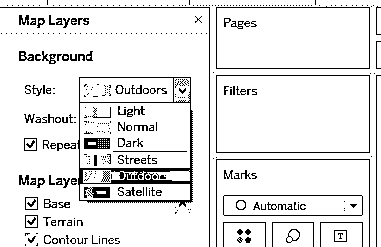

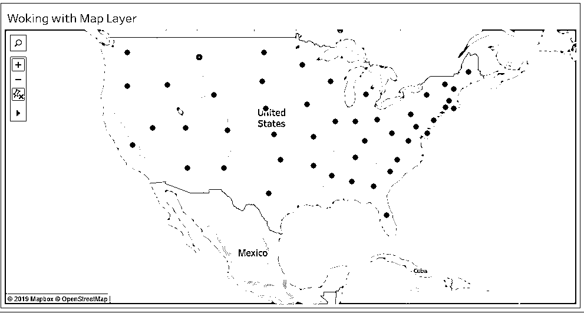

**步骤 13:** 下面截图中突出显示的洗出功能允许我们设置透明度。我们将它设置为 100%，观察它对地图的影响，如下图所示。

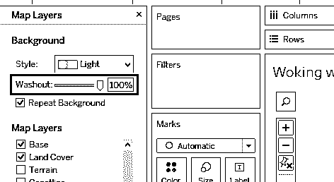

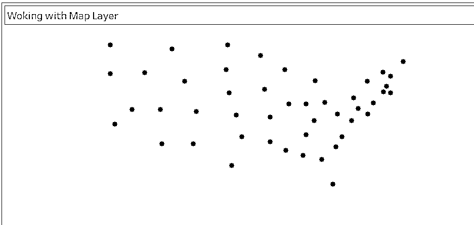

**第十四步:**这一部分的重要部分是图层。正如我们在地图图层中看到的，我们可以找到各种选项，如基础、地形、国家/地区边界等。其中一些是选中的，一些是灰色的。这取决于你目前选择了什么风格。在接下来的部分中，我们选择了“户外”样式，并且相应的地图图层也可用于此样式。

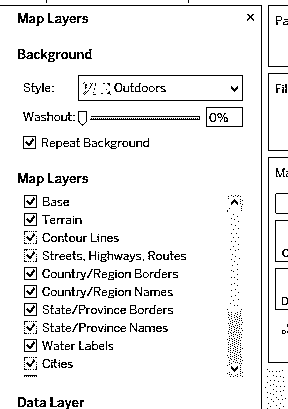

第 15 步:现在，我们选择了光的风格，并观察地图层是不一样的。因此，背景样式决定了地图图层。

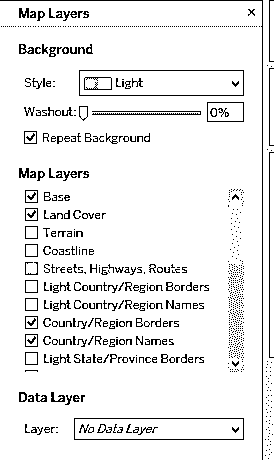

**步骤 16:** 如下图截图所示，我们在地图图层中取消选中了基础选项。我们只是不想基地反映在地图上。观察更新后的地图，如下图之后的截图所示。

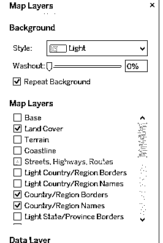

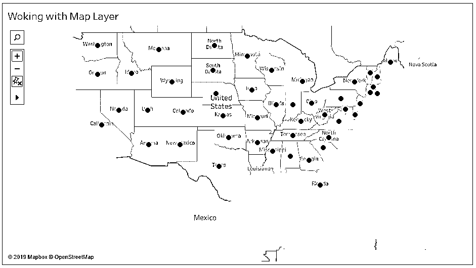

现在，我们检查了地图图层中的海岸线选项，并在下面的截图中观察更新后的地图。我们现在突出显示了美国周围的海岸线。

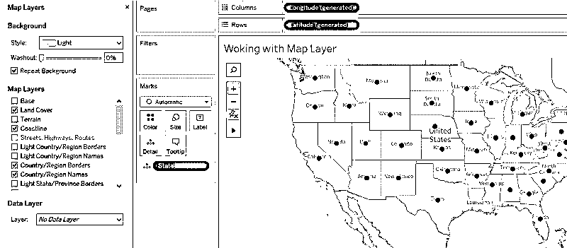

**步骤 17:** 向下滚动地图图层，查看所有图层提供的内容。请记住，某些选项会根据上下文变灰。应该对这些选项进行试验，以了解它们的效果和用途。

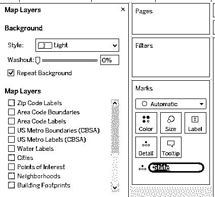

**第十八步:**现在，地图图层中一个非常重要的选项就是数据层。此选项的默认选择是“无数据层”。单击菜单以探索各种选项，如下节所示。正如我们所看到的，有多种选择，允许我们考虑某些将影响地图的定量元素。所有这些都与美国有关。观察下面两张截图。

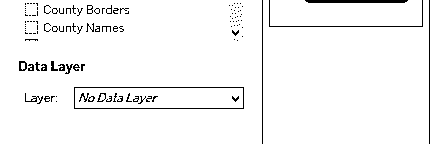

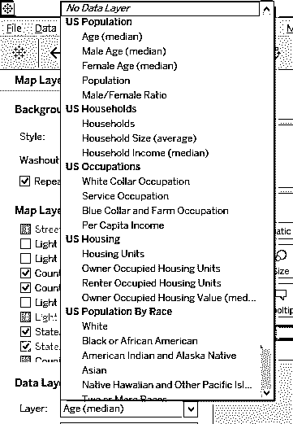

**步骤 19:** 当我们为层选项选择一个合适的值时,“按”和“使用”部分激活。“通过选项”本质上意味着需要如何合并该层。为此选项选择适当的值。

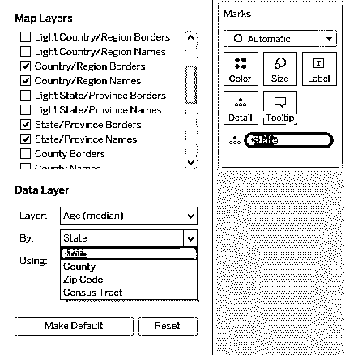

第 20 步:最后但同样重要的是，使用选项允许我们选择非常重要的颜色组合。将图层选项中的值考虑在内的颜色组合会生成强大的基于地图的可视化效果。在此做出适当的选择。

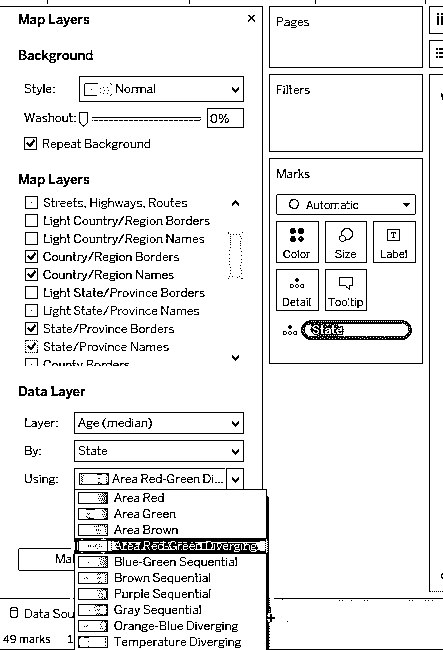

*   使用上述步骤，我们在数据层进行了如下选择。现在，只需观察我们得到的基于地图的可视化，如下图所示。它提供了对美国各地年龄数据的快速洞察。

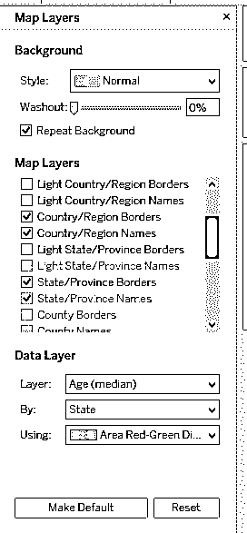

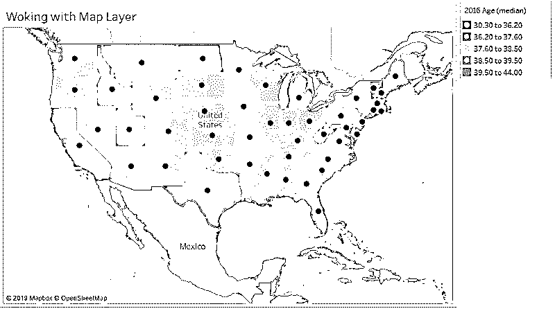

### 结论

地图层是由 Tableau 提供那些特征，其呈现其基于地图的可视化特征为动态特征。在达成最终组合之前，必须详细研究这些选项，并且应该根据上下文来选择各种选项的值。

### 推荐文章

这是 Tableau 中的地图图层指南。在这里，我们讨论了在 Tableau 中使用地图图层，简单的步骤和适当的解释，以便更好地理解。您也可以浏览我们的其他相关文章，了解更多信息——

1.  [Tableau 中的组](https://www.educba.com/group-in-tableau/)
2.  [Tableau 中的帕累托图](https://www.educba.com/pareto-chart-in-tableau/)
3.  [Tableau 中的趋势线](https://www.educba.com/trend-lines-in-tableau/)
4.  [Tableau 项目符号图](https://www.educba.com/tableau-bullet-chart/)
5.  [Tableau 中的连接指南](https://www.educba.com/concatenate-in-tableau/)
6.  [Tableau 动作过滤器的不同概念](https://www.educba.com/tableau-action-filter/)

