# 如何在 Tableau 中创建一个集合？

> 原文：<https://www.educba.com/create-set-in-tableau/>

## 介绍如何在 Tableau 中创建集合

Tableau 是一个[商业智能工具](https://www.educba.com/business-intelligence-tool/)，用于可视化分析数据。我们所做的每一件事都越来越多地产生大量数据，组织可以利用这些数据来扩大业务。Tableau 产品正在改变人们使用数据解决问题的方式。Tableau Software 是速射商业智能软件的全球领导者。Tableau 正在彻底改变数据的使用方式。 [Tableau 被企业、学术研究人员和许多政府机构用于可视化数据分析。Tableau 可以连接到文件、关系和大数据源，以获取和处理数据。](https://www.educba.com/what-is-tableau/)

### 设置概述

集合是基于数据源中的维度在 Tableau Desktop 中创建的自定义字段。Tableau 使用过滤器、组和集合来组织数据。集合可以被认为是自定义段，但与维度字段不同，它们总是二进制的。Tableau Set 是一个自定义字段，用于保存基于某些条件的数据子集。Tableau set 允许您隔离维度的特定段，然后可以用几种不同的方式来深入了解您的数据。Tableau 中的 Set 用于根据用户定义的特定条件创建数据子集。

<small>Hadoop、数据科学、统计学&其他</small>

### 着手做什么？

*   集合是数据的子集，可以手动创建或计算。使用条件逻辑，维度或度量可用于确定集合中包含或排除的内容。可以创建具有销售额最高的前 10 名客户的子集数据的集合。
*   您可以选择要放入集合的单个维成员，让集合基于数量阈值，使用表现最好或最差的维成员创建，等等。集合有特定的用例。其中一些用例包括突出显示符合特定标准的数据、检查手动选择的维度成员、比较和对比集合中的成员和那些不符合标准的成员(进/出)、创建组合集合等等。
*   在 real-time Tableau 中，可以通过从列表中选择成员、编写自定义条件或根据度量值选择顶部或底部的少数记录等方式来创建集合。
*   在 Tableau 中，器械包的图标由一个小的文氏图(两个互锁的环)表示。集合也包含在 Tableau 数据源(*。tds 文件)、Tableau 数据提取(*。tde 文件)和打包的 Tableau 数据源(*。tdsx)。

### 如何在 Tableau 中创建 Set？

让我们看看如何在 Tableau 中创建集合:-

#### 1.静态集合

在 tableau 中创建静态集合是一种非常简单直接的方法。有不同的方式-用户可以在 tableau 中创建一个集合。如下图所示——我在列字段中使用销售总额，在行字段中使用客户名称。我使用的是默认数据 Tableau 提供的超市数据集。

1.  我已经按照销售额最高的客户的顺序排列了数据。
2.  我选择了前 10 名客户名称
3.  右键单击并在显示为小维恩图的图标上创建集合

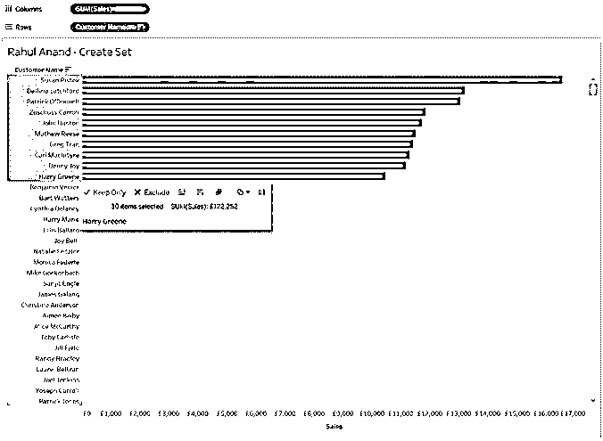

4.  我将“前 10 名客户”作为一个集合名称，并单击“确定”。

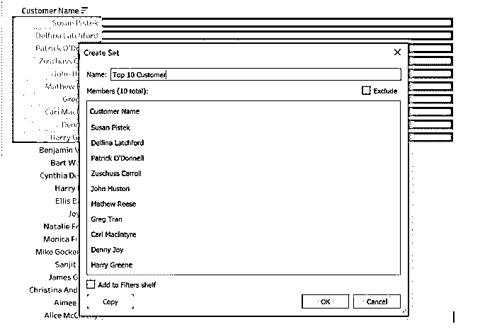

5.  如下图所示，您可以看到，我已经创建了一组前 10 名客户。该器械包将出现在面板左侧的器械包架上。

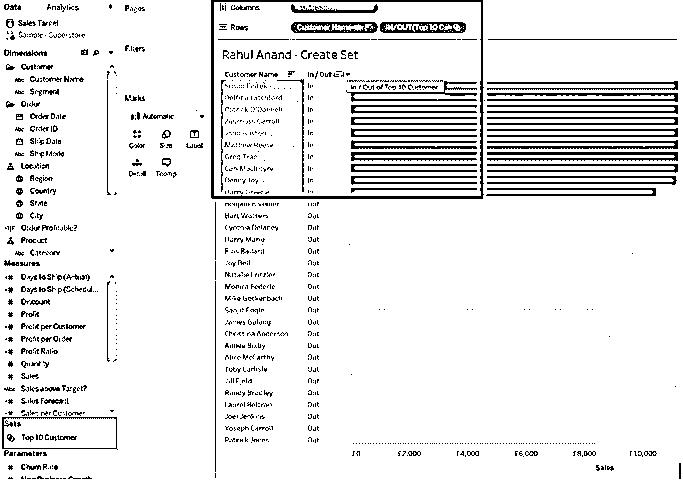

这个集合告诉我们每个客户的名字是在销售额前 10 名的客户之内还是之外。这一套可供我们分析使用。所创建的这个集合本质上是静态的，这意味着当一个新客户进入前 10 名时，它不会动态变化。

#### 2.动态组

您可以创建一个动态集。这意味着当数据集更新时，动态集允许你改变值。下面是创建动态集的步骤:

1.您可以选择如下所示的维度，我已经选择了前 15 名的销售额。右键单击并在显示为小维恩图的图标上创建集合

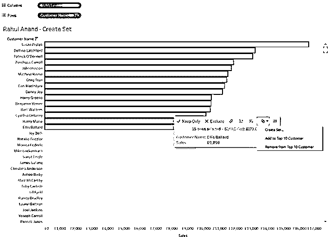

2\. I have given Name Top 15 Sales as a set name and clicked on OK.

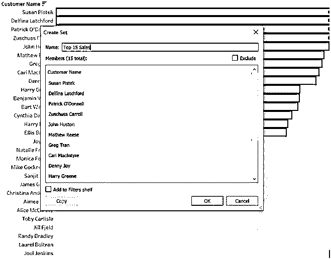

3.如下图所示，你可以看到，我创建了一组前 15 名的销售。该器械包将出现在面板左侧的器械包架上。

4.  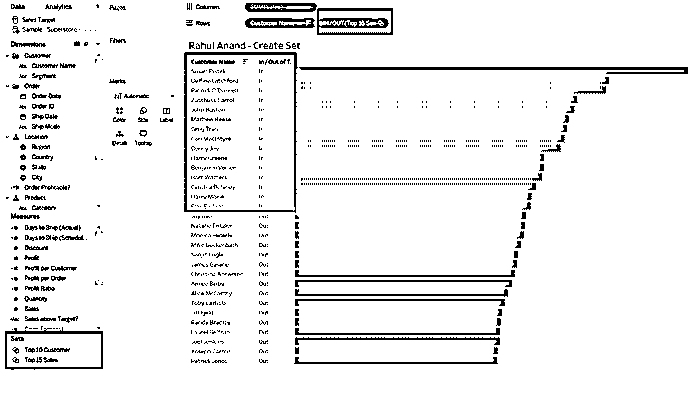

    

如上所述的动态集合将在它们的销售值更新时动态更新它们的数据。动态集合有利于实时分析。

### 使用 Set 的 5 种方法

有五种方法可以使用该设备。

1.  您可以将 set 用作过滤器。由于集合是二进制的，您可以将它们作为过滤器添加。您可以通过在器械包架上右键单击器械包并选择“显示过滤器”来使用 using。
2.  您可以使用 set 作为编码标记。可以通过将器械包从器械包架拖到色标卡上来完成。
3.  您可以将 set 用作计算字段。它可以像尺寸和测量一样使用。
4.  您可以将 set 用作维度字段。这可以通过向列架或行架添加字段来实现，视图将被该维度字段分割。
5.  您可以将集合作为自定义层次结构。它允许您和最终用户轻松地在不同维度上追溯和备份。

**过滤器:**过滤器甚至可以在度量或维度上使用逻辑条件来修改返回的数据子集。这似乎比我们从一组中看到的更符合一组的功能。

**组:**组用于简化使用具有大量成员的维度的可视化。必须在维度内创建组。通过将大量维度成员组合到更高级别的类别中来简化它们。

### 在 Tableau 中创建集合的示例

在这些示例中，我们将考虑 tableau 网站上提供的超市销售数据

#### 示例 1–创建一个集合作为过滤器

我们将使用“使用 excel 导入”将 excel 文件导入 tableau。

现在，我们在列中采用了度量值(利润),在行中采用了维度(客户名称),并获得了以下结果。

现在，为了在 tableau 中创建一个场景，我们必须执行以下操作:

右键点击**客户名称**，然后点击**创建**一个**集合。**
(注意:集合通常锚定到尺寸)

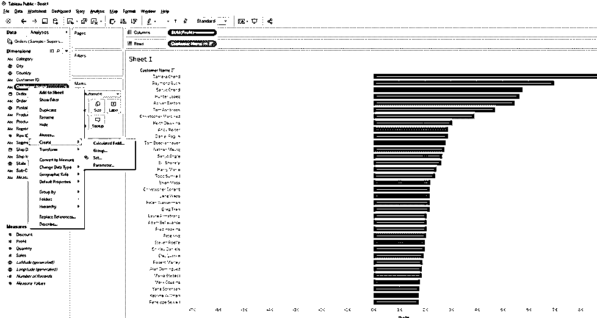

选择创建集合选项后，对话框将打开。三个选项卡最后一个是顶部，是所有选项卡中最容易的一个，我们将该组重命名为**顶级客户**。

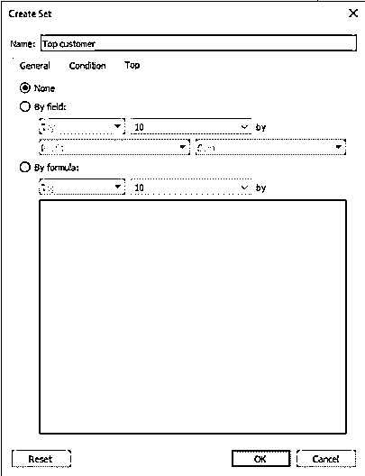

现在我们将按字段选择选项 a **，选择**利润**和**总和**，输入 30。**

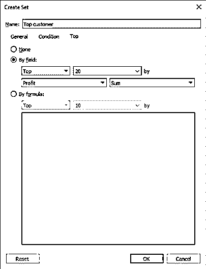

现在我们可以看到一个新的分区与度量和维度一起被创建，一个新的选项卡随着**设置**而出现。

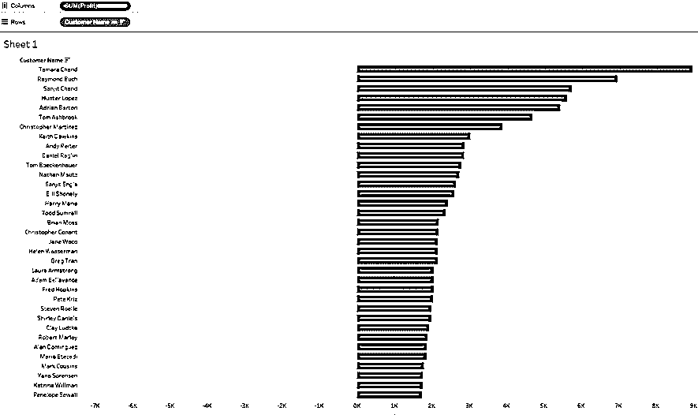

现在，如果我们将该集合放在 filters 窗格中，我们将获得数据中前 **30 名客户**的列表。

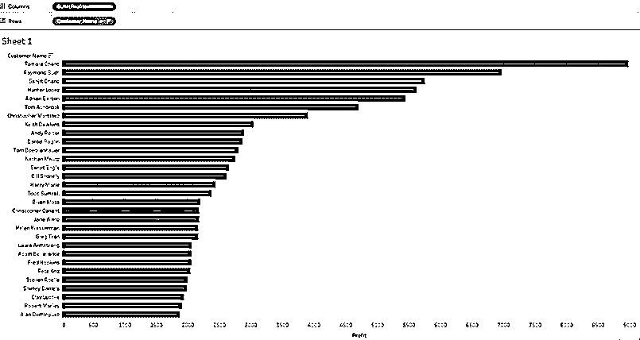

#### 示例 2–创建一个集合作为输入/输出字段

现在，取出一张新表，将测得的利润放在列字段中，将名为 top customer 的集合放在行字段中，然后我们将得到下图。

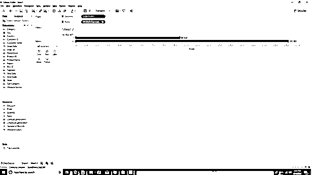

现在可能会出现一个问题，如果我们想在同一张纸上看到顶部 30 和底部 30，而不是在两张不同的纸上，该怎么办？

#### 示例 3–显示前 30 名和后 30 名

在这个场景中，我们选择了底部，我们还添加了一个颜色差异，以便更好地观察前 30 名和后 30 名客户。

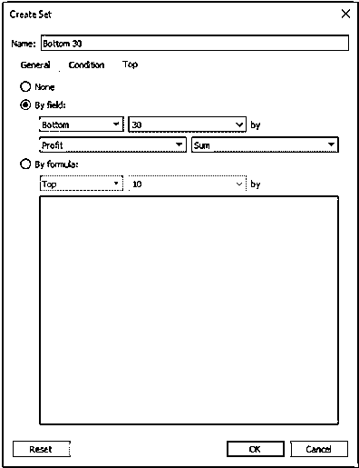

现在我们必须点击一个**集合**并选择一个**组合集合。**

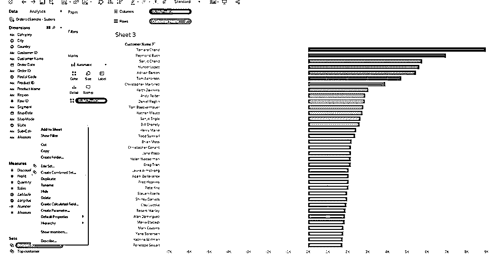

将弹出一个对话框，我们将把名称重命名为“前 30 名和后 30 名客户”。
我们有四个选项可供选择，如果您熟悉数据库，这些选项与数据库中使用的四个连接相似，即:

*   完全连接
*   内部连接
*   左连接
*   右连接

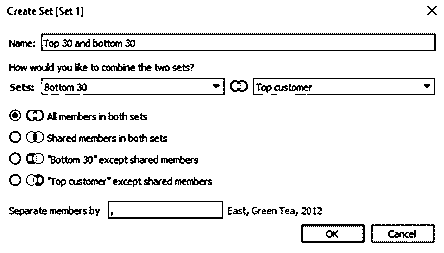

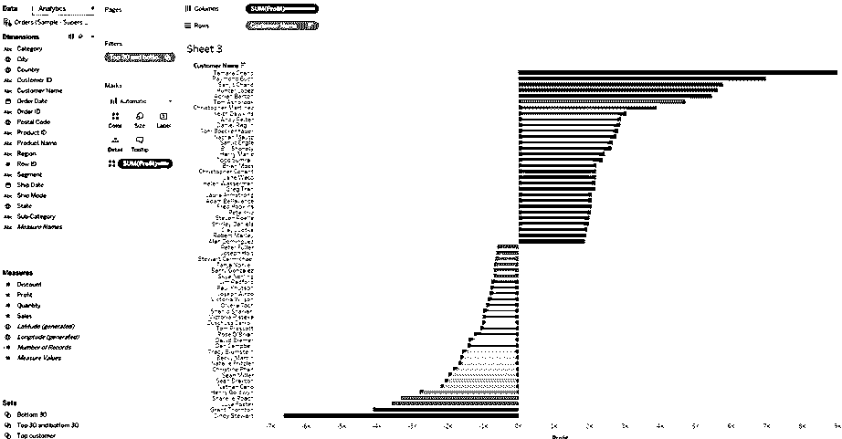

集合的最佳用例场景之一是能够用作清理数据的工具。这里我们考虑维度(州),并寻找在该州销售的单位数量。

有时，我们希望从数据集中删除一些数据(也可称为数据子集)，为此，我们在这里右键单击 state à delete exclude à，然后再次选择需要删除的状态

这里我们不包括佛罗里达州和乔治亚州。

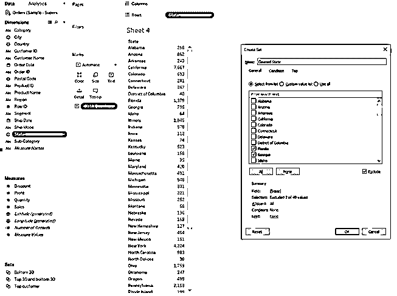

在 Tableau 中创建了一个名为 cleaned state 的[集合后，我们将在工作表的 filter 窗格中拖放该字段。](https://www.educba.com/sets-in-tableau/)

右键单击“已清理状态”上方的过滤器窗格，然后选择“显示过滤器”。

现在我们可以看到，过滤器不包含被排除在外的两个州(乔治亚州和佛罗里达州)

很多时候，我们希望将两个或更多的字段组合起来作为数据集的子集，因此下面的示例显示了如何从两个或三个维度中选择子集。

这里，我们考虑三个维度，即状态、运输模式和类别，并且我们将度量作为数量来考虑。

请按照下图所示放置尺寸和尺寸。

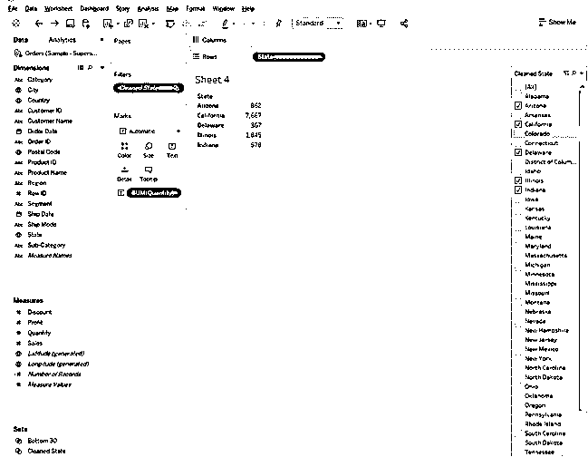

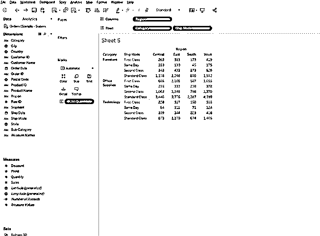

现在，对于要用作自定义过滤器的数据，通过按下 control 键选择所有大于 250 的值，并选择 create set，如下所示。

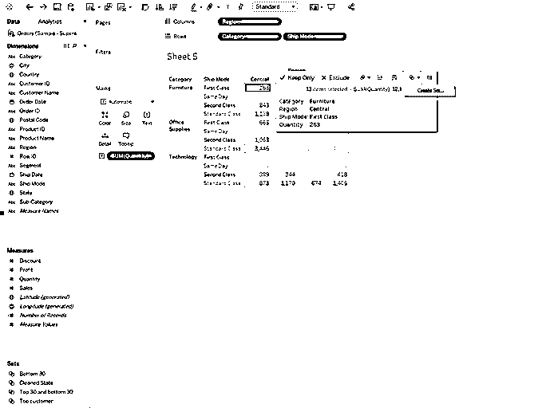

一旦弹出“设置”对话框，将该集合重命名为“250 个交易以上”，并删除所有维度和度量，然后从位于表单左下方的“集合”选项卡中拉出名为“250 个交易以上”的集合。

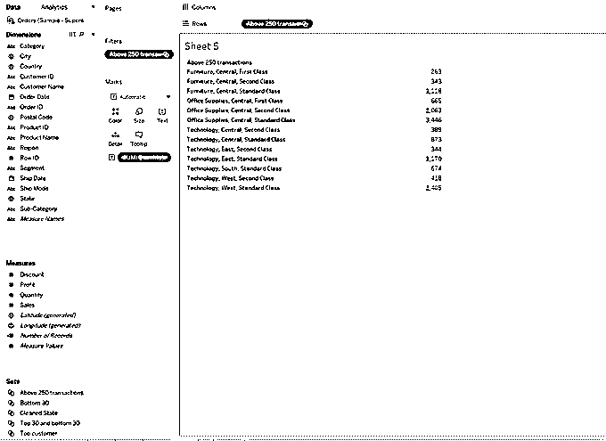

### 结论

在这里，我们分析了 Tableau:如何创建一个 Set 和 Tableau，它是一个高级的 BI 工具。Tableau 主要用于根据您的数据创建一个故事。Tableau 用于创建报告和交互式仪表板。它主要用于数据可视化和创建数据趋势。Tableau 是用于商业智能的自助式拖放工具。Tableau 可用于简单的统计分析。

### 推荐文章

这是一个在 Tableau 中创建集合的指南。在这里，我们讨论了基本概念，如何创建集合，以及如何使用它的例子。您也可以看看以下文章，了解更多信息–

1.  [Tableau 的用途](https://www.educba.com/uses-of-tableau/)
2.  [优秀的 Tableau 面试问题](https://www.educba.com/tableau-interview-questions/)
3.  [视觉分析 vs Tableau](https://www.educba.com/visual-analytics-vs-tableau/)
4.  [旁观者 vs 画面](https://www.educba.com/looker-vs-tableau/)
5.  [JavaScript 中的设置指南](https://www.educba.com/set-in-javascript/)

