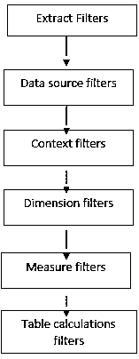
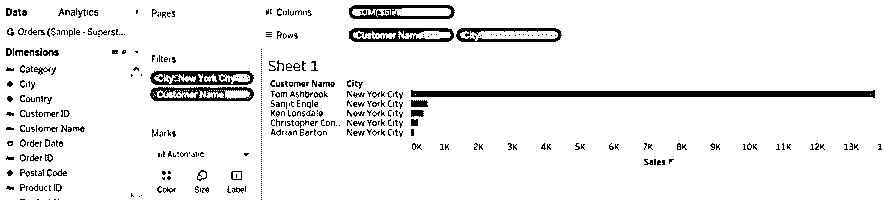
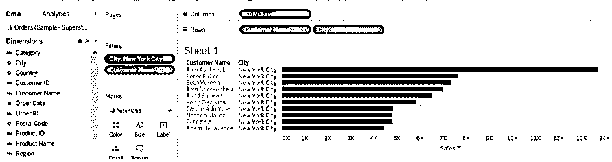
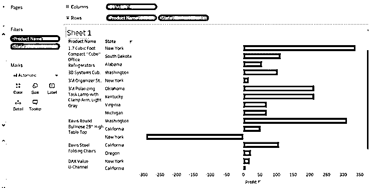
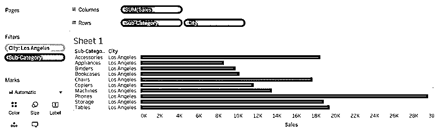
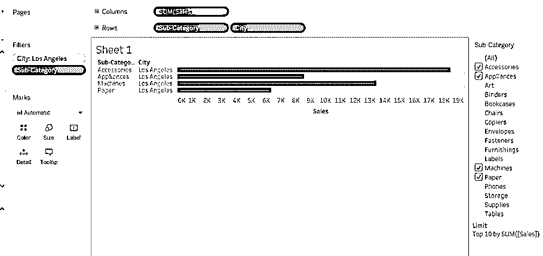

# 操作顺序表

> 原文：<https://www.educba.com/tableau-order-of-operations/>

## Tableau 操作顺序介绍

操作的顺序大约是 tableau 中的执行顺序。当我们执行某些查询或操作时，有一个执行查询的管道。操作如创建不同类型的图表，应用过滤器如颜色，大小，文本，创建计算字段，创建视图等。有一个程序可以产生结果作为过滤器或视图，tableau 不能产生你想要的任何东西。在执行任何操作时，数据都会被操纵。当我们了解这个过程的每一个细节时，对用户来说都是一个优势。理解 tableau 中的每一级操作总是有好处的。

### 如何在 Tableau 中做一个订单操作？

我们将在 tableau 中展示过滤器的流程。每个过滤器都有自己的值或处理 tableau 数据的方式。提取过滤器用于提取数据文件，它可以以 excel、文本、在线服务器、JSON 文件等形式出现。数据源过滤器用于提取数据源，如拖动到的文件，表格被创建到数据源表中。上下文筛选器包含诸如资产、条件筛选器、前 N 名等筛选器，这些筛选器将用于从上下文中查找值。维度过滤器包含数据混合，用于将两个轴合并为一个轴，这将为我们提供更确定的数据。测量过滤器用于测量值，如温度、天气预报或表格计算。我们可以为数值数据创建计算字段。表计算过滤器包含一条趋势线，参考线将提供对数据的深入了解，并突出显示数据的趋势。

<small>Hadoop、数据科学、统计学&其他</small>

### 实现 Tableau 操作顺序的示例

以下是一些例子:

#### 示例#1

我们将使用上下文过滤器，看看这个过滤器如何帮助我们提高查询性能和数据结果。我们将把维度过滤器转换成上下文过滤器。

1.  打开 tableau 桌面或公共版本。
2.  打开样本超市数据集，或者您可以使用您选择的数据集(从 tableau 网站您可以获得 n 个不同的数据集)。这就是提取过滤器。
3.  将订单表拖到数据源筛选器中。
4.  将销售度量值拖到列中
5.  将客户名称维度拖到
6.  将城市维度拖到
7.  拖动城市到过滤器->点击无->选择纽约市(你可以选择你的选择)。
8.  将客户名称拖至过滤器->点击顶部->按字段选择顶部

当您单击 Top 10 时，您将看到只有 5 个结果，因为同时应用了 Top 和 dimension 过滤器。现在将上下文过滤器添加到城市过滤器中。

9.  右键单击 city Filter ->选择 add context，您将看到按销售额排名的前 10 名客户的结果。

#### 示例#2

我们将按照州和产品名称显示利润。

1.  将利润度量拖至
2.  将产品名称和状态维度拖到
3.  将产品名称拖到过滤器中，并选择一些
4.  拖动状态以过滤->转到顶部->按字段单击并选择顶部
5.  点击产品名称->选择添加到

当将添加上下文视图时，度量颜色将发生变化。你可以看到产品名称的颜色。

#### 实施例 3

1.  将销售度量值拖到列中。
2.  将子类别和城市维度拖到
3.  将城市和子类别拖到
4.  从中选择洛杉矶这样的城市
5.  过滤器中的子类别->转到顶部->选择依据
6.  向城市添加上下文过滤器。点击城市->添加到上下文中

*   如果我们从过滤器中选择两个或三个子类别，那么结果将会不同，它可能会显示前 10 名或少于 10 名。
*   您可以在下图中看到，我们选择了配件、电器、机器和纸张等子类别。我们可以观察到限制被设置为 10。
*   但是我们没有得到前 10 个结果，因为所选类别分配的数据少于 10 个。

### 结论

我们已经了解了 tableau 中的操作顺序。有时候我们得不到预期的结果，是因为有一个执行 tableau 函数的流水线。我们没有通过它，然后我们得到的结果是一个错误。上帝总是遵循操作的顺序，这将简化任务或操作的执行。

### 推荐文章

这是一个 Tableau 操作顺序的指南。在这里我们讨论一个介绍，如何做一个订单操作和例子来实现更好的理解。您也可以浏览我们的其他相关文章，了解更多信息——

1.  [Tableau 中的饼图](https://www.educba.com/pie-chart-in-tableau/)
2.  [在 Tableau 中设置](https://www.educba.com/sets-in-tableau/)
3.  [Tableau 中的仪表板](https://www.educba.com/dashboard-in-tableau/)
4.  [Tableau 动作过滤器](https://www.educba.com/tableau-action-filter/)
5.  [Tableau 用户组指南|示例](https://www.educba.com/tableau-user-group/)

