# Tableau 中的自定义 SQL

> 原文：<https://www.educba.com/custom-sql-in-tableau/>

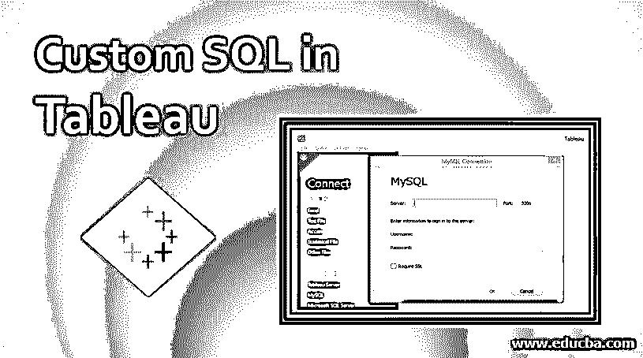

## Tableau 中的自定义 SQL 介绍

在一个数据库中，存在多个表，通常为了获得所需的数据，必须连接多个表。任何处理大型数据库的可视化工具都使用连接来访问数据库中的数据。Tableau 支持与各种类型数据源的连接，最常见的是 SQL server。当 Tableau 与 SQL server 连接时，必需的数据被加载到 Tableau 的环境中。通过 SQL 查询，Tableau 自动执行连接。然而，在复杂的情况下，这些 SQL 查询可能不是优化的形式。使用 Tableau 中的自定义 SQL 选项，我们可以简化数据提取操作。

### 在 Tableau 中使用自定义 SQL

我们将连接 MySQL 中的“员工”数据库。它包含组织中员工的各种详细信息。数据库中的各种表格包括雇员、部门、薪水、部门经理等。使用这个数据库将工作和演示 Tableau 中的自定义 SQL 的概念。

<small>Hadoop、数据科学、统计学&其他</small>

**第一步:**我们先连接数据源。在这里，[是 MySQL](https://www.educba.com/what-is-mysql/) 。因此，点击 MySQL，如下图所示。

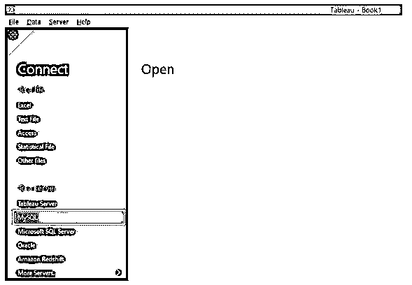

**第二步:**我们点击 MySQL，弹出 MySQL 连接对话框。在这个对话框中，我们需要提供必要的凭证来访问数据。

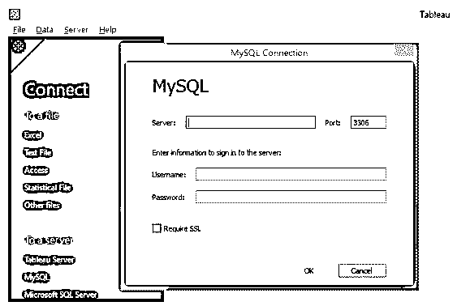

**步骤 3:** 如下图所示，我们在 MySQL 连接对话框中提供了必要的凭证，以便连接数据库。完成后，单击确定按钮。

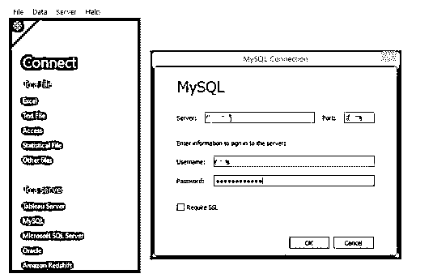

**第 4 步:**如果提供了正确的凭证，就可以成功连接 MySQL，如下图所示。我们收到了一条“连接到 MySQL”的消息。现在，在数据库部分，我们可以从下拉列表中选择所需的数据库。

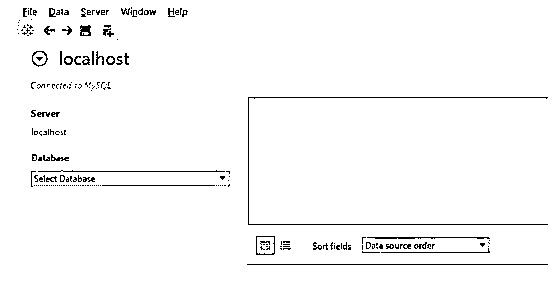

**步骤 5:** 我们从下拉菜单中选择了“test”数据库。正如我们所看到的，这个数据库中有多个表。我们将使用所需的表格来达到我们的目的。

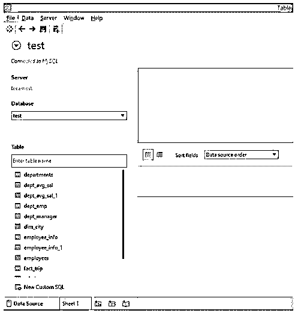

**第 6 步:**加载数据库后，数据源中的布局如下图所示。我们可以直接将所需的表拖到“将表拖到这里”部分。

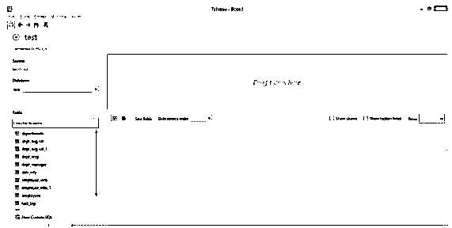

步骤 7: 我们将表 employees 和 salaries 放入“将表拖到这里”部分，Tableau 自动在这两个表之间创建一个连接。注意，如果 Tableau 识别出它们之间存在公共字段，那么它将创建连接。

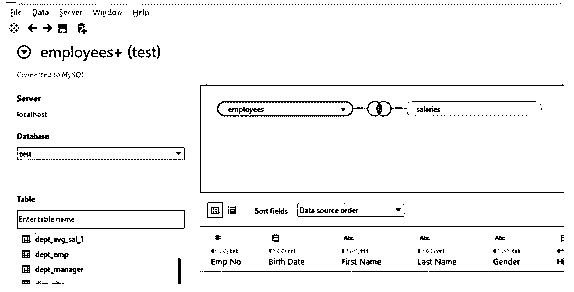

**第八步:**看看 Tableau 将员工表和工资表连接后得到的数据就知道了。

仔细研究上表中的每个字段。我们可以发现，Emp 编号字段已经重复，用红框突出显示。这是因为，默认情况下，Tableau 在执行连接后会考虑所有表中的字段。同样，雇用日期和开始日期字段也是同一个字段。这两个字段实质上表示雇员开始为组织工作的日期。但是，该日期在“雇员”表中称为“雇用日期”,在“薪金”表中称为“开始日期”。绿色方框突出显示了这两个字段。

**步骤 9:** 我们可以通过使用 Tableau 中的自定义 SQL 功能来克服上述步骤中出现的冗余。当两个表连接时，Tableau 编写自己的 SQL 查询。Tableau 确实允许我们在它上面工作。在 Data 选项卡下，单击“Convert to custom SQL”选项，如下图所示。

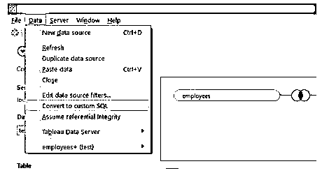

**第 10 步:**按照上面的步骤导航到“转换为自定义 SQL”部分，如下图所示。仔细观察 SQL 查询。我们可以看到 emp_no 字段在两个表中都被突出显示。此外，雇佣日期和起始日期是两个相同的字段，但由于它们在两个表中以两个不同的名称出现，因此它们被视为单独的字段。我们将编辑该 SQL 以克服冗余。

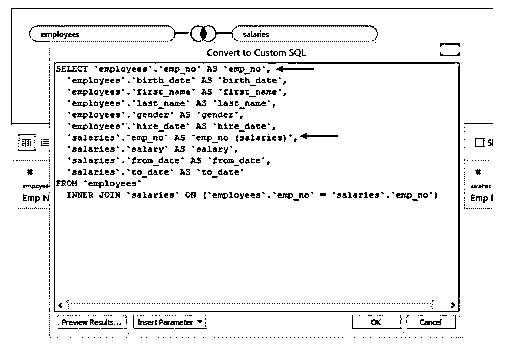

**步骤 11:** 正如我们在下面的截图中看到的，我们编辑了 SQL 查询。过一遍，仔细观察我们做的改动。这里，我们删除了之前重复的字段。因此，我们从 sales 表中删除了 emp_no、from_date 和 to_date。完成所需查询的编写后，单击 OK 按钮。

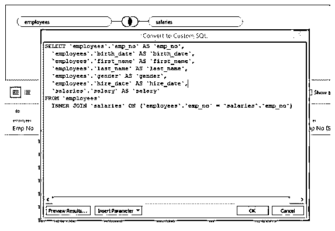

**步骤 12:** 当 SQL 查询被更新时，我们得到更新表的选项，即。“立即更新”和“自动更新”。单击其中任何一个继续。该表将根据新的 SQL 查询进行更新。

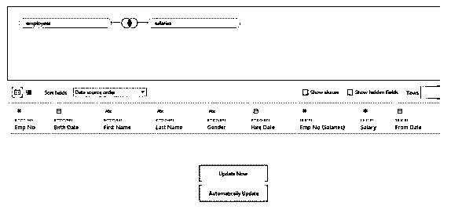

**第 13 步:**按顺序正确执行上述步骤后，我们得到如下所示的更新后的表格。遍历表，研究它的字段。现在，我们可以看到该表看起来更有意义，它不包含重复的字段。这些字段不会给人一种来自不同表的印象。Tableau 中的定制 SQL 功能使我们能够修改默认的 SQL 查询，并以所需的方式更新表。因此，当从多个表中获取数据的默认 SQL 查询不是优化的 SQL 查询时，该功能非常有用。

**第 14 步:**在 tables 部分可以看到作为默认 SQL 查询更新的结果而创建的定制 SQL 查询。现在，取代所有表格的是“自定义 SQL 查询”。这实际上意味着 SQL 查询是用户创建的。该查询可以说是充当了一个表。我们可以根据需要多次编辑它。要编辑自定义 SQL 查询，请单击下拉菜单中的“编辑自定义 SQL 查询”选项，如下图所示。如果我们单击 Duplicate 选项，那么 Tableau 将创建查询的副本。

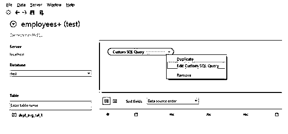

**步骤 15:** 我们可以通过单击“remove”选项从环境中删除自定义 SQL 查询，如下图所示。

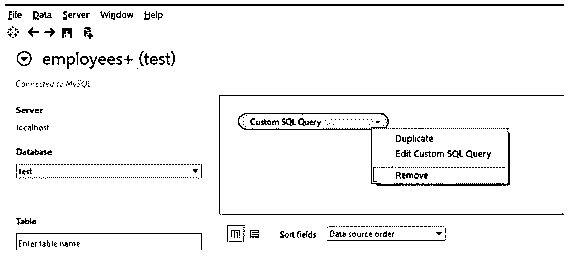

**步骤 16:** 点击从数据源标签中永久删除定制 SQL 查询，如下所示。

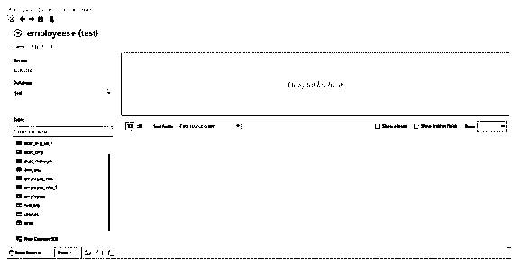

### 结论

Tableau 除了允许连接各种类型的数据源，还允许用户在连接 SQL server 时操作 SQL 查询。自定义 SQL 功能至关重要，尤其是在复杂数据库的情况下，以便优化 SQL，其中每行代码都决定处理性能。

### 推荐文章

这是 Tableau 中定制 SQL 的指南。这里我们讨论 Tableau 中的自定义 SQL 的介绍和使用。您也可以看看以下文章，了解更多信息–

1.  [Tableau 动作过滤器](https://www.educba.com/tableau-action-filter/)
2.  [Tableau 中的 LOD 表达式](https://www.educba.com/lod-expressions-in-tableau/)
3.  [Tableau 工作簿](https://www.educba.com/tableau-workbook/)
4.  [在 Tableau 中连接](https://www.educba.com/concatenate-in-tableau/)
5.  [HTML 中的日期|功能|示例](https://www.educba.com/date-in-html/)

