# PHP 是什么？

> 原文：<https://www.educba.com/what-is-php/>

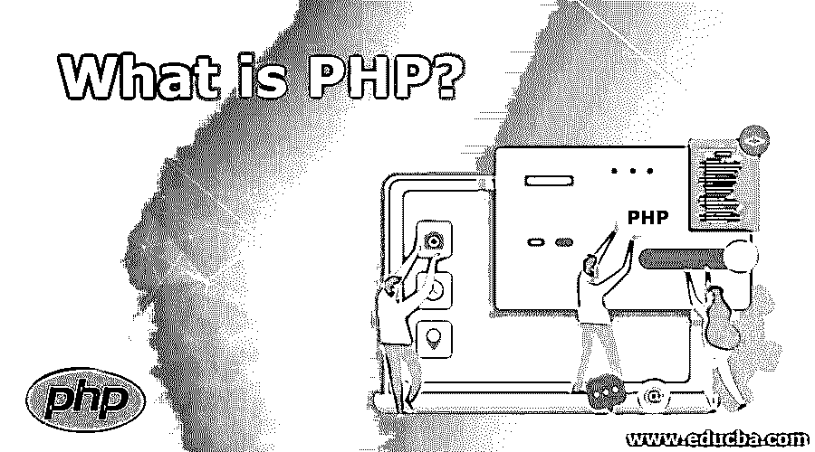

## PHP 的定义

PHP 是服务器端的脚本，用于创建静态或动态网站或 Web 应用程序。PHP 是超文本的预处理程序，超文本以前代表主页。用于构建 web 应用程序的软件是一种开源的服务器端脚本语言。我们说一个通过编写基于脚本的语言(代码行)为自动化工作而设计的程序。它适用于 web 应用程序、电子商务应用程序和数据库应用程序的动态网页的输出和构造。PHP 可以插入 HTML。

### PHP 是什么？

每当你点击任何链接输入一个 URL 或请求(这也只是间接提供一个 URL)，请求就会被你的网络浏览器(Firefox，Chrome 等)转发。)通过互联网传输到“服务器”。现在，这个服务器是您编码的所有页面实际存储的地方。此外，所有用户帐户显然都将出现在服务器上。现在想想这个:像脸书，电子邮件等应用程序。，会有很多用户账号，对吧？所以管理这样的数据有点棘手。因此，计算机程序员想出了一种叫做“数据库”的东西。这些有助于有效地处理(通常是大量的)数据，尤其是当数据可以制成表格时。

<small>网页开发、编程语言、软件测试&其他</small>

因此，当请求到达服务器时，服务器处理请求并用数据响应(作为平面响应或嵌入在网页中)。为了这些目的，它被使用。基本上是一种服务器端脚本语言**。**目前 PHP7 版本是最新版本。

下面是这个脚本在 HTML 页面中的一个简单例子。

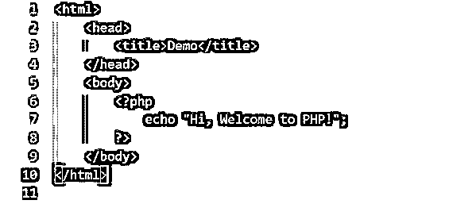

看看 PHP 代码是如何嵌入到 HTML 代码中打印出正文中的句子 Hi，Welcome to PHP。web 服务器可以配置成用 PHP 处理所有的 HTML 文件。

### PHP 能做什么？

有了这个，我们可以:

*   生成动态网页。
*   从网页收集表单数据。
*   发送或接收 cookies。
*   以及任何其他 CGI(公共网关接口)编程语言可以做的任何事情。

这些脚本主要用于三个领域:

*   **服务器端脚本:**这是传统意义上的目的，它是为了生成动态内容而构建的&。为此，您需要一个 PHP 解析器、一个 web 服务器和一个 web 浏览器。
*   命令行脚本:PHP 就像其他脚本语言一样，可以使用 PHP 解析器运行 PHP 脚本。
*   客户端 GUI: 这是你可以使用 PHP-GTK 构建应用软件的地方。不过，这并不是最适合这个目的的语言。

### PHP 支持什么？

*   这几乎可以在所有主流操作系统上运行。
*   它支持大多数 web 服务器，如 Apache、Microsoft IIS 等。
*   它还支持多种数据库，如 MySQL、Front-base、Inter-base、Oracle、PostgreSQL、ODBC(开放式数据库连接标准)等。
*   它不仅可以生成 HTML 页面，还可以输出图像、PDF 文件以及 Flash 电影。
*   它还支持使用 HTTP(超文本传输协议)、LDAP(轻量级直接访问协议)、IMAP(互联网消息访问协议)、COM 等协议与其他服务进行对话。
*   它支持过程化编程和面向对象的编程方法。

### 使用 PHP

下面给出了使用 PHP 的示例:

#### 1.如何在 HTML 文件中嵌入一段 PHP 代码？

嵌入包含在中的代码，无论里面是什么，解释器都会将其视为 PHP 代码。

代码应该是这样的。

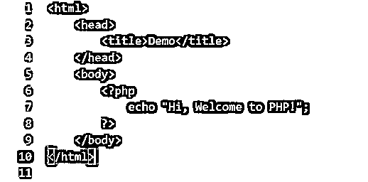

#### 2.使用数据类型和变量

它支持八种原始数据类型。

四种标量类型，

*   布尔代数学体系的
*   整数
*   浮动
*   线

两种复合或派生的数据类型。

*   排列
*   目标

两种特殊类型，即。

*   资源
*   空

这就是如何动态地创建一个变量并在这里使用它。

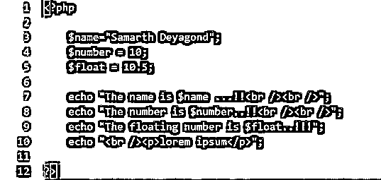

#### 3.使用数组

PHP 中的数组是一个有序的映射，将键映射到相应的值。它可以以多种方式进行转换，以至于可以将其用作真正的数组、列表(异构数组或向量)、哈希表或字典、集合等。当然，在 PHP 中，也像其他编程语言一样，数组是零索引的。

这就是如何创建和访问数组。

#### 4.预定义变量

它带有几个预定义的变量，如下所示:

*   **$_GLOBALS:** 这是指脚本全局范围内当前可用的所有变量。
*   **$_SERVER:** 包含与执行环境相关的变量和由 web 浏览器设置的变量。
*   **$_GET:** 这包含了 GET HTTP 请求发送的所有变量。
*   **$_POST:** 这包含了 POST HTTP 请求发送的所有变量。
*   **$_COOKIE:** 这是由 HTTP cookies 给出的变量。
*   **$_FILES:** 这是通过 HTTP 文件上传给脚本的变量。
*   **$_ENV:** 这是环境给脚本的变量。
*   **$_REQUEST:** 这是为采用任何用户输入请求方法的脚本提供的变量。
*   **$_SESSION:** 存储脚本当前会话中注册的变量。

#### 5.决策

下面的代码片段显示了处理 if-else 语句的方法。

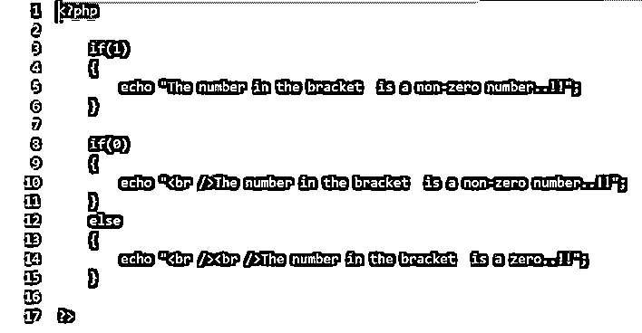

#### 6.环

它有 for 循环和 do-while 循环，语法是这样的。

这是一个“for”循环。

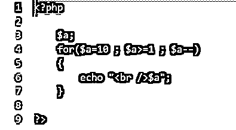

这是“for each”循环。

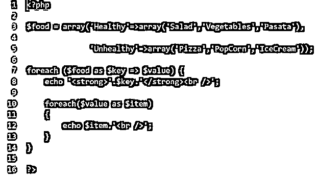

这是一个 do-while 循环。

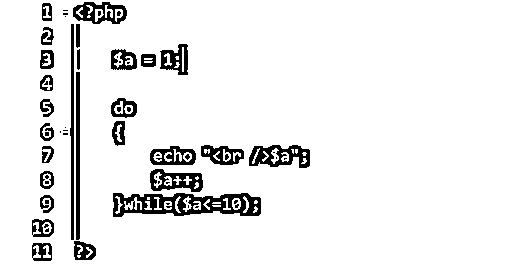

#### 7.Switch 语句

我们还有 switch 语句，它帮助我们基于固定的值选择来做决策。

下面的代码显示了如何使用它。

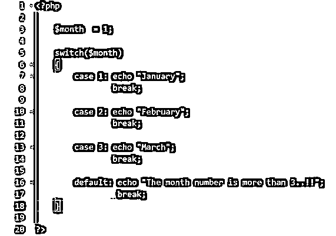

#### 8.功能

为了模块化程序，也为了代码的可重用性，我们可以用 PHP 编写函数。每个函数都有一个定义，定义了一组参数和返回值。

下面的代码片段显示了如何在这个？

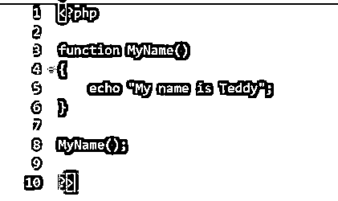

#### 9.饼干

它支持处理 Cookies。Cookies 是在 web 浏览器中存储数据的机制，以便更快地响应和跟踪回访用户。可以使用 set-cookie()函数在 PHP 中设置 cookie。

下面的代码显示了这一点。

#### 10.使用 GET 方法

GET 方法是将请求变量嵌入请求 URL 并转发给服务器的方法。我们使用$_GET 全局变量来接收和访问 GET 请求变量。来自网页的数据通过网页中的表单提交给服务器脚本。因此，表单动作必须链接到将处理表单数据的服务器脚本。

下面的代码片段将展示如何在 PHP 中访问 GET 变量。

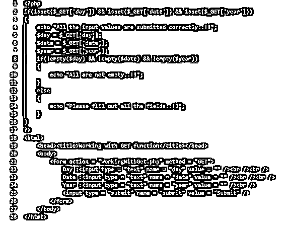

#### 11.使用发布请求

在 POST HTTP 请求中，数据被包装在请求体中并发送给服务器。为了访问通过 POST 请求发送的变量，我们使用了全局变量$_POST。

下面的代码片段将展示如何处理 POST 请求。

PHP 中还有比这些更多的东西，你可以用这些强大的基础来探索。

### 一些你需要提高的额外技能

*   理解 HTML、CSS 和 JavaScript 以及 PHP 将会使你创建的网站更加优雅。
*   这是一个附加的，如果你了解 HTTP 协议，数据库管理，以更好地互动。
*   关于 Apache 等服务器和 LAMP 或 XAMP 等工具的知识。

### 使用 PHP 的顶级公司

*   尽管有几十种语言用于服务器端脚本，PHP 仍然是广泛使用的语言之一。
*   像脸书、雅虎、谷歌、维基百科、WordPress 等顶级公司。，使用 PHP 进行服务器端编程。

### 优势

以下是如下优点:

*   这很容易。
*   它本质上是轻量级的。
*   它附带了很多库和包。
*   尽管它是开源的、免费的，但在质量方面没有任何妥协。
*   它非常稳定。不像 JavaScript，没有频繁的版本有太多的变化和错误修复。
*   因为它运行在 Nginx 或 Apache 类型的服务器之后，所以很容易扩展。
*   有很多优秀的 PHP 开发人员。因此，雇佣资源来完成任务是很容易的。
*   PHP 有很好的社区支持。

### PHP 的未来

嗯，3 年后再问，答案还是会是‘是’。

*   大多数网站都是由这个驱动的，他们可能不会想到改变底层的服务器脚本。
*   Laravel 已经成为最好的 PHP 框架，被广泛采用，并在市场上有很高的需求。
*   版本 7 具有更高的安全性和更快的速度，这使它成为组织和开发人员的优先选择之一。

所以，是的，这一点的相关性将保持不变。

**在该技术领域的职业发展**

*   如果你正在寻找 web 开发的职业，那么是的，PHP 的专业知识将会提升你的成功。

### 推荐文章

这是什么是 PHP 的指南？在这里，我们讨论了 PHP 的工作原理和优势，以及实现这项技术的顶级公司。您也可以浏览我们推荐的其他文章，了解更多信息——

1.  [PHP XML 头](https://www.educba.com/php-xml-header/)
2.  [PHP 清空](https://www.educba.com/php-empty/)
3.  [PHP 回合](https://www.educba.com/php-round/)
4.  [PHP 压缩文件](https://www.educba.com/php-zip/)

