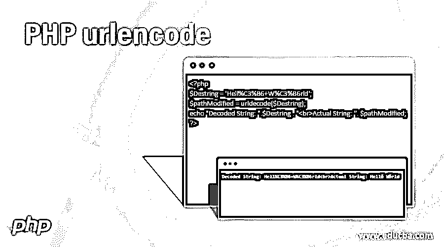
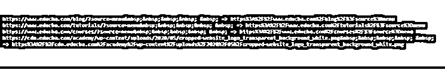
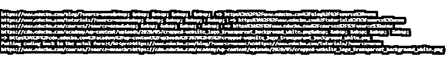
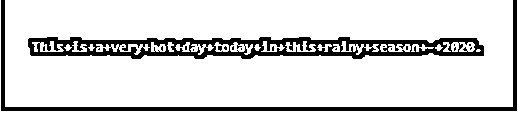
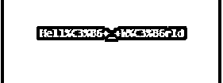
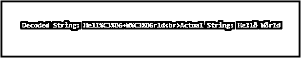

# PHP urlencode

> 原文：<https://www.educba.com/php-urlencode/>

## PHP urlencode 简介

处理 URL 和参数化 URL 对于任何编程语言来说都是常见的。urlencode()是一个可以用来编码 URL 的函数。当我们用 URL 传递任何值时，它会通过程序自动修改。我们通过一个例子 URL 来了解一下；实际的网址是"https://www.educba.com/cart/？PID = 5217 & ptype = 11 & color = green and red”，对该 URL 进行编码后，它将是“https % 3A % 2F % 2 fwww . educba . com % 2f cart % 2F % 3 fpid % 3d 5217% 26p type % 3d 11% 26 color % 3d green+and+red”。实际的 URL 和编码的 URL 之间的差异很容易看出来。在某些情况下，实际的 URL 和编码的 URL 可能是相同的；这完全取决于 URL 中定义的参数。使用 urldecode()后，我们可以获得实际的 URL。在这个主题中，我们将学习 PHP 的 urlencode。

**语法**

<small>网页开发、编程语言、软件测试&其他</small>

`urlencode($strURL);`

**说明:**

$ strURL –$ strURL 是 URL 本身。这是强制参数。此参数的类型是字符串。这个函数的返回类型也是字符串。使用这个 urlencode()对于任何开发人员或用户来说都是不够的，我们还必须使用 urlencode()，这样我们才能返回到实际的或原始的 URL。这是 URL 解码的语法。
URL decode($ strURL)；

因为我们甚至可以解码 URL 函数有相同的参数。但是在参数中，它将是一个编码的字符串或 URL。因此，如果我们将传递实际的字符串，而不是解码后的字符串，那么输出可能与实际的字符串不同。

### urlencode 在 PHP 中是如何工作的？

当我们需要从一个地方向另一个地方传递带有某个值的各种类型的参数时，URL 编码就出现了。这是必需的事情之一，以便我们可以在目标页面上准确地获得实际值。我们只能在应用 urldecode()函数后将 URL 编码值恢复为实际值。urldecode()的语法和语义与我们在 urlendode()中看到的一样。PHP 语言中有各种内置函数来完成这项工作，但 urlencode()是使用最广泛的函数之一。

这里有两个内置函数，可以一起使用来完成这项工作:
urlencode()–用于编码字符串
urlencode()–用于解码回实际的字符串

### 使用 urlencode 的示例

下面提到了不同的例子:

#### 示例#1

在各种 URL 上使用 urlencode()的简单方法。

**代码:**

`<?php
// Here is the list of example of URL encode
echo "https://www.educba.com/blog/?source=menu" . "&nbsp;&nbsp;&nbsp;&nbsp; &nbsp; => ". urlencode("https://www.educba.com/blog/?source=menu") . " ";
echo "https://www.educba.com/tutorials/?source=menu" . "&nbsp;&nbsp;&nbsp;&nbsp; &nbsp; => ". urlencode("https://www.educba.com/tutorials/?source=menu") . " ";
echo "https://www.educba.com/courses/?source=menu" . "&nbsp;&nbsp;&nbsp;&nbsp; &nbsp; => ". urlencode("https://www.educba.com/courses/?source=menu") . " ";
echo "https://cdn.educba.com/academy/wp-content/uploads/2020/05/cropped-website_logo_transparent_background_white.png" . "&nbsp;&nbsp;&nbsp;&nbsp; &nbsp; => ". urlencode("https://cdn.educba.com/academy/wp-content/uploads/2020/05/cropped-website_logo_transparent_background_white.png") . " ";
?>`

**输出:**

#### 实施例 2

让我们尝试解码上面提到的相同的 URL，以获得相同的实际形式。在 PHP 中，对于每一种编码，通常都有解码。

**代码:**

`<?php
// Here is the list of example of URL encode
echo "https://www.educba.com/blog/?source=menu" . "&nbsp; &nbsp; &nbsp; &nbsp; &nbsp; => ". urlencode("https://www.educba.com/blog/?source=menu") . " ";
echo "https://www.educba.com/tutorials/?source=menu" . "&nbsp; &nbsp; &nbsp; &nbsp; &nbsp; => ". urlencode("https://www.educba.com/tutorials/?source=menu") . " ";
echo "https://www.educba.com/courses/?source=menu" . "&nbsp; &nbsp; &nbsp; &nbsp; &nbsp; => ". urlencode("https://www.educba.com/courses/?source=menu") . " ";
echo "https://cdn.educba.com/academy/wp-content/uploads/2020/05/cropped-website_logo_transparent_background_white.png" . "&nbsp; &nbsp; &nbsp; &nbsp; &nbsp; => ". urlencode("https://cdn.educba.com/academy/wp-content/uploads/2020/05/cropped-website_logo_transparent_background_white.png") . " ";
echo "   <b>Putting coding back to the actul form:</b>";
echo "<pre>";
echo urldecode(urlencode("https://www.educba.com/blog/?source=menu")) . " ";
echo urldecode(urlencode("https://www.educba.com/tutorials/?source=menu")) . " ";
echo urldecode(urlencode("https://www.educba.com/courses/?source=menu")) . " ";
echo urldecode(urlencode("https://cdn.educba.com/academy/wp-content/uploads/2020/05/cropped-website_logo_transparent_background_white.png")) . " ";
?>`

**输出:**

编码就是将一些东西编码成相对来说更难阅读或理解的形式。这不仅仅是玩编码和解码；这是任何编程语言的基本需求之一。当我们在 URL 中发送+号时，它会更改为其他值，我们不能像在所有情况下那样访问它。

#### 实施例 3

编码就是用其他字符替换一些字符。一般来说，urlencode()返回一个字符串，在这个字符串中我们可以看到除了-、。等等。已经被替换了。根据字符，这些替换将用一个百分号(%)后跟一些十六进制数字来完成。因此，让我们用一个例子来仔细看看。

**代码:**

`<?php
$string = 'This is a very hot day today in this rainy season - 2020.';
$pathModified = urlencode($string);
?>
<?php echo $pathModified; ?>`

**输出:**

在上面的例子中，我们可以看到下面的变化:
Space——Space 已经被+号代替了。
点(-)-根据规则，没有更改或替换。

#### 实施例 4

让我们看另一个例子，字符串中有一些特殊的字符。

**代码:**

`<?php
$string = 'Hellö _ Wörld';
$pathModified = urlencode($string);
echo $pathModified;
?>`

**输出:**

在上面程序的输出中，我们可以看到特殊字符被替换了。

#### 实施例 5

让我们看一个 urdecode()的例子，它在字符串中有一些特殊的字符。

**代码:**

`<?php
$Destring = 'Hell%C3%B6+W%C3%B6rld';
$pathModified = urldecode($Destring);
echo "Decoded String: ".$Destring . " Actual String: ". $pathModified;
?>`

**输出:**

在上面程序的输出中，我们可以看到编码后的字符串正在进入实际的字符串(和前面的程序一样)。

### 结论

函数 urlencode()可用于解码字符串或任何参数化的 URL。PHP 还有一个名为 urldecode()的内置函数，用于解码原始字符串。可以成对使用 urlencode()和 urldecode()来完成这项工作；这两个 PHP 函数是相互补充的。PHP 还有其他各种编码和解码字符串的函数，但这两个函数是最流行和使用最广泛的函数之一。

### 推荐文章

这是一个 PHP 的 urlencode 指南。在这里，我们讨论了 urlencode 在 PHP 中的工作方式和例子，以及代码和输出。您也可以看看以下文章，了解更多信息–

1.  [PHP 数组搜索](https://www.educba.com/php-array-search/)
2.  [PHP 写文件](https://www.educba.com/php-write-file/)
3.  [PHP 字符串操作符](https://www.educba.com/php-string-operators/)
4.  [PHP strtotime](https://www.educba.com/php-strtotime/)

