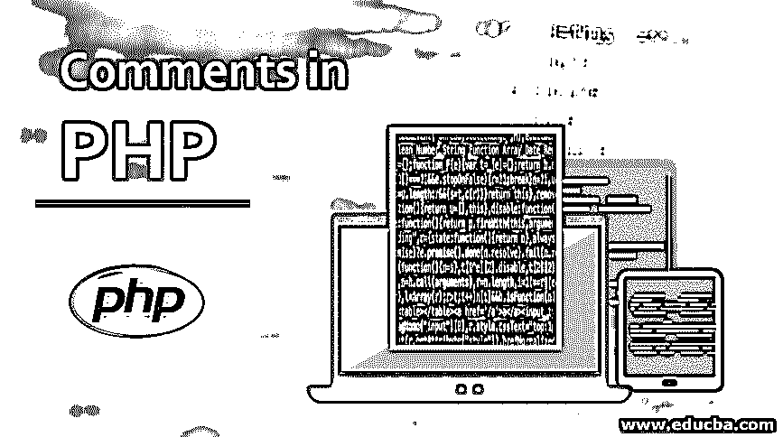
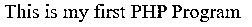
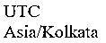
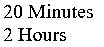

# PHP 中的注释

> 原文：<https://www.educba.com/comments-in-php/>




## PHP 中注释的介绍

“注释”这个词本身表达的意思是对某事进行注释。如果我们对 PHP 程序文件中的任何内容进行注释，它都不会与代码一起编译。编译器或解释器会简单地忽略这一点。在 PHP [编程语言中，我们可以用不同的方式来注释任何东西。](https://www.educba.com/what-is-a-programming-language/) [PHP 有单行](https://www.educba.com/what-is-php/)和多行注释选项。同样，在单行注释中，我们可以根据需要使用/或#。我们应该总是在注释中使用适当的语言，这样任何审查代码的人都可以阅读和理解注释。

**语法**

<small>网页开发、编程语言、软件测试&其他</small>

同样，我们可以在 PHP 中以下面提到的方式使用注释。

单行注释:

```
// This is a single-line comment
# This is a single-line comment
/*
This is a multiple line comment – line no – 1
This is a multiple line comment – line no – 2
… and so on …
*/
# this is the single-line comment
; this is a PHP.INI style commenting
```

### PHP 中的注释是如何工作的？

当我们在代码中写注释的时候，与实际的代码相比，它在视图中会更亮。如果我们在同一个文件中编写了代码和注释，在这种情况下，在运行 PHP 文件时，注释不会被执行。那么让我们看一个例子。

```
<?PHP
echo "This is my first PHP Program";
// this is the first program
?>
```

这将只给出“这是我的第一个 PHP 程序”作为输出，而不是注释部分。

### 为什么我们应该使用注释？

我们应该在 PHP 程序代码之间使用注释，以确保我们有足够的帮助注释，以便人们可以容易地阅读和理解代码。在注释中，我们还可以为了编写代码段的目的，修改日期、修改日期、修改人等。强烈建议开发人员在编程代码中使用注释，以便在需要时可以轻松理解。

#### 例子

现在，是时候看看一些快速检查程序中注释行为的例子了。

##### 示例#1

```
<?php
echo "This is my first PHP Program";
// this is the first program
?>
```

**输出**




##### 实施例 2

程序中的单行注释

**代码:**

```
<?php
echo date_default_timezone_get(); //to get the timezone
echo "<br>"; //line brea;
date_default_timezone_set('Asia/Kolkata'); // setting the timezone to Asia/Kolkata
echo date_default_timezone_get(); //to get the timezone
?>
```

**输出**




##### 实施例 3

程序中的多行注释

**代码:**

```
<?php
/*
This is a function that will take time in minutes and will return that in hours and minutes
We use will this function further to test with some examples.
*/
function hoursandmins($minutes, $format = '%01d Hours, %02d Minutes')
{
if ($minutes < 1) {
return;
}else if($minutes<10){
if($minutes==1){
return '0'.$minutes.' Minute';
}
return '0'.$minutes.' Minutes';
}else if($minutes<50){
return $minutes.' Minutes';
}
$hours = floor($minutes / 60);
$minutes = ($minutes % 60);
$format = "";
if($hours>0){
if($hours>1){
$format .= '%01d Hours';
}else{
$format .= '%01d Hour';
}
}
if($hours>0 && $minutes>0){
$format .= ', ';
}
if($minutes>0){
if($minutes>1){
$format .= ' %02d Minutes';
}else{
$format .= ' %01d Minute';
}
}
return sprintf($format, $hours, $minutes);
}
// time to check the time in descriptive form
echo hoursandmins(20);
echo "<br>";
echo hoursandmins(120);
?>
```

**输出**




在任何函数之前写的关于该函数的注释通常被称为函数文档。因此，在给定的场景中，我们可以把这个注释称为功能文档。这样使用评论真的很好。为了使 PHP 程序更加健壮，我们有各种各样的 PHP 标准，说我们不应该在函数中使用注释，因为我们可以在函数文档中使用注释。

##### 实施例 4

混合评论

在一个 PHP 程序文件中，我们可以将 PHP 和 HTML 结合起来。考虑到这一点，我们将使用 HTML 注释方法在需要时注释掉 HTML 部分，PHP 注释可以根据业务需求用于 PHP 相关代码。我们可以在 PHP-HTML 文件中使用任何类型的 PHP 注释和 HTML 注释。

**代码:**

```
<html>
<body>
<h1>PHP with HTML</h1>
<!-- this is html comment -->
<?php
echo "Hello World!"; // this is PHP comment
?>
</body>
</html>
```

**输出**


##### 实施例 5

使用#的单行注释

我们也可以使用#来进行单行注释。让我们看一个相同的代码示例。我们可以看到这一行评论并不是很受欢迎。很少有开发人员使用这种类型的注释。当注释函数文档或文件级文档时，这确实是推荐的。

**代码:**

```
<?php
# $i=10;
# $j=20;
# echo $i + $j;
echo "Hello World!";
# this is PHP comment
?>
```

**输出** 


### 结论

在代码中，注释实际上是时间的召唤。我们可以在 PHP 程序文件中使用注释。这将有助于我们使代码更容易理解。我们应该在开始一个函数或类之前使用注释，因为大多数编程语言都有自己的代码标准。通常，任何函数或类前的注释都称为该函数或类的文档。

### 推荐文章

这是一个 PHP 注释指南。在这里，我们讨论介绍，它是如何工作的，为什么我们应该使用注释以及例子和输出。您也可以浏览我们推荐的其他文章，了解更多信息——

1.  [PHP 拆分数组](https://www.educba.com/php-split-array/)
2.  [PHP 获取方法](https://www.educba.com/php-get-method/)
3.  [PHP 中的继承](https://www.educba.com/inheritance-in-php/)
4.  [PHP 加密](https://www.educba.com/php-encryption/)


