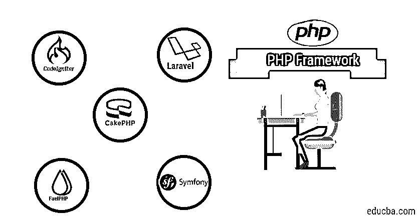

# PHP 框架

> 原文：<https://www.educba.com/php-frameworks/>

## PHP 框架简介

PHP 框架是由几个开源社区提供的组件，它们为开发基于 PHP 的应用程序提供了内嵌特性。框架是要使用的可选组件；然而，如果没有框架，开发 PHP 的常规方法包括管理软件特性、功能和安全特性的大量开销，这需要更多的开发人员资源，并增加了开发成本。一些广泛使用的 PHP 框架有 Laravel、CodeIgniter、Symfony、CakePHP、FuelPHP、Phalcon、Slim 和 Zend Framework。此外，PHP 框架提供了一些有用的特性，有助于简化应该包含在应用程序架构中的 PHP 应用程序的开发过程。

### PHP 框架列表

下面是最佳 PHP 开发框架列表，基于流行程度和促进应用程序开发的能力。

<small>网页开发、编程语言、软件测试&其他</small>

#### 1.拉勒韦尔

它是一个开源框架，遵循基于模型-视图-控制器的架构。

它提供的各种功能有:

*   自从 Laravel 4 出现以来，Composer 就可用了，它作为一个依赖管理器来添加与框架无关的特性。
*   雄辩的 ORM，即活动记录模式实现。
*   查询生成器提供了一组类。
*   Laravel 激发了极其干净和可读的代码，从而使开发人员的生活变得轻松。
*   Laravel 提供了强大的 web 应用程序安全性，因为它结合了密码哈希、[加密](https://www.educba.com/what-is-encryption/)、电子邮件验证、API 认证。
*   确保了受保护的和安全的路由，所有的 Laravel 路由都在 routes 目录中定义，并且框架自动下载这些文件。
*   CSRF 令牌被附加到 URL 以防止跨站点伪造。
*   该框架在前端提供了诸如 Blade(模板引擎)模板、本地化、Javascript 和 CSS 脚手架等功能。
*   支持 Redis(键值存储)、分页、迁移(共享数据库模式)、数据库播种，

**使用 Laravel 之前的服务器要求:**

最好用 Laravel Homestead 虚拟机，所以强烈推荐用这个作为我们本地的 Laravel 开发环境。

如果您不使用宅基地，则需要以下内容:

*   PHP >= 7.1.3
*   OpenSSL PHP 扩展
*   PDO PHP 扩展
*   Mbstring PHP 扩展
*   令牌化器 PHP 扩展
*   XML PHP 扩展
*   Ctype PHP 扩展
*   JSON PHP 扩展
*   BCMath PHP 扩展

**安装 Laravel:**

Laravel 利用 composer 来管理它的依赖项，所以首要要求是 Composer 应该是预安装的。然后使用下面给出的 composer 下载 Laravel 安装程序。

Composer global 需要 Laravel/installer。

*   通过 composer 创建项目

composer create-project-prefere-dist Laravel/Laravel 博客

*   本地开发服务器

#### 2.代码点火器

[CodeIgniter 是一个开源的](https://www.educba.com/what-is-codeigniter/)开发框架。

以下是它提供的功能:

*   它不要求严格的模型-视图-控制器实现；控制器是强制要求的，模型和视图是可选的。
*   助手功能是存在的，比如帮助创建链接的 URL 助手，表单助手，格式化文本的文本助手，设置和读取 Cookie 的 Cookie 助手。
*   您可以创建新的库，替换和删除本地库。
*   Hooks 特性提供了一种方法来挖掘和修改框架的内部工作，而不需要侵入核心文件。
*   自动加载特性是存在的，它允许在每次系统运行时自动初始化库、助手和模型。
*   CodeIgniter 提供了页面缓存特性，从而提高了性能。
*   CodeIgniter 有一个错误记录类，允许将错误和调试消息保存为文本文件。
*   URI 路由是存在的；URL 字符串唯一映射到控制器。
*   PHP 版本 5.5 以上有密码散列。
*   在数据库部分，提供的各种特性有 QueryBuilder、QueryCaching、Transactions 等。
*   可以设置环境变量来决定应用程序必须在哪里运行，即在开发环境中运行还是在生产环境中运行。

**如何安装 CodeIgniter？**

*   下载 CodeIgniter。
*   解压软件包。
*   将 CodeIgniter 文件夹和文件上传到您的服务器。通常 index.php 文件会在你的根目录下。
*   用文本编辑器打开 application/config/config.php 文件，并设置您的基本 URL 如果您打算使用加密或会话，请设置您的加密密钥。
*   如果您打算使用数据库，请用文本编辑器打开 application/config/database . PHP 文件，并设置您的数据库设置。

#### 3.symphony

Symfony 是开源软件；Symfony 组件是一组解耦的、可重用的 PHP 库。它旨在开发健壮的企业应用程序，旨在让开发人员完全控制从目录到外部库的配置，并且可以定制。

Symfony 具有以下特点:

*   提供了本地化路由(i18n );因此，路线可以被本地化以提供每个地点的唯一路径。有了 Symfony，这些路由可以不重复编写；也支持通配符。
*   树枝模板在那里；它们很简单，不[处理 PHP 标签](https://www.educba.com/php-tag-in-html/)；小枝可以进行自动 HTML 转义、手动上下文输出转义和一些过滤器。
*   Twig 模板缓存加快了这个过程，因为模板被编译成一个本地 PHP 类并被缓存。
*   资产组件用于 CSS、JS 和图像的 URL 生成和版本控制。
*   BrowserKit 组件用于模拟 web 浏览器的行为，允许以编程方式发出请求、点击链接和提交表单。
*   依赖注入组件实现了 PSR-11 兼容的服务容器，允许应用程序中对象的标准化和集中化。
*   DOMCrawler 组件可以简化 HTML 和 XML 文档的 DOM 导航。
*   Dotenv 组件是用来存储环境变量的。环境变量。
*   事件调度程序就在那里，以便组件可以通过事件调度和监听它们来进行通信。
*   LDAP 组件已经存在，可以与 LDAP 服务器通信。
*   ExpressionLanguage 组件提供了一个可以编译和计算表达式的引擎。
*   Polyfill/APCu 组件为传统 APC 扩展的用户提供 apcu_*函数和 ACPUIterator 类。
*   序列化组件的作用是将对象转换成 JSON、XML 或 YAML 等格式。

**安装步骤:**

使用以下步骤进行下载；composer 应预先安装在系统中:

作曲家需要交响乐/资产:

如需下载上述单个组件，请访问:[https://symfony.com/components](https://symfony.com/components)

#### 4.CakePHP

CakePHP 是一个开源平台，它使构建 web 应用程序变得简单快捷，需要的代码更少。

CakePHP 具有以下特性:

*   它提供了快速构建原型的脚手架。
*   CakePHP 中的缓存类支持缓存，并提供静态接口和统一的 API 来与各种缓存实现进行交互。
*   哈希类提供了静态实用程序，可以进行适当的数组管理，从而优化代码。
*   提供了变形类来操作提供的字符串和处理单词变化，如复数和焦糖化。
*   在 CakePHP 中日志记录很容易；LogTrait 提供了 log()函数。
*   启动并运行 REST 的最快方法是在 config/routes.php 中添加几行来设置资源路由。
*   CakePHP 中的验证包提供了构建验证器的特性，可以轻松地验证任意数据数组。
*   支持各种插件与 CakePHP 结合使用，它们是 Chronos(它提供了对 DateTime 对象的零依赖性扩展集合)、DebugKit(具有调试工具栏和增强的调试工具)、ElasticSearch(它在 elasticsearch 之上提供了一个类似 ORM 的抽象，使文档的测试和索引变得容易)。
*   Phinx 和 CakePHP，phinx 允许开发人员以清晰的方式改变和操作数据库。不需要手写 SQL 相反，phinx 为使用 PHP 代码创建迁移提供了强大的 API。
*   提供烘焙控制台是为了更快的运行 CakePHP 烘焙控制台可以创建模型、视图、行为、测试用例、夹具和插件。

**Phinx 可以通过以下方式简单安装:**

php 编写器。phar 需要 robmorgan/phinx

有了中间件支持，我们可以将应用程序包装成可重用和可组合的请求处理或响应构建层。

**安装和先决条件:**

下面给出了在我们开始安装之前必须满足的一些先决条件:

*   HTTP 服务器(Apache、Nginx 或微软 IIS)。
*   PHP 7.3。
*   mbstring PHP 扩展
*   intl PHP 扩展(如果使用 XAMPP，应包括 intl 扩展，但请确保取消 Php.ini 中 extension = php_intl.dll 的注释，并通过控制面板重新启动 XAMPP 服务器，如果您使用 WAMP，intl 扩展在默认情况下被激活，您只需转到文件夹并复制所有与 icu*同义的文件。并将它们粘贴到 Apache bin 目录，然后重新启动服务)。
*   simplexml PHP 扩展。
*   PDO PHP 扩展。

给定列表中的任何数据库都应安装在您的机器上:

*   MySQL ( v5.5.3 或更高版本)
*   MariaDB (v 5.5 或更高版本)
*   一种数据库系统
*   SQLite3
*   Microsoft SQL server(> = 2008 版)

#### 5.燃料电池

FuelPHP 是一个开源框架，速度快，兼容 PHP 5.4+版本。

下面列出了合并的功能:

*   它是一个 MVVM 类型的框架，仅限于模型-视图-控制器，并采用模型-视图-视图模型方法。视图模型也称为表示模型。
*   FuelPHP 支持基于路由器的方法，允许我们直接编写 URI。
*   支持 CSRF 令牌以防止跨站点脚本伪造。
*   输入过滤和查询构建器在 [SQL 注入](https://www.educba.com/What-is-SQL-injection/)有帮助。
*   出于安全身份验证的目的，支持身份验证框架。
*   FuelPHP 提供了一个名为“oil”的 CLI，旨在加速开发、测试辅助和调试。它还有助于运行数据库迁移。
*   为控制器和模型提供了一些基类，以便开发人员可以快速启动；这些特性包括:Controller_Template(为控制器添加简单的页面模板功能)、Controller _ Rest(RESTful API 创建方式)、Controller_Hybrid(将两个特性合并到一个控制器中)、Model_crud(在一个表中提供 crud 操作的所有方法)。
*   轻量级 ORM 提供了一种面向对象的方式来处理数据库数据和执行 CRUD 关系就像有很多很多，级联保存和删除相关对象。此外，观察者在那里更新对象实例。
*   安全性整合了身份验证框架，集成了 Opauth 库，并提供了各种其他功能，如基于角色的访问控制(RBAC)、密码的安全哈希函数、社交媒体身份验证的 OAuth 集成。
*   有模板解析器可以增强简单 PHP 的视图；许多图书馆都有:
    1.  髭
    2.  嫩枝
    3.  Haml
    4.  翡翠
    5.  大宇
    6.  自作聪明
    7.  降价

**安装步骤:**

遵循相同的给定步骤:

*   $ curl[https://get.fuelphp.com/oil](https://get.fuelphp.com/oil)| sh

可以使用以下方法创建项目:

*   $石油创造<sample_project></sample_project>
*   $ composer create-project fuel/fuel-prefere-dist

### 结论

在上面的文档中，我们引用了多个 PHP 开发框架来承载代码开发的多个特性。在选择任何一个之前，应该首先讨论需求分析和要遵循的设计模式。框架具有多样性，并提供了各种插件来实现日志记录和度量跟踪。Laravel 命名为 Lumen 的框架受到高度赞赏，而[正在寻找微服务](https://www.educba.com/what-is-microservices/)开发由于微服务架构不同于单片应用程序，日志机制、数据库处理、身份验证安全性和实现是编码前首要考虑的问题。选择框架时需要注意的另一件事是应用程序设计的领域，比如银行和金融服务、供应链管理、生命科学、零售或社交网络。

### 推荐文章

这是 PHP 框架的指南。这里我们已经讨论了 PHP 开发框架的列表及其特性和安装步骤。您也可以浏览我们推荐的其他文章，了解更多信息——

1.  [PHP MD5()](https://www.educba.com/php-md5/)
2.  [PHP chop()](https://www.educba.com/php-chop/)
3.  [PHP 存储库](https://www.educba.com/php-repository/)
4.  [PHP XML 头](https://www.educba.com/php-xml-header/)

