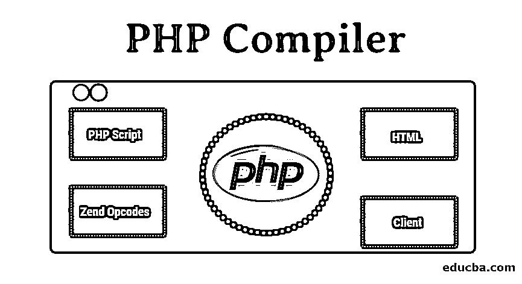

# PHP 编译器

> 原文：<https://www.educba.com/php-compiler/>

## PHP 编译器简介

利用编程语言来开发各种应用程序。当我们运行任何应用程序时，它可以让我们利用代码赋予它的所有功能。当我们运行应用程序时，系统中有一个程序可以理解代码想要传达的内容，然后相应地渲染应用程序，这个程序称为编译器或解释器。编译器可以被定义为一种特殊的程序，它将以高级或中级语言编写的代码转换成机器可理解的形式，以便处理器能够理解它。对于每一种编程语言，都有一个独立的编译器。在这篇文章中，我们将学习 PHP 编译器。

### 什么是 PHP 编译器？

它是一种特殊的程序，将 PHP 语句转换成机器语言，以便系统的处理器能够理解。任何系统的处理器只理解二进制代码，这意味着编译器将高级语言转换成二进制形式，以便处理器能够理解和处理。没有编译器，任何程序都是没有意义的。所有 ide 都提供了一个完整的平台来编辑和运行程序，这些 ide 都由编译器组成，编译器将 ide 中编写的程序编译成机器语言。实际上，编译器只不过是一个程序，帮助将使用语句编写的任何东西转换成二进制形式。

<small>网页开发、编程语言、软件测试&其他</small>

编译器的作用不仅仅是将代码转换成机器语言，还要确保程序中的语句没有错误。当进行错误检查时，编译器会确保程序符合语法，并且正确使用了预定义的关键字。当编译器发现错误时，它通过提供错误的简要细节让开发人员知道它，这样的错误被称为编译时错误。在错误中，它显示发生问题的行号以及错误的种类。必须纠正错误，以便让编译器将代码转换为处理器可以理解的二进制代码。

### Zend Engine PHP 编译器

Zend Engine PHP 编译器是一种特殊的编译器，它提供了编译 PHP 程序的平台，还提供了运行时引擎。它也可以被认为是一种特殊的程序，是为了提供完整的解决方案来编译和呈现用 PHP 编程语言编写的代码而编写的。这个程序是由 Andi Gutmans 和 Zeev Suraski 开发的，他们后来成立了名为 Zend Technologies 的公司。它的工作方式和编译器一样，提供了更多的功能。这个程序可以部署在服务器端，以服务于 PHP 脚本的执行，该脚本必须从发出脚本运行请求的地方发送到客户端。

Zend 引擎的工作非常简单，下面已经使用图表进行了定义。一般来说，PHP 代码被转换成机器语言，然后由处理器处理。但是当使用 Zend 编译器时，PHP 脚本被转换成 Zend 操作码。然后利用操作码生成最终提供给客户端的 HTML 页面。与普通编译器相比，它以简单的方式工作并提供额外的特性。Zend 引擎还提供了运行时引擎，让用户使用程序。尽管 Zend 引擎提供了编译平台，但它必须在启动整个编译过程之前将 PHP 脚本加载到内存中。

与其他 PHP 编译器程序相比，更喜欢 Zend 引擎的原因是它提供了额外的功能。没有编译器协助程序的实际运行，但是 Zend engine 提供的运行时引擎也帮助我们运行应用程序。除此之外，它还提供由 Zend technologies 提供的帮助。如上图所示，HTML 是使用 Zend 操作码生成的，其中使用 [PHP](https://www.educba.com/php-constants/) 生成的输出与 HTML 相结合，以便以简单易懂的形式向用户提供输出。最终，发出运行脚本请求的客户机或 web 浏览器会得到输出，这一切都是使用 Zend 引擎完成的。

我们在本地服务器上使用的编译器是内置的。他们只是编译代码，并让处理器处理编译后的文件，以便呈现应用程序。所有的[编程语言](https://www.educba.com/what-is-a-programming-language/)都有自己的编译器，可以理解用这种特定编程语言编写的代码。编译器编译程序文件所花的时间取决于它的大小。如果它是一个大文件或者代码行更多，编译器会花费更多的时间，反之亦然。

### 结论

PHP 编译器是用 PHP 编写的一组语句进行编译的程序。使用任何编程语言都被认为是非常重要的，因为没有编译器，代码对系统几乎没有意义。这有助于将代码转换为二进制数据，处理器利用二进制数据来呈现应用程序或为应用程序带来功能。

### 推荐文章

这是一个 PHP 编译器指南。在这里，我们讨论了介绍，什么是 PHP 编译器以及 Zend 引擎的工作细节。您也可以阅读以下文章，了解更多信息——

1.  [PHP 中的变量](https://www.educba.com/variables-in-php/)
2.  [PHP 框架](https://www.educba.com/php-frameworks/)
3.  [PHP 魔法常数](https://www.educba.com/php-magic-constants/)
4.  [PHP 递归函数](https://www.educba.com/php-recursive-function/)

