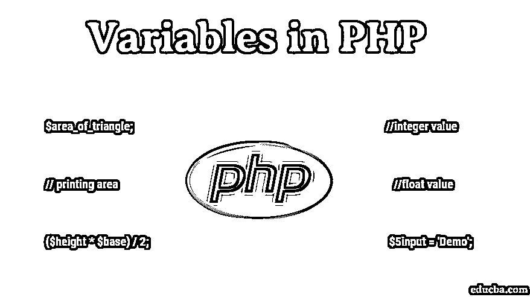
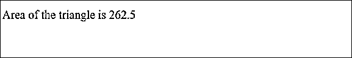
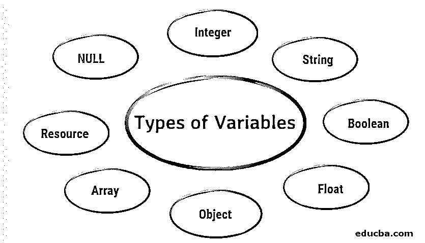
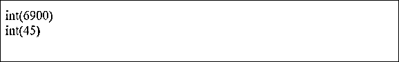
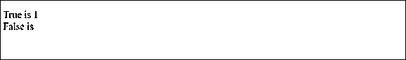
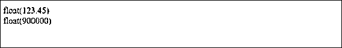
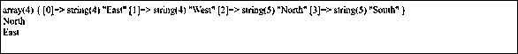

# PHP 中的变量

> 原文：<https://www.educba.com/variables-in-php/>




## PHP 中的变量介绍

下面这篇文章“PHP 中的变量”提供了 PHP 中各种变量的概要。每个变量都存储某种信息，信息就是一个值。该值可以是数字、字符串、布尔值、数组、对象、资源等。

### 如何在 PHP 中声明变量？

声明的变量存储信息。因此，关于在 PHP 中声明变量，你必须知道一些事情。

<small>网页开发、编程语言、软件测试&其他</small>

1.  声明的变量总是以美元符号($)开始。变量名必须以字母或下划线开头，但不能以数字开头。
2.  变量不包含空格，这些变量名是区分大小写的例子，$fruit 不同于$From。
3.  变量声明使用赋值运算符“=”，其中变量名在运算符的左边，表达式在运算符的右边。
4.  正如我们所知， [PHP 是一种松散类型的语言](https://www.educba.com/what-is-php/)，声明的变量确实预先知道它将是什么类型的变量，这意味着它可以被声明为数字、字符串、数组或其他任何东西。
5.  因为变量的值不是常数，所以当需要时，这些值可以从一个值转换成另一个值。

### 如何在 PHP 中初始化变量？

从前面的内容中，我们知道 PHP 是一种松散类型的语言，我们不需要像在其他语言中一样在使用它之前声明变量的类型，比如变量是整数、字符串还是布尔类型。变量的类型取决于它存储的值。让我们通过例子来学习。

在下面的例子中，我们看到高度是一个浮点值，底部是一个整数值，基于这些值，我们计算了三角形的面积。

**代码:**

```
<?php
// example to demonstrate the intialization of variables
$height = 10.5;           //float value
$base = 50;               //integer value
// calculating area of a triangle
$area_of_triangle = ($height * $base) / 2;
// printing area of the triangle
echo 'Area of the triangle is '. $area_of_triangle;
?>
```

**输出:**




下面的代码显示了 PHP 中初始化变量的所有有效和无效的方法。

1.  //无效，因为以数字开头

```
$5input = 'Demo';
```

2.  //有效，因为以下划线开头

```
$_input = 'Demo';
```

3.  //有效

```
$input = 'Demo';
```

4.  //有效，因为它以下划线开头，后跟允许的数字和字符串

```
$_5input = 'Demo';
```

### 变量类型及示例

变量存储值。这些赋给变量的值定义了变量的类型。有八种数据类型:




让我们详细了解每一个。

#### 1.整数

整数是一个整数。这个整数可以是正数，也可以是负数。(如果没有明显的意义，它是积极的)它必须至少有一个数字范围从 0 到 9，没有逗号或空格。它没有小数点。整数有不同的表示法，比如

1.  十进制(基数为 10)
2.  十六进制(基数为 16，前缀为 0x)
3.  八进制(基数为 8，前缀为 0)

可以选择在前面加一个符号–或+

```
<?php
//example to demonstrate an integer datatype
$x = 6900;
$y = 45;
//var_dump tells us about the datatype and value of the input number
var_dump($x);
echo '<br>';
var_dump($y);
?>
```

**输出:**




#### 2.线

字符串是字符或字母的序列。字符串可以包含一系列数字、特殊字符和算术值。也可以是所有的组合。为了表示一个字符串，我们使用单引号或双引号。

```
<?php
//example to demonstrate string datatype
$input = 'Apple';
echo '<br> $input is my favorite fruit';
echo "<br> $input is my favorite fruit";
?>
```

**输出:**


#### 3.布尔代数学体系的

此数据类型可以包含两个值之一:true 或 false，其中 true 为 1，false 为空。

```
<?php
//example to demonstrate boolean datatype
$input = true;
// print true
echo "<br> True is ".$input;
$input_value = false;
// print false
echo "<br> False is ".$input_value;
?>
```

**输出:**

**

** 

#### 4.浮动

带有小数点或指数形式的数字称为浮点数或 float 类型。

```
<?php
//example to demonstrate float datatype
$input = 123.45;
$input_value = 9.e5;
var_dump($input);
echo '<br>';
var_dump($input_value);
?>
```

**输出:**




#### 5.目标

对象是存储数据的数据类型。除了数据，它还存储有关数据处理的信息。通过声明类来显式声明对象。类是用 Class 关键字定义的。类是包含数据成员和数据方法的结构。

类被实例化，对象被创建，通过这个对象，我们现在可以访问类的成员和方法。

```
<?php
//example to demonstrate object datatype
class Subject{
//defining a string property
public $string = "My favourite subject is Maths";
//defining a method that returns the string property
function display() {
return $this->string;
}
}
//instantiating an object of a class
$object = new Subject;
echo $object->string;
?>
```

**输出:**


#### 6.排列

它是相似和不相似数据类型的集合。数组以键值对的形式声明。

```
<?php
//example to demonstrate array datatype
$directions= array('East','West','North','South');
var_dump($directions);
echo '<br>';
echo $directions[2]
echo '<br>';
echo $directions[0];
?>
```

**输出:**




#### 7.空

当变量没有赋值，变量为空时，我们可以使用空值。

```
<?php
//example to demonstrate NULL datatype
$input = 'Demo Test';
var_dump($input);
echo '<br/>';
$input = NULL;
var_dump($input);
?>
```

**输出:**


#### 8.资源

资源是与外部资源相关的特殊变量，外部资源[可以是文件处理](https://www.educba.com/php-file-handling/)，数据库连接或其他

```
<?php
//example to demonstrate resource datatype
//establishing a connection to database with default values
$connection = mysql_connect("localhost", "root", "");
var_dump($connection);
?>
```

### 推荐文章

这是 PHP 中变量的指南。这里我们讨论 PHP 中的变量是什么，我们如何声明变量，我们如何初始化变量，最后讨论 PHP 中变量的不同类型。您也可以阅读以下文章，了解更多信息——

1.  [PHP 数学函数](https://www.educba.com/php-math-functions/)
2.  [如何将数据库连接到 PHP？](https://www.educba.com/how-to-connect-database-to-php/)
3.  [PHP 字符串函数](https://www.educba.com/php-string-functions/)
4.  [什么是 PHP 数组？](https://www.educba.com/what-is-php-array/)


