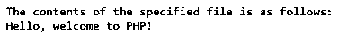
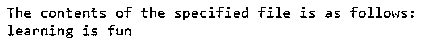
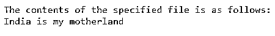
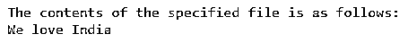

# PHP 文件获取内容

> 原文：<https://www.educba.com/php-file_get_contents/>

## PHP 文件获取内容简介

每当我们想在 PHP 中将文件的内容读入一个字符串时，我们使用一个名为 file_get_contents()的函数。如果操作系统支持，此函数可以使用内存映射技术来提高性能。在成功访问和读取指定文件的内容时，这个函数将文件的内容返回到一个字符串中。如果该函数不能访问指定的文件或读取指定文件的内容，则该函数返回 false，并且要读取的文件所在位置的路径作为参数传递给该函数。

**PHP 中声明 file_get_contents()函数的语法如下:**

<small>网页开发、编程语言、软件测试&其他</small>

文件获取内容(文件路径)；

其中，path_to_the_file 是文件所在文件的路径，该文件的内容将由 file_get_contents()函数读入一个字符串。

### PHP 中 file_get_contents()函数的使用

*   每当我们想将文件的内容读入 PHP 中的[字符串时，我们使用一个名为 file_get_contents()的函数。](https://www.educba.com/string-in-php/)
*   要读取的文件所在位置的路径作为参数传递给 file_get_contents()函数。
*   在成功访问和读取指定文件的内容时，file_get_contents()函数将文件的内容返回到一个字符串中。
*   如果 file_get_contents()函数无法访问指定的文件或读取指定文件的内容，此函数将返回 false。
*   如果操作系统支持，file_get_contents()函数可以使用内存映射技术来提高性能。

### PHP 文件获取内容示例

下面举几个例子

#### 示例#1

PHP 程序，用于读取文件的内容，该文件位于其路径作为参数传递给 file_get_contents()函数的位置:

`#making use of file_get_contents() function by passing the path to the file where the file is present to read the contents of the file into a string called filecontents
@filecontents = file_get_contents('C:/Users/admin/Desktop/check.txt');
print "The contents of the specified file is as follows:\n";
#displaying the contents of the file
echo $filecontents;`

上述程序的输出如下面的快照所示:

在上面的程序中，我们使用 file_get_contents()函数，传递文件所在文件的路径，将文件的内容读入一个名为 filecontents 的字符串。然后文件的内容作为输出显示在屏幕上。

#### 实施例 2

PHP 程序读取文件的内容，该文件的路径作为参数传递给 file_get_contents()函数:

`#making use of file_get_contents() function by passing the path to the file where the file is present to read the contents of the file into a string called filecontents
@filecontents = file_get_contents('C:/Users/admin/Desktop/EDUCBA/check1.txt’);
print "The contents of the specified file is as follows:\n";
#displaying the contents of the file
echo $filecontents;`

上述程序的输出如下面的快照所示:

在上面的程序中，我们使用 file_get_contents()函数，传递文件所在文件的路径，将文件的内容读入一个名为 filecontents 的字符串。然后文件的内容作为输出显示在屏幕上。

#### 实施例 3

PHP 程序读取文件的内容，该文件的路径作为参数传递给 file_get_contents()函数:

`#making use of file_get_contents() function by passing the path to the file where the file is present to read the contents of the file into a string called filecontents
@filecontents = file_get_contents('C:/Users/admin/Desktop/check2.txt');
print "The contents of the specified file is as follows:\n";
#displaying the contents of the file
echo $filecontents;`

上述程序的输出如下面的快照所示:

在上面的程序中，我们使用 file_get_contents()函数，传递文件所在文件的路径，将文件的内容读入一个名为 filecontents 的字符串。然后文件的内容作为输出显示在屏幕上。

#### 实施例 4

PHP 程序读取文件的内容，该文件的路径作为参数传递给 file_get_contents()函数:

`#making use of file_get_contents() function by passing the path to the file where the file is present to read the contents of the file into a string called filecontents
@filecontents = file_get_contents('C:/Users/admin/Desktop/check3.txt');
print "The contents of the specified file is as follows:\n";
#displaying the contents of the file
echo $filecontents;`

上述程序的输出如下面的快照所示:

在上面的程序中，我们使用 file_get_contents()函数，传递文件所在文件的路径，将文件的内容读入一个名为 filecontents 的字符串。然后文件的内容作为输出显示在屏幕上。

#### 实施例 5

PHP 程序读取文件的内容，该文件的路径作为参数传递给 file_get_contents()函数:

`#making use of file_get_contents() function by passing the path to the file where the file is present to read the contents of the file into a string called filecontents
@filecontents = file_get_contents('C:/Users/admin/Desktop/check4.txt');
print "The contents of the specified file is as follows:\n";
#displaying the contents of the file
echo $filecontents;`

上述程序的输出如下面的快照所示:

在上面的程序中，我们使用 file_get_contents()函数，传递文件所在文件的路径，将文件的内容读入一个名为 filecontents 的字符串。然后文件的内容作为输出显示在屏幕上。

### 推荐文章

这是一个 PHP 文件获取内容的指南。这里我们通过编程实例及其输出，通过 PHP 中 file_get_contents()函数的定义、语法和工作原理来讨论 PHP 中 file_get_contents()函数的概念。您也可以看看以下文章，了解更多信息–

1.  [PHP json_decode](https://www.educba.com/php-json_decode/)
2.  [PHP preg_match_all](https://www.educba.com/php-preg_match_all/)
3.  [PHP 数组 _push()](https://www.educba.com/php-array_push/)
4.  PHP URL

