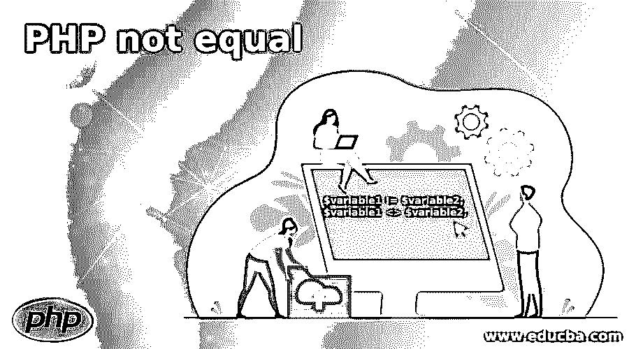
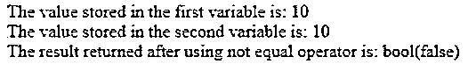
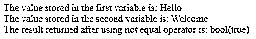
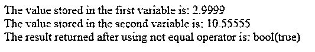
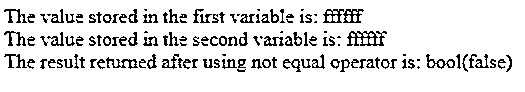

# PHP 不相等

> 原文：<https://www.educba.com/php-not-equal/>

## PHP 简介不等于

PHP 中有一个比较运算符不等于，用符号表示！=或<>每当我们想要比较两个给定值的数据类型时，我们就使用 PHP 中的不等于运算符。如果给定的两个值的数据类型相同，即使存储在两个变量中的值不相同，PHP 中的这个不相等运算符也将返回 true 如果给定的两个值的数据类型不同，即使存储在两个变量中的值相同，PHP 中的这个不相等运算符也将返回 false。

**语法:**

<small>网页开发、编程语言、软件测试&其他</small>

`$variable1 != $variable2;
$variable1 <> $variable2;`

其中 variable1 表示其数据类型要与 variable2 表示的变量进行比较的变量的值。

### PHP 中不等运算符的使用

*   PHP 中有一个比较运算符不等于，用符号表示！=或者<>。
*   每当我们想要比较两个给定值的数据类型时，不管这两个值是否相等，我们都要使用 PHP 中的 not equal 运算符。
*   如果给定的两个值的数据类型相同，即使存储在两个变量中的值不同，不等于运算符也返回 true。
*   如果给定的两个值的数据类型不同，即使存储在两个变量中的值相同，PHP 中的 not equal 运算符也会返回 false。

### PHP 不相等的例子

下面是提到的例子:

#### 示例#1

PHP 程序演示了不等运算符的工作原理，用来比较给定两个值的数据类型并返回输出。

**代码:**

`<?php
//an integer value is stored in a variable called variable1
$variable1 = 10;
echo "The value stored in the first variable is: $variable1 ";
//a string value is stored in a variable called variable2
$variable2 = "10";
echo "The value stored in the second variable is: $variable2 ";
//not equal operator is used to compare the data type of the given two variables and return the result
echo "The result returned after using not equal operator is: ";
var_dump($variable1 != $variable2);
?>`

**输出:**

在上面的程序中，一个整数值存储在一个名为 variable1 的变量中。然后将一个字符串值存储在一个名为 variable2 的变量中。存储在两个变量中的值是相同的。然后我们利用不等运算符来比较两个变量的数据类型。不等于运算符返回 false，因为即使存储在变量中的值相同，两个变量的数据类型也不同。

#### 实施例 2

PHP 程序来演示不等运算符的工作，比较给定的两个值的数据类型并返回输出。

**代码:**

`<?php
//an integer value is stored in a variable called variable1
$variable1 = "Hello";
echo "The value stored in the first variable is: $variable1 ";
//a string value is stored in a variable called variable2
$variable2 = "Welcome";
echo "The value stored in the second variable is: $variable2 ";
//not equal operator is used to compare the data type of the given two variables and return the result
echo "The result returned after using not equal operator is: ";
var_dump($variable1 != $variable2);
?>`

**输出:**

在上面的程序中，一个字符串值存储在一个名为 variable1 的变量中。然后将一个字符串值存储在另一个名为 variable2 的变量中。存储在这两个变量中的值是不同的。然后我们利用不等运算符来比较两个变量的数据类型。不等于运算符返回 true，因为即使存储在变量中的值不同，两个变量的数据类型也是相同的。

#### 实施例 3

PHP 程序演示了不等运算符的工作原理，用来比较给定两个值的数据类型并返回输出。

**代码:**

`<?php
//an integer value is stored in a variable called variable1
$variable1 = 2.9999;
echo "The value stored in the first variable is: $variable1 ";
//a string value is stored in a variable called variable2
$variable2 = 10.55555;
echo "The value stored in the second variable is: $variable2 ";
//not equal operator is used to compare the data type of the given two variables and return the result
echo "The result returned after using not equal operator is: ";
var_dump($variable1 != $variable2);
?>`

**输出:**

在上面的程序中，一个字符串值存储在一个名为 variable1 的变量中。然后将一个字符串值存储在另一个名为 variable2 的变量中。存储在这两个变量中的值是不同的。然后我们利用不等运算符来比较两个变量的数据类型。不等于运算符返回 true，因为即使存储在变量中的值不同，两个变量的数据类型也是相同的。

#### 实施例 4

PHP 程序演示了不等运算符的工作原理，用来比较给定两个值的数据类型并返回输出。

**代码:**

`<?php
//an integer value is stored in a variable called variable1
$variable1 = "ffffff";
echo "The value stored in the first variable is: $variable1 ";
//a string value is stored in a variable called variable2
$variable2 = ffffff;
echo "The value stored in the second variable is: $variable2 ";
//not equal operator is used to compare the data type of the given two variables and return the result
echo "The result returned after using not equal operator is: ";
var_dump($variable1 != $variable2);
?>`

**输出:**

在上面的程序中，一个整数值存储在一个名为 variable1 的变量中。然后将一个字符串值存储在一个名为 variable2 的变量中。存储在两个变量中的值是相同的。然后我们利用不等运算符来比较两个变量的数据类型。不等于运算符返回 false，因为即使存储在变量中的值相同，两个变量的数据类型也不同。

### 推荐文章

这是一个 PHP 不等于指南。这里我们分别讨论不等算子的介绍、运算和例子。您也可以看看以下文章，了解更多信息–

1.  [PHP 堆栈跟踪](https://www.educba.com/php-stack-trace/)
2.  [PHP 自定义异常](https://www.educba.com/php-custom-exception/)
3.  [PHP 表单验证](https://www.educba.com/php-form-validation/)
4.  [PHP 异步](https://www.educba.com/php-async/)

