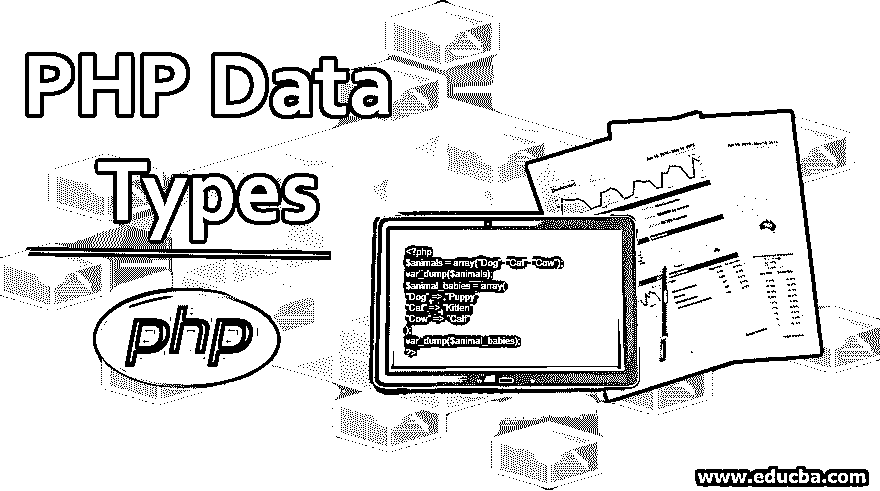
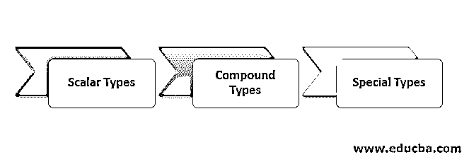
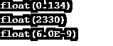
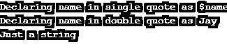
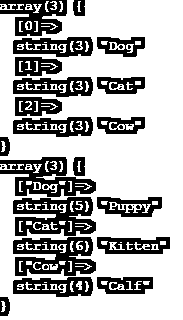
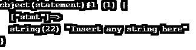

# PHP 数据类型

> 原文：<https://www.educba.com/php-data-types/>




## PHP 数据类型介绍

PHP 或超文本预处理器是一种基于 web 的应用程序开发编程语言，可以在其中加入 HTML 编码来构建 web 应用程序。在 PHP 中，有八种不同的数据类型用于声明和调用脚本中的变量。它们是代表 true 或 false 值的' Boolean '、代表数值的' Integer '、代表十进制数字的' Float/Double '、代表字符的' String '、固定元素大小的' Arrays '、代表类实例的' object '、代表 void 的' NULL '以及引用 PHP 脚本之外的元素的' resources '。

### 前 3 种 PHP 数据类型

用于存储值的 PHP 变量可能与各种数据类型相关联，从最简单的 int 到更复杂的数据类型，如数组。PHP 被称为松散类型的[编程语言](https://www.educba.com/what-is-a-programming-language/)，这意味着变量数据类型是在运行时根据它们的属性决定的，而不是显式定义的。它分析给定值属性，然后确定要分配给它的数据类型。PHP 支持 8 种原始数据类型，可以进一步分为以下 3 种类型:

<small>网页开发、编程语言、软件测试&其他</small>

让我们通过一个例子来详细讨论每一个问题。




#### 1.标量类型

它们可以进一步分为以下基本类型:

##### 形容词（adjective 的缩写）布尔代数学体系的

这些类型可能以 0 或 1 的形式输出，即真或假。它们用于条件测试案例，当条件满足时事件返回 true，当条件不满足时返回 false。它还将 NULL 和空字符串视为 false。

**代码:**

```
<?php
// TRUE is assigned to a variable value
$variable_value = true;
var_dump($variable_value);
?>
```

**输出:**


##### b.整数

整数数据类型包含-2，147，483，648 和 2，147，483，647 之间的非十进制整数值。这个最大值和最小值取决于系统，是 32 位还是 64 位。通过使用常量 PHP_INT_MAX，我们可以找出最大值。它还保存基数为 10、基数为 8 和基数为 6 的值。

**代码:**

```
<?php
// example for decimal (base 10)
$dec1 = 100;
$dec2 = 200;
// example for decimal (base 8)
$oct1 = 10;
// example for decimal (base 6)
$hex1 = 0x15;
$addn = $dec1 + $dec2;
echo $addn;
?>
```

**输出:**


##### 碳（carbon 的缩写）浮动/双精度

有小数点或指数的数称为浮点数/实数。它可以有正数也可以有负数。该数字应显示预定义的小数位数。

**代码:**

```
<?php
$dec1 = 0.134;
var_dump($dec1);
$exp1 = 23.3e2;
var_dump($exp1);
$exp2 = 6E-9;
var_dump($exp2);
?>
```

**输出:**




##### d.线

字符串数据类型基本上是字符的集合，包括数字、字母表和字母。它们可以保存高达 2GB 的值。如果一个变量必须显示在字符串中，就要用双引号来声明它们。否则，单引号也可以。

**代码:**

```
<?php
$name = "Jay";
$str1 = 'Declaring name in single quote as $name';
echo $str1;
echo "\n";
$str2 = "Declaring name in double quote as $name";
echo $str2;
echo "\n";
$str3 = 'Just a string';
echo $str3;
?>
```

**输出:**




#### 2.复合类型

这些是不能分配新值的。数组和对象属于这一类。

##### 形容词（adjective 的缩写）数组

它是一种数据结构，由具有相似数据类型的固定大小的元素组成。它还用于以有序映射的形式存储已知数量的键-值对。它可以用于各种目的，如列表、哈希表(map 实现)、集合、堆栈、字典、队列等。;多维阵列也是可能的。

一个简单的数组示例如下:

**代码:**

```
<?php
$animals = array("Dog", "Cat", "Cow");
var_dump($animals);
$animal_babies = array(
"Dog" => "Puppy",
"Cat" => "Kitten",
"Cow" => "Calf"
);
var_dump($animal_babies);
?>
```

**输出:**




##### b.目标

它允许存储数据(称为其属性),并给出如何处理数据的信息(称为对象的方法)。一个对象充当一个类的实例，该类用作其他对象的模板。关键字“new”用于创建对象。

每个对象都从父类继承属性和方法。它要求在每个对象中有一个明确的声明和一个“类”。

**代码:**

```
<?php
// Declaring a class
class statement{
// properties
public $stmt = "Insert any string here";
// Declaring a method
function show_statement(){
return $this->stmt;
}
}
// Creation of new object
$msg = new statement;
var_dump($msg);
?>
```

**输出:**




#### 3.特殊类型

PHP 中有两种特殊的数据类型属于这一类，因为它们是唯一的。它们是:

##### a. NULL

在 PHP 中，这个特殊的 NULL 用于表示空变量，即变量中没有数据，NULL 是唯一可能的值。如果它已被设置为 unset()或没有设置任何值，则赋给常量 NULL 的变量将成为 NULL 数据类型。

这里我们将 NULL 直接设置为 val1。对于 val2 变量，我们首先分配一个字符串值，然后将其设置为 NULL。在这两种情况下，变量的最终值都是 NULL。

**代码:**

```
<?php
$val1 = NULL;
var_dump($val1);
echo "<br>";
$val2 = "Any string";
$val2 = NULL;
var_dump($val2);
?>
```

**输出:**


##### b.资源

资源不是实际的数据类型，但是它是一个特殊的变量，用来保存对 PHP 外部资源的引用。它们为打开的文件和数据库连接保存特殊的处理程序。特殊函数通常会创建和使用这些资源。

要运行这段代码，我们必须在系统中创建 file.txt，并授予它读取权限。如果“句柄”不是资源，它会抛出一个错误。此外，确保连接到系统中任何现有的数据库。

**代码:**

```
<?php
// Open an existing file to read
$handle = fopen("file.txt", "r");
var_dump($handle);
echo "<br>";
// Connecting to MySQL database server with settings set to default
$db = mysql_connect("localhost", "root", "");
var_dump($db);
?>
```

除了上面的数据类型，我们还有一种叫做伪类型的东西:PHP 文档中的关键字用来表示参数可能具有的类型或值。其中一些是:

*   混合:它们允许一个参数接受多种类型。例如:gettype()
*   number:有了 number，参数可以是浮点数，也可以是整数。
*   void、callback、array|object 是其他一些伪类型

### 结论

这里我们已经涵盖了 PHP 中几乎所有可用的数据类型。PHP 隐式支持以上所有 8 种原语类型，不需要用户手动指定它们。数组和对象可以保存多个值，而对于 rest，所有的只能保存一个值(除了 NULL，它不保存任何值)。

### 推荐文章

这是 PHP 数据类型指南。在这里，我们详细讨论了 3 种 PHP 数据类型，如标量、复合和特殊，并给出了示例和实现。你也可以看看下面的文章来了解更多-

1.  [PHP 中的函数](https://www.educba.com/functions-in-php/)
2.  [PHP 中的继承](https://www.educba.com/inheritance-in-php/)
3.  [PHP 简介](https://www.educba.com/introduction-to-php/)
4.  [PHP 表单](https://www.educba.com/php-form/)


