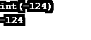
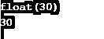
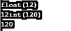

# PHP 整数

> 原文：<https://www.educba.com/php-integer/>


## PHP 整数简介

在开始谈论 PHP 中的整数之前，我们先来了解一下整数这个术语。整数是一种数据类型。一种保持完整数值的变量。完整的(整数)数字，如-1、23、343、-23、-50 等。整数本身可以是正数、负数或 0。几乎每种编程语言，如 C、JAVA 和 C++都支持全功能整数。但是，当我们使用 PHP 语言时，当我们将任何整数值赋给任何变量时，它可以被认为是整数数据类型。因为 PHP 是一种松散的编程语言，所以在使用它之前不需要声明任何具有指定数据类型的变量。整数可以在赋值时直接在 PHP 中使用。几乎所有的编程语言中都有一种整数数据类型来处理整数类型的值。

### PHP 中如何声明整型变量？

下面给出了在 PHP 中声明整数变量的两种方法:

<small>网页开发、编程语言、软件测试&其他</small>

#### 正整数

包含 0 或大于 0 的值的整数。PHP 支持各种原始数据类型，如整数、浮点数、字符、字符串、[布尔值(真或假)](https://www.educba.com/php-booleans/)、混合数组等。在示例部分中，我们将逐一看到我们可以使用 PHP 编程语言处理的所有类型的整数。

**代码:**

```
<?php
$x = 124; // declaration and assignment
var_dump($x); // int 124
echo $x;            // 124
?>
```

**输出**:


#### 负整数

包含小于 0 的值的整数。

**代码:**

```
<?php
$x = -124; // declaration and assignment
var_dump($x); // int -124
echo $x;            // -124
?>
```

**输出**:




我们可以看到显示 int -124 的 var_dump($x)的输出；int 是数据类型，-124 是值。

### 高级 PHP 整数示例

下面是 php 中整数的不同例子:

#### 示例#1

十六进制代码形式的整数:

**代码:**

```
<?php
$x = 0x1B; // hexadecimal number
var_dump($x);
echo $x;
?>
```

**输出**:


现在的问题是，为什么是 27？这就是 PHP 支持整数的原因。当我们给任何东西赋值的时候(表达式，函数返回，等等。)在将被视为整数数据类型的变量中，是该代码或函数的整数输出。

对于 about code，我们得到 27，因为我们指定了一个等于 27 的十六进制值。其中 0x 是 16，B 是 11；如果我们将这两者相加，我们将得到 27 作为输出。

#### 实施例 2

作为八进制代码的整数:

**代码:**

```
<?php
$x = 0123; // octal number
var_dump($x);
echo $x;
?>
```

**输出**:


这也是一个整数，因为给定的八进制代码的输出是一个整数。

#### 实施例 3

以整数形式返回的函数:

**代码:**

```
<?php
function addNumbers($a, $b){
$sum = 0;
$sum = $a + $b;
return $sum;
}
$x = addNumbers(10,20);
var_dump($x);
echo $x;
?>
```

**输出**:


同样我们有 30 个给定的两个整数之和作为一个整数。但是如果我们在上面的代码中做一个非常小的改变，它会给我们一个输出 float。

#### 实施例 4

函数以浮点形式返回:

**代码:**

```
<?php
function addNumbers($a, $b){
$sum = 0;
$sum = $a + $b;
return $sum;
}
$x = addNumbers(10,20.0);
var_dump($x);
echo $x;
?>
```

**输出**:




我们可以看到，除了函数参数值之外，所有内容都与前面的代码示例相同。

$x = addNumbers(10,20.0);

我们用 20.0 代替了 20。这足以将输出从整数变为浮点数。输出保持不变，但是数据类型已经从 integer 改为 floating。

#### 实施例 5

使用混合数据类型:

```
<?php
$x = 12.0; // float number
var_dump($x);
echo $x;
$x = 120; // integer number
var_dump($x);
echo $x;
?>
```

**输出**:




我们可以看到，任何变量的数据类型都会根据分配给它的值而动态变化。在上面的代码中，我们首先使用 float 数据类型 value 然后，它给出数据类型 float。但是当我们把这个值赋值为一个整数的时候，它会给我们一个整数数据类型的结果。

看完上面的例子后，我们现在清楚了如何识别整数。

整数可以是普通的整数(以 10 为基数的任何数字)、十六进制记数法数字(以 0x 开头的以 16 为基数的数字)或八进制记数法数字(以 0 开头的以 8 为基数的数字)，或者是任何以 a 符号为前缀的完整数字(整数)，a 符号可以是–或+,也可以是零。

### 结论

在了解了上面给出的所有语句和示例代码之后，我们可以说 PHP 是一种松散类型的编程语言。这个词的松散使用意味着在声明时不需要使用任何数据类型。如果我们需要声明任何类型，我们不需要要求给出它的数据类型。PHP 本身会根据分配给它的值来处理标识符的任何变量的数据类型。所以，直接地说， [PHP 通常支持市场上所有可用的数据类型。](https://www.educba.com/php-constants/)

### 推荐文章

这是一个 PHP 整数指南。这里我们讨论 2 种类型，包括正整数和负整数以及高级 PHP 整数示例。您也可以阅读以下文章，了解更多信息——

1.  [PHP 中的阶乘](https://www.educba.com/factorial-in-php/)
2.  [PHP 中的变量](https://www.educba.com/variables-in-php/)
3.  [PHP 数学函数](https://www.educba.com/php-math-functions/)
4.  [PHP 魔法常数](https://www.educba.com/php-magic-constants/)


