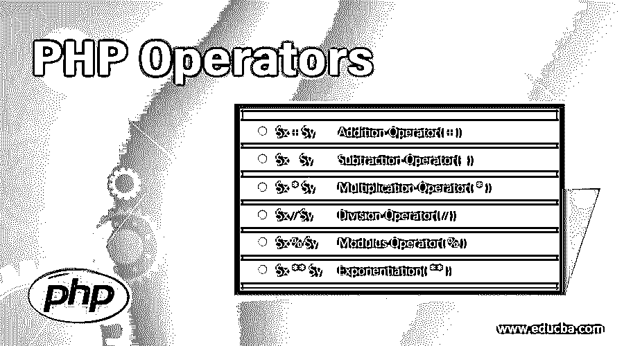

# PHP 操作符

> 原文：<https://www.educba.com/php-operators/>




## PHP 操作符介绍

运算符是用于执行加、减、乘等数学计算的符号。PHP 支持各种运算符，不仅可以执行简单的数学运算，还可以[执行一些逻辑运算](https://www.educba.com/logical-operators-in-php/)，比如 AND、OR、not、比较运算，比如大于、小于等等。操作符是接受一个或多个值并产生另一个值的东西。

### PHP 操作符的前 6 种类型

PHP 中使用的不同运算符如下:

<small>网页开发、编程语言、软件测试&其他</small>

#### **1。算术 PHP 运算符**

 **像每一种编程语言一样，PHP 也支持算术运算符 T1，用于执行简单的算术运算，如加、减、除、乘等。

**i)加法运算符(+ ):** 该运算符用于将两个值相加。假设 X 和 Y 是两个值，这个加号运算符会把这两个值 X + Y 加起来。

**语法:**

```
$x + $y
```

****ii)减法运算符(–):****该运算符用于两个值相减。假设 X 和 Y 是两个值，那么这个减号运算符将从第一个值中减去第二个值。

**语法:**

```
$x - $y
```

****iii)乘法运算符(* ):**** 该运算符用于两个值相乘。假设 X 和 Y 是两个值，那么这个乘法运算符将 X 乘以 Y。

**语法:**

```
$x * $y
```

****iv)除法运算符(** / ):** 该运算符用于分子乘分母。假设 X 和 Y 是两个值，这个除法运算符将分子除以分母。

**语法:**

```
$x / $y
```

****v)模数运算符(% ):**** 该运算符用于给出除法的余数。假设 X 和 Y 是两个值，那么这个模数运算符首先将分子除以分母，然后给出余数。

**语法:**

```
$x % $y
```

******vi)求幂(** ):**** 该运算符用于将一个量提升到另一个值的幂。假设 X 和 Y 是两个值，那么这个取幂运算符将 X 的值提升到 Y 的幂。**

 ****语法:**

```
$x ** $y
```

#### **2。PHP 运算符赋值**

 **赋值运算符与数值一起使用，为变量赋值。在 PHP 中，=是基本的赋值操作符，这意味着左边的值被设置为右边的赋值表达式的值。下面是 PHP 中使用的赋值操作符列表

*   **简单赋值操作符(= ):** 该操作符从右值到左值赋值。
*   **Add AND 运算符(+= ):** 该运算符将右值与左值相加，并将输出赋给左值。
*   **减法 AND 运算符(-= ):** 该运算符从左值中减去右值，并将结果赋给左值。
*   **乘与运算符(*= ):** 该运算符将右值与左值相乘，并将结果赋给左值。
*   **除 AND 运算符(/= ):** 该运算符将左值除以右值，并将结果赋给左值。
*   **模数和运算符(%= ):** 该运算符使用两个值取模数，并将结果赋给左边的值。

#### 3.PHP 运算符的比较

PHP 比较运算符用于比较两个值，这些值可以是数字或字符串。

**i)等于(== ):** 如果两个操作数相等，该运算符返回 True。

**语法:**

```
$x == $y
```

**ii) Identical( === ):** 如果两个操作数相等且属于同一类型，则该操作符返回 True。

**语法:**

`$x === $y`

**iii)不相同(！== ):** 如果两个操作数不相等且属于不同类型，则该操作符返回 True。

**语法:**

```
$x !== $y
```

**iv)不相等(< > ):** 如果两个操作数不相等，该运算符返回 True。

**语法:**

```
$x <> $y
```

**v)不等于(！= ):** 如果两个操作数不相等，该操作符返回 True。

**语法:**

```
$x != $y
```

**vi)小于(< ):** 如果$x 小于$y，该操作符返回 True

**语法:**

```
$x < $y
```

**vii)大于(> ):** 如果$x 大于$y，该操作符返回 True

**语法:**

```
$x > $y
```

**viii)小于或等于(< = ):** 如果$x 小于或等于$y，该运算符返回 True

**语法:**

```
$x <= $y
```

**ix)大于或等于(> = ):** 如果$x 大于或等于$y，该运算符返回 True

**语法:**

```
$x >= $y
```

#### **4。递增/递减 PHP 运算符**

 **这些运算符被称为一元运算符，因为它对单个操作数进行运算。这些运算符用于增加或减少值。

**i)预递增(++ ):** 这个操作符最初将$x 递增 1，然后返回$x。

**语法:**

```
++$x
```

ii)预减量(— ): 这个操作符最初将$x 减 1，然后返回$x。

**语法:**

```
--$x
```

**iii)后置递增(++ ):** 这个操作符首先返回$x，然后递增 1。

**语法:**

```
$x++
```

**iv)预减量(— ):** 这个操作符首先返回$x，然后将它减 1。

**语法:**

```
$x—
```

#### **5。字符串 PHP 操作符**

 **字符串运算符是在字符串上实现的。

I)连接。):这个操作符连接两个字符串。

**语法:**

```
$text1.$text2
```

ii)连接和分配。= ): 这个操作符追加两个字符串。

**语法:**

```
$text1.$text2
```

#### **6。逻辑 PHP 运算符**

 **逻辑运算符用于组合条件语句。

**i) AND:** 如果两个操作数都为真，则该运算符返回真，否则返回假。

**语法:**

```
$x and $y
```

**ii) OR:** 如果任一操作数为真，则该运算符返回真，否则返回假。

**语法:**

```
$x or $y
```

iii) XOR: 如果两个操作数都为真，这个操作符返回真，如果两个都为真，那么我将返回假。

**语法:**

```
$x xor $y
```

**iv)&T3】:**如果两个操作数都为真，则该运算符返回真，否则返回假。

**语法:**

```
$x && $y
```

**v) NOT:** 如果$x 为 false，该运算符返回 True。

**语法:**

```
!$x
```

### 结论

当涉及到数学计算时，它在 PHP 中起着重要的作用。它还支持各种运算符，如逻辑运算符、字符串运算符等。

### 推荐文章

这是一个 PHP 操作指南。这里我们详细讨论了 PHP 操作符的 6 种类型，即算术、赋值、比较、递增/递减、逻辑和字符串。您也可以阅读以下文章，了解更多信息——

1.  [PHP 超全局变量](https://www.educba.com/php-superglobal-variables/)
2.  [PHP 字符串操作符](https://www.educba.com/php-string-operators/)
3.  [PHP 中的按位运算符](https://www.educba.com/bitwise-operators-in-php/)
4.  [PHP 中的逻辑运算符](https://www.educba.com/logical-operators-in-php/)


************