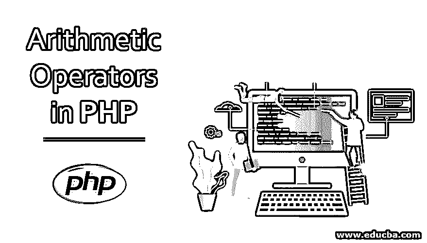
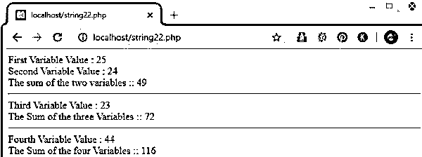
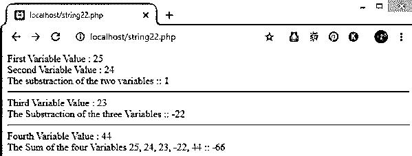
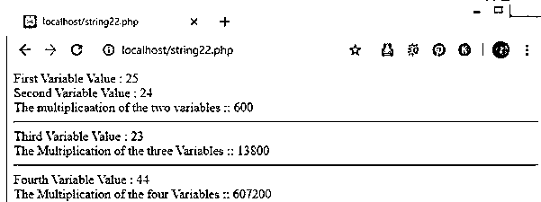
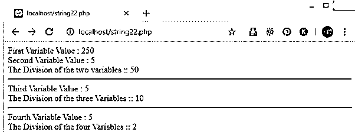
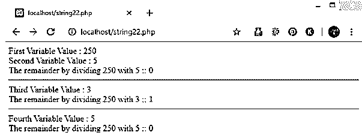
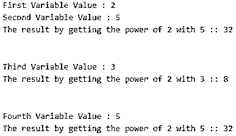

# PHP 中的算术运算符

> 原文：<https://www.educba.com/arithmetic-operators-in-php/>




## PHP 中算术运算符的介绍

算术运算符是 PHP 编程语言中的一种运算符。算术运算符对许多数学计算非常有用，可以让不同类型的程序轻松解决问题。[算术运算符只能与数值/数字一起使用](https://www.educba.com/arithmetic-operators-in-java/)来执行算术运算，如加(+)、减(-)、乘(x)、除(/)、模(%)、取幂(**)(1 <sup>st</sup> 数的 2 次方<sup>和</sup>数)。

### PHP 中算术运算符的解释

[算术运算符用于](https://www.educba.com/arithmetic-operators-in-javascript/)两个数值/数字执行加法(+)、减法(-)、乘法(x)、除法(/)、取模(%)、求幂(**)(1 <sup>第</sup>数的 2 次方<sup>第</sup>数)。

<small>网页开发、编程语言、软件测试&其他</small>

#### 1.加法(+)

加法是 PHP 编程语言的算术运算符之一。它需要至少两个/更多的数值/数字相加。

**代码:**

```
<?php
$pavan = 25;
$kumar = 24;
$sake = $pavan + $kumar;
echo "First Variable Value : $pavan";
echo "<br/>";
echo "Second Variable Value : $kumar";
echo "<br/>";
echo "The sum of the two variables :: ";
echo $sake;
echo "<br/>";
echo "<hr/>";
$p1 = 23;
echo "Third Variable Value : $p1";
echo "<br/>";
$k1 = $sake + $p1 ;
echo "The Sum of the three Variables :: $k1";
echo "<br/>";
echo "<hr/>";
$pavan1 = 44;
echo "Fourth Variable Value : $pavan1";
echo "<br/>";
$s1 = $pavan1 + $k1;
echo "The Sum of the four Variables :: $s1";
echo "<br/>";
?>
```

**输出:**




#### 2.减法(-)

减法是 PHP 编程语言的算术运算符之一。它需要至少两个/更多的数值/数字来相减。

**代码:**

```
<?php
$pavan = 25;
$kumar = 24;
$sake = $pavan - $kumar;
echo "First Variable Value : $pavan";
echo "<br/>";
echo "Second Variable Value : $kumar";
echo "<br/>";
echo "The substraction of the two variables :: ";
echo $sake;
echo "<br/>";
echo "<hr/>";
$p1 = 23;
echo "Third Variable Value : $p1";
echo "<br/>";
$k1 = $sake - $p1 ;
echo "The Substraction of the three Variables :: $k1";
echo "<br/>";
echo "<hr/>";
$pavan1 = 44;
echo "Fourth Variable Value : $pavan1";
echo "<br/>";
$s1 = $k1 - $pavan1;
echo "The Substraction of the four Variables $pavan, $kumar, $p1, $k1, $pavan1 :: $s1";
echo "<br/>";
?>
```

**输出:**




#### 3.乘法(x)

乘法是 PHP 编程语言的算术运算符之一。它需要至少两个/更多的数值/数字相乘。

**代码:**

```
<?php
$pavan = 25;
$kumar = 24;
$sake = $pavan * $kumar;
echo "First Variable Value : $pavan";
echo "<br/>";
echo "Second Variable Value : $kumar";
echo "<br/>";
echo "The multiplicaation of the two variables :: ";
echo $sake;
echo "<br/>";
echo "<hr/>";
$p1 = 23;
echo "Third Variable Value : $p1";
echo "<br/>";
$k1 = $sake * $p1 ;
echo "The Multiplication of the three Variables :: $k1";
echo "<br/>";
echo "<hr/>";
$pavan1 = 44;
echo "Fourth Variable Value : $pavan1";
echo "<br/>";
$s1 = $pavan1 * $k1;
echo "The Multiplication of the four Variables :: $s1";
echo "<br/>";
?>
```

**输出:**




#### 4.除法(/)

除法是 PHP 编程语言的算术运算符之一。它需要至少两个/更多的数值/数来除。

**代码:**

```
<?php
$pavan = 250;
$kumar = 5;
$sake = $pavan / $kumar;
echo "First Variable Value : $pavan";
echo "<br/>";
echo "Second Variable Value : $kumar";
echo "<br/>";
echo "The Division of the two variables :: ";
echo $sake;
echo "<br/>";
echo "<hr/>";
$p1 = 5;
echo "Third Variable Value : $p1";
echo "<br/>";
$k1 = $sake / $p1 ;
echo "The Division of the three Variables :: $k1";
echo "<br/>";
echo "<hr/>";
$pavan1 = 5;
echo "Fourth Variable Value : $pavan1";
echo "<br/>";
$s1 = $k1/$pavan1;
echo "The Division of the four Variables :: $s1";
echo "<br/>";
?>
```

**输出:**




#### 5.模数(%)

模数是这种编程语言的算术运算符之一。需要至少两个/更多数值/数字才能知道余数值。当你将一个数与任何其他数相除时，你只能得到 1 或 0 的余数，但是如果你用这个大的数相除，你肯定会得到 0 的余数。

**代码:**

```
<?php
$pavan = 250;
$kumar = 5;
$sake = $pavan % $kumar;
echo "First Variable Value : $pavan";
echo "<br/>";
echo "Second Variable Value : $kumar";
echo "<br/>";
echo "The remainder by dividing $pavan with $kumar :: ";
echo $sake;
echo "<br/>";
echo "<hr/>";
$p1 = 3;
echo "Third Variable Value : $p1";
echo "<br/>";
$k1 = $pavan%$p1 ;
echo "The remainder by dividing $pavan with $p1 :: $k1";
echo "<br/>";
echo "<hr/>";
$pavan1 = 5;
echo "Fourth Variable Value : $pavan1";
echo "<br/>";
$s1 = $pavan%$pavan1;
echo "The remainder by dividing $pavan with $pavan1 :: $s1";
echo "<br/>";
?>
```

**输出:**




#### 6.幂运算(**)

取幂是这种编程语言的算术运算符之一。需要至少两个/更多的数值/数字才能知道第一个<sup>到第二个<sup>到第三个</sup>的幂。</sup>

**代码:**

```
<?php
$pavan = 2;
$kumar = 5;
$sake = $pavan ** $kumar;
echo "First Variable Value : $pavan";
echo "<br/>";
echo "Second Variable Value : $kumar";
echo "<br/>";
echo "The result by getting the power of $pavan with $kumar :: ";
echo $sake;
echo "<br/>";
echo "<hr/>";
$p1 = 3;
echo "Third Variable Value : $p1";
echo "<br/>";
$k1 = $pavan**$p1 ;
echo "The result by getting the power of $pavan with $p1 :: $k1";
echo "<br/>";
echo "<hr/>";
$pavan1 = 5;
echo "Fourth Variable Value : $pavan1";
echo "<br/>";
$s1 = $pavan**$pavan1;
echo "The result by getting the power of $pavan with $pavan1 :: $s1";
echo "<br/>";
?>
```

**输出:**




### 结论

我希望你明白算术运算符是什么，以及如何使用这些算术运算符。我想你也明白加法(+)、减法(-)、乘法(x)、除法(/)、模(%)、求幂(**)(1 <sup>st</sup> 数的 2 <sup>nd</sup> 数的幂)是什么意思。

### 推荐文章

这是 PHP 中算术运算符的指南。这里我们讨论算术运算符的详细解释和代码实现。您也可以浏览我们推荐的文章，了解更多信息——

1.  [PHP 中的控制语句](https://www.educba.com/control-statement-in-php/)
2.  [SQL 算术运算符](https://www.educba.com/sql-arithmetic-operators/)
3.  [PHP include_once](https://www.educba.com/php-include_once/)
4.  [PHP 获取方法](https://www.educba.com/php-get-method/)


