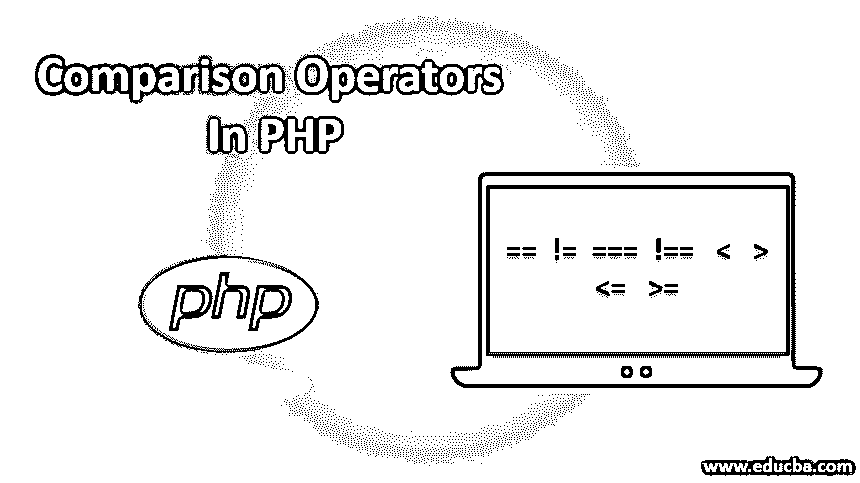
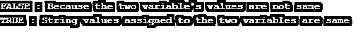
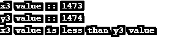
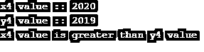
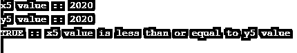
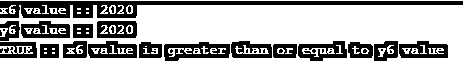

# PHP 中的比较运算符

> 原文：<https://www.educba.com/comparison-operators-in-php/>




## PHP 中的比较运算符简介

PHP 中比较运算符中的 Comparison 一词本身表示运算符一般用于比较任意两个值/变量值(变量值可以是字符串或数字或任何其他要比较的对象)。相等、相同、不相等、不相同、大于、小于、大于或等于、小于或等于是一些比较运算符名称，用于根据我们的要求比较任意两种相似类型的值。

### PHP 中比较运算符的类型

就像其他编程语言一样，PHP 编程语言中也有不同类型的比较运算符。查看下面每个比较运算符的示例。

<small>网页开发、编程语言、软件测试&其他</small>

#### 1.相等比较运算符(==)

仅当第一个<sup>第一个</sup>变量值等于第二个<sup>第二个</sup>变量值时，相等运算符结果才为真。如果第一个变量的值不等于第二个<sup>和第二个</sup>变量的值，那么比较的结果/输出将为假。

##### 例子

这是一个比较两个值(字符串或数字)的程序，这两个值作为值分配给变量。如果这些值相同，则输出 TRUE，否则输出 FALSE。基于该输出，剩余的代码将运行。

**代码:**

```
<?php
//1\. comparing only numerical values/numbers using two variables
$pavan = 2;
$kumar = 5;
if($pavan==$kumar){
echo "TRUE : Because the two variable's values are same \n";
}
else{
echo "FALSE : Because the two variable's values are not same \n";
}
//2\. Program to compare two string values
$a = "pavan";
$b = "pavan";
if($a==$b){
echo "TRUE : String values assigned to the two variables are same \n";
}
else{
echo "FALSE : String values assigned to the two variables are not same \n";
}
?>
```

**输出:**




#### 2.相同的比较运算符(===)

如果两个变量值属于相同的数据类型变量，这个相同的操作符将给出 TRUE 结果，否则结果将是 FALSE。

##### 例子

下面的程序将为 bool(false ),因为 x1，y1 变量中的两个值不属于同一数据类型，所以结果将为 false。

**代码:**

```
<?php
$x1 = 100;
$y1 = "100";
var_dump($x1 === $y1); // will give result as false because types are not at all equal
?>
```

**输出:**


#### 3.不等于比较运算符(！=或<>

如果第一个变量的值与第二个变量的值不同，not Equal 运算符的结果将为真，否则结果将为假。检查下面的例子，让你自己知道。

##### 示例#1

**代码:**

```
<?php
$pavan1 = 1;
$sake1 = 2;
if($pavan1!=$sake1){
echo "TRUE :: variables values are not same as you expected";
}
else{
echo "FALSE :: variables values are same as not you expected";
}
?>
```

**输出:**


##### 实施例 2

**代码:**

```
<?php
$pavan1 = 1;
$sake1 = 2;
if($pavan1<>$sake1){
echo "TRUE :: variables values are not same as you expected .";
}
else{
echo "FALSE :: variables values are same as not you expected";
}
?>
```

**输出:**


#### 4.不相同的比较运算符(！==)

只有当两个变量的值不属于相同的数据类型时，不相同的运算符才会产生真结果，否则，如果变量值的数据类型相同，不相同的运算符会产生假结果。

##### 例子

下面的程序演示了不同的比较运算符是如何操作的。

**代码:**

```
<?php
$x2 = 100;
$y2 = "100";
var_dump($x2 !== $y2); // returns/provide result as true because types are not at all equal
?>
```

**输出:**


#### 5.小于比较运算符(

小于运算符用于检查第 1 个<sup>第</sup>变量值是否小于第 2 个<sup>第</sup>变量值或第 2 个<sup>第</sup>变量值是否小于第 1 个<sup>第</sup>变量值。

##### 例子

下面的程序将提供 IF 条件下的结果/语句，因为 x3 小于 IF 条件下的 y3。

**代码:**

```
<?php
$x3 = 1473;
$y3 = 1474;
if($x3<$y3){
echo "x3 value :: $x3 \n";
echo "y3 value :: $y3 \n";
echo "x3 value is less than y3 value \n";
}
else{
echo "x3 value is less than y3 value";
}
?>
```

**输出:**




#### 6.大于比较运算符(>)

大于运算符用于检查第一个<sup>第一个</sup>变量值是否大于第二个<sup>第二个</sup>变量值或者第二个<sup>第二个</sup>变量值是否大于第一个<sup>第一个</sup>变量值。在从简单到复杂的许多程序中执行某些操作时，这些比较运算符非常有用。

##### 例子

下面这个大于运算符的程序是为了实现并检查哪些变量值大于另一个变量值。

**代码:**

```
<?php
$x4 = 2020;
$y4 = 2019;
echo "x4 value :: $x4 \n";
echo "y4 value :: $y4 \n";
if($x4>$y4){
echo "x4 value is greater than y4 value \n";
}
else{
echo "y4 value is less than x4 value";
}
?>
```

**输出:**




#### 7.小于或等于比较运算符(< =)

小于或等于运算符将有助于检查第一个<sup>第一个</sup>变量值是否小于或等于第二个<sup>和</sup>变量值。它将检查并延长其程序以进一步进行。

##### 例子

**代码:**

```
<?php
$x5 = 2020;
$y5 = 2020;
echo "x5 value :: $x5 \n";
echo "y5 value :: $y5 \n";
if($x5<=$y5){
echo "TRUE :: x5 value is less than or equal to y5 value \n";
}
else{
echo "FALSE :: y5 value is less than x5 value";
}
?>
```

**输出:**




#### 8.大于或等于比较运算符(> =)

大于或等于运算符有助于检查哪个数字/变量的值大于或等于哪个数字/其他变量的值。它还需要两个变量值。

##### 例子

X6 变量的值可以大于或等于 y6 变量的值。即使 x6、y6 变量值相同，它也只会执行 IF 条件中的语句。

**代码:**

```
<?php
$x6 = 2020;
$y6 = 2020;
echo "x6 value :: $x6 \n";
echo "y6 value :: $y6 \n";
if($x6>=$y6){
echo "TRUE :: x6 value is greater than or equal to y6 value \n";
}
else{
echo "FALSE :: y6 value is less than x6 value";
}
?>
```

**输出:**




### 推荐文章

这是 PHP 中比较运算符的指南。这里我们讨论比较操作符的介绍和类型，以及不同的例子和代码实现。您也可以看看以下文章，了解更多信息–

1.  [基本 PHP 命令](https://www.educba.com/php-commands/)
2.  [PHP 中的日历](https://www.educba.com/calendar-in-php/)
3.  [PHP include_once](https://www.educba.com/php-include_once/)
4.  [PHP 数组搜索](https://www.educba.com/php-array-search/)


