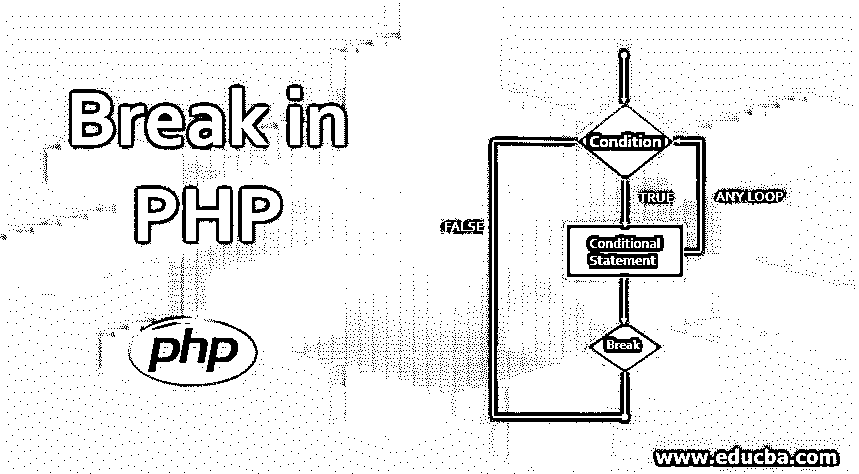
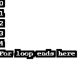
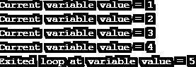
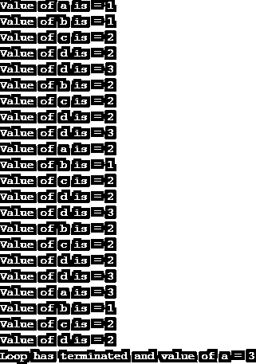

# PHP 中断

> 原文：<https://www.educba.com/break-in-php/>




## PHP 中 Break 语句介绍

PHP break 语句用于即时退出循环，而不必等待返回条件语句，如 for 循环、while 循环、do-while、switch 和 for-each 循环。如果存在多个循环并且使用了 break 语句，那么它只从第一个内部循环中退出。Break 出现在语句块中，它给予用户在需要时跳出循环的充分自由。

**语法**:

<small>网页开发、编程语言、软件测试&其他</small>

```
<?php
//variable declarations
//conditional statement block
{
break;
}
?>
```

**流程图**:


如上所示，一旦满足循环条件，代码首先进入条件语句块，并继续执行循环中的语句，直到不满足条件。当在代码中写入 break 语句时，程序一遇到它，代码就从当前循环中退出，而不管条件是否满足，如图所示。

### PHP 中断的例子

让我们通过在各种场景中为每个条件语句取几个例子并检查其行为来理解 break 语句的工作原理。

#### 示例#1

“for”循环中的 Break 语句。

**代码:**

```
<?php
$var = 1;
for ($var = 0;$var <= 10;$var++)
{
if ($var==5)
{
break;
}
echo $var;
echo "\n";
}
echo "For loop ends here" ;
?>
```

**输出:**




这里，我们通过将 1 初始化为变量“var ”,在 for 循环中打印从 1 到 10 的数字。“var”从 1 开始打印增量数字，直到遇到 if 循环条件。这里我们提到，一旦变量的值达到 5，它就应该退出循环。这是使用 break 语句完成的，如下所示。我们可以在输出中看到相同的内容，因为一旦执行了 break 语句，即使不满足 for 循环条件，它也会从 For 循环中出来。因此，break 语句来自所有其他迭代的整个逻辑。

#### 实施例 2

此示例用于检查 while 循环中 break 语句的功能。

**代码:**

```
<?php
$var = 0;
while( $var < 10) {
$var++;
if( $var == 5 )break;
echo ("Current variable value = $var");
echo "\n";
}
echo ("Exited loop at variable value = $var" );
?>
```

**输出:**




在上面的程序中，变量“var”首先被初始化为 0，并使用 while 循环，我们将它的值递增 1 并打印出来。我们正在编写一个 if 条件，其中一旦变量值等于 5，我们就使用 break 语句让代码退出。即使不满足将变量递增到值 10 的指定条件，这种中断也会使其退出当前的 while 循环。我们正在显示循环中断时的变量值。

#### 实施例 3

这里我们在 foreach 循环中实现 break 语句。

**代码:**

```
<?php
$array = array('A', 'B', 'C', 'D', 'E', 'F');
foreach ($array as $let) {
if ($let == 'E') {
break;
}
echo "$let \n";
}
```

**输出:**


在这个程序中，我们首先声明一个包含字母集合的数组。然后通过[使用 foreach 循环](https://www.educba.com/foreach-loop-in-php/)，我们一个接一个地打印数组的所有元素。一个 if 条件语句，用于在数组指针的值到达字母“E”时中断循环。因此，在遇到 break 语句时，代码退出，而不打印数组中的下一个字母，即“F”。

#### 实施例 4

break 最常见的应用是在 switch 语句中，如下所示。

**代码:**

```
<?php
$a=1;
switch ($a) {
case 0:
echo "a equals 0";
break;
case 1:
echo "a equals 1";
break;
case 2:
echo "a equals 2";
break;
}
?>
```

**输出:**


这是一个简单的 switch 语句的例子，我们首先将变量值初始化为 1。然后通过使用开关条件，我们检查变量值并在条件匹配时打印出来。

#### 实施例 5

这里让我们看看当有两个或多个循环(条件语句)时，break 语句是如何工作的。

**代码:**

```
<?php
// PHP program to verify break of inner loop
// Declaration of 2 arrays as below
$array1 = array( 'One', 'Two', 'Three' );
$array2 = array( 'Three', 'One', 'Two', 'Four' );
// Outer foreach loop
foreach ($array1 as $a1) {
echo "$a1 ";
// Inner nested foreach loop
foreach ($array2 as $a2) {
if ($a1 != $a2 )
echo "$a2 ";
else
break 2;
}
echo "\n";
}
echo "\n Loop Terminated";
?>
```

**输出:**


这里我们使用了两个嵌套的 foreach 循环，并展示了一个使用“break 2”的例子，它从两个循环中跳出，而“break”语句只从内部循环中跳出。

我们已经声明了两个数组 array1 和 array2，我们将为 array1 的每个值显示 array2 的值，直到 array1 的值不等于 array2。一旦 array1 中的值与 array2 中的值相同，我们就通过使用 break 2 语句来中断这两个循环，break 2 语句可以防止代码执行更多的语句。

#### 实施例 6

这里我们将看到如何使用 break 语句来产生“n”个循环(条件语句)。

**代码:**

```
<?php
## Outermost first for loop
for($a=1;$a<5;$a++){
echo ("Value of a is = $a");
echo "\n";
## Second for loop
for($b=1;$b<3;$b++){
echo ("Value of b is = $b");
echo "\n";
## Third for loop
for($c=2;$c<3;$c++){
echo ("Value of c is = $c");
echo "\n";
## Fourth for loop
for($d=2;$d<4;$d++){
echo ("Value of d is = $d");
echo "\n";
if( $a == 3 ){
break 4;
}
}
}
}
}
echo 'Loop has terminated and value of a = '.$a;
?>
```

**输出:**




break 语句后跟需要退出的循环数，用于终止“n”个循环。

**语法**:

```
break n;
```

其中 n 是需要从循环中退出的循环数。

为此，我们使用了 4 个嵌套的 for 循环。变量 a，b，c，d 分别为每个 for 循环初始化，我们将它们的值递增 1。输出中显示了相同的值，以便更好地理解其流程。最后，我们给出了一个条件，如果第一个变量的值变成等于 3，那么所有的 4 个循环都将中断，而第一个变量的值最终等于 3，并且可以显示在输出中。我们将输出循环已经在末尾终止，以及一个值来记录断点的功能。

### 结论

当我们在代码中使用一个或多个条件语句，并且需要在某一点退出时，我们可以使用 break 语句。基本上，当我们给定的条件为真时，它有助于从代码中终止。我们还可以传递一个整数和 break 来终止任意数量的现有循环，而不是一次又一次地声明 break。

### 推荐文章

这是一个 PHP 中断指南。在这里，我们讨论了 PHP 中使用不同条件的 break 及其实现的介绍和前 6 个例子。你也可以看看下面的文章来了解更多-

1.  [PHP 过滤器](https://www.educba.com/php-filters/)
2.  [PHP 文件处理](https://www.educba.com/php-file-handling/)
3.  [PHP 中的多维数组](https://www.educba.com/multidimensional-array-in-php/)
4.  [PHP 中的随机数生成器](https://www.educba.com/random-number-generator-in-php/)


