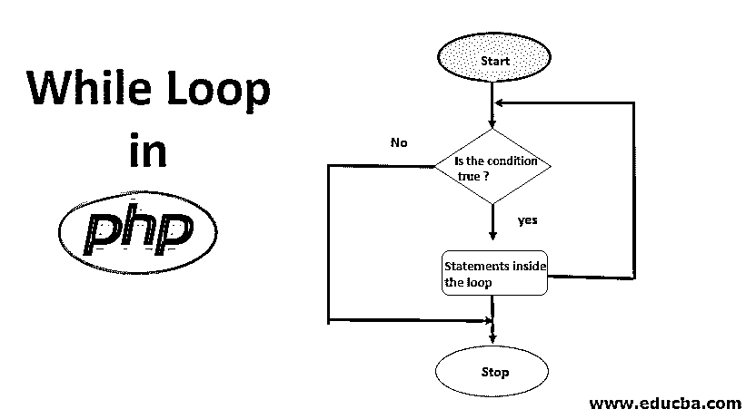
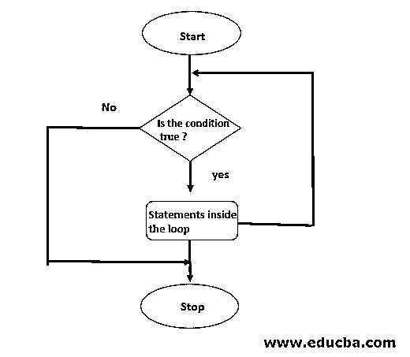

# PHP 中 While 循环

> 原文：<https://www.educba.com/while-loop-in-php/>




## PHP 中的 While 循环介绍

众所周知，PHP 是 web 开发中使用最广泛的语言之一。在深入研究高级概念之前，理解基本概念在任何编程语言中都是非常重要的。循环是编写任何一段代码时最常用的方法之一，因为它们的主要目的是根据程序员的特定要求重复执行同一段代码。PHP 中 while 循环内的代码/语句会一直执行，直到程序员的条件保持为“真”。与“for”循环不同，while 循环不需要指定确切的迭代次数。

下面提到的是 PHP 中 while 循环的语法:

<small>网页开发、编程语言、软件测试&其他</small>

**语法:**

```
while (condition to be true)
{
..
..
// Set of Statements to be executed
..
..
..
}
```

一旦循环的条件被评估为 false，while 循环中的语句将不会执行。

**流程图:**

下面给出的是表示 while 循环如何执行其动作的过程的基本流程图。




### PHP 中 While 循环是如何工作的？

如上所述，while 循环一直工作到满足指定的条件。下面的步骤解释了 PHP 中 while 循环的工作原理:

1.  首先，检查 while 关键字后括号内给出的条件。
2.  如果条件得到满足或为真，则控制被移动到循环内部。
3.  执行循环内的语句。
4.  一旦执行完循环中的所有语句，将再次检查条件，如果为真，则继续执行。
5.  当条件被评估为假时，控制将不在循环内移动，并且 while 循环终止。

### PHP 中 While 循环的例子

下面是 PHP 中 while 循环的不同例子:

#### 示例# 1–根据特定条件打印字段的值。

**代码:**

```
<!DOCTYPE html>
<html>
<head>
<title>PHP while Loop Example 1</title>
</head>
<body>
<?PHP
$value = 10;
while ((int)$value > 5) {
echo "The value of the field is : $value <br>";
$value--;
}
?>
</body>
</html>
```

**输出:****T3】**

字段的值是 10
字段的值是 9
字段的值是 8
字段的值是 7
字段的值是 6

**解释**

在上面的程序中，名为“value”的变量被赋值为 10。现在[while 循环条件](https://www.educba.com/powershell-while-loop/)被检查，即 10 > 5，为真，因此循环内的语句将被执行。变量“value”的值减 1，并用 while 条件再次检查。while 循环中语句的执行将继续，直到变量的值变为 6。一旦值变为 5 且条件评估为假(5 > 5)，while 循环终止，while 循环内的 echo 语句将不执行。

#### 例 2–打印一个给定数字的数字总和。

**代码:**

```
<!DOCTYPE html>
<html>
<head>
<title>PHP while Loop Example 2</title>
</head>
<body>
<?PHP
$number = 107;
$sum=0; $rem=0;
while((int)$number != 0)
{
$rem=$number%10;
$sum = $sum + $rem;
$number=$number/10;
}
echo "The Sum of digits of number given 107 is $sum";
?>
</body>
</html>
```

**输出:****T3】**

给出的数字 107 的位数之和是 8

**解释**

在上面的例子中，计算了数字“107”的位数之和，即 1+0+7。首先是 while 循环的条件，即 107！= 0，则检查。当条件评估为真时，控制将移动到循环内部，余数(rem)被计算(107%10)，即 7，并被添加到 sum 变量，其变为 0+7 =7。数字现在变成了 107/10 = 10。再次对照 while 条件检查数字 10，该条件被设置为真，并且控件将再次在循环内移动。Rem 变量现在是 10%10 =0，总和变成 7+ 0 = 7。number 变量现在变成了 10/10 =1，它也不等于 0，并且移到了 while 循环内部，所以 rem 变量变成了 1%10 =1。总和=7+1 =8。数字变量变成 1/10 =0。现在，while 条件被评估为 false，因此光标不会在 while 循环内移动，sum 最终值变为 8，并显示在屏幕上。

#### 例 3–生成并打印 6 号表格。

**代码:**

```
<!DOCTYPE html>
<html>
<head>
<title>PHP while Loop Example 2</title>
</head>
<body>
<?PHP
$table_number= 6;
$mult =1;
while((int)$mult<=10)
{
echo "$table_number * $mult <br>";
$mult++;
}
?>
</body>
</html>
```

**输出:**

6
12
18
24
30
36
42
48
54
60

**解释**

在上面的程序中，打印了变量“table_number”的表格。一般来说，需要打印的表格中的数字保持不变，即本例中的 6，而倍数从 1 到 10 一直递增。第一次，当' mult '变量的值为 1 时，那么 while 循环的条件，即 1<=10，设置为真，光标将在循环内移动，屏幕上打印出 6 * 1= 6 的值。“mult”变量的值增加 1，即现在 mult =2。再次检查 while 循环条件，即 2 <=10，并打印乘法表 6，直到“mult”变量小于等于 10。一旦' mult '变量的值变为 11，光标将不会在循环内移动，循环的执行将终止。

### 结论

上面的解释清楚地描述了 while 循环的语法及其在程序中的工作。虽然 PHP 中使用了 4 种类型的循环[，并且每种循环都在特定的情况下使用。程序员主要在迭代不固定的时候使用循环，我们需要执行语句集，直到主条件求值完毕。在使用循环之前，理解它们的工作原理是很重要的，因为对它们一知半解有时会导致意想不到的结果。](https://www.educba.com/what-is-php/)

### 推荐文章

这是 PHP 中 while 循环的指南。在这里，我们讨论了 PHP 中 while 循环的工作原理、语法、流程图，以及不同的例子和代码实现。你也可以看看下面的文章来了解更多-

1.  [什么是 PHP？](https://www.educba.com/what-is-php/)
2.  [PHP 编译器](https://www.educba.com/php-compiler/)
3.  [PHP 中的回文](https://www.educba.com/palindrome-in-php/)
4.  [PHP 命令](https://www.educba.com/php-commands/)


