# PHP 中的数组

> 原文：<https://www.educba.com/arrays-in-php/>

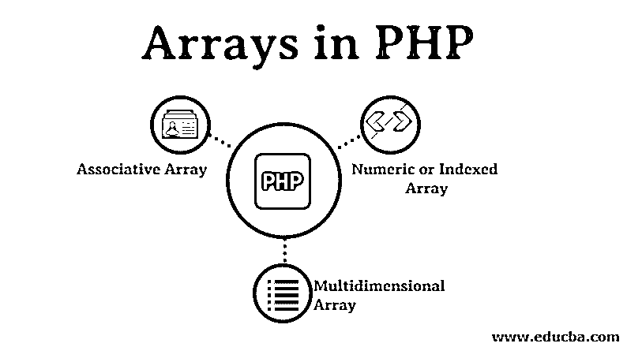

## PHP 中数组的介绍

下面这篇文章“PHP 中的数组”为您提供了在 PHP 中创建数组的概要。数组是相似数据类型的集合。数组在单个变量中存储多个值。当存储一个值也可以通过变量来完成时，为什么还需要一个数组呢？答案是因为存储有限数据的值，比如计数 5 是可能的，但当计数增加到 100 或 200 时，我们需要在 100 个变量中存储 100 个值，这有点困难；因此，我们将它存储在一个数组中。这就是使用数组的原因。

### 如何在 PHP 中创建数组？

**语法:**
`variablename = array();`
或
`variablename[i] = value;,`

<small>网页开发、编程语言、软件测试&其他</small>

其中，变量名是变量的名称，I 是键，或者索引值是元素值。

**创建数组的例子**

`$colors = array(“Red”,”Green”,”Blue”);`
要计算数组的长度，我们使用 count 关键字。
`$length = count($colors); // output is 3`

数组中的每个值都被称为数组的一个元素。数组索引从 0 开始。数组中最后一个元素的索引是数组总长度减 1。

在上面给出的例子中，红色的指数是 0，绿色的指数是 1，蓝色的指数是 2。因此，在索引或键的帮助下，访问数组变得更加容易。为了得到数组中每个索引的值，我们遍历给定的数组。为了循环数组，我们使用 foreach 循环或 for 循环。

### PHP 中的数组是如何工作的？

像 for each 和 for 这样的循环用于遍历数组。每个数组都有从 0 开始的索引，依此类推:

#### PHP 中数组的类型

PHP 中有 3 种类型的数组，让我们详细了解每种类型的数组:

1.  [数字或索引数组](https://www.educba.com/indexed-array-in-php/)。
2.  [关联数组](https://www.educba.com/associative-array-in-java/)。
3.  [多维数组](https://www.educba.com/multidimensional-array-in-python/)。

#### 1.数字数组

在这种类型的数组中，索引总是一个数字，它不能是一个字符串。相反，它可以存储任意数量的元素和任意类型的元素。

**语法:**
`variable name = array(“value1”,”value2”,”value3”,”value4”)`

**代码:**

`<?php
//Example to demonstrate numeric array
$input = array("Apple", "Orange", "Banana", "Kiwi");
//Here, to get these values we will write like
echo $input[0] . "\n"; // will give Apple
echo $input[1] . "\n"; // will give Orange
echo $input[2] . "\n"; // will give Banana
echo $input[3] . "\n"; // will give Kiwi
// To get the length of array we will use count
echo "The count of the array is " . count($input); // will give 4
echo "\n";
//To print the array we can use
print_r($input);
?>`

**输出:**

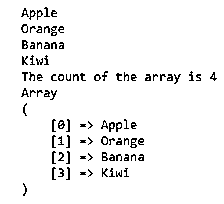

运筹学

声明数值数组的另一种方法是按照下面的程序。在这个程序中，我们还将看到修改和打印值。

**代码:**

`<?php
//Example to demonstrate numeric array in another way
$input[0] = "Apple";
$input[1] = "Orange";
$input[2] = "Banana";
$input[3] = "Kiwi";
// To get Kiwi we will write like
echo $input[3]." "; // will give Kiwi
//To modify Orange value
$input[1] = "Mango";
// Now echo $input[1] will give Mango
echo $input[1]." "; // Mango
//To print the array we can use
print_r($input);
?>`

**输出:**

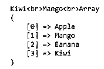

现在我们将学习如何使用 for 循环遍历数组

**代码:**

`<?php
//Example to demonstrate for loop on a numeric array
//declaring the array
$input = array("Apple", "Orange", "Banana", "Kiwi", "Mango");
//the for loop to traverse through the input array
for($i=0;$i<count($input); $i++) {
echo $input[$i];
echo " ";
}
?>`

**输出:**

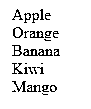

#### 2.关联数组

这个[数组是键-值对的](https://www.educba.com/associative-array-in-php/)形式，其中键是数组的索引，值是数组的元素。

**语法:**

`$input = array(“key1”=>”value1”,
“key2”=>”value2”,
“key3”=>”value3”,
“key4”=>”value4”);`

运筹学

另一种不用 array 关键字声明关联数组的方法是

`$input[$key1] = $value1;
$input[$key2] = $value2;
$input[$key3] = $value3;
$input[$key4] = $value4;`

**代码:**

`?php
//Example to demonstrate associative array
//declaring an array
$input = array(
"Jan"=>31,
"Feb"=>28,
"Mar"=>31,
"Apr"=>30);
// the for loop to traverse through the input array
foreach($input as $in) {
echo $in." ";}
?>`

**输出:**

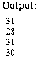

#### 3.多维数组

这个[数组是数组](https://www.educba.com/multidimensional-array-in-php/)的数组，其中数组的值包含一个数组。

**语法:**

`$input =array(
array(‘value1’, ‘value2’, ‘value3’),
array(‘value4’, ‘value5’, ‘value6’),
array(‘value7’, ‘value8’, ‘value9’));,`

**代码:**

`<?php
//Example to demonstrate multidimensional array
// declaring a multidimensional array
$input = array ("colors"=>array ("Red", "Green", "Blue"),
"fruits"=>array ("Apple", "Orange", "Grapes"),
"cars"=>array ("Skoda", "BMW", "Mercedes")
);
//the foreach loop to traverse through the input array
foreach($input as $key=>$value) {
echo $key .'--'. " ";
foreach($value as $k=>$v)
{echo $v ." ";}
echo " ";
}
?>`

**输出:**

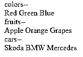

运筹学

#### 关联数组中的多维数组

**代码:**

`<?php
//Example to demonstrate multidimensional array
// declaring a multidimensional array
$input = array(
"The_Alchemist" => array (
"author" => "Paulo Coelho",
"type" => "Fiction",
"published_year" => 1988),
"Managing_Oneself" => array(
"author" => "Peter Drucker",
"type" => "Non-fiction",
"published_year" => 1999
),"Measuring_the_World" => array(
"author" => "Daniel Kehlmann",
"type" => "Fiction",
"published_year" => 2005
));
//the foreach loop to traverse through the input array
//foreach to loop the outer array
foreach($input as $book) {
echo " ";
// foreach to loop the inner array
foreach($book as $key=>$value)
{
echo $key." ". $value. " ";}
}?>`

**输出:**

### PHP 中的数组方法

下面是 PHP 中的数组方法:

#### 1.Count()方法

此方法用于计算数组中元素的数量。

**语法:** `Count(array, mode) where the count is required mode is optional.`

**代码:**

`<?php
//Example to demonstrate use of in_array method
//declaring associative array
$input=array('English','Hindi','Marathi');
//counting the number of elements in the given array
echo count($input);
?>`

**输出:**

Three

#### 2.数组 _ 行走()方法

该方法采用两个参数作为输入；第一个参数是输入数组，第二个参数是声明的函数名。此方法用于循环访问数组中的每个元素。

**语法:**
`array_walk(array, function_name, parameter...)
where array is required, function_name is required
parameter is optional`

**代码:**

`<?php
//Example to demonstrate use of array_walk method
//creating a function to print the key and values of the given array
function fun($val, $k) {
echo $k. " --" .$val ."\n";
}
// declaring associative array
$input=array("e"=>'English', "h"=>'Hindi', "m"=>'Marathi');
//passing this array as a first parameter to the function
// array_walk,
//second paramter as the name of the function being called
array_walk($input,"fun");
?>`

**输出:**

e–英语 h–印地语 m–马拉地语

#### 3.In_array()方法

无论给定数组是否包含特定值，此方法都会对数组执行搜索。如果找到或没有找到，它将执行各自的 If，else 块

**语法:**
`in_array(search_value, array_name)
Where both the parameters are required`

**代号:**
`<?php
//Example to demonstrate use of in_array method
// declaring associative array
$input=array('English','Hindi','Marathi', "Maths", "Social Science");
// using in_array to find Maths in given array
if(in_array("Maths", $input)) {
echo "Found Maths in the given array";
}
else
{
echo "Did not find Maths in the given array";
}
?>`

**输出:**

在给定的数组中找到数学

#### 4.数组 pop()方法

此方法从给定数组中移除最后一个元素。

**语法** `array_pop(array_name)`

**代码:**

`<?php
//Example to demonstrate use of array_pop method
// declaring array
$input=array('English','Hindi','Marathi');
// before using array_pop on the given array
print_r($input);
// after using array_pop method on the given array
array_pop($input);
echo "\n ";
print_r($input);
?>`

**输出:**

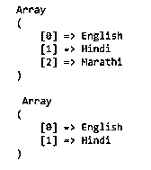

#### 5.数组 _push()方法

此方法在数组末尾添加给定的元素。

**语法:**

`array_push(array_name, value1, value2, ...)`

**代号:**
`<?php
//Example to demonstrate use of array_push method
// declaring array
$input=array('English','Hindi','Marathi');
// before using array_push on the given array
print_r($input);
// after using array_push method on the given array
array_push($input, "Economics", "Maths", "Social Science");
echo "\n";
//printing the array
print_r($input);
?>`

**输出:**

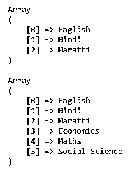

#### 6.数组移位()方法

此方法移除并返回数组的第一个元素。

**语法:** `array_shift(array_name)`

**代码:**

`<?php
//Example to demonstrate use of array_push method
// declaring array
$input=array('English','Hindi','Marathi');
// before using array_shift on the given array
print_r($input);
echo "\n";
// after using array_shift method on the given array
echo array_shift($input);
?>`

**输出:**

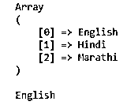

#### 7.Array_unshift()方法

此方法将给定的元素插入到数组的开头。

**语法:**

`array_unshift(array_name, value1, value2,…)`

**代码:**

`<?php
//Example to demonstrate use of array_push method
// declaring array
$input=array('English','Hindi','Marathi');
// before using array_unshift on the given arrayprint_r($input);
echo "\n";
// after using array_unshift method on the given array
array_unshift($input, "Economics");
print_r($input);
?>`

**输出:**

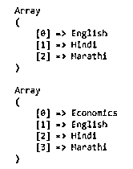

#### 8.数组反转()方法

此方法用于反转数组的元素。

**语法:**
`array_reverse(array_name, preserve)
where array_name is required ,
preserve is optional`

**代号:**
`<?php
//Example to demonstrate use of in_array method
// declaring associative array
$input=array("e"=>'English',"h"=>'Hindi',"m"=>'Marathi');
// array before reversing the elements
print_r($input);
echo "\n";
// printing the reverse
// array after reversing the elements
print_r(array_reverse($input));
?>`

**输出:**

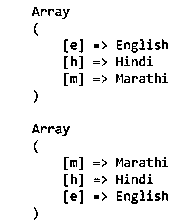

### 结论

本文涵盖了 PHP 中主题数组的所有层次的概念，简单的和复杂的。我希望你发现这篇文章对学习来说是有趣的和有意义的。

### 推荐文章

这是 PHP 中数组的指南。这里我们讨论 PHP 中数组的基本概念、方法和类型，以及各种例子和代码实现。你也可以浏览我们推荐的其他文章来了解更多信息-

1.  [什么是 PHP？](https://www.educba.com/what-is-php/)
2.  [PHP 的优势](https://www.educba.com/advantages-of-php/)
3.  [PHP 简介](https://www.educba.com/introduction-to-php/)
4.  [PHP 中的多维数组](https://www.educba.com/multidimensional-array-in-php/)

