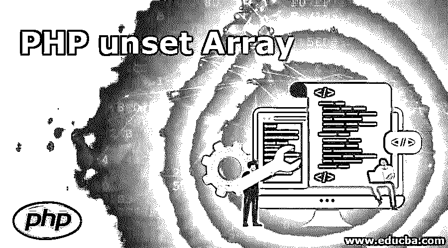
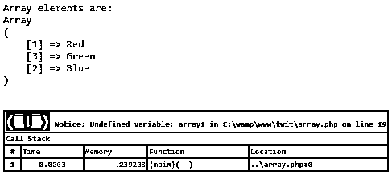
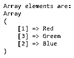
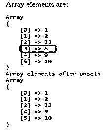
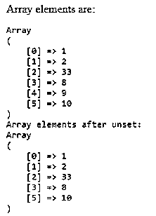

# PHP 未设置数组

> 原文：<https://www.educba.com/php-unset-array/>

## PHP 未设置数组函数介绍

在 PHP 编程语言中，设置数组值和取消设置是很常见的。取消设置数组意味着删除数组中的元素。我们可以取消数组中特定位置或整个数组的值。在 PHP 语言中，我们有多种方法可以做到这一点。我们可以通过使用我们自己的自定义代码或者使用 PHP 内置函数本身来实现这一点。在处理未设置的数组时，我们应该在打印数组之前检查存在的元素数组。这样做，我们会更安全，因为我们不会看到任何消息或 PHP 警告通知。

**语法:**

<small>网页开发、编程语言、软件测试&其他</small>

`unset ($array1)`

这将删除数组$array1 的所有元素。

`unset($array1[position]);`

这将按位置删除数组$array1 的元素。位置是数组索引总是从 0 开始。

### PHP unset 数组如何工作？

为了让这个未设置的数组起作用，我们需要一个数组，里面有一些值。比方说，我们有一个名为$array1 的数组，其中包含一些值。现在我们需要将这个数组清空，我们可以通过使用 PHP unset()函数来完成。我们还可以通过使用 PHP 的 unset 特性来删除数组元素。

我们可以做下面提到的 PHP 不设置数组的功能:

*   取消设置数组。
*   取消设置数组元素及其索引。
*   通过数组的值来取消数组的设置——这不能直接实现。在搜索了该元素的正确索引后，unset 索引也可以完成这项工作。

### PHP 未设置数组的实现示例

下面是 PHP 未设置数组的例子:

#### 示例#1

在这个例子中，我们将使用一些值声明一个数组，并使用 print_r 函数打印这些数组元素。在此之后，我们将取消设置该数组，并尝试打印以查看代码的行为。

**代码:**

`<!DOCTYPE html>
<html lang="en">
<head>
<title>Array unset in PHP</title>
<meta charset="utf-8">
<meta name="viewport" content="width=device-width, initial-scale=1">
</head>
<body>
<?php
$array1 = array(1 => "Red", 3=>"Green", 2=>"Blue");
echo "<pre>";
echo "Array elements are: ";
print_r($array1);
unset($array1); // unset the complete array.
print_r($array1); // this line give notice as we have unset the $array1 before printing.
?>
</body>
</html>`

**输出:**

警告即将到来，因为我们在 unset 之后没有那个数组引用。因此，在这种情况下，我们不应该在没有检查数组是否存在的情况下打印数组。

#### 实施例 2

在本例中，我们将尝试删除阵列重置后出现的上述通知。检查数组是否存在总是检查数组或打印值的好方法。因此，在这个示例代码中，我们将尝试删除通知消息。

**代码:**

`<?php
$array1 = array(1 => "Red", 3=>"Green", 2=>"Blue");
echo "<pre>";
echo "Array elements are: ";
print_r($array1);
unset($array1); // unset the complete array.
if(isset($array1)){
print_r($array1); // this line give notice as we have unset the $array1 before printing.
}
?>`

**输出:**

是的，我们可以看看(isset($array1)){ }是否能帮我们删除通知消息。

#### 实施例 3

现在让我们不设置数组中的一些元素，而是不设置整个数组。

**代码:**

`<?php
$array1 = array(1, 2, 33, 8, 9, 10);
echo "Array elements are: ";
echo "<pre>";
print_r($array1);
unset($array1[3]); // Unset the element of array that is on 4th index.
echo "Array elements after unset: ";
print_r($array1);
?>`

**输出:**

正如我们所看到的，上面的示例代码将删除索引 3 的值，下一个值已被移动到第 3 个，并且对索引 3 之后的其他元素进行相同的移动。

#### 实施例 4

通过值移除数组元素。这可以直接完成，在这个删除过程中，首先，我们必须找出该元素的位置，然后我们可以使用 unset()函数通过将位置作为参数传递来删除该元素。

**代码:**

`<?php
$array1 = array(1, 2, 33, 8, 9, 10);
echo "Array elements are: ";
echo "<pre>";
print_r($array1);
if (($key = array_search(9, $array1)) !== false) { // if key exist
unset($array1[$key]); // unsetting that key
}
echo "Array elements after unset: ";
print_r($array1);
?>`

**输出:**

如我们所见，9 是我们试图从数组中删除的元素。这个过程将从在数组中搜索指定的元素开始，如果找到，那么将为找到的索引执行 unset。这里我们必须再次使用 unset，如果元素在数组中，如果我们不这样做，它会给出一个通知消息，它也可以删除该位置的其他元素。

### 结论

在 PHP 语言中，可以对一个完整的数组或该数组的特定位置执行数组的复位。没有通过数组的值直接删除数组的功能，但是我们可以通过首先找到数组中的元素，然后在该数组位置上执行删除来达到同样的目的。开发人员或编码人员在处理取消设置数组或数组元素时，必须遵循良好的编码实践。我们还应该使用 condition 或 try-catch 块来处理结果区域中不需要的通知。

### 推荐文章

这是一个 PHP 未设置数组的指南。在这里，我们讨论 PHP 未设置数组函数的介绍，以及它是如何工作的，并给出了例子和代码实现。你也可以浏览我们推荐的其他文章来了解更多信息-

1.  [PHP 中的套接字编程](https://www.educba.com/socket-programming-in-php/)
2.  [PHP 框架](https://www.educba.com/php-frameworks/)
3.  [PHP 发布方法](https://www.educba.com/php-post-method/)

