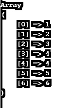
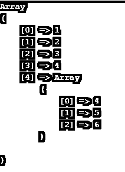
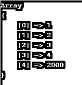
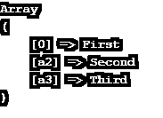
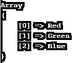

# PHP 附加数组

> 原文：<https://www.educba.com/php-append-array/>

## PHP 追加数组简介

对任何编程语言来说，在现有的基础上增加一些东西都是基本需求之一。PHP 本身有各种内置函数来处理数组追加功能。我们可以添加两个或更多的数组来得到一个新的(所有数组的组合)数组。当我们有两个不同的数组，并希望将它们合并成一个数组以便进一步处理时，数组是很有用的。数组追加可以是将一个新元素推送到一个数组中，将一个数组添加到另一个数组中，将两个或更多数组合并在一起，等等。在 array_merge()函数中，在对所有数组进行组合后，返回一个新的数组，这个数组在 array_merge()参数中传递。

### PHP 附加数组的语法

下面是 PHP 数组追加及其语法的列表:

<small>网页开发、编程语言、软件测试&其他</small>

**语法#1:**

`array_merge($array1, $array2);`

*   描述–array _ merge()是一个 PHP 语言内置函数。$array1 和$array2 是我们希望合并的两个数组。它将两个单独的数组合并成一个数组。

**语法#2:**

`array_push($array1, $array2);`

*   描述——同样，array_push()是 PHP 语言的内置函数。$array1 和$array2 是我们希望合并的两个数组。在这个过程中，下一个数组将出现在第一个位置的下一个位置。例如，如果$array1 有 5 个元素，在这种情况下，完整的$array2 将放在第 6 个位置。

**语法#3:**

`array_push($array1, $val);`

*   描述–array _ merge()也可以用来将元素添加到数组中。$array1 是一个数组，表示$val 是否是我们要添加到$array1 中的值。在此过程中，$val 将作为正常值添加到$array1 的下一个位置。
*   单个关联数组的元素可以使用数组合并来执行。这个键值对数组将被转换成单个数组。还有各种其他方法可以执行 array_merge()功能。

**语法#4:**

`array_combine($array1, $array2)`

array_combine()可以用来将两个单独的数组合并成 associate 数组(成键值 pared 数组)。

### 它是如何工作的？

为了实现这个数组合并特性，我们需要两个数组。假设$array1 和$array2。我们可以把这两个合并成数组，形成一个数组。这可以通过使用 PHP 内置函数编写我们自己的定制代码来实现。根据我们的业务需求，PHP 本身有多种方式可以实现这一点。另一方面，元素也可以添加到数组中。

### PHP 附加数组的例子

下面是一些例子:

#### 示例# 1–将两个数组合并成一个数组

在这个例子中，我们将有两个数组，我们将尝试使用 PHP array_merge()函数来合并这个数组。

**代码:**

`<?php
$array1 = array(1, 2, 3, 4);
$array2 = array(4,5, 6);
$arr_merge = array_merge($array1, $array2);
print_r($arr_merge);
?>`

**输出:**

#### 示例 2–使用 array_push 合并两个数组

使用 array_push()函数，将第二个合并到第一个中。在这个函数中，第二个数组将被添加到第一个数组的下一个位置。完整的数组将被放置在下一个位置。

**代码:**

`<?php
$array1 = array(1, 2, 3, 4);
$array2 = array(4,5, 6);
array_push($array1, $array2);
print_r($array1);
?>`

**输出:**

我们可以看到，在第 4 个位置，整个阵列已经放置。

#### 示例# 3–将单个元素添加到数组中

**代码:**

`<?php
$array1 = array(1, 2, 3, 4);
array_push($array1, 2000);
print_r($array1);
?>`

**输出:**

正如我们在示例中看到的，如果我们添加一个元素，它将作为一个普通值添加到数组的下一个位置。

#### 示例# 4–通过运行循环来感受阵列

**代码:**

`<?php
$testing = array();
for ($i=1; $i < 11 ; $i++) {
array_push($testing,$i);
}
print_r($testing);
?>`

**输出:**

#### 例 5——在 PHP 中合并关联数组

**代码:**

`<?php
$array1 = array("1" => "First");
$array2 = array("a2" => "Second", "a3" => "Third");
$result = array_merge($array1, $array2);
print_r($result);
?>`

**输出:**

正如我们在这个例子中看到的，如果我们有数字键，它将从它的传统位置开始。对于其余的，它将被添加到键值中。

#### 例 6——在 PHP 中合并一个关联数组

**代码:**

`<?php
$array1 = array(1 => "Red", 3=>"Green", 2=>"Blue");
$result = array_merge($array1);
print_r($result);
?>`

**输出:**

### 推荐文章

这是一个 PHP 附加数组的指南。在这里，我们还讨论了 php append array 的介绍和工作原理，以及不同的例子和代码实现。您也可以看看以下文章，了解更多信息–

1.  [PHP chop()](https://www.educba.com/php-chop/)
2.  [PHP strip_tags()](https://www.educba.com/php-strip_tags/)
3.  [PHP bin2hex()](https://www.educba.com/php-bin2hex/)
4.  [PHP MD5()](https://www.educba.com/php-md5/)

