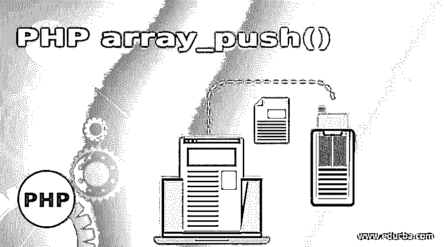
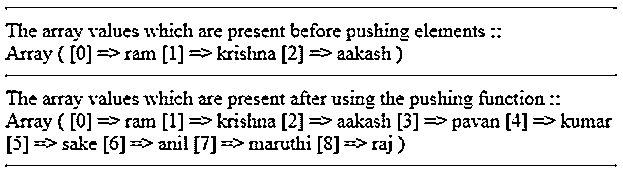
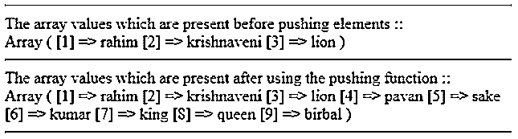
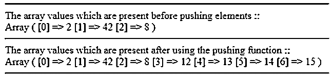

# PHP array_push()

> 原文：<https://www.educba.com/php-array_push/>

## PHP array_push()的定义

PHP 编程语言的 array_push()函数实际上是一个内置函数，它可以根据我们的需求将新的元素放入特定的数组中。我们可以根据需要将一个或多个元素放入特定的数组中，这些数组元素将被插入到最后的节/索引值位置。由于 array_push()函数的使用，特定数组的长度将根据推入特定数组的元素数量而增加/递增。

### 语法和参数

PHP array_push()的语法和参数是:

<small>网页开发、编程语言、软件测试&其他</small>

`array_push($array1, $value1, $value2, $value3, …..)`

array_push()函数参数说明:

PHP 编程语言的 array_push()函数中有多个参数可用。array_push()函数的参数数量基本上取决于实际推入特定数组的元素数量。人们可以将这些参数具体分为两类。他们是 1。$array1，2。值列表

*   **$array1 array _ push()函数的参数:**array _ push()函数的$ array 1 参数实际上是实际指定或操作的原始数组。它是包含所有先前定义的数组元素的主数组。
*   **值列表(多值参数):**值列表是 PHP 编程语言的 array_push()函数的多个参数。这个参数是一串元素列表，这些元素实际上是用逗号分隔的，这些分隔的元素将被放入某个特定的数组中。让这些数组为$value1，$value2，$Value3，$Value4 等等。
*   **array_push()函数的返回值:**PHP 编程语言的 array_push()函数只会在 array _ push()函数内部引用的参数值的帮助下，通过添加/推送一些元素来返回修改后的数组。根据我们的要求，这些添加的元素将被放置在数组的最后一个索引值处。

### PHP 中 array_push()函数是如何工作的？

PHP 编程语言的 array_push()函数基本上只是通过将一些元素推入特定的数组来工作。array_push()函数还可以将多个元素推入原始数组，该数组实际上是在 array_push()函数中指定的。在使它工作之后，数组的长度将会增加，这是基于推入数组的元素的数量。如果一个数组有一个键和值对，那么该方法将尝试把数字键添加到被推的值中。PHP 的这个 array_push()函数只能在 PHP 4、PHP 5 和 PHP 7 版本上运行。

#### 示例#1

这是借助原始数组参数和值列表参数说明 array_push()函数的示例。这里首先在 PHP 标签的内部使用了

* * *

标签来表示一条水平线。然后，在 array()函数的帮助下，用一些字符串数组索引值/元素创建一个数组变量，但是这里没有定义 key。然后，原始数组元素将在“print_r()”函数的帮助下打印出来。然后创建一些值变量，并在其中存储一些字符串值。这里创建了六个带值的字符串变量。然后 array_push()函数与原始变量和传递给它的所有六个字符串变量一起使用。这将把所有提到的元素推入特定的数组。然后 print_r($array1)函数将打印包含所有额外元素的数组。

**代码:**

`<?php
// PHP code which helps in illustrating the usage of array_push() function of PHP
// The Input array
echo "
";
$array1 = array("ram", "krishna", "aakash");
echo "The array values which are present before pushing elements :: ";
echo " ";
print_r($array1);
echo "
";
// elements to push
$value1 = "pavan";
$value2 = "kumar";
$value3 = "sake";
$value4 = "anil";
$value5 = "maruthi";
$value6 = "raj";
echo "The array values which are present after using the pushing function :: ";
echo " ";
// This is the array which is after the pushing of some new elements
array_push($array1, $value1, $value2, $value3, $value4, $value5, $value6);
print_r($array1);
echo "
";
?>`

**输出:**

#### 实施例 2

这个例子类似于例子 1，但是不同之处在于在 array()函数内部，声明/提到了键和值参数(提到了 Key_value 对)。除此之外，一切都与示例 1 非常相似。您可以检查下面输出部分提到的程序的输出，以便更好、更容易地理解 array_push()函数。

**代码:**

`<?php
// PHP code which helps in illustrating the usage of array_push() function of PHP
// The Input array
echo "
";
$array2 = array(1=>"rahim", 2=>"krishnaveni", 3=>"lion");
echo "The array values which are present before pushing elements :: ";
echo " ";
print_r($array2);
echo "
";
// elements to push
$valuea1 = "pavan";
$valuea2 = "sake";
$valuea3 = "kumar";
$valuea4 = "king";
$valuea5 = "queen";
$valuea6 = "birbal";
echo "The array values which are present after using the pushing function :: ";
echo " ";
// This is the array which is after the pushing of some new elements
array_push($array2, $valuea1, $valuea2, $valuea3, $valuea4, $valuea5, $valuea6);
print_r($array2);
echo "
";
?>`

**输出:**

#### 实施例 3

这个例子是 array_push()函数的简单说明，但是这里只使用了一些整数值作为数组元素。然后创建四个变量，其中包含一些整数值。然后，在 array_push()函数的帮助下，所有这四个变量值都被推送到原始数组中。除此之外，一切都与实施例 1 和 2 相似。您可以查看下面的输出，以便更好、更容易地理解 array_push()的概念。

**代码:**

`<?php
// PHP code which helps in illustrating the usage of array_push() function of PHP
// The Input array
echo "
";
$array2 = array(2, 42, 8);
echo "The array values which are present before pushing elements :: ";
echo " ";
print_r($array2);
echo "
";
// elements to push
$valuea1 = 12;
$valuea2 = 13;
$valuea3 = 14;
$valuea4 = 15;
echo "The array values which are present after using the pushing function :: ";
echo " ";
// This is the array which is after the pushing of some new elements
array_push($array2, $valuea1, $valuea2, $valuea3, $valuea4);
print_r($array2);
echo "
";
?>`

**输出:**

### 推荐文章

这是 PHP array_push()的指南。在这里，我们还讨论了 array_push()函数的定义以及它在 php 中的工作方式，并给出了例子和代码实现。您也可以看看以下文章，了解更多信息–

1.  [PHP include_once](https://www.educba.com/php-include_once/)
2.  [PHP 数组搜索](https://www.educba.com/php-array-search/)
3.  [PHP 加密](https://www.educba.com/php-encryption/)
4.  [PHP substr_count()](https://www.educba.com/php-substr_count/)

