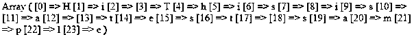
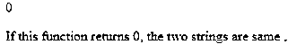
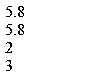
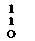
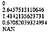
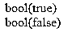
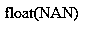
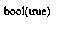

# PHP 中的函数

> 原文：<https://www.educba.com/functions-in-php/>


## PHP 中的函数介绍

在 PHP 中，使用了很多函数[比如内置函数](https://www.educba.com/python-built-in-functions/)和用户自定义函数。每个函数都有自己的功能和属性。函数是程序中编写的一组语句，可以在代码中任何需要的地方多次使用。需要一个函数调用来执行写在函数内部的语句。它是一段代码，将一个或多个输入作为参数，对其进行处理并返回值。程序员只需创建一个函数，然后在程序中需要的地方调用该函数。

### PHP 中的函数类型

在 PHP 中，程序员主要使用两个函数。它们是:

<small>网页开发、编程语言、软件测试&其他</small>

#### 1.用户定义的

当开发人员或程序员必须执行他们自己的代码逻辑时，就会用到这些函数。这些函数是使用关键字 function 定义的，在函数内部，当函数调用发生时，将编写一组语句来执行它。可以通过简单地调用 functionname()这样的函数来进行函数调用，函数将被执行。

#### 2.内置的

这些函数为我们提供了内置的库函数。PHP 在安装包中提供了这些功能，这使得这种语言更加强大和有用。要使用函数的属性，我们只需要在需要的地方调用函数来获取想要的结果。

PHP 中使用了许多内置函数，如日期、数字、字符串等。

*   字符串函数:这些函数在 PHP 中有一个预定义的功能来处理字符串。PHP 有各种字符串函数如 strpos()、strncmp()、strrev()、strlen()，
*   **日期函数**:这些函数是 PHP 中预定义的功能，其格式是 UNIX 日期和时间，这是一种人类可读的格式。
*   **数值函数**:这些函数有自己的预定义逻辑，由 PHP 提供，用于数值运算。它将以布尔形式或数字形式返回结果。一些数字函数包括 is_number()、number_format()、round()等。

### 为什么我们应该在 PHP 中使用函数？

以下几点解释了为什么我们应该在 php 中使用函数:

*   **可重用性**:在任何一种编程语言中，函数都是用来减少需要多次编写的代码行数。这将减少开发人员或程序员的时间和精力。如果一个公共代码必须在多个领域中使用，那么我们可以简单地将它包含在一个函数中，并在需要时随时随地调用它。这可以通过调用同一个程序中的函数或在不同程序中使用的函数来实现。
*   **更容易的错误检测**:由于代码不是批量编写的，而是被分割或划分到函数中，因此如果出现错误，可以很容易地检测出来，并快速轻松地修复错误。
*   **易维护**:由于函数是在程序中使用的，所以如果有任何函数或任何一行代码需要修改，我们可以在函数中很容易地进行修改，修改会被反映出来。因此，在任何地方都很容易维护。

### 函数在 PHP 中是如何使用的？

正如我们之前讨论的，在 PHP 中我们有两个函数，即内置函数和用户自定义函数。让我们进一步了解这些功能:

#### 示例#1

对于字符串函数

**代码:**

```
<!DOCTYPE html>
<html>
<body>
<?php
print_r(str_split("Hi This is a test sample"));
?>
</body>
</html>
```

**输出:**




**对上面程序的解释:**在上面的例子中，我们在函数 str_split()内部传递的字符串将字符串拆分成一个字符并产生输出。

#### 实施例 2

**代码:**

```
<!DOCTYPE html>
<html>
<body>
<?php
echo strcmp("Hi this is test","Hi this is test");
?>
<p>If this function returns 0, the two strings are same.</p>
</body>
</html>
```

**输出:**




**对上面程序的解释:**在上面的例子中，函数 strcmp()将比较字符串，如果字符串相同，它将返回零，如果字符串不相等，它将返回其他数字。

#### 实施例 3

**代码**:

```
<!DOCTYPE html>
<html>
<body>
<?php
echo strpos("I love coding, I love php too!","coding");
?>
</body>
</html>
```

**输出**:


**对上面程序的解释:**这个函数 strpos()将检查作为参数传递的字符串的位置。

#### 实施例 4

**代码:**

```
<!DOCTYPE html>
<html>
<body>
<?php
echo strrev("Hi world!");
?>
</body>
</html>
```

**输出:**


**上面程序的解释:**在上面的例子中，函数 strrev()将反转作为参数传递的字符串，并提供所需的输出。

#### 实施例 5

**代码:**

```
<!DOCTYPE html>
<html>
<body>
<?php
echo str_word_count("Hello this is the new world!");
?>
</body>
</html>
```

**输出:**


**对上面程序的解释:**在上面的例子中，str_word_count()函数将计算作为参数传递的字符串的数量，并提供所需的输出。

#### 实施例 6

**代码:**

```
<!DOCTYPE html>
<html>
<body>
<?php
echo strlen("Hello this is the test sample!");
?>
</body>
</html>
```

**输出:**


**对上面程序的解释:**在上面的例子中，strlen()函数将计算字符串中出现的字符数，并提供计数作为所需的输出。

#### 示例#1

对于数值函数

**代码:**

```
<!DOCTYPE html>
<html>
<body>
<?php
echo(abs(5.8) . "<br>");
echo(abs(-5.8) . "<br>");
echo(abs(-2) . "<br>");
echo(abs(3));
?>
</body>
</html>
```

**输出**:




**对上述程序的解释:**在上面的例子中，数值函数 abs()将为我们提供作为参数传递给该函数的数字的[绝对值。](https://www.educba.com/python-absolute-value/)

#### 实施例 2

**代码:**

```
<!DOCTYPE html>
<html>
<body>
<?php
echo(round(0.65) . "<br>");
echo(round(0.75) . "<br>");
echo(round(0.30) . "<br>");
?>
</body>
</html>
```

**输出:**




#### 实施例 3

**代码**:

```
<!DOCTYPE html>
<html>
<body>
<?php
echo(sqrt(0) . "<br>");
echo(sqrt(7) . "<br>");
echo(sqrt(2) . "<br>");
echo(sqrt(0.45) . "<br>");
echo(sqrt(-3));
?>
</body>
</html>
```

**输出:**




**对上述程序的解释:**在上面的例子中，传递给函数 sqrt()的参数通过计算[数字的平方根](https://www.educba.com/square-root-in-php/)来获取结果，并产生所需的输出。

#### 实施例 4

**代码:**

```
<!DOCTYPE html>
<html>
<body>
<?php
// Check if the type of a variable is integer or not
$x = 456;
var_dump(is_int($x));
echo "<br>";
// Check whether the type of variable is integer or not
$x = 66.58;
var_dump(is_int($x));
?>
</body>
</html>
```

**输出:**




**对上面程序的解释:**在上面的例子中，var_dump()函数将[检查作为参数传递的特定数字的数据类型](https://www.educba.com/hive-data-types/)。在上面的截图中，在数字应该是整数的条件下，输出被打印为 true 或 false。如果数字不是整数，它将返回 false，否则返回 true。

#### 实施例 5

**代码:**

```
<!DOCTYPE html>
<html>
<body>
<?php
// Invalid calculation will return a NaN value
$x = acos(10);
var_dump($x);
?>
</body>
</html>
```

**输出:**




**上面程序的解释:**在上面的例子中，函数 var_dump()会检查作为参数传递的数字的数据类型。在本例中，函数 acos()无法计算作为参数指定的数字，因此产生输出 NAN，这意味着计算不正确。

#### 实施例 6

**代码:**

```
<!DOCTYPE html>
<html>
<body>
<?php
$x = 11.35;
var_dump(is_float($x));
?>
</body>
</html>
```

**输出:**




**对上面程序的解释:**在上面的例子中，函数 is_float()会检查作为参数传递的数字是否为 float 数据类型。这个函数总是返回一个布尔值。如果结果是肯定的，那么它将返回真，如果结果是否定的，它将返回假。

#### 示例#1

对于用户定义的函数

**代码:**

```
<!DOCTYPE html>
<html>
<body>
<?php
function Writefunction() {
echo "Hello world!";
}
Writefunction();
?>
</body>
</html>
```

**输出:**


#### 实施例 2

**代码:**

```
<!DOCTYPE html>
<html>
<body>
<?php
function employee($ename) {
echo "$ename Patil.<br>";
}
employee("Akshay");
employee("Leela");
employee("Sharda");
employee("Subhadra");
employee("Akash");
?>
</body>
</html>
```

**输出:**


#### 实施例 3

**代码:**

```
<!DOCTYPE html>
<html>
<body>
<?php
function Employee($ename, $id) {
echo "employee name is $ename. Employee id is $id <br>";
}
Employee("Heetal","778456");
Employee("Clark","567890");
Employee("Mohit","567894");
?>
</body>
</html>
```

**输出:**


**对上面程序的解释:**在上面的例子中，只要调用函数 employee()就可以显示雇员姓名和雇员 id，用户希望在这里打印雇员的详细信息。当组织拥有大量数据并且必须一次性打印所有员工的详细信息时，可以使用这种用户定义的函数。

#### 实施例 4

**代码:**

```
<?php
function addNumbers(int $a, int $b) {
return $a + $b;
}
echo addNumbers(5, "13 days");
// since strict is NOT enabled "5 days" is changed to int(5), and it will return 10
?>
```

**输出:**


**对上述程序的解释:**在上面的例子中，我们已经看到用户定义的函数有它们自己的属性，用户也可以给出自己的输入来得到想要的输出。程序员或开发人员使用用户定义的函数在代码中进行自己的更改，而不是使用内置函数。使用该函数类型的主要动机是开发人员可以制定自己的逻辑，如计算圆的面积、测量高度、员工详细信息等。PHP 拥有松散类型的语言，其中数据类型没有严格的设置，我们可以添加整数和字符串数据类型值来获取输出。在上面的例子中，整数和字符串“5 和 13”相加，输出为 18。这个特征对用户是有利的。

### 结论

在本文中，我们讨论了 PHP 中的函数类型及其特性。开发人员和程序员尝试使用这两个函数来开发代码，因为他们不必重新编写代码，并且代码易于测试，因为它是根据它必须执行的任务类型编写的。

### 推荐文章

这是一个 PHP 函数指南。这里我们讨论 php 中函数的类型以及如何通过不同的例子来使用 php 中的函数。您也可以浏览我们的其他相关文章，了解更多信息-

1.  [PHP 递归函数](https://www.educba.com/php-recursive-function/)
2.  [PHP 魔法常数](https://www.educba.com/php-magic-constants/)
3.  [Python 编辑器](https://www.educba.com/python-editors/)
4.  [PHP 关键字](https://www.educba.com/php-keywords/)


