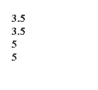
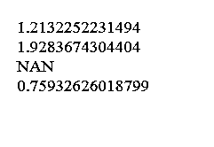
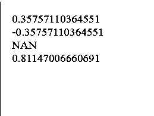
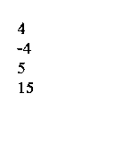
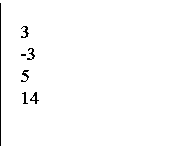
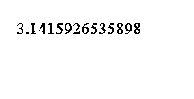
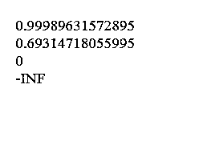
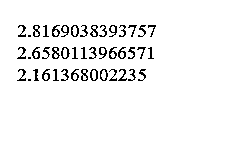

# PHP 数学函数

> 原文：<https://www.educba.com/php-math-functions/>


## PHP 数学函数概述

在这篇文章中，我们将讨论 PHP 数学函数。PHP 代表超文本预处理器。PHP 是一种编程语言，可用于构建小型应用程序，如简单表单等，也可用于构建大型企业应用程序。它是一种基于服务器端的脚本语言。每种编程语言都有许多内置的默认功能。

这些功能帮助开发人员快速编写所需的代码。根据我们的要求，这些内置功能包含所需的逻辑。这些内置功能可以是基于字符串的功能、基于数组的功能、基于数字的功能、 [JSON](https://www.educba.com/what-is-json/) 的功能等

<small>网页开发、编程语言、软件测试&其他</small>

现在让我们看看什么是 PHP 数学函数

### PHP 数学函数

它们是 PHP 作为编程语言的内置功能。这些函数的基本作用是提供一种机制，开发者可以在其中进行某种数学计算或类似的事情。这些为开发提供了快速的动手操作，而无需编写很长的代码。现在让我们知道这些 PHP 数学函数的范围

#### PHP 数学函数的范围

这些 php 数学函数的范围是整型和浮点型。对于 32 位计算机，PHP 中整数数据类型的范围是-2，147，483，647 到 2，147，483，647。任何小于-2，147，483，647 的数字或任何大于 2，147，483，647 的数字或任何小于-2，147，483，647 的数字都被视为浮点数。

现在我们将试着理解不同的 PHP 数学函数，以及它的使用示例:

**1) abs()函数**——在 PHP 4+版本中引入。它返回数字的绝对值。根据函数中传递的参数类型，函数的返回类型是浮点数还是整数。

**举例**:

```
<!DOCTYPE html>
<html>
<body>
<?php
echo(abs(3.5) . "<br>");
echo(abs(-3.5) . "<br>");
echo(abs(5) . "<br>");
echo(abs(-5));
?>
</body>
</html>
```

**解决方案**:




**2) acos()函数**——在 PHP 4+版本中引入。它要求参数在-1 到+1 的范围内。如果参数中传递了超出指定范围的数字，则返回 n an，否则返回该数字的反余弦值。该函数的返回类型是一个数字的反余弦值

**举例**:

```
<!DOCTYPE html>
<html>
<body>
<?php
echo(acos(0.35) . "<br>");
echo(acos(-0.35) . "<br>");
echo(acos(5) . "<br>");
echo(acos(0.7253));
?>
</body>
</html>
```

**解决方案**:




**3) asin()函数**——在 PHP 4+版本中引入。它要求参数在-1 到+1 的范围内。如果参数中传递了超出指定范围的数字，则返回 n an，否则返回该数字的反正弦值。该函数的返回类型是一个数字的反正弦

**举例**:

```
<!DOCTYPE html>
<html>
<body>
<?php
echo(asin(0.35) . "<br>");
echo(asin(-0.35) . "<br>");
echo(asin(5) . "<br>");
echo(asin(0.7253));
?>
</body>
</html>
```

**解决方案**:




**4) ceil()函数**——在 PHP 4+版本中引入。它将一个数字向上舍入到最接近的整数。例如，3.2 的上限将给出 4。它以最接近的整数形式返回大于传递的参数的整数

**举例**:

```
<!DOCTYPE html>
<html>
<body>
<?php
echo(ceil(3.35) . "<br>");
echo(ceil(-4.35) . "<br>");
echo(ceil(5) . "<br>");
echo(ceil(14.8114700666069059));
?>
</body>
</html>
```

**解决方案**:




**5) floor()函数**——在 PHP 4+版本中引入。它将一个数字向下舍入到最接近的整数。比如 3.2 的地板会给 3。它以最接近的整数形式返回小于传递的参数的整数

**举例**:

```
<!DOCTYPE html>
<html>
<body>
<?php
echo(floor(3.35) . "<br>");
echo(floor(-2.35) . "<br>");
echo(floor(5) . "<br>");
echo(floor(14.811470062));
?>
</body>
</html>
```

**解决方案**:




**6) pi()函数**——在 PHP 4+版本中引入。它返回 PI 的值，其返回类型是 float。

**举例**:

```
<!DOCTYPE html>
<html>
<body>
<?php
echo(pi() . "<br>");
?>
</body>
</html>
```

**解决方案**:




**7) pow()函数**——在 PHP 4+版本中引入。它接受两个参数，比如 x 和 y。它计算 x 的 y 次幂。它的返回类型是整型还是浮点型，这取决于参数的性质

**举例**:

```
<!DOCTYPE html>
<html>
<body>
<?php
echo(pow(2,3) . "<br>");
echo(pow(2,4) . "<br>");
echo(pow(5,6) . "<br>");
echo(pow(3,5));
?>
</body>
</html>
```

**解决方案**:


**8) log()函数**——在 PHP 4+版本中引入。它接受两个参数，比如 x 和 y，其中 x 是一个数字，y 是以数字为底的对数。如果 y 未通过，则采用默认值“e”。它的返回类型是 float

**举例**:

```
<!DOCTYPE html>
<html>
<body>
<?php
echo(log(2.718) . "<br>");
echo(log(2) . "<br>");
echo(log(1) . "<br>");
echo(log(0));
?>
</body>
</html>
```

**解决方案**:




**9) log10()函数**——在 PHP 4+版本中引入。它接受一个参数 x，其中 x 是一个需要计算其以 10 为底的对数的数字。它的返回类型是 float

**举例**:

```
<!DOCTYPE html>
<html>
<body>
<?php
echo(log10(656) . "<br>");
echo(log10(455) . "<br>");
echo(log10(145) . "<br>");
?>
</body>
</html>
```

**解决方案**:




**10) round()函数**——在 PHP 4+版本中引入。它四舍五入一个数字。它需要三个参数，第一个参数是数字，第二个参数是精度，第三个参数是模式。唯一的第一个参数是强制性的

**举例**:

```
<!DOCTYPE html>
<html>
<body>
<?php
echo(round(3.35) . "<br>");
echo(round(-2.35) . "<br>");
echo(round(5) . "<br>");
?>
</body>
</html>
```

**解决方案**:


除了指定的 PHP 数学函数，还有其他几个数学函数可以根据我们的要求使用。我们可以运行上述 PHP 代码片段来执行它

### 让我们知道如何运行一个示例代码片段？

1)安装 php5 或 5+

2)安装本地主机，如 WampServer 等

3)现在创建一个文件，命名为 index.php

4)将示例片段粘贴到创建的文件中

5)在浏览器上运行本地主机和 index.php

### 结论

*   Php 是一门非常庞大的编程语言，我们可以学习它来制作 web 应用程序。它用于处理服务器端脚本逻辑。虽然我们也可以像在示例片段中一样在 PHP 中插入 HTML 代码。
*   Php 有一个内置功能的大型数据库。有几个函数使用字符串作为参数，其他函数使用数组。这些内置的功能帮助我们解决我们的需求，而不需要写很多代码。

### 推荐文章

这是 PHP 数学函数的指南。在这里，我们讨论了函数的介绍、范围，以及不同函数的详细解释和 PHP 示例。您也可以浏览我们推荐的其他文章，了解更多信息——

1.  [PHP 框架](https://www.educba.com/php-frameworks/)
2.  [PHP 字符串函数](https://www.educba.com/php-string-functions/)
3.  [PHP 命令](https://www.educba.com/php-commands/)
4.  [PostgreSQL 数学函数](https://www.educba.com/postgresql-math-functions/)


