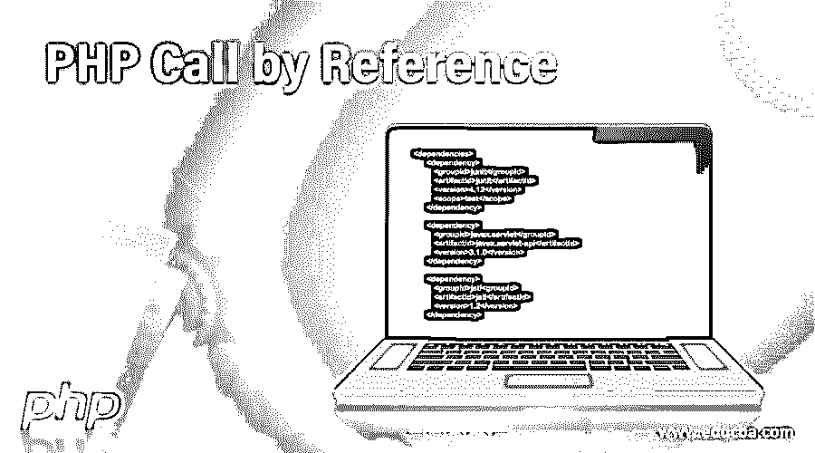
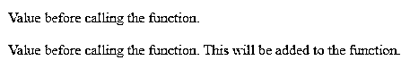
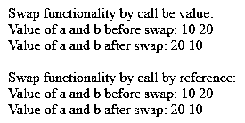
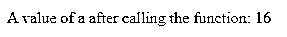

# PHP 引用调用

> 原文：<https://www.educba.com/php-call-by-reference/>




## PHP 引用调用简介

引用调用就是将变量的引用作为函数参数传递。由于 PHP 不直接支持指针类型的机制，它支持引用来处理各种操作。在 PHP 语言中，如果任何函数内部的值被修改，那么该保持变量的实际值也将被修改；这在按值调用中是无法实现的。在 call be a reference 中将变量作为引用传递时，可以将&符号用作前缀。& symbol 本身表示一个变量被用作引用。引用函数也可以作为参数传递给另一个函数。在这个主题中，我们将通过引用来学习 PHP 调用。

**语法**

<small>网页开发、编程语言、软件测试&其他</small>

使用它没有特殊的语法，但是在向函数传递参数时，需要使用&符号。

函数声明可能如下所示:

```
function callByref(&$var)
{
$var.= 'inside the Call By Reference function.';
}
```

调用这个函数时不需要任何特殊的东西；同样可以像普通函数一样使用(按值调用)。

```
$var = 'Yes, I am';
callByref ($var);
```

### PHP 中引用调用是如何工作的？

在继续通过引用进行调用之前，应该有一些需求，以便能够适合某个函数。然后，在指定函数的声明中，我们可以使用参数变量的引用符号。让我们用一个简单的例子来理解这一点。

```
function callByref(&$var)
{
$var.= 'Call By Reference function.';
}
$var = 'Try to check the reference, I am inside the ';
```

当我们试图在这里打印$var 时，将会显示上面的消息

```
echo $var;
```

//在调用函数之前打印变量

现在调用这个函数，调用这个函数将修改变量的实际值

函数内部写的$var。

```
callByref ($var);
echo $var;
```

//这将是打印字符串的组合值。

在 PHP 语言中，下面提到的可以用作调用的引用:

*   变量–正常变量。
*   返回引用的函数——一个定义良好的返回引用的函数也可以作为函数参数在引用调用中传递(参见示例 E3)。

### 通过引用调用的示例

下面提到了不同的例子:

#### 示例#1

一个简单的程序，使用引用调用来检查这个函数的性质。在这种情况下，我们可以在使用引用调用并从函数内部修改变量后检查实际值是否被修改。

**代码:**

```
<?php
function callByref(&$var)
{
$var.= ' This will be added to the function.';
}
$var = 'Value before calling the function.';
echo $var ."<br><br>"; // printing variable before callig function
callByref ($var);
echo $var;
?>
```

**输出:**




#### 实施例 2

一个示例代码在 PHP 中区分了按值调用和按引用调用。

**代码**

```
<?php
// call by value function
echo "<br>Swap functionality by call be value:<br>";
function SwapCallByValue($a, $b){
$c=$a;
$a=$b;
$b=$c;
echo "";
echo "<br>Value of a and b after swap: ";
echo $a . " ".$b;
}
$a = 10;
$b = 20;
echo "Value of a and b before swap: ";
echo $a . " ".$b;
SwapCallByValue($a, $b);
// swap functionality by call be a reference
echo "<br><br>Swap functionality by call by reference:<br>";
function SwapCallByRefernce(&$a,&$b)
{
$c=$a;
$a=$b;
$b=$c;
}
$a = 10;
$b = 20;
echo "Value of a and b before swap: ";
echo $a . " ".$b;
SwapCallByRefernce($a, $b);
echo "<br>Value of a and b after swap: ";
echo $a . " ".$b;
?>
```

**输出:**




正如我们在上面的例子中看到的，如果我们在函数之外打印 a 和 b 的值，那么 call-by-swap 将不起作用。这是因为按值调用不会改变变量的实际副本。但是在引用调用中，我们可以看到我们在调用该函数后立即打印 a 和 b 的值，交换工作正常。这是我们在处理通过值调用和通过引用调用的交换函数时的全部内容。

#### 实施例 3

**代码:**

```
<?php
// this is the main function inside which the a funtion will be passed as a parameter
function mainFunction(&$val)
{
$val++;
echo $val;
}
// this function will be used as a parameter
function &FunctionAsAParam()
{
$val = 15;
return $val;
}
echo "A value of a after calling the function: ";
$result = mainFunction(FunctionAsAParam()); // calling function, function as a reference parameter
?>
```

**输出:**




在上面的例子中，我们可以看到一个引用函数 FunctionAsAParam()被用作另一个函数参数。按照里面写的代码，它分配主变量的值。函数 mainFunction()是上面代码的主函数，是使用 FunctionAsAParam()作为引用函数参数后增加的值。我们可以通过多种方式将该函数用作参考参数。

### 结论

通过引用调用在创建时使用参数中的&符号，而不是在调用该函数时使用。与 PHP 不同，在 C 或 C++语言中，它通常在调用该函数时使用。PHP 引用调用就是创建或调用一个函数来修改变量的实际副本。因此，没有参考符号是必要的，在调用时，将给出 PHP 中的错误。

### 推荐文章

这是一个 PHP 调用参考指南。在这里，我们讨论如何在 PHP 中通过引用调用工作，以及代码和输出的例子。您也可以看看以下文章，了解更多信息–

1.  [PHP include_once](https://www.educba.com/php-include_once/)
2.  [PHP 拆分数组](https://www.educba.com/php-split-array/)
3.  [PHP 加密](https://www.educba.com/php-encryption/)
4.  [PHP 未设置数组](https://www.educba.com/php-unset-array/)


