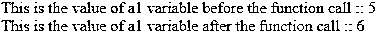
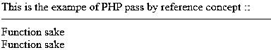
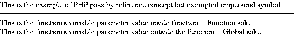
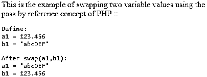

# PHP 通过引用传递

> 原文：<https://www.educba.com/php-pass-by-reference/>

## PHP 简介按引用传递

PHP 编程语言本身的单词 pass by reference 表示，每当变量通过引用传递时，就会在变量的一个或多个参数之前添加&符号。现在举一个例子“function(&$x)”，这里全局变量和函数变量的作用域都是全局值，因为它们是使用相同的引用概念定义的。所以每当全局变量要改变时，函数内部的变量也会改变，反之亦然，这适用于所有这些变量。

**语法和参数**

<small>网页开发、编程语言、软件测试&其他</small>

`function function_name(&$function_parameter){
..
..
}`

PHP 通过引用传递的参数说明:

*   **Function _ name:**Function _ name 参数只是用户定义的函数的名称。人们可以根据自己的需求和任务来命名任何东西。
*   **Function_parameter:** 这是一个变量参数，用于 PHP 编程语言中的引用传递。这个可变参数可以是任何东西。它也是用户定义的，可以根据您的编码需求命名为任何名称。但是应该用“&”符号(&)来表示。

### PHP 中如何通过引用工作？

PHP 编程语言的引用传递基本上是借助于变量参数前的&符号绕过引用变量。如果我们通过引用概念传递一个变量，那么一个函数可以修改这个变量。这样，PHP 通过引用传递的概念就起作用了，在一些编码情况下，了解这个概念是很重要的。对于某些 PHP 版本，通过引用传递的概念并不适用。在 PHP 5.3.0 中，你会遇到一个警告，说“调用时通过引用传递”,而在 PHP 5.4.0 版本中，调用时通过引用传递将被删除，所以在一些 PHP 版本中使用它将引发一些致命错误。

### 通过引用实现 PHP 传递的示例

下面是提到的例子:

#### 示例#1

这是一个说明 PHP 编程语言的引用传递概念的例子。这里首先创建一个函数“calculate()”及其引用函数参数“$a1”。然后在函数内部，变量值递增。然后从函数“$a1”出来后，变量值被声明为“5”。然后，通过使用回显功能，将打印$a1 的值，然后调用 calculate()函数。调用函数后，再次使用 echo 函数，这一次变量值将由于递增而显示为“6”。

**代码:**

`<?php
function calculate(&$a1){
$a1++;
}
$a1=5;
echo "This is the value of a1 variable before the function call :: ";
echo $a1;
echo " ";
echo "This is the value of a1 variable after the function call :: ";
calculate($a1);
echo $a1;
?>`

**输出:**

#### 实施例 2

这也是一个说明 PHP 语言相同概念的例子，但是这里使用了字符串值，而不是像例子 1 一样使用数值。这里 print_string()函数是用一个变量“string1”跟在&符号后面。然后在函数内部，string1 变量值被赋值为“Function sake ”,然后用来打印 string1 变量值。然后在函数之外，再次将 string1 变量值赋值为“Global sake”。然后，使用打印功能再次打印 string1 变量，但这次打印的是函数内部的字符串值，而不是全局值。这是因为 PHP 的相同概念。

**代码:**

`<?php
// Here Function is used just for assigning the new value to
// some $string1 variable and then printing it
echo "This is the exampe of PHP pass by reference concept :: ";
echo "
";
function print_string( &$string1 ) {
$string1 = "Function sake \n";
// Print $string1 variable
print( $string1 );
echo " ";
}
// Drivers code
$string1 = "Global sake \n";
print_string( $string1 );
print( $string1 );
echo " ";
?>`

**输出:**

#### 实施例 3

这个例子类似于例子 2，但是这里没有使用&符号只是为了确定如果不使用它会发生什么。如果不使用&符号，我们也可以称之为传递值概念。因此，如果您不想使用该功能，不要忘记在函数的变量参数前使用&符号。这里在第二次打印输出时，你会得到“全球清酒”，因为缺少按引用传递的概念。只需查看示例 2 和示例 3 的输出，就可以更好地理解这个概念。

**代码:**

`<?php
// Here Function is used just for assigning the new value to
// some $string1 variable without using ampersand and then printing it
echo "This is the example of PHP pass by reference concept but exempted ampersand symbol :: ";
echo "
";
function print_string( $string2 ) {
$string2 = "Function sake \n";
// Print $string1 variable
echo "This is the function's variable parameter value inside function :: ";
print( $string2 );
echo " ";
}
// Drivers code
$string2 = "Global sake \n";
print_string( $string2 );
echo "This is the function's variable parameter value outside the function :: ";
print( $string2 );
echo " ";
?>`

**输出:**

#### 实施例 4

这是借助 swap()函数和 PHP 编程语言的相同概念实现交换功能的示例。这里，首先用数值和字符串值创建两个变量 a1、b1。然后用 swap()函数交换这些数字。然后在函数内部使用一个额外的变量值来交换功能。然后将使用该函数进行交换。您可以查看输出部分的输出，以理解 PHP 交换机制的引用传递。

**代码:**

`<?php
// ------------------------------------------
// This is sample Demo call of swap(...) function below.
echo "This is the example of swapping two variable values using the pass by reference concept of PHP :: ";
echo " ";
$a1 = 123.456;
$b1 = 'abcDEF';
print "<pre>Define:\na1 = $a1\nb1 = '$b1'</pre>";
swap($a1,$b1);
print "<pre>After swap(a1,b1):\na1 = '$a1'\nb1 = $b1</pre>";
// -------------------------------
function swap (&$arg11, &$arg12)
{
// Now Swapping the contents of the indicated variables.
$w1=$arg11;   $arg11=$arg12;   $arg12=$w1;
}
?>`

**输出:**

### 结论

我希望您已经了解了 PHP 通过引用传递的定义及其语法和一些参数解释，在 PHP 编程语言中是如何工作的，以及 PHP 的各种示例，以便更好地理解 PHP 通过引用传递的概念。

### 推荐文章

这是一个 PHP 通过引用的指南。在这里，我们讨论了 PHP 通过引用的介绍，语法，参数，它是如何工作的例子。您也可以浏览我们的其他相关文章，了解更多信息——

1.  [PHP 引用](https://www.educba.com/php-references/)
2.  [PHP substr_count()](https://www.educba.com/php-substr_count/)
3.  [PHP 注释](https://www.educba.com/php-annotations/)
4.  [PHP strtotime](https://www.educba.com/php-strtotime/)

