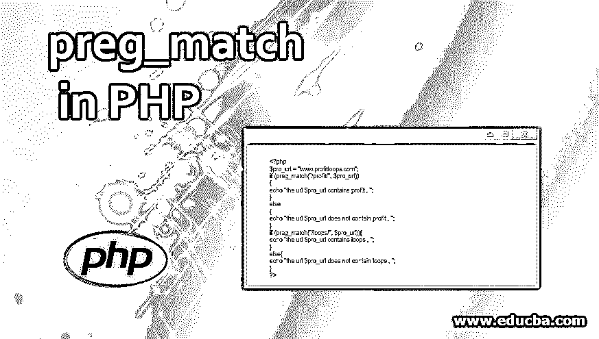
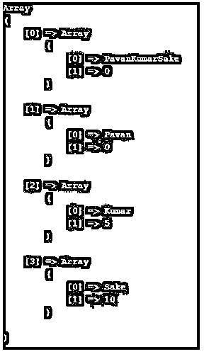

# PHP 的 preg_match

> 原文：<https://www.educba.com/preg_match-in-php/>




## **PHP 中 preg_match 介绍**

PHP 编程语言的 preg_match()函数在字符串中搜索模式，然后只有当模式存在时，该函数才返回 TRUE，否则 preg_match()函数将返回 FALSE。Preg_match()函数基本上使用一些参数工作，这些参数对于在输入字符串数据/字符串模式中搜索字符串模式非常有用。第一个参数是存储要搜索的字符串模式。第二个参数是存储输入字符串。我们必须在字符串数据中搜索所需的字符串模式等。，那么 3 <sup>rd</sup> 参数“matches”将找到匹配的字符串内容，并且只有在 preg_match()函数之后包含打印时才显示在输出中。

**语法:**

<small>网页开发、编程语言、软件测试&其他</small>

```
Int preg_match($pattern, $input, $matches, $flags, $offset)
```

**说明:**

*   PHP 语言的 preg_match()函数通常只接受 preg_match()函数内部的语法列中提到的 5 个参数。
*   preg_match()函数中的 5 个参数列表是:模式、输入、匹配、标志和偏移。
*   每个参数对于在大字符串中或在完全配备了字母数字字符串数据的文档中执行字符串模式搜索都非常有用。

### preg_match 在 PHP 中是如何工作的？

php 编程语言中的 Preg_match()函数的工作是基于在字符串语句或其他内容的大列表中搜索字符串模式，只有找到字符串模式，preg_match()才会返回真值，否则 preg_match()函数将返回假值。PHP 的 Preg_match()函数通常基于 preg_match()函数中包含的五个参数。

下面给出了参数:

**1。Pattern Parameter:** 这是 PHP 的 preg_match()的参数，用于保存模式，以便将字符串作为字符串进行搜索。Pattern 也被视为变量，并与$符号一起放在函数中。

**2。输入参数:**preg _ match()函数内部的输入参数保存字符串输入/字符串输入值。

**3。Matches 参数:**只有当匹配存在时，preg_match()中的 Matches 参数才会提供搜索结果。匹配意味着相同的字符串是否存在。$matches[0]实际上将包含完全匹配的字符串模式的完整文本。$matches[1]将包含匹配第一个带括号的捕获子模式的字符串文本，等等..通常，字符串模式可以在$matches[0][0]，$matches[1][0]，$matches[2][0]，$matches[3][0]等处找到..在$matches[0][1]，$matches[1][1]，$matches[2][1]和$matches[3][1]处，您将发现 NULL，这意味着字符串模式值为 0，因为它没有在 matches 数组中存储任何内容。

**4。Flags 参数:** Flags 参数可以包含一些其他的标志，这些标志在处理字符串模式搜索时非常有用。

*   **PREG_OFFSET_CAPTURE 标志:**现在，preg_match()函数的该标志被传递，然后将返回每个匹配字符串的偏移量。
*   **PREG_UNMATCHED_AS_NULL 标志:**该标志有助于报告为 NULL。当该标志被传递时，子模式将被报告为 NULL，因为子模式根本不匹配。

**5。Offset 参数:**preg _ match()函数的 offset 参数对于从作为输入发送的字符串的最开始进行搜索非常有帮助。这个偏移参数是可选的，并不总是需要。您可以根据需要使用它。它实际上是用来通过指定搜索开始的位置来开始字符串搜索。

**6。preg_match()的返回值:**PHP 的 preg_match()函数只有在字符串模式存在时才会返回 TRUE，否则 preg_match()函数将返回 FALSE。

### PHP 中 preg_match 的例子

下面是一些例子:

#### 示例#1

这里使用 PREG_OFFSET_CAPTURE 标志来说明 preg_match()。创建“$pavan1”并存储一个字符串值“PavanKumarSake”并将其分配给“$pavan1”。然后用参数声明 preg_match()。

/(Pavan)(Kumar)(Sake)/'是模式参数，用于保存要在输入字符串/字符串值中搜索的模式。然后将“$pavan1”变量作为输入变量放置，该变量通常包含字符串元素，您必须在该元素中搜索字符串变量的值在输入中是否可用。然后“$matches1”变量被放在逗号后的$pavan1 变量旁边。这有助于检查模式在输入字符串“PavanKumarSake”中的什么位置可用。在上面的 preg_match()工作解释中，我们说什么$matches[0]和$matches[1]会返回。同样，在下面的示例中,$matches[1]将提供与模式完全匹配的结果。所以数组[0]的输出为“PavanKumarSake ”,因为它包含完整的字符串/文本。那么根据示例 1 的输出，数组[1][0]将是“Pavan”，数组[2][0]是“Kumar”，数组[3][0]是“Sake”。然后“print_r($matches1)”将打印输入字符串中可用的匹配，并显示字符串模式中可用的字符串模式的位置。Print_r 会显示上面 PHP 编程语言的 preg_match()程序的输出。

**语法:**

```
<?php
$pavan1 = 'PavanKumarSake';
preg_match('/(Pavan)(Kumar)(Sake)/', $pavan1, $matches1, PREG_OFFSET_CAPTURE);
print_r($matches1);
?>
```

**输出:**




#### 实施例 2

在下面的示例中，使用字符串值 www.profitloops.com 创建了一个变量“$pro_url”。然后创建一个 if 条件，条件是如果单词“profit”出现在“$pro_url”中，那么 if 条件将认为它为真，并打印所提到的语句。这里“www.profitloops.com 包含利润的 URL”将被打印出来，它也显示在浏览器的输出中，并放在输出部分的下面。如果 www.profitloops.com 中没有“利润”一词，则将打印 ELSE 条件中的报表。然后，像上面的语法一样，再次使用 IF 语句来检查单词“loops”是否出现在“www.profitloops.com”中。如果条件是一个错误，那么将打印 ELSE 条件的语句。但是这里的 IF 条件为真，所以 IF 中的语句将被打印出来。

**语法:**

```
<?php
$pro_url = "www.profitloops.com";
if (preg_match("/profit/", $pro_url))
{
echo "the url $pro_url contains profit , ";
}
else
{
echo "the url $pro_url does not contain profit , ";
}
if (preg_match("/loops/", $pro_url)){
echo "the url $pro_url contains loops , ";
}
else{
echo "the url $pro_url does not contain loops , ";
}
?>
```

**输出:**


### 推荐文章

这是一个 PHP 中 preg_match 的指南。这里我们讨论介绍，preg_match 如何在 PHP 中工作以及例子。您也可以看看以下文章，了解更多信息–

1.  [PHP 数组搜索](https://www.educba.com/php-array-search/)
2.  [PHP 加密](https://www.educba.com/php-encryption/)
3.  [PHP 获取方法](https://www.educba.com/php-get-method/)
4.  [PHP 写文件](https://www.educba.com/php-write-file/)


