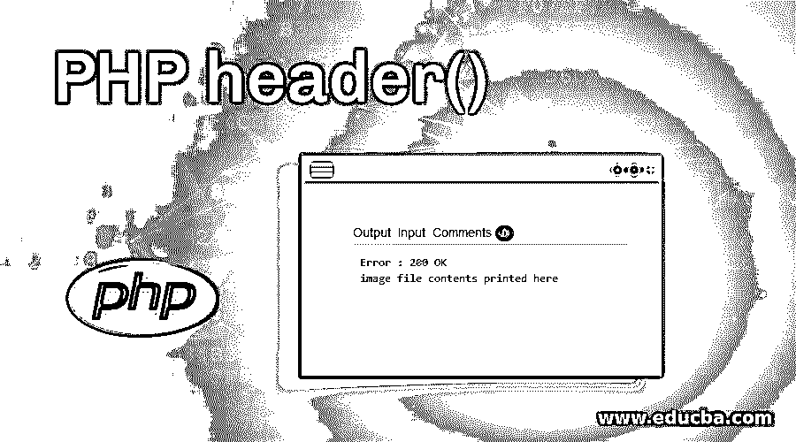
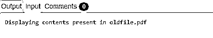
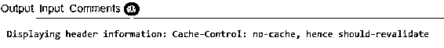
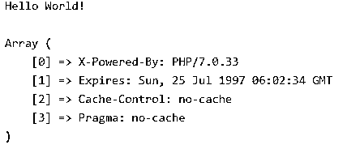
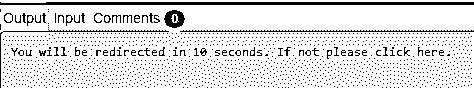
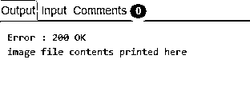

# PHP 头()

> 原文：<https://www.educba.com/php-header/>

## PHP 头文件介绍()

PHP header 是一个内置函数，用于向客户端发送一个原始 HTTP 头，在发送任何原始输出之前，它们必须实际处理发送给客户端或浏览器的信息。在发送 HTML、XML、JSON 或任何其他输出之前，原始请求(如 HTTP 请求)被发送到浏览器或客户端。HTTP 头包含所需的对象的必要信息，该信息在请求及其响应的消息体中更准确地发送。

### 语法和参数

下面是语法和参数:

<small>网页开发、编程语言、软件测试&其他</small>

**语法**

`void header( $header_name, $replace_param = TRUE, $http_response_code )
header_name() here is a mandatory field and sends the header string to be sent`

**替换参数:**这是一个可选的布尔型字段，显示当前报头是否应该替换先前相似的报头，或者是否应该添加一个相同类型的新报头。默认情况下，它的值为 TRUE，这样，它将替换标头，除非给出 FALSE，这允许给出多个标头，但条件是它应该具有相同的类型。

**代码:**

`<?php
header('WWW-Authenticate: Negotiate');
echo ('header has been changed to WWW-Authenticate: Negotiate');
echo "\n";
header('WWW-Authenticate: NTLM', false);
echo ('header has been changed to WWW-Authenticate: NTLM');
?>`

**输出:**

**http_response_code:** 这也是一个可选字段，强制接收到的 http 响应为给定值。在 PHP 4.3 和更高版本中可用。

这里的 header()用于发送一个原始的 HTTP 头。因此，在通过普通的 HTML 标记、空白行或 PHP 发送任何其他输出之前，必须调用这个头。一些常见的错误是用 include、access 或任何其他 require 函数读取代码，在调用 header()之前输出空格或空行。当我们使用单独的 PHP 或 HTML 文件时，这个问题也存在。

**返回值** : header()函数不返回值。在 header 调用中，有两种类型:第一种以字符串“HTTP/”开始(大小写无关紧要)，用于找出要发送的 HTTP 状态代码。

### 实现 PHP header()的示例

以下是一些例子:

#### 示例#1

**代码:**

`<?php
header("HTTP Error 404: Not Found");
echo ('Header been changed to HTTP Error 404: Not Found');
?>`

**输出:**

**解释:**第二种类型是位置报头，其将报头发送回网络浏览器，并且还将重定向状态码返回到浏览器，直到并且除非状态码 201 或 3xx 已经被发送。

#### 实施例 2

**代码:**

`<?php
header("Location: http://www.example_site.com/");/* This is to redirect the browser */
echo("Browser successfully redirected to http://www.example_site.com/");
exit;
?>`

**输出:**

#### 实施例 3

**代码:**

`<?php
// To output a PDF header
header('Content-Type: application/pdf');
// Let the filename be called file.pdf
header('Content-Disposition: attachment; filename="file.pdf"');
// The source of PDF can be found in oldfile.pdf
readfile('oldfile.pdf');
?>`

**输出:**

**解释:**在这个例子中，我们提示用户保存发送给他们的生成的 PDF 文件。为此，我们使用 Content-Disposition 头给出所需的文件名，并强制 web 浏览器显示保存对话框。

#### 实施例 4

**代码:**

`<?php
header("Cache-Control: no-cache, hence should-revalidate");
header("Expires: Sun, 25 Jun 1999 04:00:00 GMT");
// Providing some random date in the past
echo('Displaying header information: Cache-Control: no-cache, hence should-revalidate' );
?>`

**输出:**

**解释:**在这个例子中，我们使用某些代理和客户端来禁用 PHP 的缓存过程。这是因为 PHP 经常创建动态内容，这些内容不应该被 web 浏览器或任何其他介于服务器和浏览器之间的代理缓存所缓存。

有时，即使上面所说的行和头没有包含在 PHP 代码中，页面也不会被缓存。这是因为用户可以为自己的浏览器设置许多选项，从而改变其默认的缓存行为。因此，通过使用上述标题，我们将能够覆盖所有可能导致 PHP 脚本输出被缓存的设置。

还有另一个名为 session.cache_limiter 的配置设置，当使用不同的会话时，它会自动生成正确的与缓存相关的头。

#### 实施例 5

**代码:**

`<?php
// PHP program to describes header function
// Set a past date
header("Expires: Sun, 25 Jul 1997 06:02:34 GMT");
header("Cache-Control: no-cache");
header("Pragma: no-cache");
?>
<html>
<body>

Hello World!

<!-- PHP program to display
header list -->
<?php
print_r(headers_list());
?>
</body>
</html>`

**输出:**

**解释:**上面给出的例子是用来防止缓存发送的头信息覆盖浏览器设置，使其不缓存。在这个例子中，我们多次使用 header()函数，因为一次只允许发送一个报头。这可以防止所谓的报头注入攻击。

#### 实施例 6

**代码:**

`<?php
header( "refresh:10;url=example.php" );
echo 'You will be redirected in 10 seconds. If not please click <a href="example.php">here</a>.';
?>`

**输出:**

**解释:**上面的例子用于重定向用户，并通知他将被重定向。

#### 实施例 7

**代码:**

`<?php
// Test image.
$t1 = 'https://cdn.educba.com/test/image.png';
// Headers being sent by the client
$headers = apache_request_headers();
// To check if the cache is being validated by the client and whether it is current
if (isset($headers['If-Modified-Since']) && (strtotime($headers['If-Modified-Since']) == ftime($t1))) {
// We shall respond with '304 Not Modified' if the client cache is current
header('Last-Modified: '.gmdate('D, d M Y H:i:s', ftime($t1)).' GMT', true, 304);
echo(‘’);
} else {
// We shall display '200 OK' by outputting the image if it is not cached or outdated cache
header('Last-Modified: '.gmdate('D, d M Y H:i:s', ftime($t1)).' GMT', true, 200);
header('Content-Length: '.filesize($t1));
header('Content-Type: image/png');
print file_get_contents($t1);
}
?>`

**输出:**

**解释:**在上面的例子中，我们使用 PHP 头来缓存正在发送的图像，因此这样做可以节省带宽。首先，我们获取图像并检查它是否已经被缓存，这是通过将缓存设置为当前的来实现的。如果它不是当前的，那么我们缓存它并在输出中发送图像。

### 在 PHP 中使用 header 函数的优点

*   PHP 头在重定向 URI 字符串以显示诸如“404 Not Found Error”之类的适当消息时非常重要。
*   PHP 头可以用来告诉 web 浏览器响应的类型和内容类型。
*   开始时使用的重定向脚本有助于节省执行时间和带宽。

### 结论

如上所述，标题构成了每个文档的主要部分，因为它告诉 web 浏览器它是什么类型的文档，以便浏览器正确地阅读它。因此，它负责向浏览器提供原始 HTTP 头，并将其重定向到不同的正确位置。

### 推荐文章

这是 PHP header()的指南。在这里，我们将讨论 PHP header()的介绍和适当的语法，以及用适当的代码和输出来实现的 7 个示例。您也可以浏览我们的其他相关文章，了解更多信息——

1.  [PHP 循环](https://www.educba.com/php-loops/)
2.  [PHP 分页](https://www.educba.com/php-pagination/)
3.  [PHP unset()](https://www.educba.com/php-unset/)
4.  [PHP MD5()](https://www.educba.com/php-md5/)

