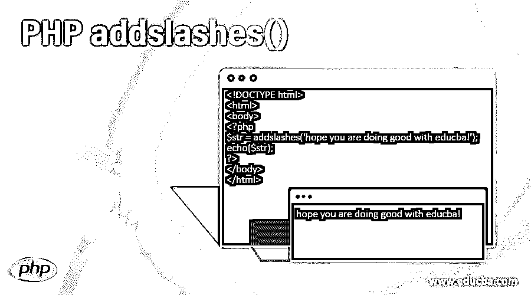
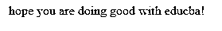
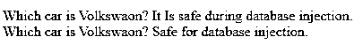
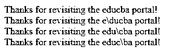
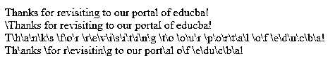
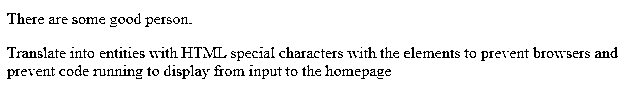

# PHP addslashes()

> 原文：<https://www.educba.com/php-addslashes/>

## PHP addslashes()函数介绍

addslashes()函数是 PHP 中内置的预定义函数，用于返回包含反斜杠的字符串，并放在字符串中所有预定义字符的前面。PHP addslashes()函数有一个特殊的特性，它不考虑从函数中传递任何参数或自变量。预定义字符在此函数中的行为有所不同。与 addcslashes()函数相比，addslashes 函数稍有不同，因为此函数接受需要添加到斜杠前面的指定字符，但对于 addslashes()函数并不重要，因为它不允许传递任何参数，并在指定字符前面追加斜杠。

**语法**

<small>网页开发、编程语言、软件测试&其他</small>

`addslashes($string)`

*   **addslashes():**addslashes()函数只允许从函数内部传递一个参数或自变量，后跟字符串的$符号。
*   **$string :** 这是将作为函数输入传递给 addslashes 函数的参数。它指定了指定字符串的属性的特殊结构。

**返回类型:**此处的返回类型是返回在函数中添加字符串的字符串前，预先定义并加前缀的字符前有反斜杠的字符串。

### addslashes()函数在 PHP 中是如何工作的？

addslashes 是 PHP 定义的字符串引用和字符串包中的一个特殊的内置函数，它为带斜杠的引用字符串生成一个引用。它有一个返回类型，以一种特殊的格式返回字符串，字符串中的字符将在字符串后加前缀:

1.  **单引号:**用符号(')表示
2.  **双引号:**用符号(")表示
3.  **反斜杠:**用符号(\)表示
4.  **Null:** 用(NUL 字节)表示

用例将随着字符串的不同而不同，在带有这些字符的字符串之前的字符将被转义为字符集。

这个函数是在 PHP 5 . 4 . 0 及更高版本之后添加并开始使用的，否则，默认值将被认为是 magic_quotes_gpc，适用于所有类型的 GET、POST 和 cookies，正如 addslashes()函数所提到的那样。

有时，一旦与数据库查询合并，该函数会表现异常。因此，在 PHP 中使用 addslashes 函数时，检查和处理它取决于需求的类型和版本。由于这使得使它与数据库一起工作变得模糊不清，所以有时会出现使它与数据库注入及其相关查询同步的情况，此时非常需要为它的使用创建特定于数据库的转义函数或准备好的语句。

此外，许多子字符串作为 addslashes 函数的一部分，该函数包括以下函数作为其伙伴:

*   **stripcslashes():** 它是作为 addslashes 的一部分的函数，用来生成一些未加引号的字符串，但是加了一些 addcslashes。
*   **stripslashes():** 它也是 addslashes 函数的一个伙伴，该函数取消对任何生成的带引号的字符串的引用。
*   addcslakes():它是 addslashes 函数的另一部分，它与 addslashes 函数完全互补，在某种程度上，它用包含 C 风格模式的 inbuild 函数引用字符串。
*   htmlspecialchars(): 这个函数的工作方式是将一个特殊字符转换成 HTML 实体。
*   **Quotemeta():** 该函数适用于称为元字符类型的字符中的字符。
*   **get_magic_quotes_gpc():** 该函数也以类似的方式运行，与 magic_quotes_gpc 设置的配置中的现有设置差别很小。

### PHP addslashes()函数示例

以下是不同的例子:

#### 示例#1

这个程序使用 addslashes 函数来表示字符串，并输出带有转义字符序列的生成字符串。

**代码:**

`<!DOCTYPE html>
<html>
<body>
<?php
$str = addslashes('hope you are doing good with educba!');
echo($str);
?>
</body>
</html>`

**输出:**

#### 实施例 2

该程序使用 addslashes 函数来表示字符串，并输出带有转义字符序列的生成字符串，但支持数据库注入的不明确行为。

**代码:**

`<!DOCTYPE html>
<html>
<body>
<?php
$str = "Which car is Volkswaon?";
echo $str . " It Is safe during database injection. ";
echo addslashes($str) . "  Safe for database injection.";
?>
</body>
</html>`

**输出:**

#### 实施例 3

这个程序使用 addcslashes()函数来表示字符串，通过在字母 W 前面添加一个反斜杠来输出带有转义字符序列的生成字符串，这与 addslashes()函数的行为完全相反。

**代码:**

`<!DOCTYPE html>
<html>
<body>
<?php
$str = addcslashes("Welcome Educba!","W");
echo($str);
?>
</body>
</html>`

**输出:**

#### 实施例 4

这个程序使用 addcslashes()函数来表示字符串，通过在字母 educba 前面添加一个反斜杠来表示带有转义字符序列的生成字符串的输出，该反斜杠的行为与 addslashes()函数完全相反。

**代码:**

`<!DOCTYPE html>
<html>
<body>
<?php
$str = "Thanks for revisiting the educba portal!";
echo $str." ";
echo addcslashes($str,'d')." ";
echo addcslashes($str,'c')." ";
echo addcslashes($str,'b')." ";
?>
</body>
</html>`

**输出:**

#### 实施例 5

这个程序使用 addcslashes()函数来表示字符串，通过在字母 educba 前面添加一个反斜杠来添加多个反斜杠，其行为与 addslashes()函数完全相反。

**代码:**

`<!DOCTYPE html>
<html>
<body>
<?php
$str = "Thanks for revisiting to our portal of educba!";
echo $str." ";
echo addcslashes($str,'A..Z')." ";
echo addcslashes($str,'a..z')." ";
echo addcslashes($str,'a..g');
?>
</body>
</html>`

**输出:**

#### 实施例 6

这个程序用元素表示 HTML 特殊字符，用字符串将元素的值转换成一个值。

**代码:**

`<!DOCTYPE html>
<html>
<body>
<?php
$str = "There are some good person.";
echo htmlspecialchars($str);
?>

Translate into entities with HTML special characters with the elements to prevent browsers and prevent code running to display from input to the homepage

</body>
</html>`

**输出:**

### 结论

addslashes 函数用于通过在整个特殊字符串前面加上反斜杠来表示和遍历字符串，并用于引用要同时使用的必要和重要的字符串。

### 推荐文章

这是 PHP addslashes()的指南。这里我们讨论 addslashes()函数在 PHP 中是如何工作的，并给出了多个例子及其代码实现。您也可以看看以下文章，了解更多信息–

1.  [PHP 字符串函数](https://www.educba.com/php-string-functions/)
2.  [PHP 数组 _push()](https://www.educba.com/php-array_push/)
3.  [PHP 数组搜索](https://www.educba.com/php-array-search/)
4.  [PHP require_once](https://www.educba.com/php-require_once/)

