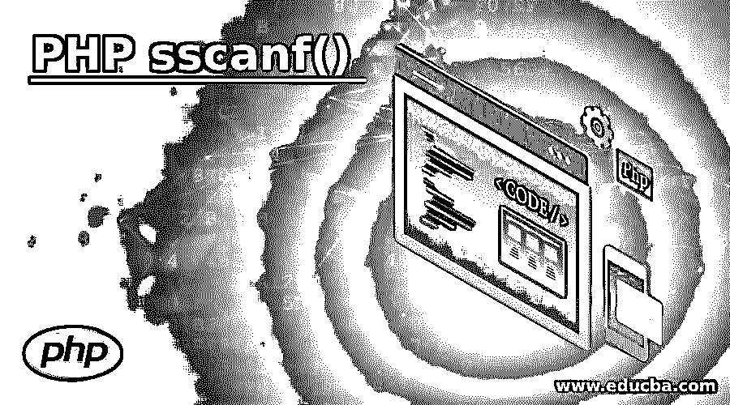
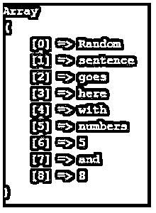
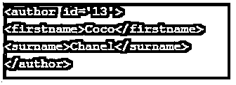
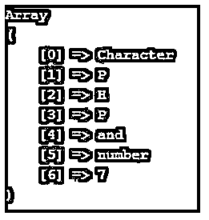

# PHP sscanf()

> 原文：<https://www.educba.com/php-sscanf/>

## PHP sscanf()简介

sscanf()是 PHP 中预定义的函数，它按照要求的格式解析输入字符串，然后返回解析后的字符串。它接受 2 个参数的输入，并给出所需的数组，在其他情况下，当传递其他参数(如可选参数)时，解析的数据将存储在这些参数中。当包含这些的说明符比变量多时，它会抛出一个错误，如果存在比变量低的说明符，额外的变量将得到 NULL。

### PHP sscanf()的语法

下面给出的是 PHP sscanf()的语法:

<small>网页开发、编程语言、软件测试&其他</small>

`sscanf(input_string, format, arg1, arg2, arg3....)`

**输入参数:**

**1。input_string:** 这是要读取的输入字符串。

**2。格式:**我们可以根据需要指定以下列表中的格式:

*   **%%:** 此格式将以百分号表示。
*   **%c:** 该格式根据所需的 ASCII 值返回字符。
*   **%d:** 此格式适用于有符号十进制值。(可以是零、负或正)
*   **%e:** 此格式返回小写的科学记数法。(例如 1.2e+2)
*   **%u:** 用于表示等于或大于零的无符号十进制数。
*   **%f:** 这个用来表示一个浮点数。
*   **%o:** 这个用来表示一个八进制数。
*   **%s:** 这代表字符串格式。
*   **%x:** 这代表十六进制数的小写字母。
*   **%X:** 这代表十六进制数的大写字母。

还有一些附加的格式值放在%符号和我们给出的字母之间。(例如%0.3f)

*   +(这会强制在数字的开头使用+和–值，默认情况下只标记负值)。
*   (这描述了要用作填充的内容，空格是这里的默认值。这应该与宽度说明符一起使用。例如:%x30s，它使用 x 进行填充)。
*   –(左边的这个将为我们提供变量值)。
*   [0-9](这给出了由变量值保持的最小宽度)。
*   .[0-9](描述十进制数的总数或字符串的最大长度)。

**Note:** In case there are more than one format being used then the order followed must be same as given above.

*   **arg1:** 这是一个可选参数，也是我们存储数据的第一个变量。
*   **arg2:** 这也是可选的，我们存储数据的第二个变量。
*   这是可选的，代表我们继续存储数据的连续变量。

**返回值**:这里有两种情况可能发生:

*   如果只有 2 个值作为这个函数的输入参数，那么数据将以数组的形式返回。
*   如果传递了其他可选参数，那么解析后的数据将存储在这些参数中。
*   如果有多个说明符超过了包含它们的变量，那么就会抛出一个错误。
*   如果说明符少于它们所能包含的变量，那么 NULL 将被赋给这些变量。
*   如果出现的说明符多于预期的格式，将返回-1。

### PHP sscanf()的例子

下面是提到的例子:

#### 示例#1

**代码:**

`<?php
$text = "Random sentence goes here with numbers 5 and 8";
$f = sscanf($text,"%s %s %s %s %s %s %d %s %d");
print_r($f);
?>`

**输出:**

在本例中，我们根据需要指定一个文本。然后使用 sscanf 函数并指定表示输入字符串的正确格式。因此，在输出中，确切的字符串显示为数组。仅当格式与数据匹配时。

#### 实施例 2

**代码:**

`<?php
// fetching the unique ID of product
list($ID) = sscanf("SN/680001", "SN/%d");
// fetching date of manufacturing
$manf = "March 03 2001";
// fetching the date of expiry
$expiry = "March 03 2002";
// Parsing using sscanf function
list($mon, $day, $yr) = sscanf($manf, "%s %d %d");
list($mon, $day, $yr) = sscanf($expiry, "%s %d %d");
echo "Product $ID was manufactured on $manf and will expire on: $yr-" . substr($mon, 0, 3) . "-$day\n";
?>`

**输出:**

在本例中，我们展示了如何检查和显示产品信息，如其唯一的生产 ID 和有效期。因此，在第一个参数中，我们获取 ID 信息并以%d 格式解析它。接下来，我们获取产品的生产日期和到期日期，并使用 sscanf 函数解析所需的格式。然后用一句话显示所有解析过的东西。这里可以添加多种东西来显示我们想要的信息。

#### 实施例 3

**代码:**

`<?php
// Fetching designer info and to generate DressInfo entry
$design = "13\tCoco Chanel";
$str = sscanf($design, "%d\t%s %s", $ID, $firstname, $lastname);
// Displaying all the above details after formatting
echo "<author id='$ID'>
<firstname>$firstname</firstname>
<surname>$lastname</surname>
</author>\n";
?>`

**输出:**

在这个例子中，我们使用 sscanf 函数首先解析设计者的 ID 和名字。然后通过将姓名分成名和姓来以 HTML 格式显示相同的内容。

#### 实施例 4

**代码:**

`<?php
// We are initializing the string here
$arr = "Character PHP and number 7";
// Parsing the input string according to different format
$format = sscanf($arr,"%s %c%c%c %s %s  %d");
print_r($format);
?>`

**输出:**

在上面的例子中，我们首先根据需要初始化字符串，这一次包括一些与字符串结合的字符集。同样，我们使用 sscanf 函数解析。

### 结论

从上面的所有例子中可以看出，PHP 中的 sscanf 函数基本上用于根据需要解析任何类型的输入字符串。在一些情况下，这个函数显示出解析字符串的效率很低，当我们试图解析制表符分隔的字符串时，可能会出现不正确的输出。如果在代码中有一个带有扩展名的文件名，并且在有“.”的情况下很难将两者分开，那么它也不会给出预期的输出.

### 推荐文章

这是 PHP sscanf()的指南。这里我们讨论 PHP sscanf()的介绍，以及适当的语法和相应的编程示例，以便更好地理解。您也可以看看以下文章，了解更多信息–

1.  PHP levenshtein()
2.  [PHP is_null()](https://www.educba.com/php-is_null/)
3.  [PHP wordwrap()](https://www.educba.com/php-wordwrap/)
4.  [PHP 正则表达式](https://www.educba.com/php-regular-expressions/)

