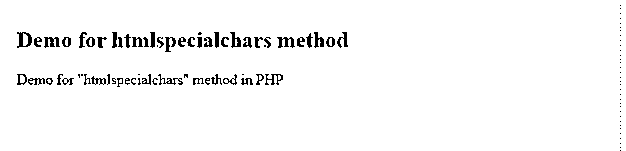
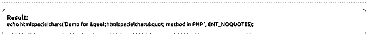

# PHP htmlspecialchars

> 原文：<https://www.educba.com/php-htmlspecialchars/>


## PHP htmlspecialchars 的定义

在 PHP 中，htmlspecialchars 方法用于字符串的编码。通过使用 htmlspecialchars 方法，我们可以通过为字符串指定某些参数来对其进行编码。htmlspecialchars 方法将字符串中的一些特殊字符转换为基于 HTML 的实体，我们有一些预定义的字符，这些字符是通过 PHP >中的 htmlspecialchars 方法转换的，这用于我们希望在字符串之间应用一些 HTML 代码的地方。htmlspecialchars 方法将多个输入作为参数，我们将在下一节中更详细地讨论这一点。

**语法:**

<small>网页开发、编程语言、软件测试&其他</small>

htmlspecialchars 方法将多个参数作为来自用户的输入，这些不同的参数也表示在将字符串转换为基于 HTML 的实体时不同类型的角色。为了更好地理解，我们将看到它的语法见下文；

```
htmlspecialchars(your_string,flags_if_any,character-set_if_any,double_encode_if_any)
```

所以正如你在上面的语法中看到的，我们在 PHP 中给这个 htmlspecialchars 方法传递了多个参数，它们都有不同的用途。但是 string 是这里的强制参数，在调用这个方法时是必需的。在下一节中，我们将更详细地讨论它的参数。例如，我们可以为初学者提供一个练习语法以使其更加清晰，见下文；

**例如:**

```
htmlspecialchars("my string hello <br>")
```

### htmlspecialchars 方法如何在 PHP 中工作？

到目前为止，我们知道 htmlspecialchars 方法是用来对字符串中的特殊字符进行编码的，这些特殊字符已经在 HTML 中预定义了。我们将对此进行更多的讨论。HTML 为我们提供了五种预定义的特殊字符，如下所述。

让我们详细讨论它们中的每一个，见下文；

**1) >或大于:**在 HTML 中这个特殊字符变成了&gt；同时将我们的字符串编码成 HTML 实体。所以如果你想用这个我们需要用'>'符号来表示这个。为了更好的理解，请看下面的例子；

**例如:**

```
<?php
$str = "Hello greater than symbol > .";
?>
```

这将把'>'编码到>中它出现的地方。

**2) <或小于:**在 HTML 中这个特殊字符变成了&lt；同时将我们的字符串编码成 HTML 实体。所以如果你想用这个我们需要用'<'符号来表示这个。为了更好的理解，请看下面的例子；

**例如:**

```
<?php
$str = "Hello lesser than symbol < .";
?>
```

这会将“

**3) &或&符号:**在 HTML 中这个特殊字符变成了&amp；同时将我们的字符串编码成 HTML 实体。所以如果你想用这个我们需要用'&'符号来表示这个。为了更好的理解，请看下面的例子；

**例如:**

```
<?php
$str = "Hello ampersand symbol & .";
?>
```

这会将' & '编码到&中，无论它出现在哪里。

或者单引号:在 HTML 中，当把我们的字符串编码成 HTML 实体时，这个特殊字符变成了。所以如果你想用这个，我们需要用"'符号。为了更好的理解，请看下面的例子；

**例如:**

```
<?php
$str = "Hello single quote symbol ' .";
?>
```

这将把"'编码到它会出现的地方。

或者双引号:在 HTML 中这个特殊字符变成了&quot；同时将我们的字符串编码成 HTML 实体。所以如果你想用这个，我们需要用'"'符号。为了更好的理解，请看下面的例子；

**例如:**

```
<?php
$str = "Hello double quote symbol " .";
?>
```

这会将'"'编码到"中，无论它出现在哪里。

现在我们将讨论我们拥有的 htmlspecialchars 方法签名。这个方法有四个参数。但是 string 参数是强制的，一旦我们必须传递。其他是可选的。我们将在下面详细讨论它们；

### 签名

htmlspecialchars(your_string，flags_if_any，character-set_if_any，double_encode_if_any)

1) String: 这是一个字符串，每当字符串中的特殊字符被定义在纸上时，我们就想把它编码成 HTML 实体。

**2) double_encode:** 该参数如果指定将决定我们是否需要对字符串进行编码。它是一个布尔参数，取值为 true 或 false。默认情况下，它的值为 TRUE，这意味着它将对字符串特殊字符进行编码。

**3)字符集:**该参数也是可选的，该参数将决定此处需要使用哪个 chatter 集。我们有几个字符集可用，其中一些指定如下；

1.  a) UTF-8
2.  b) EUC-JP
3.  c)更多

**4)如果有标志:**该参数在方法中也是可选的。此参数将决定字符串编码的引用样式。我们有三种报价方式，见下文；

1.  a) ENT_NOQUOTES:这个标志指定这里不编码任何引号。既不是单引号也不是双引号。
2.  b) ENT_QUOTES:该标志将指定两个引号都将被编码到字符串中，单引号或双引号。
3.  c) ENT_COMPAT:该参数将只对字符串中出现的双引号进行编码。这是 PHP 中 htmlspecialchars 方法的默认编码风格。

需要记住的一些要点；

*   String param 是必需的。
*   这将对出现特殊字符的字符串进行编码。
*   HTML 无视一些预定义的字符。这也将防止 HTML 页面受到有害的攻击。

### 例子

1)在本例中，我们试图对包含一些特殊字符的字符串进行编码。附上两张截图一张是输出，另一张是 PHP 中的编码字符串。

#### 示例#1

**代码:**

```
<!DOCTYPE html>
<html>
<body>
<h2 style="color:Green;">Demo for htmlspecialchars method</h2>
<?php
//here we are using htmlspecialchars method to encode our string and printing the result
echo htmlspecialchars('Demo for "htmlspecialchars" method in PHP ', ENT_NOQUOTES);
?>
</body>
&lt/html>
```

**输出:**




**编码字符串输出:**




### 结论

通过使用这一点，我们可以防止我们的 HTML 页面有害的链接。因为如果字符串中存在任何特殊字符，它就会对字符串进行编码。我们只需要使用 htmlspecialchars 方法，并根据我们的要求传递参数。

### 推荐文章

这是 PHP htmlspecialchars 的指南。这里我们讨论 htmlspecialchars 方法如何在 PHP 中工作？和示例以及代码实现。您还可以浏览我们推荐的其他文章——

1.  [PHP 梁()](https://www.educba.com/php-strlen/)
2.  [PHP 异步](https://www.educba.com/php-async/)
3.  [PHP usort()](https://www.educba.com/php-usort/)
4.  [PHP 内爆](https://www.educba.com/php-implode/)


