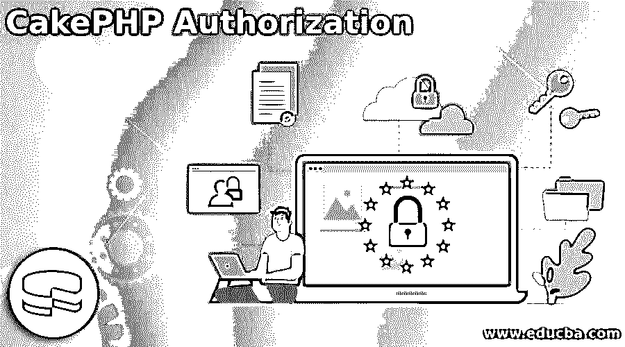
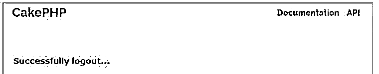

# CakePHP 授权

> 原文：<https://www.educba.com/cakephp-authorization/>

## CakePHP 授权简介

下面的文章提供了 CakePHP 授权的概要。CakePHP 是一个开源工具，它以可插拔的方式提供了一个 Auth 组件来执行我们的任务。Auth 组件用于提供身份验证和授权对象。换句话说，我们可以说它是两者的组合，用于根据我们的需求确定用户的授权和认证。身份验证意味着确定用户凭证并验证这些凭证，如用户名和密码。另一方面，授权意味着基于用户凭证和用户提供的其他信息来验证用户。

### 什么是 CakePHP 授权？

正如您可能知道的，添加了两个新模块“最近”(不是最近)来管理 CakePHP 应用程序中的认证和授权思想。长期以来，使用 AuthComponent 在控制器层监督身份验证和授权。随着任务的发展，这两件事通常会变得错综复杂，使得 AuthComponent 成为一个同时管理许多元素的复杂类。

<small>网页开发、编程语言、软件测试&其他</small>

这些新模块背后的第一个想法是重构 AuthComponent 并创建显式层来处理:

确认:你是谁？

赞同:你是说你被允许了吗？

我们将利用一个特定的模型来研究本文中的授权思想:我们应该设想一些游戏应用程序，其中用户将监督锦标赛。用户将希望进行新的锦标赛，并通过具有众多会员的锦标赛会员资格加入锦标赛。除非欢迎客户参加比赛，否则客户不会接近比赛。一个锦标赛的玩家可以欢迎不同的用户来玩。

### 如何检查 CakePHP 授权？

现在让我们看看如何检查 CakePHP 授权，如下所示:

在对我们各自的应用程序实现授权中间件之后，我们可以检查授权。这是因为中间件包装了每个请求的身份。

现在，让我们看看如何使用单个资源检查授权，如下所示:

他们可以通过策略让您实际了解某项单独资产的审批情况。通常这是一个 ORM 物质或应用领域对象。

您的政策给出了决定批准选择的理由:

**代码:**

`/ / Fetch identity from each and every request
$user = $this->request->getAttribute('identity');
// Checking authorization on $sample
if ($user->can('delete', $sample)) {
// Do delete operation
}`

现在让我们看看如何应用范围条件，如下所示:

每当您想要对各种项目(如分页查询)进行批准检查时，您将经常需要获得当前客户接近的记录。这个模块以“范围”的形式实现了这个想法

范围方法允许您“限定”查询或结果集的范围，并返回刷新的纲要或问题对象:

**代码:**

`// Fetch the identity from each and every request
$specified user = $this->request->getAttribute('identity');
$Sql_query = $specified fuser->ApplyScopeTo('index', $Sql_query);`

授权组件可以在监管者的活动中使用，以平滑批准，这提高了对失望的豁免。

### 创建 CakePHP 授权

现在让我们看看如何在 CakePHP 中创建授权，示例如下:

首先，我们需要了解需要考虑哪些参数，如下所示:

确认是辨别正确客户的最常见方式。CakePHP 支持三种验证。

*   **FormAuthenticate:** 它允许您确认客户给定的结构化帖子信息。通常，这是客户端输入数据的登录结构。这是默认的验证策略。
*   **BasicAuthenticate:** 它允许您确认客户端正在使用基本的 HTTP 验证。
*   **DigestAuthenticate:** 它允许您确认客户端正在使用 Digest HTTP 验证。

首先，我们需要如下配置 routes.php 文件:

**代码:**

`<?php
use Cake\Core\Plugin;
use Cake\Routing\RouteBuilder;
use Cake\Routing\Router;
Router::defaultRouteClass('DRoute');
Router::scope('/', function (RouteBuilder $routes) {
$routes->connect('/auth',['controller'=>'Auth','action'=>'index']);
$routes->connect('/login',['controller'=>'Auth','action'=>'login']);
$routes->connect('/logout',['controller'=>'Auth','action'=>'logout']);
$routes->fallbacks('DRoute');
});
Plugin::routes();`

之后，我们需要创建一个 controller.php 文件，并编写如下代码:

**代码:**

`<?php
namespace App\Controller;
use Cake\Controller\Controller;
use Cake\Event\Event;
use Cake\Controller\Component\AuthComponent;
class DemoController extends Controller {
public function initialize() {
parent::initialize();
$this->loadComponent('RequestHandler');
$this->loadComponent('Flash');
$this->loadComponent('Auth', [
'authenticate' => [
'Form' => [
'fields' => [
'username' => 'userid',
'password' => 'userpass'
] ] ],
'loginAction' => [
'controller' => 'Authexs',
'action' => 'login'
],
'loginRedirect' => [
'controller' => 'Authexs',
'action' => 'index'
],
'logoutRedirect' => [
'controller' => 'Authexs',
'action' => 'login'
] ]);
}
public function BFilter(Event $eventt) {
$this->Auth->allow(['index','view']);
$this->set('loggedIn', $this->Auth->specified user());
}
}`

现在创建 authcontrollr.php 文件，并编写如下代码:

**代码:**

`<?php
namespace App\Controller;
use App\Controller\AppController;
use Cake\ORM\TableRegistry;
use Cake\Datasource\ConnectionManager;
use Cake\Event\Eventt;
use Cake\Auth\DefaultPasswordHasher;
class AuthController extends AppController {
var $component = array('Auth');
public function index(){
}
public function login(){
if($this->request->is('post')) {
$specified_user = $this->Auth->identify();
if($user){
$this->Auth->setUser($specified_user);
return $this->redirect($this->Auth->redirectUrl());
} else
$this->Flash->errormsg('Entered username and password is wrong');
}
}
public function logout(){
return $this->redirect($this->Auth->logout());
}
}
Finally we need to create a login template to see the result as follows.
<?php
echo $this->Form->create();
echo $this->Form->control('UserID');
echo $this->Form->control('Userpass');
echo $this->Form->button('Submit');
echo $this->Form->end();
?>`

**说明:**

*   这里我们创建一个模板来查看结果。执行上面的代码后，我们将得到下面的屏幕。

在这里，我们可以提供登录的用户凭证。

我们必须为注销创建另一个 php 文件，并编写以下代码。

**代码:**

`<?php
echo $this->Html->link('logout',[
"controller" => "Auth","action" => "logout"
]);
?>`

执行上面的代码后，我们将得到下面的屏幕。

### CakePHP 授权安装

现在让我们看看如何在 CakePHP 中安装授权，如下所示:

首先，我们需要使用如下语句加载插件:

**代码:**

`$this-> addPlugin(‘Authorization’);`

之后，我们需要通过导入以下类来启用所有授权插件，如下所示:

**代码:**

`use Authorization\AuthorizationService;
use Authorization\AuthorizationServiceInterface;
use Authorization\AuthorizationServiceProviderInterface;
use Authorization\Middleware\AuthorizationMiddleware;
use Authorization\Policy\OrmResolver;`

按照我们的要求创建策略后，我们还需要按照我们的要求修改添加和编辑操作。上述要求我们可以通过编码来实现。

### 结论

从上面的文章中，我们已经了解了 CakePHP 授权的基本思想，并看到了 CakePHP 授权的表示和示例。最后，我们从本文中了解了如何以及何时使用 CakePHP 授权。

### 推荐文章

这是 CakePHP 授权指南。这里我们讨论介绍，创建，安装，以及如何检查 CakePHP 授权。您也可以看看以下文章，了解更多信息–

1.  [PHP 中迄今为止的时间戳](https://www.educba.com/timestamp-to-date-in-php/)
2.  [PHP ksort](https://www.educba.com/php-ksort/)
3.  [PHP 异或](https://www.educba.com/php-xor/)
4.  PHP 获取数组的第一个元素

