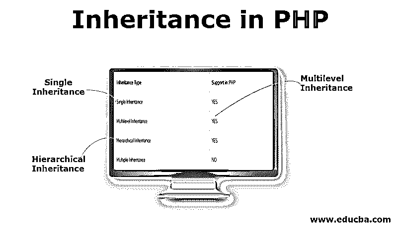
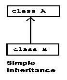
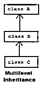
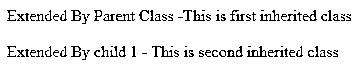
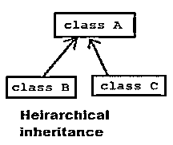
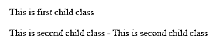

# PHP 中的继承

> 原文：<https://www.educba.com/inheritance-in-php/>




## PHP 中的继承介绍

继承是在新创建的类中扩展现有类功能的方式。除了扩展基类功能之外，我们还可以向新创建的类添加一些额外的功能。当我们继承一个类时，我们说一个继承的类是一个子类(子类),我们从它继承的被称为父类。父类也称为基类。这是能够更好地管理编程代码和代码可重用性的方法。使用继承背后的想法是为了更好地管理代码和代码的可重用性。在这个主题中，我们将学习 PHP 中的继承。

### PHP 中的继承类型

PHP 像 JAVA 一样支持各种类型的[继承。下表列出了 PHP 中的继承类型和支持状态。](https://www.educba.com/what-is-java-inheritance/)

<small>网页开发、编程语言、软件测试&其他</small>

| **继承类型** | **PHP 中的支持** |
| 单一遗传 | 是 |
| 多级遗传 | 是 |
| 分层继承 | 是 |
| 多重遗传 | 不 |

#### 1.单一遗传

PHP 支持单一继承。[单一继承](https://www.educba.com/single-inheritance-in-c-plus-plus/)是 PHP 中的一个概念，一个类只能被一个类继承。在这个过程中，我们需要上两节课。一个是基类(父类)，另一个是子类本身。我们用一个例子来理解同样的道理。这就是通常所说的简单继承。这种类型的继承在 [PHP 语言](https://www.educba.com/what-is-php/)中与 [JAVA、C++](https://www.educba.com/c-plus-plus-vs-java/) 等保持一致。




**代码:**

```
<?php
class MyAccess {
var $var = "This is first var";
protected $fist_name;
// simple class method
function returnVar() {
echo $this->fist_name;
}
function set_fist_name($set_this){
$this->fist_name = $set_this;
}
}
class child extends MyAccess {
function setVal($set_this){
$this->fist_name = $set_this;
}
function getVal(){
echo $this->fist_name;
}
}
$obj1 = new child();
$obj1->setVal("Jai Shre");
$obj1->getVal();
?>
```

MyAccess 是父类，child 是子类的名称。

**输出:**


#### 2.多级遗传

PHP 支持[多级继承](https://www.educba.com/multilevel-inheritance-in-c-plus-plus/)。在这种类型的继承中，我们将有两个以上的类。在这种类型的继承中，父类将被子类继承，然后子类将被子类继承。PHP 语言中这种类型的继承与 C++等保持一致。




**代码:**

```
<?php
class ParentClass {
var $var = "This is first var";
public $fist_name;
// simple class method
function returnVar() {
echo $this->fist_name;
}
function set_fist_name($set_this){
$this->fist_name = $set_this;
}
}
class child_1 extends ParentClass {
function setVal($set_this){
$this->fist_name = $set_this;
}
function getVal(){
echo "Extended By Parent Class -". $this->fist_name;
}
}
class child_2 extends child_1 {
function setVal($set_this){
$this->fist_name = $set_this;
}
function getVal(){
echo "Extended By child 1  - ".$this->fist_name;
}
}
$obj1 = new child_1();
$obj1->setVal("This is first inherited class");
$obj1->getVal();
echo "<br/><br/>";
$obj2 = new child_2();
$obj2->setVal("This is second inherited class");
$obj2->getVal();
?>
```

**输出:**




#### 3.分层继承

PHP 支持[层次继承](https://www.educba.com/hierarchical-inheritance-in-java/)。层次继承是这样一种类型的继承，其中一个程序由一个父类和多个子类组成。让我们用这个例子来理解同样的道理。PHP 语言中这种类型的继承与 JAVA、C++等保持一致。




**代码:**

```
<?php
class ParentClass {
var $var = "This is first var";
public $fist_name;
// simple class method
function returnVar() {
echo $this->fist_name;
}
function set_fist_name($set_this){
$this->fist_name = $set_this;
}
}
class child_1 extends ParentClass {
function setVal($set_this){
$this->fist_name = $set_this;
}
function getVal(){
echo $this->fist_name;
}
}
class child_2 extends ParentClass {
function setVal($set_this){
$this->fist_name = $set_this." - ".$set_this;;
}
function getVal(){
echo $this->fist_name;
}
}
$obj1 = new child_1();
$obj1->setVal("This is first child class");
$obj1->getVal();
echo "<br/><br/>";
$obj2 = new child_2();
$obj2->setVal("This is second child class");
$obj2->getVal();
?>
```

**输出:**




我们有一个名为 parent class 的父类和两个子类，分别是 child_1 和 child_2。给定的继承场景称为[层次继承](https://www.educba.com/hierarchical-inheritance-in-c-plus-plus/)。

### 继承在 PHP 中的重要性

继承的重要性更大，因为它带来了巨大的好处。

*   代码可重用性是继承中最常用的[之一；基类保留在进程之间。正如我们在上面所有继承的例子中所看到的，代码从一个类到另一个类被重用。我们不需要一遍又一遍地重写同样的东西。](https://www.educba.com/inheritance-in-python/)
*   基类可以被类层次结构中[的多个派生类使用。是的，这是一种继承类型，我们可以用](https://www.educba.com/hierarchy-in-tableau/)[多重继承](https://www.educba.com/multiple-inheritance-in-python/)在父类中进行扩展。
*   可扩展性是继承的优点之一，在继承中，我们可以扩展基类特性，而无需做很少或不做任何更改来满足业务需求。假设在开始的时候，我们只有一个父类，没有子类。但是在需要的情况下，我们可以添加子类来满足我们以后的业务需求。
*   [覆盖是这种继承特性的另一个优点](https://www.educba.com/overriding-in-php/)，我们可以将基类函数的定义重写到派生类中，以根据业务需求进行更改。
*   更少的代码量——与此同时，与传统的编码方式相比，在继承的过程中，我们将拥有更少的代码。
*   继承也启用了数据隐藏特性。我们可以使用各种 PHP 访问修饰符将父类唯一需要的部分暴露给子类。
*   完全支持 MVC——我们可以通过使用继承的概念来实现 MVC。

### 结论

我们应该使用继承来完成我们的业务，因为与普通代码相比，它带来了一些额外的优势。在处理继承时，我们应该注意数据的安全性。我们可以使用 private、protected 这样的访问修饰符来处理数据隐藏和数据安全问题。PHP 不支持[多重继承。](https://www.educba.com/multiple-inheritance-in-php/)

### 推荐文章

这是一个 PHP 继承指南。在这里，我们讨论 PHP 中的继承类型，即单级继承、多级继承和分层继承，并给出了相应的示例代码。您也可以阅读以下文章，了解更多信息——

1.  [PHP 中的重载](https://www.educba.com/overloading-in-php/)
2.  [Python 中的单一继承](https://www.educba.com/single-inheritance-in-python/)
3.  [Java 中的多级继承](https://www.educba.com/multilevel-inheritance-in-java/)
4.  [c++中的多重继承](https://www.educba.com/multiple-inheritance-in-c-plus-plus/)


