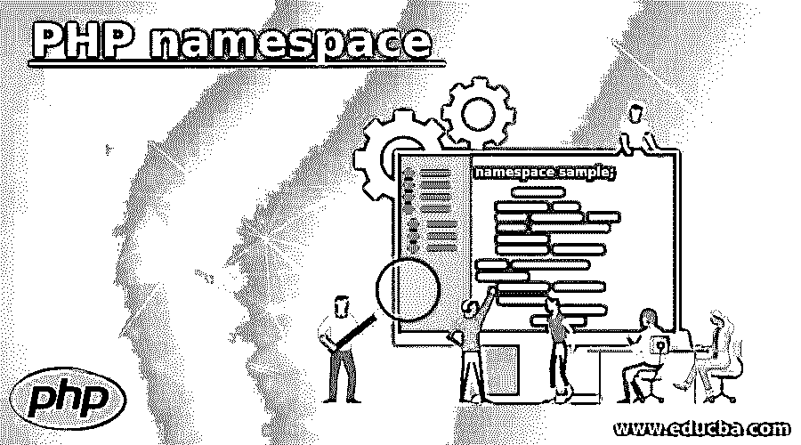
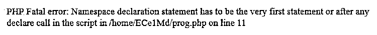

# PHP 名称空间

> 原文：<https://www.educba.com/php-namespace/>

## PHP 名称空间介绍

PHP 中的名称空间类似于 C++中的名称空间，c++通过重用名称来封装项目，以避免名称冲突。在许多情况下，它也被视为一个抽象的概念。它允许在不同的名称空间中重新声明相同的类或接口或函数或常量函数，而不会收到致命错误。这个名称空间是一个分层标记的代码块，包含一个普通的 PHP 代码。它由一个有效的 PHP 代码组成。此外，它还会影响代码类型，如类、函数、常数和接口。命名空间是使用关键字 namespace 声明的。

**语法:**

<small>网页开发、编程语言、软件测试&其他</small>

`namespace sample;`

这里声明了一个名称空间示例。

与其他 PHP 标识符类似，名称空间也应该遵循一些规则。也就是说，名称空间应该以下划线或字母开头，后跟字母、下划线或数字。

### PHP 中的名称空间是如何工作的？

让我们把一个名称空间想象成一个橱柜，我们可以在里面存放所有的物品，比如衣服、饰品等等。对于每个人，将有一个单独的橱柜可以存放他们的物品。为了识别每个人的橱柜，可以给每个人一个标签，这样就不会发生任何混淆。过去，程序员在常量、类和函数中使用下划线来分隔代码基。类似于给每个人的物品贴上标签，放在一个大柜子里。即使是有组织的，效率也不会更高。

在这种情况下，名称空间的概念就出现了。可以在不同的名称空间中声明相同的类、接口、函数和常数，而不会出现任何致命错误。基本上，名称空间是一个分层标记的代码块，用于保存普通的 PHP 代码。

正如我们已经提到的，PHP 中的名称空间通过重用名称来封装项目，以避免名称冲突。

例如，考虑下面提到的一个 PHP 程序。

**代码:**

`<?php
namespace sample ;
function func()
{
echo ' Never give up! Keep trying . . . ' ;
}
// Resolves to the function
func() ;
?>`

可以看到存在一个 func 函数，它在执行代码时打印一个文本。

随着 PHP 代码库大小的增加，有可能无意中重用已经声明的类名或函数。如果添加第三方组件和插件，问题会更加严重。此外，名称冲突问题可以在名称空间的帮助下得到解决。PHP 常量、函数和类可以聚集到命名空间库中。这些命名空间可以遵循特定的层次结构，类似于计算机上文件系统中可用的文件夹。子名称空间的概念对于安排项目结构非常有用。如果项目需要访问数据库，所有与数据库相关的代码，比如数据库的异常、连接处理程序，都可以保存在一个名为 DB 的子名称空间中。

为了保持灵活性，最好将子名称空间保存在子目录中。这激发了项目的结构化，也使得使用遵循标准 PSR-0 的自动加载器变得容易。

通常，PHP 中会使用反斜杠作为名称空间分隔符。

**举例:**

**代码:**

`Sample\Sub Sample
Sample\SubSample\Samp
College\Proj\Common\Widget`

在全局声明名称空间的情况下，可以不使用任何名称来声明它，如下所示。

**代码:**

`<?php
namespace {
// Global . . . !
}
?>`

在某些情况下，一个 PHP 代码中可以使用多个名称空间，如下所示。

**代码:**

`<?php
namespace sam {
}
namespace samp {
}
namespace {
}
?>`

**Note:** It should be noted that the namespace has to be declared first in the PHP program. If any code is given below, it will be detected as invalid as the namespace is not given initially.

**代码:**

`<?php
echo "Never Give up ! " ;
namespace Html ;
. . .
?>`

### PHP 名称空间的示例

下面给出了 PHP 名称空间的例子:

#### 示例#1

一个 PHP 程序，使用一个名称空间并隐式和显式地调用一个函数。

**代码:**

`<?php
namespace sample;
function func()
{
echo 'Never give up! Keep trying. . .';
}
// Resolves to the function
func();
// Explicitly resolves to the function
namespace\func();
?>`

**输出:**

在程序中，首先创建一个名称空间示例。之后，可以看到定义了一个函数 func，它在执行代码时打印一个文本。当函数被隐式和显式调用时，文本被打印两次。

假设命名空间是在定义函数之后声明的，如下所示。然后，会发生什么？

**代码:**

`<?php
function func()
{
echo 'Never give up! Keep trying. . .';
}
// Resolves to the function
func();
namespace sample;
// Explicitly resolves to the function
namespace\func();
?>`

是的…将显示一个错误，如下所示。也就是说，命名空间应该在程序开始时定义。

**输出:**

#### 实施例 2

PHP 程序，使用一个名称空间并调用一个函数来打印表格细节。

**代码:**

`<?php
namespace Html;
class sampletable {
public $heading= "";
public $cntrows= 0;
public function fnc() {
echo "
 The Table used is '{$this->heading}' that has {$this->cntrows} different rows. . . .
";
}
}
$tb= new sampletable ();
$tb->heading= " Students ";
$tb->cntrows= 8 ;
?>
<!DOCTYPE html>
<html>
<body>
<?php
$tb->fnc();
?>
</body>
</html>`

**输出:**

在程序中，首先创建一个名称空间 Html。之后，创建一个类 sampletable，变量 heading，cnt rows。还存在包含文本的函数 func。之后给出了一个标题学生和 8 个行数。在执行代码时，打印出带有表名和行数的行。

### 结论

PHP 中的名称空间类似于 C++中的名称空间，c++通过重用名称来封装项目，以避免名称冲突。在本文中，将详细解释 size()函数的语法、工作原理和示例等不同方面。

### 推荐文章

这是 PHP 名称空间的指南。这里我们讨论一下 PHP 中名称空间的工作原理。并分别举例说明。您也可以看看以下文章，了解更多信息–

1.  [PHP 梁()](https://www.educba.com/php-strlen/)
2.  [PHP array_pop()](https://www.educba.com/php-array_pop/)
3.  [PHP 内爆](https://www.educba.com/php-implode/)
4.  [PHP sscanf()](https://www.educba.com/php-sscanf/)

