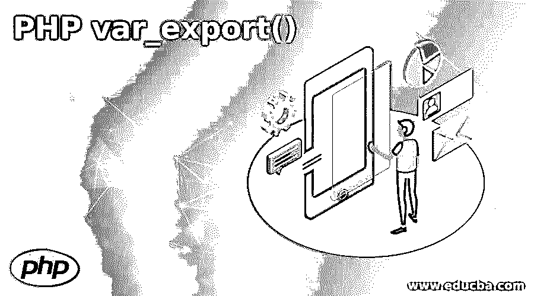
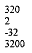
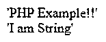
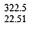
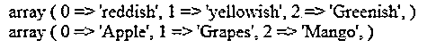
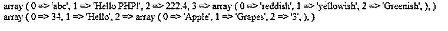
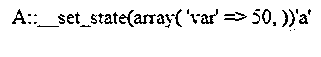

# PHP var_export()

> 原文：<https://www.educba.com/php-var_export/>

## PHP var_export()简介

PHP 提供了一个 var_export 函数，可以返回任何变量的结构化信息。无论用 var_export()定义的变量是什么，都会产生结构化的信息。这个函数的返回值是一个有效的 PHP 代码。这使得 var_export 成为与其定义的函数 var_dump()不同的唯一函数。PHP 的这个 var_export 函数是在 PHP 4 稳定发布版 PHP 之后出现的。该函数仅将值作为任何变量的结构化信息返回。

**PHP var _ export()**的语法

<small>网页开发、编程语言、软件测试&其他</small>

下面给出了 PHP var_export()的语法:

`var_export(variable, return)`

*   **变量:**我们要导出的变量。
*   **return:** 可选参数，如果使用，返回变量表示。

变量是一个必需的参数，其数据类型为 String。其中，作为返回的是作为布尔数据类型的可选参数。

**举例:**

**代码:**

`<!DOCTYPE html>
<html>
<body>
<?php
$a = 3;
echo var_export($a, true) . " ";
echo var_export($a) . " ";
?>
</body>
</html>`

**输出:**

### var_export()函数正在工作

*   var_export()函数将输入作为要检查其结构化定义的变量。返回值取决于返回参数(使用的可选参数，并设置为 true)。
*   如果不这样做，函数将返回 null。当使用 return 参数时，它使用内部输出缓冲方法，基本上是告诉 PHP 在将数据发送到浏览器之前保存一些数据。有了这些，我们就可以检索数据并在需要时对其进行操作，以避免使用回调函数。
*   这个函数返回一个包含变量结构化信息的有效 PHP 代码。

### PHP var_export()的例子

以具有基本数据类型的 PHP 为例:

#### 例子#1:整数

这将整数作为输入，结果是变量的结构化信息为整数。

**代码:**

`<!DOCTYPE html>
<html>
<body>
<?php
$a = 320;
echo var_export($a) . " ";
$a = 2;
echo var_export($a) . " ";
$a = -32;
echo var_export($a) . " ";
$a = 3200;
echo var_export($a) . " ";
?>
</body>
</html>`

**输出:**

#### 示例 2:字符串

它将 String 作为输入，结果将变量的结构化信息作为 String。

**代码:**

`<!DOCTYPE html>
<html>
<body>
<?php
$b = "PHP Example!!";
echo var_export($b) . " ";
$b = "I am String";
echo var_export($b) . " ";
?>
</body>
</html>`

**输出:**

#### 例 3:双精度

这将 Double/Decimal 作为输入，从而将变量的结构化信息作为 Double。

**代码:**

`<!DOCTYPE html>
<html>
<body>
<?php
$a = 322.5;
echo var_export($a) . " ";
$a = 22.51;
echo var_export($a) . " ";
?>
</body>
</html>`

**输出:**

#### 示例#4:数组

它将 Array 作为输入，将变量的结构化信息作为 Array。

**代码:**

`<!DOCTYPE html>
<html>
<body>
<?php
$a = array("reddish", "yellowish", "Greenish");
echo var_export($a) . " ";
$a = array("Apple", "Grapes", "Mango");
echo var_export($a) . " ";
?>
</body>
</html>`

**输出:**

#### 例 5:数组的数组

它将数组的数组作为输入，将变量的结构化信息作为数组。

**代码:**

`<!DOCTYPE html>
<html>
<body>
<?php
$a = array("abc", "Hello PHP!", 222.4, array("reddish", "yellowish", "Greenish"));
echo var_export($a) . " ";
$a = array(34, "Hello", array("Apple", "Grapes", "3"));
echo var_export($a) . " ";
?>
</body>
</html>`

**输出:**

**

** 

我们甚至可以设置一个对象并用一个变量映射它。在 var_export 函数中调用这个细节将给出一个对象的状态。

让我们用一个例子来验证一下:

**代码:**

`<!DOCTYPE html>
<html>
<body>
<?php
$person = new stdClass;
$person->name = 'John Anand';
$person->website = 'https://php.net/John.php';
echo var_export($person);
?>
</body>
</html>`

**输出:**

我们还可以在 PHP 中定义一个类，并使用 var_export 函数来设置类变量的状态。

让我们用一个例子来验证一下:

**代码:**

`<!DOCTYPE html>
<html>
<body>
<?php
class A { public $var; }
$a = new A;
$a->var = 50;
var_export($a);
echo var_export(a);
?>
</body>
</html>`

**输出:**

### 短信

PHP var 导出函数需要注意以下几点:

*   此 VarExport 函数不导出类型资源变量。
*   VarExport 函数也不处理循环引用，因为不会为循环引用生成可解析的 PHP 代码。
*   处理的对象实现 _set_state 方法，但 stdClass 除外，它是使用与对象一起转换的数组导出的。

### 结论

从上面的文章中，我们看到了函数 var_export 在 PHP 中的使用。我们试图通过各种例子和分类来了解 var_export()函数在 PHP 中是如何工作的，以及它在编程级别上的用途。我们还看到了内部工作原理以及拥有我们为各种编程目的定义的数据类型的优势。此外，语法和例子帮助我们更精确地理解了函数。

### 推荐文章

这是一个 PHP var_export()的指南。在这里我们分别讨论简介、var_export()函数的工作原理和例子。您也可以看看以下文章，了解更多信息–

1.  [PHP require_once](https://www.educba.com/php-require_once/)
2.  [PHP XML 阅读器](https://www.educba.com/php-xml-reader/)
3.  [PHP XMLWriter](https://www.educba.com/php-xmlwriter/)
4.  [PHP mail()](https://www.educba.com/php-mail/)

