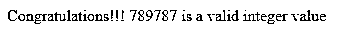
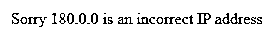
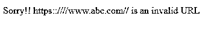
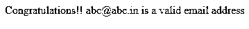
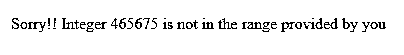

# PHP 过滤器 _var

> 原文：<https://www.educba.com/php-filter_var/>

## PHP filter_var 简介

Php filter_var()是一个用指定的过滤器过滤给定变量的函数。净化和验证数据，如 email_id、IP 地址等。，在 Php 中，使用 filter_var()函数(其中包含数据)。文本中的验证意味着输入数据的格式是否正确。例如，在该人的电子邮件 id 中，是否存在“@”符号。在电话号码字段中，所有的数字都应该出现。净化是指净化输入的数据或从中删除非法或不必要的字符，以防止将来出现任何问题。例如，从用户电子邮件中删除不必要的符号和字符。

**语法:**

<small>网页开发、编程语言、软件测试&其他</small>

下面给出的是 Php 中 filter_var()函数的基本语法:

`filter_var(variable, filtername, options)`

在哪里，

*   **变量:**该参数代表变量字段，需要过滤的变量。这是必填字段。
*   **filtername:** 该参数代表用户想要使用的过滤器的名称。这是一个可选参数。如果未指定，则使用 FILTER_DEFAULT，这意味着不会对给定变量进行过滤。
*   **选项:**该参数是可选的。它指定了要使用的选项/标志。它基本上是标志或选项的按位析取的关联数组。如果在 filter_var()函数中使用此参数，则必须在“flags”字段中提供一个标志，并且必须为回调函数传递一个可调用类型。接受所有参数后，返回经过过滤和净化的变量。

**返回值:**如果数据/变量没有被过滤，上述函数返回过滤后的值或 false。

### Php 中 filter_var 函数是如何工作的？

在 php 中，filter_var()方法接受上面解释的各种参数，并返回经过验证/净化的数据。验证意味着检查程序员指定的数据格式，净化意味着从数据中删除不必要的字符以返回程序员要求的数据。

### PHP filter_var 示例

让我们通过例子来理解 Php 中 filter_var()函数的工作原理:

#### 示例#1

使用 filter_var()函数验证整数值:

**代码:**

`<!DOCTYPE html>
<html>
<body>
<?php
// Integer value to check
$value = 789787;
// passing the value in the filter_var() function
if (filter_var($value, FILTER_VALIDATE_INT))
{
echo("Congratulations!!! $value is a valid integer value");
}
else
{
echo("Sorry!! $value is not a valid integer value");
}
?>
</body>
</html>`

**输出:**

**说明:**

在上面的代码中，要验证的整数值存储在变量“value”中，然后在 filter_var()方法中与“FILTER_VALIDATE_INT”筛选器名称一起传递以验证它。最后，应用条件操作符 if 和 else 来检查条件，并使用“echo”在控制台上打印相应的输出。

#### 实施例 2

使用 filter_var()函数验证计算机设备的 IP 地址

**代码:**

`<!DOCTYPE html>
<html>
<body>
<?php
// Ip Address to validate
$ip = '180.0.0';
//Passing the ip address and applying the specific ip filter name
if (filter_var($ip, FILTER_VALIDATE_IP)){
echo("Congratulations!! $ip is a valid IP address, passed by the you");
}
else
{
echo("Sorry $ip is an incorrect IP address");
}
?>
</body>
</html>`

**输出:**

**说明:**

在上面的代码中，使用 filter_var()方法验证计算机或任何其他网络设备的 IP 地址。要验证的 ip 地址存储在变量“ip”中因为 IP 地址有其特定的格式“x.y.z.w”，所以使用 filter_var()函数中的“FILTER_VALIDATE_IP”对其进行验证。最后，验证传递的 ip 地址，并使用“echo”将相应的输出打印在控制台上。

#### 实施例 3

使用 filter_var()函数净化和验证 URL 地址

**代码:**

`<!DOCTYPE html>
<html>
<body>
<?php
// URL which is to be checked
$check_url = "https::////www.abc.com//";
// Sanitizing the URL by removing unnecessary characters from it if any
$check_url = filter_var($check_url, FILTER_SANITIZE_URL);
// Validating the url by passing the appropriate filter name and the sanitized url
if(!filter_var($check_url, FILTER_VALIDATE_URL) == false) {
echo("Congratulations!!! $check_url is the correct URL");
}
else
{
echo("Sorry!! $check_url is an invalid URL");
}
?>
</body>
</html>`

**输出:**

**说明:**

在上面的代码中，具有特定格式的 URL 地址首先被清理，然后使用 filter_var()方法进行验证。要检查的 URL 存储在变量“check_url”中为了整理 url，将“FILTER_SANITIZE_URL”作为过滤器名称与 URL 一起传递。清理后，使用“FILTER_VALIDATE_url”过滤器名称和 URL 对 URL 进行验证，并使用“echo”在控制台上打印相应的验证输出

#### 实施例 4

使用 filter_var()函数验证用户的电子邮件地址

**代码:**

`<!DOCTYPE html>
<html>
<body>
<?php
// email address to be checked
$email_check = "abc@abc.in";
// Validating the email by passing the email address and the filtername
if (filter_var($email_check, FILTER_VALIDATE_EMAIL))
{
echo("Congratulations!! $email_check is a valid email address");
}
else
{
echo("Sorry!! You have entered an incorrect email address");
}
?>
</body>
</html>`

**输出:**

**说明:**

在上面的例子中，要检查的电子邮件地址存储在变量“email_check”中使用 Php 中的 filter_var()函数对其进行验证，绕过 email 变量和相应的过滤器名称(FILTER_VALIDATE_EMAIL)。由于传递的电子邮件是无效的，所以使用“echo”将响应打印在控制台上

**例#5**

**代码:**

`<!DOCTYPE html>
<html>
<?php
// Integer value to be checked
$value = 465675;
// Validating the above integer value range using the 'options' parameter
if(filter_var($value, FILTER_VALIDATE_INT, array("options" => array("min_range" => 10,"max_range" => 4000))))
{
echo "Integer $value is within the specified range";
}
else
{
echo "Sorry!! Integer $value is not in the range provided by you";
}
?>
</body>
</html>`

**输出:**

**说明:**

在上面的示例中，将针对给定范围验证整数值，即测试 10 到 400。然后，在 filter_var()函数中，要测试的值与过滤器名称(FILTER_VALIDATE_INT)和 1 个可选参数一起传递，即“options”具有指定最小和最大范围的数组。最后，验证变量，相应地，使用“echo”将响应打印在控制台上。

### 结论

上面的描述清楚地解释了 Php 中的 filter_var()函数是什么，以及它如何验证和净化传递给它的变量。这是程序员通常用来过滤数据以防止安全漏洞的重要功能之一。但是，该函数通过根据具体要求传递不同的参数，方便了不同过滤器的使用，因此程序员在程序中使用它之前需要深入理解它。

### 推荐文章

这是一个 PHP filter_var 的指南。这里我们讨论 filter_var 函数在 Php 中是如何工作的，并给出了代码和输出的例子。您也可以看看以下文章，了解更多信息–

1.  [PHP 自定义异常](https://www.educba.com/php-custom-exception/)
2.  [PHP 删除文件](https://www.educba.com/php-delete-file/)
3.  [PHP usort()](https://www.educba.com/php-usort/)
4.  [PHP XML 阅读器](https://www.educba.com/php-xml-reader/)

