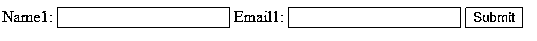
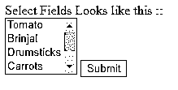
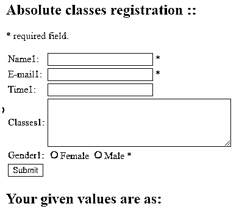

# PHP 表单验证

> 原文：<https://www.educba.com/php-form-validation/>

## PHP 表单验证简介

PHP 表单验证意味着在 PHP 表单的帮助下检查用户提交的输入。PHP 表单可能包含不同类型的验证技术。在许多情况下，PHP 表单验证的“*”符号用于必填字段。有不同类型的任务验证。PHP 将从一个内容表单中进行内容处理，但是这个表单将使用 HTML 来制作。在文本中，PHP 表单可能包含不同类型的输入。它可能包含文本字段、单选按钮、具有多个选项的选择列表、复选框、提交按钮等。这些表单输入将用于验证。

### PHP 中的各种表单验证

PHP 编程语言的技术中有各种形式的验证，这将帮助我们很多无效。假设您输入了任何错误的内容，错误将会被忽略/高亮显示，并在相关字段显示一条消息。

<small>网页开发、编程语言、软件测试&其他</small>

PHP web 语言中有两种类型的验证。=

**1。客户端验证:**在客户端验证中，将在浏览器/任何其他客户端 web 应用程序上执行验证。

**2。服务器端验证:**在服务器端验证中，数据提交后会在服务器端进行验证，并将该数据发送到服务器端进行验证。

用于验证规则的字段:

*   **Name:** 这个字段在 PHP 表单中是必填的。它应该只包含空格和字母。
*   电子邮件:这也是一个必填字段，就像 PHP 表单中的姓名字段一样。它应该只包含带有“@”和“.”的特定有效电子邮件地址在正文中间。
*   **网站:**这不像电子邮件字段那样是必填字段。这是一个可选字段。如果此网站字段有一些文本，它应该是有效的 URL 地址。
*   **注释:**这也是一个可选字段，但它包含多行输入字段(文本输入区)
*   **性别:**与姓名和电子邮件字段一样，是必填字段。它让我们只能从两个、三个或更多选项中选择一个。大多数情况下，PHP 表单中只会提供两个选择选项。

#### PHP 表单的文本字段

上述字段如姓名、网站、电子邮件、评论是文本输入元素。通常情况下，语法如下所示:

**语法:**

`Name1: <input type="text" name="name1">
E-mail1: <input type="text" name="email1">
Website1: <input type="text" name="website1">
Comment1: <textarea name="comment" rows="6" cols="40"></textarea>`

**说明:**

上述 html 表单元素用于抓取/指定文本内容。如果您观察，对于每种输入类型,“文本”都被定义为文本输入元素。

#### 单选按钮字段/元素

只有一些字段接受单选按钮(选择选项)，基本的 HTML 代码如下所示:

**语法:**

`Gender1:
<input type="radio" name="gender1" value="female">Female1
<input type="radio" name="gender1" value="male">Male1
<input type="radio" name="gender1" value="other">Other1`

#### HTML 表单元素

HTML 表单元素主要接受两个特定的属性。它们是动作和方法属性。动作方法属性定义了发送的表单内容，然后

**HTML 表单的基本语法:**

`<form name='test1' method='POST' action='' accept-charset='UTF-8'>
Name1: <input type='text' name='Name1' size='20'>
Email1: <input type='text' name='Email1' size='20'>
<input type='submit' name='Submit1' value='Submit'>
</form>`

**以上语法的输出:**

#### 选择列表字段和提交按钮字段

它会提供一些选项供多选。比如从市场上挑选蔬菜回家，或者从多种水果中挑选不同种类的水果。我们得到的提交按钮是在输入类型“提交”的帮助下创建的。

**选择列表的语法:**

`<form name='test1' method='POST' action='' accept-charset='UTF-8'>
Select Fields Looks like this ::
 
<select name="requiredVegetables[]" size="4" multiple>
<option value="Tomato">Tomato</option>
<option value="brinjal">Brinjal</option>
<option value="drumsticks">Drumsticks</option>
<option value="Carrots">Carrots</option>
<option value="Onion">Onion</option>
<option value="Beetroot">Beetroot</option>
</select>
<input type='submit' name='Submit1' value='Submit'>
</form>`

**以上语法的输出:**

为了验证 PHP 表单，必须在 HTML 的起点放置$ _ SERVER[“REQUEST _ METHOD”]。如果 REQUEST_MODE 有 POST as 值，那么您将知道 PHP 脚本已提交。我们也可以用 GET 作为一些不同特性的值。

#### 验证 PHP 表单内容

当 PHP/HTML 表单被创建/提交时，它将在“$_POST”数组或“$_GET”数组的帮助下被存储，并且它基于表单方法属性。表单的动作定义了提交表单时将内容发送到哪里。这里“$_SERVER["PHP_SELF"]”的值。PHP_SELF 包含将要执行的 PHP 编程脚本的文件名。PHP_SELF 是一个超级全局变量，它将返回当前正在执行的编程脚本的文件名。已提交。在这里,“因此使用 GET 作为值选择 dif $ _ SERVER[“REQUEST _ METHOD”]的值用于知道脚本是否被提交。这里“POST”值用于 REQUEST_METHOD。

**举例:**

这是 PHP 表单验证的例子。这里所有类型的输入方法、字段都与 PHP 函数一起使用。filter_var()函数在指定过滤器的帮助下过滤变量。查看下面的输出，以便您能够理解。

**语法:**

`<html>
<head>

</head>
<body>
<?php
$nameErr1 = $emailErr1 = $genderErr1 = $websiteErr1 = "";
$name1 = $email1 = $gender1 = $comment1 = $website1 = "";
if ($_SERVER["REQUEST_METHOD"] == "POST") {
if (empty($_POST["name1"])) {
$nameErr1 = "Name1 is required";
}else {
$name1 = test_input($_POST["name1"]);
}
if (empty($_POST["email1"])) {
$emailErr1 = "Email1 is required";
}else {
$email1 = test_input($_POST["email1"]);
if (!filter_var($email1, FILTER_VALIDATE_EMAIL)) {
$emailErr1 = "Invalid email1 format";
}
}
if (empty($_POST["website1"])) {
$website1 = "";
}else {
$website1 = test_input($_POST["website1"]);
}
if (empty($_POST["comment1"])) {
$comment1 = "";
}else {
$comment1 = test_input($_POST["comment1"]);
}
if (empty($_POST["gender1"])) {
$genderErr1 = "Gender1 is required";
}else {
$gender1 = test_input($_POST["gender1"]);
}
}
function test_input($data1) {
$data1 = trim($data1);
$data1 = stripslashes($data1);
$data1 = htmlspecialchars($data1);
return $data1;
}
?>
<h2>Absolute classes registration ::</h2>

* required field.

<form method = "post" action = "<?php
echo htmlspecialchars($_SERVER["PHP_SELF"]);?>">
<table>
<tr>
<td>Name1:</td>
<td><input type = "text" name = "name1">
* <?php echo $nameErr1;?>
</td>
</tr>
<tr>
<td>E-mail1: </td>
<td><input type = "text" name = "email1">
* <?php echo $emailErr1;?>
</td>
</tr>
<tr>
<td>Time1:</td>
<td> <input type = "text" name = "website1">
<?php echo $websiteErr1;?>
</td>
</tr>
<tr>
<td>Classes1:</td>
<td> <textarea name = "comment1" rows = "5" cols = "40"></textarea></td>
</tr>
<tr>
<td>Gender1:</td>
<td>
<input type = "radio" name = "gender1" value = "female">Female
<input type = "radio" name = "gender1" value = "male">Male
* <?php echo $genderErr1;?>
</td>
</tr>
<td>
<input type = "submit" name = "submit1" value = "Submit">
</td>
</table>
</form>
<?php
echo "<h2>Your given values are as:</h2>";
echo $name1;
echo " ";
echo $email1;
echo " ";
echo $website1;
echo " ";
echo $comment1;
echo " ";
echo $gender1;
?>
</body>
</html>`

**输出:**

### 结论

我希望你学习了 PHP 表单验证的定义，PHP 编程语言中的各种表单验证的细节，以及 PHP 表单中不同类型的输入方法的各种例子，以确保验证完美并理解这个概念。

### 推荐文章

这是一个 PHP 表单验证指南。这里我们讨论 PHP 中各种形式的验证以及编程示例，以便更好地理解。您也可以看看以下文章，了解更多信息–

1.  [PHP 日志错误](https://www.educba.com/php-log-errors/)
2.  [PHP 最终类](https://www.educba.com/php-final-class/)
3.  [HTML 中的 PHP 标签](https://www.educba.com/php-tag-in-html/)
4.  [PHP 数据对象](https://www.educba.com/php-data-object/)

