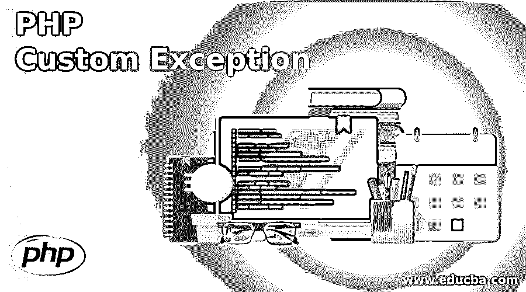
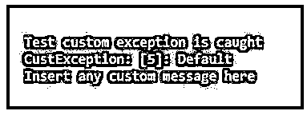

# PHP 自定义异常

> 原文：<https://www.educba.com/php-custom-exception/>

## PHP 自定义异常简介

当错误发生时，脚本的正常流程停止，可以使用异常来改变错误。通过扩展 PHP 代码库中已经内置的异常类，用户可以根据库、公司或我们的应用程序的要求自定义异常。在这里，我们将看到属性和成员，它们都在从内置异常类获取的子类的范围内。我们还将看到可以在编码中使用的 SQL 异常。

发生异常时会发生以下事情:

<small>网页开发、编程语言、软件测试&其他</small>

*   首先保存代码的当前状态。
*   代码的执行将被切换到自定义的异常处理函数。
*   异常处理程序将从代码的保存状态继续执行，终止其执行，或者从代码的另一个位置继续执行。

让我们知道为什么除了内置的例外，我们还需要自定义某些例外:

*   我们可以很容易地在代码的层次结构中准确识别哪个类、扩展或字符串产生了异常。
*   通过使用这一点，开发人员可以很容易地发现代码中的问题。
*   可用于标记某些库异常，如 DOM、PDO 等。
*   我们可以根据需要配置任意多的自定义异常。

### PHP 自定义异常的语法

对于要抛出的自定义异常，我们应该简单地从已经内置的异常类中扩展另一个类。

`namespace CustExcep;
class CustException extends \Exception { }`

现在创建了上面的 CustException 类，我们可以抛出一个自定义异常，如下所示:

`throw new \CustExcep\CustException('Insert an Exception message here');`

我们还可以根据需要对其进行定制，以覆盖某些类属性，如文件、代码、行及其消息，或者通过使用 __toString()方法将此异常消息强制为我们必须使用的格式。

### PHP 中自定义函数的使用

让我们通过几个例子来看看这个函数的工作原理:

#### 示例#1

**代码:**

`<?php
/**
* Here defining a class for custom exception
*/
class CustException extends Exception
{
// Here we are redefining the exception message so it is not optional
public function __construct($exmsg, $val = 0, Exception $old = null) {
// random code goes here
$exmsg = 'Default';
// ensure assignment of all values correctly
parent::__construct($exmsg, $val, $old);
}
// representing the custom string object
public function __toString() {
return __CLASS__ . ": [{$this->code}]: {$this->message}\n";
}
public function custFunc() {
echo "Insert any custom message here\n";
}
}
/**
* This class to test the exception
*/
class ExceptionTest
{
public $var;
const NO_EXCEPTION = 0;
const CUST_EXCEPTION = 1;
const DEF_EXCEPTION = 2;
function __construct($val = self::NO_EXCEPTION) {
switch ($val) {
case self::CUST_EXCEPTION:
// throw custom exception
throw new CustException('1 is considered as invalid', 5);
break;
case self::DEF_EXCEPTION:
// throw default one.
throw new Exception('2 is considered an invalid parameter', 6);
break;
default:
// Will not throw any exception and creates an object here
$this->var = $val;
break;
}
}
}
// Example 1
try {
$new = new ExceptionTest(ExceptionTest::CUST_EXCEPTION);
} catch (CustException $exp) { // This exception will be caught
echo "Test custom exception is caught\n", $exp;
$exp->custFunc();
} catch (Exception $exp) { // This is skipped
echo "Default exception is caught here\n", $exp;
}`

**输出:**

**说明:**

*   在这个例子中，我们将看到如何自定义抛出我们的异常。为此，首先我们为此定义一个类，在这里我们使用构造函数重新定义异常消息，使其成为非可选的。我们将异常消息设置为一些默认文本。在这里，我们应该确保我们使用的所有参数都被正确赋值，否则会导致错误。然后，我们创建另一个名为 custFunc()的函数，并在这里定义我们的自定义异常消息。
*   为了对此进行测试，我们创建了另一个名为 ExceptionTest 的类，其中我们进一步声明了 3 个变量 NO_EXCEPTION、CUST_EXCEPTION、DEF_EXCEPTION，并分别将它们的值赋给 0、1 和 2。我们使用 switch 语句为这 3 个值定义 3 个不同的自定义异常，在默认情况下，它不会抛出任何异常并创建所需的对象。
*   为了验证这一点，我们尝试通过将值作为 CUST 异常传递来创建一个新对象。这里我们将调用我们在开头定义的 custFunc()方法。因此，这将获取已定义的异常消息并显示出来。

#### 实施例 2

**代码:**

`<?php
class custException extends Exception {
public function custMsg() {
//error message
$errorMsg = 'Error on line '.$this->getLine().' in '.$this->getFile()
.': <b>'.$this->getMessage().'</b> is not a valid password. Please enter a valid one.';
return $errorMsg;
}
}
$pwd = "Password@123";
try {
//validation
if(filter_var($pwd, FILTER_VALIDATE_EMAIL) === FALSE) {
//exception thrown if password invalid
throw new custException($pwd);
}
}
catch (custException $error) {
//show custom error
echo $error->custMsg();
}
?>`

**输出:**

**说明:**

*   在这个例子中，我们定义了一个名为 custMsg()的方法，在这个方法中，我们显示了一个定制的错误消息，以便在输入错误的密码时抛出一个错误。
*   在这个消息中，我们也得到行号来抛出一个适当的错误。我们输入密码值，然后与 VALIDATE_PWD 进行比较。如果返回 true，则不抛出异常，如果结果为 false，则抛出自定义异常。

### PHP 自定义异常的优势

下面给出了一些优点:

*   内置异常很好，但从开发人员的角度来看，自定义异常更重要，因为它可以在任何他想要的地方锁定和捕捉异常。
*   易于调试，因为开发人员可以在多个点定义自定义异常并进行处理。
*   可以很容易地修改现有的异常类，并通过扩展它以更有效的方式使用它。
*   对于捕获“未捕获”的异常非常有用。

### 结论

在本文中，我们看到了自定义定义和异常处理的概念。也有其他情况可以使用这种方法，例如在 try-catch 块中，通过抛出多个异常、重新抛出某些异常、设置顶级类异常处理程序等。这些基本上是用来避免突然的错误，并在没有任何干扰的情况下继续执行代码。

### 推荐文章

这是一个 PHP 自定义异常的指南。这里我们讨论 PHP 自定义异常的介绍，自定义函数的工作原理以及各自的优点。您也可以看看以下文章，了解更多信息–

1.  [PHP 追加数组](https://www.educba.com/php-append-array/)
2.  [PHP 未设置数组](https://www.educba.com/php-unset-array/)
3.  [PHP explode()](https://www.educba.com/php-explode/)
4.  [PHP strtok()](https://www.educba.com/php-strtok/)

