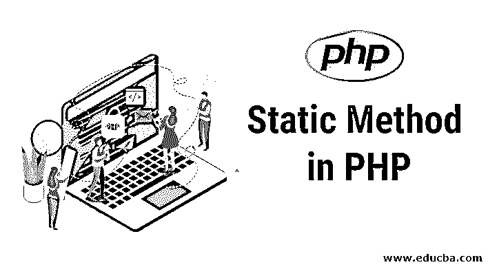

# PHP 中的静态方法

> 原文：<https://www.educba.com/static-method-in-php/>




## PHP 中静态方法介绍

在 PHP 中，使用静态方法，这样开发者可以在程序中任何需要的地方使用静态类的属性。要定义静态方法，需要使用“static”关键字。该关键字用于程序中函数和对象之间必须通用的属性和方法。因此，任何必须与程序中的函数共享的编程逻辑都必须用静态方法编写。

### PHP 中静态方法的工作原理及其语法？

在上面的介绍中，我们了解了为什么我们在 PHP 中使用静态方法，但是我们需要知道如何在 PHP 编程语言中使用它。如果我们可以访问一个类的方法和属性，而不是一个对象，为了实现这一点，我们可以使用静态关键字。为了将一个特定的方法定义为静态的，我们需要[在函数名前使用一个静态关键字](https://www.educba.com/static-keyword-in-c/)。

<small>网页开发、编程语言、软件测试&其他</small>

**语法:**

```
public static function static_methodname()
{
//Statements//
}
```

在上面的语法中，静态方法被初始化和定义。为了在相应的程序中添加一个静态属性，我们需要在属性名前使用一个静态关键字

**语法:**

```
private static static_propertyname;
```

在上面的语法中，静态属性与私有关键字/访问说明符一起使用，并且可以在类中使用。每当我们使用 static 时，我们应该确保将其用于实用程序，而不是出于方便的原因。

静态方法不允许你定义显式的依赖关系，它还包括程序中的[全局变量](https://www.educba.com/python-global-variable/)，这些变量可以在需要时随时随地访问。很难[在包含静态方法的类上执行自动化测试](https://www.educba.com/benefits-of-automation-testing/)。最常见的[静态方法用于](https://www.educba.com/javascript-static-method/)实用程序类。实用程序类的目的是为主类提供各种服务。所有实用程序方法都可以执行各种任务，例如[数据加密和解密](https://www.educba.com/encryption-vs-decryption/)，测量值之间的转换以及其他任务，这些任务不超过程序中主类的任何其他服务。

如果必须考虑静态方法和属性，因为认为它们在不创建对象的情况下使用起来很方便和容易，但是静态方法有其缺点:在对使用静态方法的类执行自动化测试时，您会感到很困难。静态方法和属性是全局的，可以在程序中的任何地方使用。当必须使用这些方法，但必须尽可能避免使用时，这种方法很有用。

要调用类外的静态方法，我们必须使用::operator。

**语法:**

```
Class_name::static_method_name();
```

类似地，要访问类外的静态属性，我们必须使用::operator。

**语法:**

```
Class_name::static_property_name;
```

### 在 PHP 中实现静态方法的例子

下面是一个如何在 PHP 中为 employee 类实现静态方法的例子。

**代码:**

```
<!DOCTYPE html>
<html>
<body>
<?php
class employee
{
public static function ename()
{
echo " Employee name is Geeta";
}
public function __construct()
{
self::ename();
}
}
employee::ename();
new employee();
?>
</body>
</html>
```

**输出:**


在上面的例子中，employee 类是主类，name 是必须在主类内部使用的静态类。这里，如果静态方法必须在定义它的类内部调用，我们必须使用 self-keyword 来调用静态方法，而如果静态方法必须在类外部调用，它必须与类名一起调用。

### PHP 中静态方法的优势

使用静态方法有几个好处。它们如下:

*   它允许许多类访问不依赖于任何静态方法实例的行为。
*   将无状态的实用程序方法组合在一个帮助器类中，可以清楚地看到发生了什么，并创建一个具有内聚性和一致性的类。
*   静态方法可以使用或通过类名访问，不需要任何对象。
*   静态方法和属性有一个适用于所有程序实例的单一值。

### PHP 中静态方法的缺点

*   静态成员的创建应该有特定的意图，因为它需要对我们的需求有正确的认识。
*   当必须对特定程序进行测试时，静态方法是困难的，因为方法及其属性是全局定义的，可以在程序中的任何地方使用。因此，方法或属性的值将默认设置，这可能是实现的一个缺点。

### PHP 中定义静态方法的规则和规定

*   定义静态方法的第一点也是最主要的一点是在必须初始化的方法名或属性名之前包含 static 关键字。如果方法或属性名没有声明为 static，那么函数/方法的作用域将不会被其他方法全局访问。
*   第二点是当静态方法和属性必须在类外调用时，使用范围解析操作符(::)。对于范围解析操作符，我们必须提到类名以及静态方法或属性名。

### 结论

在本文中，我们了解了如何声明静态方法及其用法。此外，我了解了它的工作原理和各种优缺点，以及如何使用范围解析操作符在类外调用静态方法和属性。开发人员必须了解需求的事实，并且必须使用静态方法，因为它会影响程序的测试部分。

### 推荐文章

这是 PHP 中静态方法的指南。在这里，我们讨论了 PHP 中静态方法的工作原理、例子、优点、缺点以及规则和规定。您也可以浏览我们推荐的其他文章，了解更多信息——

1.  [PHP 中的抽象类](https://www.educba.com/abstract-class-in-php/)
2.  [PHP 中的套接字编程](https://www.educba.com/socket-programming-in-php/)
3.  [PHP 框架](https://www.educba.com/php-frameworks/)
4.  [PHP 中的公共函数](https://www.educba.com/public-function-in-php/)


