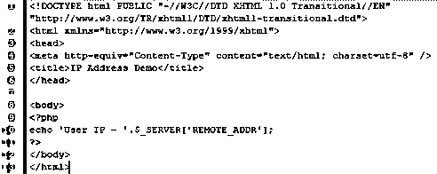
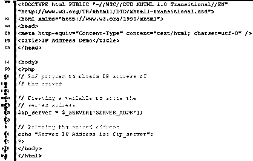
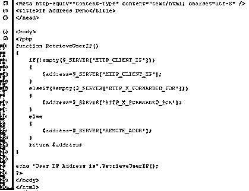
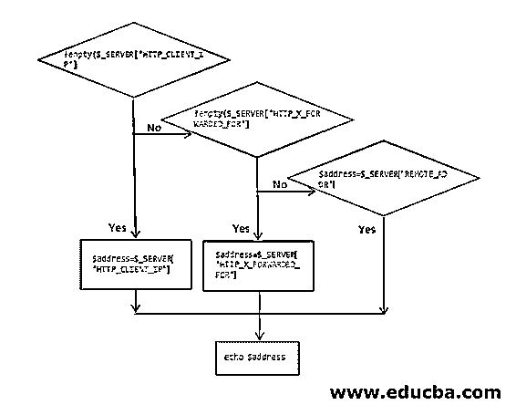
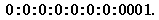

# 在 PHP 中获取 IP 地址

> 原文：<https://www.educba.com/get-ip-address-in-php/>


## IP 地址简介

要学习“在 PHP 中获取 IP 地址”，首先，我们将学习 IP 地址。IP 地址或互联网协议地址是连接到网络的每个系统或设备都具有的数字地址或标签。IP 地址被分配给每个这样的设备。这些设备使用互联网协议进行任何类型的通信。

### IP 版本

以下几点解释 IP 版本:

<small>网页开发、编程语言、软件测试&其他</small>

*   根据互联网协议标签的比特来定义 IP 版本。例如，早期版本的 IPv4 定义了 32 位数的互联网协议地址。随着互联网的发展，IPv6 应运而生，它定义了一个 128 位的数字 IP 标签。IPv6 从 1995 年开始使用至今。互联网协议地址是用人类可以理解的语言写的。IPv4 的示例如下:170.17.260.2，IPv6 的示例为 2001:db8:2:1434:1:587:5:2。
*   通过互联网协议地址获得的空间是全局管理的。一个名为互联网号码分配机构的注册中心和其他五个地区注册中心使互联网协议地址的空间管理成为可能。IANA 负责分配和管理互联网协议地址空间给其指定区域或领地内的所有最终用户和其他互联网提供商。类似地，连接到互联网服务提供商网络的所有设备都被分配一个唯一的互联网协议地址。
*   存在不经常改变的静态互联网协议地址，它们被提供给服务器。互联网服务提供商为使用调制解调器的机器提供特定且唯一的互联网协议地址。该 IP 地址在一个会话中是唯一的，在下一个会话中可能会改变。

### 在 PHP 中识别和返回 IP 地址

出于安全原因，这些网站收集其网站访问者的 IP 地址。在 PHP 中有一个简单的方法可以得到这个地址。PHP 中有一个特定的数组可以帮助并返回你机器的 IP 地址。一个数组被称为“$_SERVER”。它包含有关路径、头和脚本位置的信息。web 服务器创建$_SERVER 阵列所需的信息。有时，服务器不会创建或提供阵列所需的所有信息，他们可能会忽略一些信息。因此，在这种情况下可以使用另一个数组。它被写成‘服务器 _ ADDR’。该数组返回运行脚本的服务器的 IP 地址。

### PHP 中获取 IP 地址的方法

下面是用 php 获取 IP 地址的例子:

#### 示例#1

最简单的方法是使用$_SERVER 与'远程 _ADDR '，它将返回用户的 IP 地址谁是目前正在查看网页。

*   在 PHP 中使用['REMOTE_ADDR']识别服务器 IP 地址的例子。

**代码:**

```
<?php
echo 'User IP - '.$_SERVER['REMOTE_ADDR'];
?>
```

**输出:**




#### 实施例 2

另一种方法称为“服务器 _ADDR”，也用于检索服务器的 IP 地址。

*   在 PHP 中使用['SERVER_ADDR']识别服务器 IP 地址的例子。

**代码:**

```
<?php
// PHP program to retrieve server’s Internet Protocol address
// Creating a variable to store the server address
$ip_server = $_SERVER['SERVER_ADDR'];
// Displaying the retrieved address
echo "Server IP Address is: $ip_server";
?>
```

**输出:**




**对上述程序的解释:**上面的示例数组[$_SERVER]在机器没有通过代理连接的情况下很有帮助。如果机器通过代理服务器连接到互联网，PHP 中的$_SERVER['REMOTE_ADDR']不会返回正确的 IP 地址。它只是向[返回代理服务器和用户或客户端机器的 IP 地址](https://www.educba.com/how-do-ip-addresses-work/)。在这种情况下，使用另一种方法来检索正确的地址。

#### 实施例 3

以下示例用于返回正确和真实的 IP 地址，即使机器隐藏在代理服务器后面。它使用一对额外的服务器变量来获取客户机系统或机器的确切 IP 地址。它们被称为 HTTP_CLIENT_IP 和 HTTP_X_FORWARDED_FOR。

*   使用['HTTP_CLIENT_IP']和['HTTP_X_FORWARDED_FOR']在 PHP 中标识服务器 IP 地址的示例。

**代码:**

```
<?php
function RetrieveUserIP()
{
if(!empty($_SERVER['HTTP_CLIENT_IP']))
{
$address=$_SERVER['HTTP_CLIENT_IP'];
}
elseif(!empty($_SERVER['HTTP_X_FORWARDED_FOR']))
{
$address=$_SERVER['HTTP_X_FORWARDED_FOR'];
}
else
{
$address=$_SERVER['REMOTE_ADDR'];
}
return $address;
}
echo 'User IP Address is'.RetrieveUserIP();
?>
```

**输出:**




如果要理解上述代码的动作流程，可以参考下面的流程图。




**对上面程序的解释:**上面检索 IP 地址的例子使用了两个变量，['HTTP_CLIENT_IP']和['HTTP_X_FORWARDED_FOR']。在程序中，我们第一次尝试使用 HTTP_CLIENT_IP 直接从机器上获取它。如果不可用，我们将使用 HTTP_X_FORWARDD_FOR 尝试“转发”IP。当两个条件都为空时，我们尝试使用 REMOTE_ADDR 变量获取 IP 地址。

### 需要记住的要点

在 php 中获取 IP 地址时，应该记住以下几点:

1.当我们运行上面的代码时，返回的 IP 地址显示为::1。这就是所谓的回送地址，实际上是由 127 个 0 加上 1(0000…127 次……1)。如果我们把它写下来，它会被写成:


2.但是在 IPv6 中，我们可以用简短的形式来表示这个大标签。因此，如果一个块中全是零，可以用一个零来代替。所以当遵循上述规则时，它变成:**0:0:0:0:0:0:0:0:0001；**




3.同样，可以去掉零，剩下:: **0001**


4.其再次被简化为“: **: 1** ”，因此输出。

**对上述代码的解释:**如果让它们运行，它们可能不会给出任何输出，或者可能会返回运行时错误，因为私有域不提供它们的互联网协议地址。同时，如果上述代码在本地服务器或本地主机上执行，就像我们使用的 WAMP 服务器一样，它将根据 IP 版本提供输出，也就是说，如果它是 IPv4，则互联网协议地址将显示为“127:0:0:1”，而如果它是 IPv6，则互联网协议地址将如上所示，即“1”

### 推荐文章

这是一个在 PHP 中获取 IP 地址的指南。这里我们讨论识别 IP 地址，在 IP 地址的方法和在 IP 地址要记住的要点。您也可以浏览我们的其他相关文章，了解更多信息——

1.  [PHP 数据库连接](https://www.educba.com/php-database-connection/)
2.  [什么是 TCP/IP？](https://www.educba.com/what-is-tcp-ip/)
3.  [Mac 与 IP 地址](https://www.educba.com/mac-vs-ip-addresses/)
4.  [什么是 IPv4？](https://www.educba.com/what-is-ipv4/)


